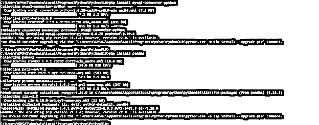

# Python SQL

> 原文：<https://www.educba.com/python-sql/>


## Python SQL 的定义

Python SQL 是目前可用的数据库接口:Python 数据库的接口和 API。我们访问过的每个数据库都需要自己的 DB API 模块。对于数据库编程，python 包含了很多有用的功能。所有的 SQL 数据库都支持 Python-like MySQL、SQLite、PostgreSQL 等。Python 还支持数据定义语言和数据操作语言。

### 什么是 Python SQL？

*   Python DB-API 是数据库接口的行业标准。这是大多数 Python 数据库接口的标准。
*   在 Python 中，SQL 可以以多种方式使用。由于这个原因，已经建立了许多可以使用的库。这些库包括 SQLite 和 MySQL。
*   Python 的数据库接口采用 Python DB-API，这是用于数据库接口的标准。DB-API 是访问关系数据库的标准接口。换句话说，无论使用什么数据库或数据库模块，连接数据库的 Python 代码都是相同的。

### 创建表 Python SQL

*   为了在 SQLite 数据库中创建一个表，我们首先需要在代码中导入 SQLite 模块。在下面的例子中，我们使用 SQLite 数据库在 python 中创建了一个表，如下所示。
*   导入模块后，使用 connect 方法，与数据库建立连接。在与数据库建立连接时，我们需要传递我们需要访问的数据库名称。如果同名文件已经存在，它将被打开。如果指定的文件名不存在，python 库将创建同名文件。
*   在调用 connect 方法并指定数据库名称之后，在下一步中，我们将创建一个游标对象，该对象用于发送命令。
*   以下示例显示了如何使用 python 连接到 SQLite 数据库，如下所示。

**代码:**

<small>网页开发、编程语言、软件测试&其他</small>

```
import sqlite3
py_con = sqlite3.connect ("py_sql.db")
py_csr = py_con.cursor ()
print (" Connected SQLite database using python")
```

**输出:**


*   在上面的例子中，我们可以看到，首先，我们已经导入了 sqlite 模块。导入模块后，我们就创建了连接 SQLite 数据库的连接对象。创建连接对象后，我们将创建用于发送 SQL 查询或命令的游标对象。
*   游标的对象为运行 SQL 查询建立连接。它充当 SQLite 数据库和 SQL 查询之间的桥梁。一旦我们建立了到 SQLite 数据库的连接，它就形成了。
*   游标的对象用于建立 SQL 查询执行的连接。它充当 SQLite 数据库和 SQL 查询之间的桥梁。一旦我们建立了到 SQLite 数据库的连接，它就形成了。
*   游标对象只是用于遍历和检索数据库记录的控制结构。
*   在连接到 SQLite 数据库并在下面的例子中创建了 cursor 对象之后，我们正在数据库中创建表。
*   要在 SQLite 数据库中创建一个表，首先我们需要创建一个对象，并需要在其中编写 create table SQL 查询，并使用它的注释在数据库中执行查询。
*   使用该命令也非常简单。在 python 中使用 SQLite 数据库，我们可以执行命令，用于执行或调用 execute 方法。
*   执行一组另存为 sql 命令的命令。完成所有任务后，提交对文件的修改，然后断开连接。
*   以下示例显示了如何使用 python 在 SQLite 数据库中创建一个表，如下所示。为了用 python 创建一个表，我们使用标准的 SQL 命令。

**代码:**

```
import sqlite3
py_con = sqlite3.connect("py_sql.db")
py_csr = py_con.cursor()
print ("Connected SQLite database using python")
sql_py = """CREATE TABLE stud_py (
stud_no INTEGER PRIMARY KEY,
stud_fname VARCHAR (10),
stud_lname VARCHAR (20),
stud_address CHAR (40),
joining DATE);"""
py_csr.execute (sql_py)
print ("stud_py table created")
py_con.close ()
```

**输出:**


*   在上面的例子中，我们创建了一个名为 stud_py 的表。我们创建了一个名为 py_con 的连接对象，还创建了一个名为 py_csr 的游标对象，sql_py 是一个 sql 命令对象，用于使用游标对象执行命令。

### Python SQL 数据库

下面是 SQL 数据库，我们可以使用如下程序连接到 python 数据库。

1)SQLite
2)MySQL
3)PostgreSQL
4)Oracle

*   我们不需要安装任何其他 Python SQL 模块来连接 SQLite 数据库，它可能很容易与 Python 项目连接。我们可以使用 Python 安装中附带的 sqlite3 Python SQL 包来连接 SQLite 数据库。
*   下面的示例显示了连接到 SQLite 数据库并创建 py_test 数据库，如下所示。

**代码:**

```
import sqlite3
py_con = sqlite3.connect ("py_test.db")
py_test = py_con.cursor ()
print (" Connected to py_test DB")
```

**输出:**


*   在上面的例子中，我们创建了一个连接对象 py_con，还创建了一个游标对象 py_test。
*   为了连接 SQLite 数据库，我们不需要安装任何库，因为 SQLite 默认情况下是 python 自带的。
*   要连接 MySQL 数据库，我们需要安装 MySQL-connector 的依赖关系如下。
*   以下示例显示了 MySQL-connector 依赖项的安装，用于连接 MySQL 数据库。

**代码:**

```
pip install mysql-connector-python
```

```
pip install pandas
```

**输出:**




*   下面的例子显示了通过 python 导入 MySQL-connector 来连接 MySQL 数据库。此外，我们正在用 mysql-connector 导入熊猫，如下所示。

**代码:**

```
import mysql.connector
from mysql.connector import Error
import pandas as py
```

**输出:**


*   为了连接到 MySQL 数据库服务器，我们需要在系统中安装 MySQL 数据库服务器。安装完 MySQL 服务器后，我们需要用 python 运行下面的代码来连接 MySQL 数据库服务器。

**代码:**

```
import mysql.connector
py_my = mysql.connector.connect (
host = "localhost",
user = "root ",
password = "MySQL@123"
)
```

**输出:**


在上面的示例中，我们将数据库主机名指定为 localhost，将数据库用户名指定为 root，并指定了连接 MySQL 数据库服务器的密码。

### 结论

Python DB-API 是数据库接口的行业标准。这是大多数 Python 数据库接口的标准。我们访问过的每个数据库都需要自己的 DB API 模块。Python SQL 列表是当前可用的数据库接口、Python 数据库的接口和 API。

### 推荐文章

这是一个 Python SQL 的指南。这里我们讨论定义，什么是 python SQL，创建一个 python SQL 的表，以及代码实现的例子。您也可以看看以下文章，了解更多信息–

1.  [Python 中的 f 字符串](https://www.educba.com/f-string-in-python/)
2.  [Python Reduce](https://www.educba.com/python-reduce/)
3.  [Timsort Python](https://www.educba.com/timsort-python/)
4.  [Python 用户定义的异常](https://www.educba.com/python-user-defined-exception/)


