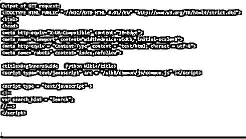

# 蟒蛇皮卷发

> 原文：<https://www.educba.com/python-curl/>


## Python Curl 简介

curl 是一个请求工具，用于创建网络请求，以便允许它通过网络传输数据，这是使用命令行完成的。在本文中，我们将讨论 Python 中的 curl。在 python 中，curl 是一个使用 PycURL 在服务器之间传输数据请求的工具。该工具用于测试 REST APIs、下载文件等。这个 PycURL 是 Python 中 libcURL 库的接口，因此 PycURL 能够继承 libcURL 的所有功能。

### Python Curl 的工作原理

在本文中，Python curl 用于 REST API 与服务器之间的数据传输。在这里，我们将看到 PycURL 是一个 python 接口，用于从由 URL 标识的 python 程序中获取对象。

<small>网页开发、编程语言、软件测试&其他</small>

Curl 是一个 UNIX 命令，可以向 url 发送 GET、POST、PUT 和 DELETE 请求。Python 中有一个名为“Requests”的 HTTP 库，但是这个库需要被拉出来，因为它不是任何标准模块。当使用这个库时，我们可以创建一个简单的请求，这个请求返回一个响应对象，该对象允许访问各种状态代码或标题等。让我们看看下面的示例，每行都有输出:

### 实现 Python Curl 的示例

下面是 Python Curl 的例子:

#### 示例#1

**代码:**

```
import requests
url ="https://rest.logentries.com/query/saved_queries"
print url 
```

**输出:**


```
headers={'x-api-key':'09ba90f6-dcd0-42c0-8c13-5baa6f2377d0'}
print headers 
```

**输出:**


```
resp = requests.get(url,headers=headers)
print resp.status_code 
```

在这里，您将获得状态代码为 200 的输出代码。

`print resp.content
print resp`

上面会打印内容。

从上面的代码片段中，我们需要首先导入请求库，然后我们创建一个 URL，我们将打印该 URL，头也将被定义和打印。然后我们看到 request.get()方法是通过将上面获得的 URL 和头传递给这个方法来调用的。此方法返回一个响应对象(resp)。在上面的代码片段中，我们可以看到，我们将使用这个 response object.get()方法打印请求的内容，这将允许我们访问和打印 status_code，并且打印整个内容，我们还可以看到这个 response 对象的可用属性列表。类似地，我们也可以使用不同的请求方法，如 requests.put()、request.post()、request.delete()等。

我们可以看到每个请求方法的语法，如下所示:

*   Call.request.get(URL)这用于向 URL 发送 get 请求。
*   这个 dict 中的 Call.request.post(URL，data= dict)包含一个键字典，还包含发送给 post 请求的值。
*   这也类似于 POST 请求；这也将向 PUT 请求发送 URL 和值。
*   Call.requset.delete(URL，data = dict)；这也具有与上面两个请求方法相同的参数，并且这个请求也将 URL 和值发送给删除请求方法。

在 Python 中，我们使用 PycURL 作为 cURL 工具，用于测试 REST APIs。因为这个 PycURL 支持不同种类的协议，如文件、FTPS、HTTPS、IMAP、SMB、SCP 等。对于任何操作系统来说，PycURL 的安装都非常简单。所以下面是安装 PycURL 的采样过程。

`$ pip install pycurl
$ easy_install pycurl`

以上两个可以用于在 mac 或 Linux OS 中安装 pycurl。现在我们将看看如何在 Windows 操作系统中安装它，但在此之前，我们需要安装一些依赖项。因此，您可以在 Python 终端中运行以下命令，如下所示:

**命令:**

`$ pip install pycurl`

如果不使用 pip，我们可以使用 PycURL windows 上的 EXE 和 MSI 安装程序。

#### 实施例 2

下面让我们看看发送 HTTP GET 请求的示例。

**代码:**

```
import pycurl
from io import BytesIO
b_obj = BytesIO()
crl = pycurl.Curl()
crl.setopt(crl.URL,'https://wiki.python.org/moin/BeginnersGuide')
crl.setopt(crl.WRITEDATA, b_obj)
crl.perform()
crl.close()
get_body = b_obj.getvalue()
print('Output of GET request:\n%s' % get_body.decode('utf8')) 
```

**输出:**




**说明:**在上面的程序中，首先我们需要设置 https://www . mouthshut . com/websites/Educba-com-reviews-925740874 等 URL 值。然后我们写入数据，然后使用 curl 方法 perform()执行文件传输，使用 close()方法关闭 curl 会话。然后我们就可以获得上面输出截图所示的 HTML 请求页面的内容了。

同样，Python 中使用 PycURL 进行 POST、PUT、DELETE 等操作也有不同的方式和代码。，方法。让我们看看可以编写什么样的代码样本来发送 HTTP 删除请求。此方法删除由 URL 标识的服务器资源。这可以使用 CUSTOMREQUEST 来实现。

#### 实施例 3

下面是一个示例:

**代码:**

```
import pycurl
crl = pycurl.Curl()
crl.setopt(crl.URL,"http://api.example.com/user/148951")
crl.setopt(crl.CUSTOMREQUEST, "DELETE")
crl.perform()
crl.close() 
```

上面的代码片段是发送 HTTP 删除请求。因此，我们可以看到如何使用 Python 中的 curl 工具(如 PycURL)使用 HTTP DELETE request 来发送这个请求。

### 结论

在本文中，我们讨论了 curl，这是一个用于与服务器之间传输数据的工具。在 Python 中，我们有 PycURL 库，它使用标准库 libcurl，PycURL 使用它的值。我们还看到了被称为语法的各种方法。在本文中，我们还看到了 PycURL 的用法，我们首先看到了如何导入它以及如何使用它和使用各种 cURL 方法如 perform()、close()等。

### 推荐文章

这是 Python Curl 的指南。在这里，我们将讨论 Python Curl 的介绍和工作原理，以及示例和代码实现。您也可以浏览我们推荐的其他文章，了解更多信息——

1.  [Python 范围函数介绍](https://www.educba.com/python-range-function/)
2.  [Python 集合函数的 7 大方法](https://www.educba.com/python-set-function/)
3.  [Python Zip 函数|示例](https://www.educba.com/python-zip-function/)
4.  [蟒蛇龟示例指南](https://www.educba.com/python-turtle/)


