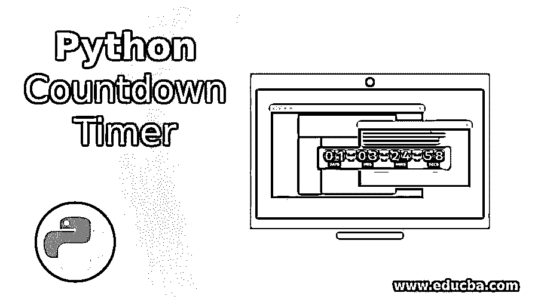
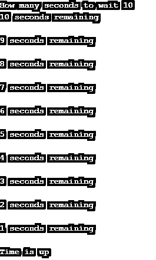
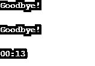

# Python 倒计时定时器

> 原文：<https://www.educba.com/python-countdown-timer/>




## Python 倒计时定时器介绍

如果您需要在特定的时间间隔后运行某段代码，您会怎么做？假设您需要每 30 分钟刷新一次文件。威尔，你每次都是手动提交的。不完全是，对吧？这就是 Python 倒数计时器的用武之地，因为它可以用来在空闲状态下等待一段时间，然后根据需要在循环中重复相同的代码。

### Python 倒计时器是如何工作的？

为了构建“Python 倒计时定时器”，我们需要使用如下的 import 语句导入时间库:

<small>网页开发、编程语言、软件测试&其他</small>

```
import time as t
```

在这里，我们使用“as”关键字为库创建了一个别名，从而为库指定了一个简称。

简而言之，别名化 Python 库使我们能够利用这种简写符号来调用 time 类，如下所示:

```
t.function_name()<\code>
```

Python 的时间库包含一个预定义的 sleep()函数，可以使用下面的语法调用它:

```
time.sleep(duration)
```

我们希望延迟执行的“持续时间”以秒为单位作为参数传递给 sleep()函数。“持续时间”也可以是更精确的浮点数，而不是整数。

由于系统中计划的任何其他活动，延迟持续时间可能会超过指定时间。在 Python 3.5 之后，sleep()函数提供了至少指定持续时间的延迟，即使它被信号中断。

### Python 倒计时定时器的例子

让我们借助一个例子来理解这一点:

#### 示例#1

让我们用 Python 制作一个倒数计时器函数
我们需要导入时间库

**代码**

```
import time as t
##this will enable to utilize specified functions within time library such as sleep()
##Asking user the duration for which the user wants to delay the process
seconds = int(input("How many seconds to wait"))
##Let's use a ranged loop to create the counter
for i in range(seconds):
    print(str(seconds-i) + " seconds remaining \n")
##we also need the loop to wait for 1 second between each iteration
t.sleep(1)
print("Time is up")
```

**输出:**




PS:程序在打印“我还有一秒钟”之前等待 1 秒钟。

它是如何工作的？

*   程序从用户输入持续时间开始。
*   注意，我们使用 int()函数进行类型转换，因为输入函数在将用户提供的信息保存到指定的变量(秒)之前将其转换为 s 字符串
*   for 循环用于重复相同的操作所需的次数。这里我们使用 sleep()函数在延迟 1 秒后打印文本。
*   这就是为什么每一行都在延迟 1 秒后打印出来，这就是我们如何利用 Python 的时间库中可用的函数来创建“Python 倒计时定时器”。

#### 实施例 2

在这里，我们将建立一个类似于手机上的秒表。是的，而不是每次迭代都在下一行打印。

这里我们将以动态方式更新计数器。

**代码:**

```
#Import time library
import time as t
## Countdown function starts here
def stopwatch(sec):
    while sec:
        minn, secc = divmod(sec, 60)
        timeformat = '{:02d}:{:02d}'.format(minn, secc)
        print(timeformat, end='\r')
        t.sleep(1)
        sec -= 1
print('Goodbye!\n')
## calling stopwatch function
stopwatch(15)
```

**输出:**




这是如何工作的？

*   程序从导入时间库开始，创建秒表功能，其中包含实际的逻辑。
*   while 循环用于重复相同的操作所需的次数。这里我们使用 sleep()函数在延迟 1 秒后打印文本。
*   这就是为什么在延迟 1 秒后，秒表会利用 Python 的时间库中可用的函数进行更新。

让我们详细讨论一下本例中使用的函数:

*   divmod()函数用于计算#分钟和#秒
*   此后，我们使用 format()函数格式化分钟和秒钟。
*   通过在 print()函数中引入 end='\r '作为参数，可以使光标返回到屏幕上的初始位置，从那里开始。这提供了一种观点或错觉，即在这个程序中只有最后一个数字是动态变化的。
*   我们通过使用 sleep()函数在延迟 1 秒后打印文本，这就是它像秒表一样工作的方式。

#### 实施例 3

让我们再举一个例子:

**代码:**

```
def countdown(tme):
    import time
    print('This window will remain open for 3 more seconds...')
    while tme >= 0:
        print(tme, end=' .  .  . ')
        time.sleep(1)
        tme -= 1
print('Goodbye!!!! \n')
tme=3
countdown(tme)
```

**输出:**


### 结论

Python 倒计时定时器可以用来在空闲状态下等待一段时间，然后根据需要在循环中再次重复相同的代码。Python 的时间库包含一个预定义的 sleep()函数。我们希望延迟执行的“持续时间”以秒为单位作为参数传递给 sleep()函数。这个函数和一个循环一起，充当 Python 的倒计时定时器。

### 推荐文章

这是一个 Python 倒计时定时器的指南。在这里，我们将讨论 Python 倒计时器是如何工作的，并给出相应的例子。您也可以浏览我们的其他相关文章，了解更多信息——

1.  [Python 子流程](https://www.educba.com/python-subprocess/)
2.  [Python 设置函数](https://www.educba.com/python-set-function/)
3.  [Python 中的缩进](https://www.educba.com/indentation-in-python/)
4.  [Python 输入字符串](https://www.educba.com/python-input-string/)


