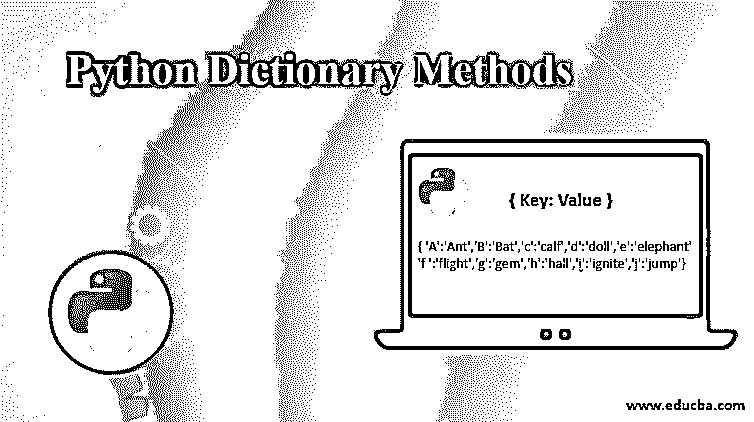

# Python 字典方法

> 原文：<https://www.educba.com/python-dictionary-methods/>

## Python 字典方法介绍

python 编程中使用最广泛的集合数据类型肯定是 dict。它包含一组无序的元素，但是 python dict 数据类型的重要元素是它们作为键值对来操作。因此，当一个特定的键被传入字典时，字典元素可以为它返回相应的值。如下面的例子所示，dictionary 元素将被包含在花括号中。

**语法:**

<small>网页开发、编程语言、软件测试&其他</small>

`{ Key: Value }`

**举例:**

`{ 'A':'Ant','B':'Bat','c':'calf','d':'doll','e':'elephant'
'f ':'flight','g':'gem','h':'hall','i':'ignite','j':'jump'}`

### Python 字典的方法

以下是 python 字典的方法:

| **方法** | **描述** | **语法** |
| **复制()** | 整个词典将被复制到新词典中 | `dict.copy()` |
| **更新()** | 帮助更新现有的字典项目 |  |
| **get()** | 返回给定键的值 | `dict.get()` |
| **pop()** | 具有所述键的元素将被移除 | `dict.pop()` |
| **值()** | 将返回给定字典中的所有值 | `dict.values()` |
| **按键()** | 将返回给定字典中的所有键 | `dict.keys()` |
| **物品()** | 用于显示字典的条目 | `dict.items()` |
| **sort()** | 允许对字典项目进行排序 | `dict.sort()` |
| **len()** | 用于确定字典中条目的总数 | `len(dict)` |
| **Str()** | 用于将字典项转换为字符串项 | `Str(dict)` |

#### 1.复制()

copy 方法用于将一个字典的内容复制到另一个字典中，因此这将包括将第一个字典的键和值复制到另一个给定的字典中。因此，当前字典中的每一项都将被放入新创建的字典中。

**举例:**

`Bikes={'Bike_1':'CT100','Bike_2':'HeroHonda','Bike_3':'Yamaha'}
Two_wheelers = Bikes.copy()
print("All two wheelers in the market: ", Two_wheelers)`

**输出:**

#### 2.获取()

get()方法用于获取 dict 变量中给定键的值。

**举例:**

`Bikes={'Bike_1':'CT100','Bike_2':'HeroHonda','Bike_3':'Yamaha'}
print('The second bike:',Bikes.get('Bike_2'))`

**输出:**

#### 3.更新()

使用这个 update()方法可以实现两个关键过程。因此，首先，这涉及修改字典中现有的键-值对的过程，而另一个过程是向字典中插入新条目的过程。添加的每个新的键、值对都被附加到字典的最后一部分。同样，当更新现有字典成分时，它不会对组件应用任何位置更改，而只有更新仍然只适用于该特定项目。

**举例:**

`Bikes={'Bike_1':'CT100','Bike_2':'HeroHonda','Bike_3':'Yamaha'}
Bikes.update({'Bike_4': 'TVS'})
print("List of bikes in the market after update 1:", Bikes)
print(" ")
Bikes.update({'Bike_3': 'Hero-Honda'})
print("List of bikes in the market after update 2:", Bikes)`

**输出:**

#### 4.项目()

为了显示 python 字典的每一个键值对，使用了名为 items()的方法。所以使用 items 方法可以显示字典中的所有实体。在给定的示例中，我们可以注意到所有 dictionary bikes 的元素都显示在执行控制台中。

**举例:**

`Bikes={'Bike_1':'CT100','Bike_2':'HeroHonda','Bike_3':'Yamaha'}
print('All bikes:',Bikes.items())`

**输出:**

#### 5.凯斯()

为了显示字典中的整组键，使用了 keyes()方法。所以字典中的每一个键都会很好地显示在这里。

**举例:**

`Bikes={'Bike_1':'CT100','Bike_2':'HeroHonda','Bike_3':'Yamaha'}
print('All bikes:',Bikes.keys())`

**输出:**

#### 6.排序()

为了对字典中的键值对进行排序，使用了 sort 方法。字典中的每个元素都通过应用这个方法进行排序。

**举例:**

`Bikes={'Bike_2':'CT100','Bike_1':'HeroHonda','Bike_3':'Yamaha'}
print('All bikes:',sorted(Bikes.items()))`

**输出:**

#### 7.值()

values 方法用于显示字典中的所有值。

**举例:**

`Bikes={'Bike_1':'CT100','Bike_2':'HeroHonda','Bike_3':'Yamaha'}
print('The second bike:',Bikes.values())`

**输出:**

#### 8.len()

为了估计 dictionary 数据类型中所有键值对的数量，可以明智地使用 len()方法。因此字典中的总元素数可以通过这种方法来确定。在这里，它的操作更像一个封装的方法，dict 项将被封装在这个 len()方法中。

**举例:**

`Bikes={'Bike_2':'CT100','Bike_1':'HeroHonda','Bike_3':'Yamaha'}
print('Overall number of bikes:',len(Bikes))`

**输出:**

#### 9.str()

要将字典转换成字符串，可以使用 str()方法。这个过程更像是一种类型转换的方法。因此，它涉及到将一种数据类型的项转换为另一种数据类型。这个过程还涉及到将 dict 项封装成 string 项的技术。

我们可以从下面列出的例子中注意到，指定了一组三个键值对。这三个键值对负责将它们自身转换成字符串值。

**举例:**

`Bikes={'Bike_2':'CT100','Bike_1':'HeroHonda','Bike_3':'Yamaha'}
Bikes_str = str(Bikes)
print('Format of Bikes datatype:',type(Bikes_str))`

**输出:**

### Python 字典示例

python 字典示例有:

**代码:**

`# dicitonary creation
Test_dict = {1:10,2:20,3:90,4:16,5:25,6:66,7:99}
# Item copy
Test_dict_copy = Test_dict.copy()
print("Newly copied dict:",Test_dict_copy)
# Item updation
Test_dict.update({'8':'800'})
print("Dict after an new insert:",Test_dict_copy)
# Items in the dict
print("Elements in the Dict:",Test_dict.items())
# item deleteion
print("Deletion of a item from the dicitionary:",Test_dict.pop(3))
print("Dictionary after the deletion:")
print(Test_dict)
print("Removal of the most arbitary item in the dicitonary:")
# arbitary item removal
print(Test_dict.popitem())
print("Dictionary after arbitary item deletion:")
print(Test_dict)
print("Removing all items from the dicitionary:")
# remove all items
Test_dict.clear()
# Output: {}
print(Test_dict)`

**输出:**

**代码解释**:上面提到的例子占用了字典的创建过程，这个过程非常奇怪，涉及到通过面向索引的技术来达到字典的范围。这里，pop()方法用于删除字典的元素。相比之下，popitem()方法参与删除最任意的项目。另一方面，clear()方法负责删除字典项中声明的所有项。首先，对索引执行 pop。接下来，一个未定义的 pop 执行删除字典中最任意的项；最后，使用 clear 方法清理整个字典。

### 结论

集合数据类型在市场上的所有编程语言标准中都占有重要的地位。对于处理复杂的数据，python 的 dict(，)方法非常有用。尤其是 python 的字典组件为 python 中的原始数据处理提供了很大的空间。

### 推荐文章

这是一个 Python 字典的指南。这里我们讨论 python 字典的介绍和方法，以及不同的例子和它的代码实现。您也可以看看以下文章，了解更多信息–

1.  [蟒蛇泡菜](https://www.educba.com/python-pickle/)
2.  [Python Tkinter Button](https://www.educba.com/python-tkinter-button/)
3.  [Python 字符串连接](https://www.educba.com/python-string-join/)
4.  [Python 逆向列表](https://www.educba.com/python-reverse-list/)

