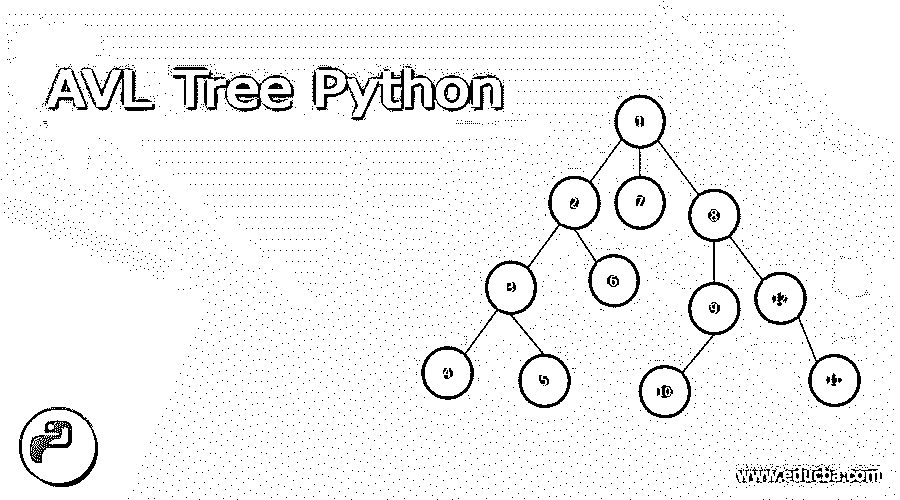
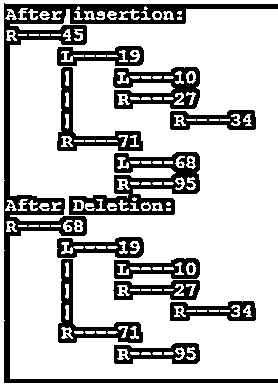

# AVL 树型 Python

> 原文：<https://www.educba.com/avl-tree-python/>




## AVL 树 Python 简介

在 Python 中，AVL·阿德尔森-维尔斯基和兰迪斯(AVL)树被定义为区域单位平衡的单位二叉树。AVL 树可以是自平衡二叉查找树，其中每个节点跟踪称为平衡问题的额外信息，其可以是-1、0 或 1。在护理右子树中，节点的左关联的高度之间的区别在于 AVL 树中该节点的平衡问题。(左子树高-右子树高)或(左子树高-右子树高)(右子树高-左子树高)。

### 语法或算法

由于这是一个数据结构概念，我们没有特定的语法，但遵循一些规则或步骤，这些规则或步骤将作为算法给出，用于在该 AVL 树中查找、插入或删除任何元素。因此，让我们看看在 AVL 树中插入和删除元素的步骤如下:

<small>网页开发、编程语言、软件测试&其他</small>

**插入:**

*   **步骤 1:** 首先，使用 BST(二叉查找树)插入逻辑为树添加一个替换成员。
*   **步骤 2:** 一旦你插入了所有的组件，你将需要可视化每个节点的平衡问题。
*   **步骤 3:** 一旦发现每个节点的平衡问题是 0 或 1 或-1，算法程序就进入下一个步骤。
*   **步骤 4:** 如果任一节点的平衡问题不是高于列出的 3 个值中的每一个，则认为树不平衡。一旦执行了合适的旋转以形成平衡，算法程序就可以进行连续的操作。

**删除:**

*   **第一步:**找到 k 所在的节点。
*   **第二步:**此时，擦除节点的内容(假设节点是 x)
*   **第三步:**创建一个索赔:删除一个叶子来降低护理 AVL 树中的 Associate 的节点的等级。3 号机组可能会发生以下情况:
*   一旦不是年轻人就删掉 x。
*   一旦 x 有了一个孩子，让 x 成为 x 的孩子。
*   因为 T 子树将只接受高一个问题，所以 x’不能有子树:
*   然后拿走 x '，用 x '(一片叶子)的内容替换 x 的内容
*   **第四步:**如果 x 有 2 个幼仔，找到 x 的后继者 z(他没有左子)，用 z 的内容替换 x 的内容，带走 z。

### 如何用 Python 实现 AVL 树？

在 Python 中，AVL 树被称为自平衡树，它使用值为-1、0 或+1 的平衡因子，它有 4 种不同的运算，具体如下:

**AVL 树的平衡因子=(左子树的高度-右子树的高度)或(右子树的高度-左子树的高度)**

AVL 采油树和独立采油树的操作如下:

#### 1.向左旋转(LL)

一旦我们围绕节点 x 向左旋转，节点 y 就成为新的子树的根。节点 x 成为节点 y 的左孩子，子树 b 成为节点 x 的正确孩子。


#### 2.右旋转(右后)

一旦我们围绕节点 y 向右旋转，节点 x 就成为子树的新根。子树 b 成为节点 y 的左孩子，而节点 y 成为子树 b 的右孩子。


#### 3.左右旋转(左右旋转)

这种旋转包括左旋和右旋，因为顾名思义。


#### 4.左右旋转(左旋转)

这种旋转包括向右旋转和向左旋转。


### AVL 树 Python 的例子

在下面的例子中，我们正在编写 Python 代码来显示 AVL 树中的插入和删除。

**代码:**

```
import sys
class treeroot(object):
def __init__(self, key):
self.key = key
self.left = None
self.right = None
self.height = 1
class avl(object):
definsrtnode(self, root, key):
if not root:
return treeroot(key)
elif key <root.key:
root.left = self.insrtnode(root.left, key)
else:
root.right = self.insrtnode(root.right, key)
root.height = 1 + max(self.getHeight(root.left),
self.getHeight(root.right))
balanceFactor = self.getBalance(root)
if balanceFactor> 1:
if key <root.left.key:
return self.RR(root)
else:
root.left = self.LR(root.left)
return self.RR(root)
if balanceFactor< -1:
if key >root.right.key:
return self.LR(root)
else:
root.right = self.RR(root.right)
return self.LR(root)
return root
defdelnode(self, root, key):
if not root:
return root
elif key <root.key:
root.left = self.delnode(root.left, key)
elif key >root.key:
root.right = self.delnode(root.right, key)
else:
if root.left is None:
temp = root.right
root = None
return temp
elifroot.right is None:
temp = root.left
root = None
return temp
temp = self.getMinValueNode(root.right)
root.key = temp.key
root.right = self.delnode(root.right,
temp.key)
if root is None:
return root
root.height = 1 + max(self.getHeight(root.left),
self.getHeight(root.right))
bf = self.getBalance(root)
if bf > 1:
if self.getBalance(root.left) >= 0:
return self.RR(root)
else:
root.left = self.LR(root.left)
return self.RR(root)
if bf < -1:
if self.getBalance(root.right) <= 0:
return self.LR(root)
else:
root.right = self.RR(root.right)
return self.LR(root)
return root
def LR(self, z):
y = z.right
T2 = y.left
y.left = z
z.right = T2
z.height = 1 + max(self.getHeight(z.left),
self.getHeight(z.right))
y.height = 1 + max(self.getHeight(y.left),
self.getHeight(y.right))
return y
def RR(self, z):
y = z.left
T3 = y.right
y.right = z
z.left = T3
z.height = 1 + max(self.getHeight(z.left),
self.getHeight(z.right))
y.height = 1 + max(self.getHeight(y.left),
self.getHeight(y.right))
return y
defgetHeight(self, root):
if not root:
return 0
return root.height
defgetBalance(self, root):
if not root:
return 0
return self.getHeight(root.left) - self.getHeight(root.right)
defgetMinValueNode(self, root):
if root is None or root.left is None:
return root
return self.getMinValueNode(root.left)
defpreOrder(self, root):
if not root:
return
print("{0} ".format(root.key), end="")
self.preOrder(root.left)
self.preOrder(root.right)
defprintHelper(self, currPtr, indent, last):
if currPtr != None:
sys.stdout.write(indent)
if last:
sys.stdout.write("R----")
indent += "     "
else:
sys.stdout.write("L----")
indent += "|    "
print(currPtr.key)
self.printHelper(currPtr.left, indent, False)
self.printHelper(currPtr.right, indent, True)
myTree = avl()
root = None
nums = [95, 45, 27, 19, 71, 10, 68, 34]
for num in nums:
root = myTree.insrtnode(root, num)
print("After insertion: ")
myTree.printHelper(root, "", True)
key = 45
root = myTree.delnode(root, key)
print("After Deletion: ")
myTree.printHelper(root, "", True)
```

**输出:**




在上面的例子中，我们可以看到我们已经编写了在 AVL 树中插入和删除元素的代码，首先我们导入 sys 文件来用 Python 实现这一点。后来，我们定义了类 treeroot 和 AVL，在 treeroot 中，我们只是用它来定义键，左，右，甚至高度因子，以便我们可以在进一步的平衡因子和其他旋转操作中使用它。在 AVL 类中，我们定义了如何在 main 函数中调用不同的函数来插入和删除。输出如上图截图所示。

### 结论

在这篇文章中，我们的结论是，在这个 AVL 与用于护理汽车平衡的二叉查找树相关联的地方，左右子树之间没有大的差异，因此重新排列它们将使其显示为自平衡，这将进一步以确定的旋转重新部署这些分配。

### 推荐文章

这是一个 AVL 树 Python 的指南。在这里，我们还讨论了介绍和如何在 Python 中实现 AVL 树，以及不同的例子和它的代码实现。您也可以看看以下文章，了解更多信息–

1.  [Python 中的 Deque](https://www.educba.com/deque-in-python/)
2.  [Python 中的 Shell 排序](https://www.educba.com/shell-sort-in-python/)
3.  [Python 中的插入排序](https://www.educba.com/insertion-sort-in-python/)
4.  [桶排序 Python](https://www.educba.com/bucket-sort-python/)


