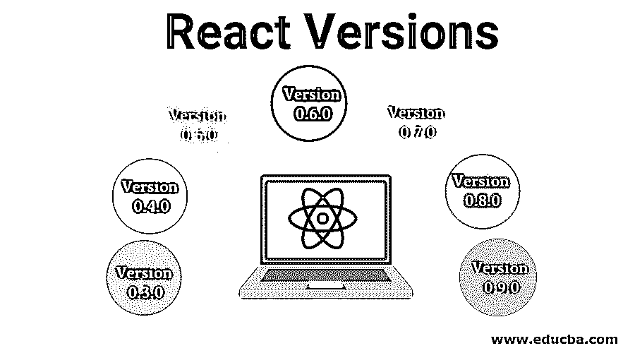

# 反应版本

> 原文：<https://www.educba.com/react-versions/>

## React 版本简介

React js 是一个用于前端开发的 javascript 库。它于 2013 年首次公开推出。它是由脸书软件工程师乔丹·沃克设计开发的。2015 年，react 推出了 react 原生概念，允许开发者开发适用于 android 和 IOS 的应用。他们最近的发布是在 2019 年 10 月，是为了修复 react 嵌套容器中 mouseenter double call 的 bug。

### React 的版本

到目前为止，react 已经发布了各种版本，让我们逐一讨论 react js 的各个版本。

<small>网页开发、编程语言、软件测试&其他</small>

#### 1.版本 0.3.0

版本 0.3.0 是它第一次向公众推出或作为开源的时候。它于 2013 年 5 月 29 日推出。

#### 2.版本 0.4.0

这个版本有一些新功能和错误修复。它的主要特点是开始允许我们进行评论，例如 {/* */} 。他们在 API 的服务器端渲染方面几乎没有改进。它引入了名为 prop 的关键字(它允许父组件向子组件发送数据)。该版本于 2013 年 7 月 20 日推出。

#### 3.版本 0.5.0

这个版本主要关注内存管理和一些新的支持。在这个版本中，我们支持一些重要的事件，比如选择和合成。它还引入了 getInitialState(在组件加载时设置任何状态)和 getDefaultProps。他们通过引入 2013 年 10 月 20 日发布的 React.isvalidClass.This 版本来提高与 Windows 的兼容性。

#### 4.版本 0.8.0

在 2013 年 12 月 20 日发布的这个版本中，他们引入了一些多媒体改进，如支持音频和视频循环。改进 jstransform 和 esprima-fb 工具。一些新属性，如:

*   自动更正
*   onContextMenu 事件

#### 5.版本 0.9.0

它们于 2014 年 2 月 20 日发布，增加了一些重要支持，它们是:

*   **crossOrigin:** 允许与其他域通信。
*   **下载和浏览**
*   **媒体组:**用于媒体，如视频
*   **静音:**视频的突变
*   **无缝:**与集成相关，允许无缝集成
*   **srcDoc:** 主要用于 iframes
*   **范围属性**
*   **arrayOf:** 用于数组
*   这是一个重大的变化，因为他们在 react js 中引入了组件的概念。
*   **oneOfType:** 用于检查类型
*   **可渲染:**检查是否可渲染
*   **属性类型:**用于验证
*   **onMouseOver:** 针对鼠标事件。
*   **onMouseOut:** 这也适用于鼠标事件
*   **加载:**在组件加载上做一些事情
*   **onError:** 提供一种在出错时做某事的方法。

#### 6.版本 0.10.0

它于 2014 年 3 月 21 日发布，增加了一些新功能，如

*   这个属性用于图片，它允许浏览器决定哪个图片需要显示给最终用户
*   **textAnchor:** 还为任何不可变的数据提供了更新功能。

#### 7.威瑞森

它于 2014 年 7 月 17 日发布，带来了 SVG 及其规范化视图事件的改进性能。它还增加了一个新功能，叫做细节变换。

#### 8.版本 0.12.0

它于 2014 年 11 月 21 日发布，还提供了一些新功能和以前功能的错误修复。它引入了像({…})这样的扩展操作符

#### 9.版本 0.13.0

它于 2015 年 3 月 10 日发布，做了几处改动，包括:

*   他们删除了名为 _pendingState 的属性和这个。_rootNodeID
*   一个好的变化是他们开始支持 es6 类。

不推荐使用 React.addons.classSet 等属性。

#### 10.版本 0.14.1

该版本于 2015 年 10 月 29 日发布，对其进行了多项更改，具体如下:

*   引入了 sercLang
*   对于颜色，它增加了颜色属性
*   能够访问 Dom 上的道具
*   scryrrendereddomcomponentswithsclass 中的小修复

#### 11.版本 15.3.1

他们于 2016 年 8 月 19 日发布了该版本，在该版本中，他们修复了开发版本的性能问题。他们还修复了一些问题，如内存泄漏，服务器渲染等。

#### 12.版本 15.6.0

这个版本有一个很好的特性来支持 CSS 变量。它允许我们定义一个变量，在这个变量中写所有的 CSS，并在我们想要的地方使用这个变量。还删除了一些东西，比如 React.createClass 和 React。该版本于 2017 年 6 月 13 日发布。

#### 13.版本 16.0.0

该版本于 2017 年 9 月 26 日发布，包含以下更改:

*   更好的错误处理，因为它引入了“错误边界”的概念
*   setState 行为的微小变化
*   它还会停止 react-with-addons.js 构建
*   添加 React.create 类
*   react js 生命周期的变化及其调度机制

#### 14.版本 16.1.0

它于 2017 年 11 月 9 日发布，增加和删除了下面给出的一些内容:

*   停止支持浏览器版本
*   一个名为 UML builds 的全局变量带来了一个错误，所以他们删除了它。
*   他们还优化了这个版本的代码
*   对 textarea 进行了少量的修复
*   添加了 react devtools

#### 15.版本 16.3.0

它于 2018 年 3 月 29 日发布，增加了一些新功能，如:

*   允许上下文 API
*   packagePrevent:防止渲染门户(以及 SSR)出现无限循环

#### 16.版本 16.3.1

此版本于 2018 年 4 月 3 日发布，它修复了开发的性能和错误处理。

#### 17.版本 16.3.2

此版本于 2019 年 4 月 16 日发布，在此版本中解决了 internet explorer 中的一些崩溃问题，并引入了 UMD 版本。

#### 18.版本 16.4.0

于 2018 年 5 月 24 日发布，他们在此版本中添加并修复了一些项目，如下所示:

*   提供了一个指针事件
*   给定定义原型的有用能力
*   getDerivedStateFromProps()函数的一些错误
*   修复一些像 testInstance.parent 这样的崩溃
*   为了测量性能，他们引入了名为 React.unstable_Profiler 的函数

#### 19.版本 16.5.0

今天我们使用 React DevTool 概要文件，它是在这个版本中引入的。能够优雅地处理错误(不影响应用程序)。在这个版本中，他们还引入了一些新功能，如 onAuxClick，用于浏览器事件。

此版本中还引入了一些与鼠标相关的功能，如 movementX 和 movementY。该版本将于 2018 年 9 月 5 日发布。

#### 20.版本 16.6.0

于 2018 年 10 月 23 日推出，几乎没有新增功能和支持，它们是:

*   **contextType:** 能够在不向子组件发送道具的情况下共享值。
*   **优先级:**允许我们设置组件更新的优先级，
*   此版本中的回退机制改进
*   **lazy():** 渲染时调用。此功能不适用于服务器端渲染。

#### 21.版本 16.7.0

在这个版本中，他们修复了以前发布的一些功能，如 React.lazy 用于渲染时加载。他们还为 SSR 修复了一些 bug。在这个版本中，他们修复了一些回归性能。这一释放发生在 2018 年 12 月 20 日。

#### 22.版本 16.8.0

在这个版本中，他们改进了一些现有的功能，如 React.lazy(他们将它设为 synchronous thenable)。他们也提高了用户使用度。在这个版本中引入了一些新的东西，如 ReacttestRenderer.act 和 ReacttestUtils.act()，这些函数对于批量更新很有用。该版本于 2019 年 2 月 6 日推出。

#### 23.版本 16.8.6

他们修复了 useReduce()等函数的一些 bug(救市问题解决)。修复 safari 上的 butg 和 iframes 的 Devtool。

#### 24.版本 16.10.0

它于 2019 年 9 月发布，附带一些错误修复。在 react 中，这个版本发现之前发布的钩子没有表现出良好的性能，所以他们改进了它的性能，在启发式方面有一些更新。它们通过在卸载时清除额外的纤程属性来提高内存性能。

#### 25.版本 16.11.0

2019 年 10 月 22 日修复了 mouseenter 处理程序在嵌套的 React 容器中触发两次的问题。移除 unstable_createRoot 和 unstable_createSyncRoot 实验 API。(这些在实验频道中可以作为 createRoot 和 createSyncRoot 获得。)

### 推荐文章

这是 React 版本的指南。在这里，我们讨论从开始到当前版本，React 中新引入的特性是什么以及如何引入的。您也可以阅读以下文章，了解更多信息——

1.  [反应原生架构](https://www.educba.com/react-native-architecture/)
2.  [反应键](https://www.educba.com/react-keys/)
3.  [React 路由器转换](https://www.educba.com/react-router-transition/)
4.  [React 组件库](https://www.educba.com/react-component-library/)