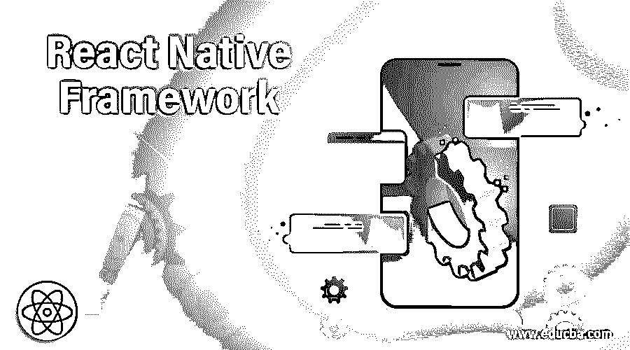

# 反应本机框架

> 原文：<https://www.educba.com/react-native-framework/>

## React 本机框架简介

React Native 现在是开发人员社区的热门词汇，开发人员对此非常兴奋。这项技术继承了 React.js 的传统，它拥有 React.js 的一切优点，并为移动开发者提供了一个很好的平台来构建一些令人敬畏的、交互式的以及有吸引力的应用程序。它支持 javascript，这使得开发人员更加方便。React Native 支持为 iOS 和 Android 这两个最常用的平台创建移动应用程序。React 处理视图控制器，并使用 JavaScript 以编程方式生成本地视图。

### 对反应本机框架的解释

React Native 是一个 JavaScript 框架，它使应用程序开发人员能够在 iOS 和 Android 这两个最常用的平台上开发具有多种组件和功能的酷应用程序。React Native 让 web 开发人员能够轻松地使用 JavaScript 创建本地应用程序，这是他们的专长。React Native 支持跨平台共享大部分代码，这使得同时在 iOS 和 Android 平台上工作变得非常容易，并且它充当了 React Native 相对于其他框架的优势。React native 提供了本机应用程序的速度和功能，同时也简化了开发人员使用 JavaScript 的过程。使用 React native，整个应用程序逻辑在 JavaScript 中创建和运行，同时整个应用程序也是本机的，这对于开发人员来说很有帮助，他们不需要与 HTML5 UI 妥协。React 创建用户界面的方法非常实用和激进。这里，应用程序用户界面可以根据当前应用程序状态轻松创建。

<small>网页开发、编程语言、软件测试&其他</small>

React Native 与 React 相同，React 混合使用 JavaScript 和 XML 风格的标记，称为 JSX。它支持 iOS 和 Android 的方式有很大的未来空间，也有潜力支持未来的平台。可以使用移动 UI 组件而不是使用 web 视图轻松构建生产就绪的移动应用程序，结果将是相同的，看起来就像任何其他移动应用程序一样。在 React Native 中，JavaScript 接口也暴露给平台 API，使得应用程序访问手机的平台特性，如相机、位置等。标记被翻译成真正的本地用户界面元素 I React native，它利用了在我们工作的平台上呈现视图的早期方式。使用单独的组件，可以在 react-native 中构建用户界面元素。

### 用于更快创建应用程序的库

让我们来看看一些可以用来更快地创建应用程序的库。

*   **NativeBase:** 在 Github 上有 12000 颗星星，NativeBase 是最著名的 React 原生库之一。该库中提供了多个跨平台组件，可以在 React 本地项目中使用或重用。任何级别的开发人员都可以创建 MVP。NativeBase 还支持操作第三方库，这表明我们可以使用 native base 和其他
*   **React Native Elements:** 凭借 Github 上的 16000 颗星，React Native Elements 也在使用最多的库上。这个库提供了一个合适的元素结构工具，而不是让开发人员更容易设计用户界面。React Native Elements 中的模板数量比 NativeBase 少，但它允许对显示的数据进行完全控制。对于初学者，React 原生元素可以作为一个很好的
*   **React Native Maps:** 在我们的 iOS 或 Android 应用中集成地图，可以使用 React native Toolkit。不同的可定制的跨平台组件被提供给开发者
*   **UI Kitten:** 在 Github 上有 3800 颗星，UI Kitten 是一个拥有一组不同用户界面组件的库。这个库有助于结合元素的设计并使用它。不同商店风格的所有元素都可以在 UI 小猫。它非常类似于 CSS，其中样式类与
*   **React Native Material UI:**React Native Material UI 有不同的 UI 组件，这些组件遵循 Google 的材质设计准则。这些组件很容易定制，这有助于我们根据自己的要求组合材料设计。它使用了一个 UI 主题 JavaScript
*   **React native Fabric:** 每个应用都需要分析，React native Fabric 帮助我们将 Fabric 分析与我们的跨平台应用相结合。目前，React native Fabric 拥有 1200 颗星
*   **Lottie Web:** Lottie web 用于添加动画反应原生。目前，它在 GitHub 上拥有超过 16，500 颗星星。After effects 动画也可以使用 Lottie Web 在 React Native 上渲染。
*   **React 原生 UI 库:** React 原生 UI 库有一个不同用户界面元素的工具集，它帮助开发人员使用支持 React 原生动画和 React 原生模糊的组件。它包括阴影，字体，边框和颜色，可以转换成
*   **React Native Paper:**React Native Paper 是一个用于用户界面组件的跨平台库。它有一个名为 Babel 的额外插件，有助于减少应用程序的大小。Github 上有超过 3400 颗星星，是 react 最著名的库之一
*   **React Native Vector Icons:**React Native Vector Icons 是用于简单和可定制图标的最有用的库之一。目前，它有超过 11，000 颗恒星

对于习惯使用 React 的移动开发人员来说，这意味着他们非常擅长编写具有本机应用程序感觉的应用程序。React native 增加了一些改进，包括跨平台开发和开发人员体验。React Native 拥有所有 React。JS 的 DOM 抽象，更好的 app 性能，易于理解的混合移动开发的编程方法。

### 结论

在本文中，我们了解了为什么人们会被 React native 所吸引，React Native 框架是如何工作的以及它的好处。我们还浏览了一些可以在 React native 中使用的库，以获得更好的应用程序。我们知道 React 开发人员如何能够轻松地在 React Native 上工作，只需稍加改进。React native Framework 是目前使用最多的框架之一，具有上述优点。我希望这篇文章对 React Native Framework 有所帮助。

### 推荐文章

这是一个反应原生框架的指南。在这里，我们讨论 React 本机框架的介绍，可以用来更快地创建应用程序的库。您也可以浏览我们的其他相关文章，了解更多信息——

1.  [反应原生网格](https://www.educba.com/react-native-grid/)
2.  [反应原生架构](https://www.educba.com/react-native-architecture/?source=leftnav)
3.  [React 原生库](https://www.educba.com/react-native-libraries/?source=leftnav)
4.  [React 组件库](https://www.educba.com/react-components-libraries/?source=leftnav)