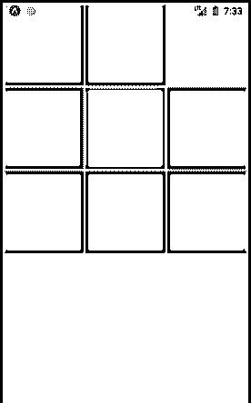

# 反应原生网格

> 原文：<https://www.educba.com/react-native-grid/>

## React 原生网格简介

网格布局可以定义为一种布局，其中组件以行和列的形式排列，从而提供了一种在用户界面上分配组件的简单方法，而无需使用定位和浮动值，为了使用 react 本机网格布局，我们需要包括 react 本机网格的依赖性。

**语法:**

<small>网页开发、编程语言、软件测试&其他</small>

现在我们将看到基本的语法。下面是代码语法:

`// import react component
import React, { Component } from 'react';
// import stylesheet and view
import { StyleSheet, View } from 'react-native';
// import react grid library
import Grid from 'react-native-grid-component';
// create class
class <ClassName> extends Component {
renderItem = (data, i) => (
// render style on component
);
renderPlaceholderItem =
// write logic to render placeholder item
/>;
render() {
return (
<Grid
style={styles.list}
renderItem={this.renderItem} // call method to render style to item
renderPlaceholder={this.renderPlaceholderItem } // call method to render placeholder item
data={<Data in form of array to be rendered into a grid>}
numColumns={<set number of columns in grid>}
/>
);
}
}`

上面的语法显示了如何在 react native 中使用 grid。在我们将 react grid 的依赖关系添加到项目中之后，首先需要将 grid 导入到我们的代码中。在 render 方法中，我们使用了 grid 标签并指定了 Grid 的不同属性。这里<classname>表示 react 类的名称，<data>表示数组形式的数据，这些数据将以行和列的形式填充到网格中。网格中所需的列数可以使用 numColumns 属性设置。在上面的语法中还使用了一些其他属性，本文后面会对它们进行解释。</data></classname>

### 网格在 React Native 中是如何工作的？

从上面的语法可以看出，为了使用 react native grid，我们需要将 react native grid 依赖项添加到 react native 项目中。可以通过运行以下命令来添加依赖关系:

`npm install react-native-grid-component`

在上面的命令成功运行之后，我们可以将依赖项导入到我们的项目中，并根据我们的需求使用它。react 本机网格布局中提供了以下参数:

| **房产名称** | **是必需的/可选的** | **属性类型** |
| 数据 | 需要 | 排列 |
| renderItem(渲染项目) | 需要 | function(data: anydata，n: number) =>ReactElement |
| 渲染占位符 | 可选择的 | 函数(n:number)= > react rement |
| 数字列 | 可选择的 | 数字 |
| 密钥提取器 | 可选择的 | 函数(item: object，n: number) = >字符串 |
| 部分 | 可选择的 | 布尔代数学体系的 |

在上表中，我们已经列出了 react native 中 grid 标签中可用的不同属性。以下是对上述每个属性的简要描述:

*   **data:** 这是一个以行和列的形式呈现在网格上的数据数组。
*   **renderItem:** 函数一次从数据中取出一个输入，并将其转换成格式化的组件以呈现在用户界面上。
*   **renderPlaceHolder:** 这是一个可选组件，它的类型是一个以数字作为输入的函数，执行所需的逻辑以返回 react 元素。
*   **keyExtractor:** 一个条目总是与一个 key 相关联，这个用来提取 react 组件对应的 key。
*   **numColumns:** 这是一个整数值，表示 react 网格中所需的列数。
*   **Sections:** 这是一个布尔属性，当我们的数据列表需要被分解成数据的逻辑单元时设置。

### React 本地网格示例

现在我们将看到 react 本机代码示例，展示 react 本机网格的使用:

`import React, { Component } from 'react';
import { StyleSheet, View } from 'react-native';
import Grid from 'react-native-grid-component';
const COLOR_COUNT = 10;
export default class App extends Component {
constructor(props) {
super(props);
this.state = {
data: addColorOnGrid(COLOR_COUNT),
refreshing: false,
};
}
dorenderItem = data => (
<View style={[{ backgroundColor: data }, styles.item]} />
);
dorenderPlaceholder = () => <View style={styles.item} />;
render() {
return (
<Grid
style={styles.list}
renderItem={this.dorenderItem}
renderPlaceholder={this.dorenderPlaceholder}
data={this.state.data}
// define number of columns on grid
numColumns={3}
keyExtractor={(item, n) => n.toString()}
refreshing={this.state.refreshing}
// do actions on refresh
onRefresh={() => {
this.setState({
data: addColorOnGrid(COLOR_COUNT),
refreshing: false,
});
}}
/>
);
}
}
const styles = StyleSheet.create({
item: {
flex: 2,
height: 120,
margin: 1.5,
},
list: {
flex: 2,
},
});
// Helper functions
// thanks materialuicolors.co
const colors_arr = [
'#2196F3',
'#03A9F4',
'#00BCD4',
'#009688',
'#4CAF50',
'#8BC34A',
'#CDDC39',
'#FFEB3B',
'#FFC107',
'#FF9800',
'#FF5722'
];
function addColorOnGrid(length) {
return Array.from(Array(length)).map(
() => colors_arr[Math.floor(Math.random() * colors_arr.length)] );
}`

**输出:**

上面的例子显示了如何在 react native 中使用网格视图。执行上述代码后，我们将在手机屏幕上看到下面的输出。上面显示的网格包含上面代码中定义的三列。

### 推荐文章

这是一个反应原生网格的指南。在这里，我们还将讨论简介以及 grid 如何在 react native 中工作？以及不同的示例和代码实现。您也可以看看以下文章，了解更多信息–

1.  [React 原生抽屉导航](https://www.educba.com/react-native-drawer-navigation/)
2.  [React 原生库](https://www.educba.com/react-native-libraries/)
3.  [反应原生图像](https://www.educba.com/react-native-image/)
4.  [反应本地异步存储](https://www.educba.com/react-native-asyncstorage/)