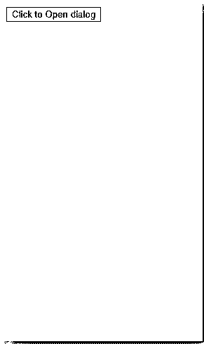
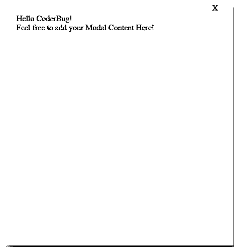
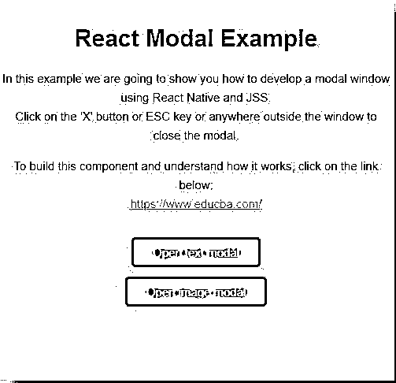
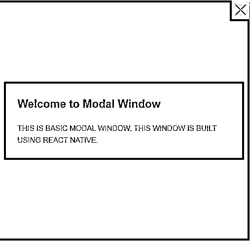
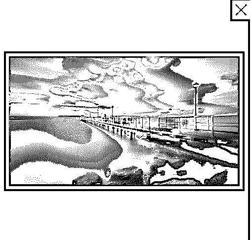

# 反应自然模态

> 原文：<https://www.educba.com/react-native-modal/>

## React 本机模态简介

React 本机模式用于在封闭视图上方显示一些内容。它是一种视图组件。在 React 本机应用程序中有三种不同的方式来显示模态。这三种不同的方式是:

*   幻灯片
*   乏味的
*   没有人

每个应用程序都需要越来越强的交互性才能在市场中脱颖而出，而模态是一种让应用程序更具交互性的方式，它让视图提供更多信息。在这篇文章中，我们将通过几个例子来了解如何使用模态。

<small>网页开发、编程语言、软件测试&其他</small>

### 举例说明如何使用反应式母语模式

#### 1.基本模态示例-

src 文件夹中的组件:

*   App.js
*   Modal.js
*   索引. js
*   样式. css

**【我】App.js**

`import React from "react"; import Modal from "./Modal";
class App extends React.Component { constructor(props) {
super(props);
this.toggleModal = this.toggleModal.bind(this);
this.state = { isModalOpen: false
};
}
toggleModal() {
const { isModalOpen } = this.state; this.setState({ isModalOpen: !isModalOpen });
}
render() { return (

<button onClick={this.toggleModal}>Click to Open dialog</button>
<Modal isOpen={this.state.isModalOpen} onClose={this.toggleModal}>

Hello CoderBug!

Feel free to add your Modal Content Here!

</Modal>

);
}
}
export default App;`

**【ii】modal . js**

`import React from "react";
import PropTypes from "prop-types";
class Modal extends React.Component { render() {
if (!this.props.isOpen) { return null;
}
const BackgroundStyle = { backgroundColor: "#e9b8f5", position: "fixed",
top: 0,
right: 0,
bottom: 0,
left: 0
};
const ModalStyle = { maxWidth: 401,
minHeight: 201, backgroundColor: "#d8ff8f", margin: "auto",
padding: 6
};
const HeaderStyle = { height: 21,
width: "100%"
};
const CloseBtnStyle = { float: "right", cursor: "pointer", display: "block"
};
return (

 X

{this.props.children}

);
}
}
Modal.propTypes = {
onClose: PropTypes.function, isOpen: PropTypes.bool, children: PropTypes.node
};
export default Modal;`

**【iii】index . js**

`import React from "react";
import ReactDOM from "react-dom";
import App from "./App";
const rootElement = document.getElementById("root");
ReactDOM.render(<App />, rootElement);`

**【iv】styles . CSS**

`.App {
font-family: sans-serif;
text-align: center;
}`

**输出:**

#### 2.带有文本和图像的模式窗口-

文件包括:

*   简单模式文件夹
*   SimpleModalLauncher 文件夹
*   IndexStyles.js
*   index.html
*   索引. js

SimpleModal 文件夹中的组件:

*   SimpleModal.js
*   SimpleModalStyles.js

SimpleModalLauncher 文件夹中的组件:

*   SimpleModalLauncher.js
*   SimpleModalLauncherStyles.js

**[i] SimpleModal.js**

`import React, { Component } from "react";
import PropTypes from "prop-types";
import injectSheet from "react-jss";
import isNil from "lodash/fp/isNil";
import styles from "./SimpleModalStyles";
class SimpleModal extends Component {
constructor(props) {
super(props);
this.handleKeyUp = this.handleKeyUp.bind(this);
this.handleOutsideClick = this.handleOutsideClick.bind(this);
}
componentDidMount() {
window.addEventListener("keyup", this.handleKeyUp, false);
document.addEventListener("click", this.handleOutsideClick, false);
}
componentWillUnmount() {
window.removeEventListener("keyup", this.handleKeyUp, false);
document.removeEventListener("click", this.handleOutsideClick, false);
}
handleKeyUp(e) {
const { onCloseRequest } = this.props;
const keys = {
27: () => {
e.preventDefault();
onCloseRequest();
window.removeEventListener("keyup", this.handleKeyUp, false);
}
};
if (keys[e.keyCode]) {
keys[e.keyCode]();
}
}
handleOutsideClick(e) {
const { onCloseRequest } = this.props;
if (!isNil(this.modal)) {
if (!this.modal.contains(e.target)) {
onCloseRequest();
document.removeEventListener("click", this.handleOutsideClick,
false);
}
}
}
render() {
const { onCloseRequest, children, classes } = this.props;
return (

 (this.modal = node)}>

{children}

<button type="button"
className={classes.closeButton}
onClick={onCloseRequest}
/>

);
}
}
SimpleModal.propTypes = { onCloseRequest: PropTypes.func,
children: PropTypes.oneOfType([
PropTypes.arrayOf(PropTypes.node),
PropTypes.node
]),
sheet: PropTypes.object,
classes: PropTypes.object
};
export default injectSheet(styles)(SimpleModal);`

**【ii】simplemodalstyles . js**

`export default { '@global': {
'body': {
overflow: 'hidden',
},
},
modalOverlay: {
display: 'flex',
alignItems: 'center', justifyContent: 'center', position: 'fixed',
top: 0,
right: 0,
left: 0,
bottom: 0, padding: '1.1rem',
backgroundColor: '#0f0d0d', zIndex: '9999',
opacity: 1,
animation: 'show .05s ease', overflowX: 'hidden', overflowY: 'auto',
},
'@keyframes show': { '0%': {
display: 'none', opacity: 0,
}, '1%': {
display: 'flex', opacity: 0,
}, '100%': {
opacity: 1,
},
},
modal: {
width: '100%', backgroundColor: '#fcf0f0',
boxShadow: [0, 0, '0.626rem', '#171616'],
'@media (min-width: 575px)': { width: '33rem',
},
},
closeButton: { position: 'fixed', top: 0,
right: 0,
background: '#f5f0f0', width: '2.50rem', height: '2.50rem', padding: 0,
border: 0,
cursor: 'pointer', outline: 0,
boxShadow: [0, 0, '0.626rem', '#171616'],
'&:before, &:after': {
content: '""', position: 'absolute', top: '1.20rem',
left: '0.26rem',
width: '2.0rem',
height: '0.10rem', backgroundColor: '#6bb38f',
},
'&:before': {
transform: 'rotate(45deg)',
},
'&:after': {
transform: 'rotate(-45deg)',
},
'&:hover:before, &:hover:after': { backgroundColor: '#3b3434',
},
},
};`

**【iii】simplemodallauncher . js**

`import React, { Component } from "react";
import PropTypes from "prop-types";
import injectSheet from "react-jss";
import styles from "./SimpleModalLauncherStyles";
import SimpleModal from "../SimpleModal/SimpleModal";
class SimpleModalLauncher extends Component { constructor(props) {
super(props); this.state = {
showModal: false
};
}
handleToggleModal() {
this.setState({ showModal: !this.state.showModal });
}
render() {
const { buttonLabel, children, classes } = this.props; const { showModal } = this.state;
return (

<button type="button"
className={classes.modalButton} onClick={() => this.handleToggleModal()}
>
{buttonLabel}
</button>
{showModal && (
<SimpleModal onCloseRequest={() => this.handleToggleModal()}>
{children}
</SimpleModal>
)}

);
}
}
SimpleModalLauncher.propTypes = { buttonLabel: PropTypes.string.isRequired, children: PropTypes.oneOfType([
PropTypes.arrayOf(PropTypes.node), PropTypes.node
]),
sheet: PropTypes.object, classes: PropTypes.object
};
export default injectSheet(styles)(SimpleModalLauncher);`

**【iv】simplemodallauncherstyles . js**

`export default {
modalButton: {
padding: ['0.70rem', '1.80rem'],
backgroundColor: '#de71a2',
border: 0,
borderRadius: '0.30rem',
fontSize: '1.0rem',
color: '#fcf7fa',
cursor: 'pointer',
marginBottom: '0.80rem',
'&:hover': {
backgroundColor: '#71c99c',
},
},
};`

**【v】index styles . js**

`export default {
'@global': {
html: {
fontSize: '15px', boxSizing: 'border-box',
},
'*, *:before, *:after': { boxSizing: 'inherit',
},
body: {
backgroundColor: '#f4ffa3',
color: '#2e2b2b',
fontFamily: 'Sans-serif',
fontWeight: 'normal',
fontSize: '1.0rem',
lineHeight: '1.6',
},
h1: {
margin: ['2.0rem', 0, '1.0rem'],
},
header: {
marginBottom: '2.0rem',
},
a: {
color: '#55c2c9',
},
'a:hover': {
color: '#b479e0',
},
},
appWrapper: {
textAlign: 'center',
},
textModal: {
textAlign: 'left',
margin: '0.80rem',
padding: '0.80rem',
background: '#c1e4f5',
'& h2': {
marginTop: 0,
},
'& p': { marginBottom: 0,
},
},
imageModal: {
padding: '0.40rem',
'& img': {
display: 'block',
maxWidth: '100%', height: 'auto',
},
},
};`

**【VI】index.html**

`

`

**【VII】index . js**

`import React from "react";
import { render } from "react-dom";
import PropTypes from "prop-types";
import injectSheet from "react-jss";
import styles from "./IndexStyles";
import SimpleModalLauncher from "./SimpleModalLauncher/SimpleModalLauncher";
const App = ({ classes }) => (

<h1>React Modal Example</h1>

In this example we are going to show you how to develop a modal window using React Native and JSS.
 
Click on the 'X' button or ESC key or anywhere outside the window to close the modal.

To build this component and understand how it works, click on the link below:
 
<a href="">https://www.educba.com/</a>

<SimpleModalLauncher buttonLabel="Open text modal">

<h2>Welcome to Modal Window</h2>

THIS IS BASIC MODAL WINDOW. THIS WINDOW IS BUILT USING REACT
NATIVE.

</SimpleModalLauncher>
<SimpleModalLauncher buttonLabel="Open image modal">

</SimpleModalLauncher>

);
App.propTypes = {
sheet: PropTypes.object, classes: PropTypes.object
};
const StyledApp = injectSheet(styles)(App);
render(<StyledApp />, document.getElementById("root"));`

**输出:**

### 结论

在以上讨论的基础上，我们了解了什么是模态，以及如何有效地使用它来构建一个好的视图。这是一个很好的视图组件，并增加了一个很好的功能来反应基于本机的应用程序，这使得应用程序更具交互性和用户友好性。上面的两个例子展示了如何在 React Native 中使用它来构建文本和图像窗口。

### 推荐文章

这是一个反应原生模态的指南。在这里，我们讨论了模态的工作原理，用三种不同的方式在应用程序中显示模态，并举例说明了它如何与输出一起使用。您也可以阅读以下文章，了解更多信息——

1.  [反应原生标签页](https://www.educba.com/react-native-tabs/)
2.  [反应原生燃烧基](https://www.educba.com/react-native-firebase/)
3.  [反应本地一个信号](https://www.educba.com/react-native-onesignal/)
4.  [反应原生下拉菜单](https://www.educba.com/react-native-dropdown/)

