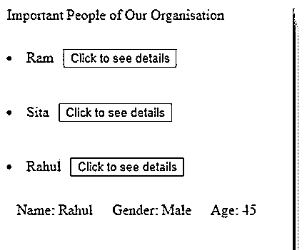
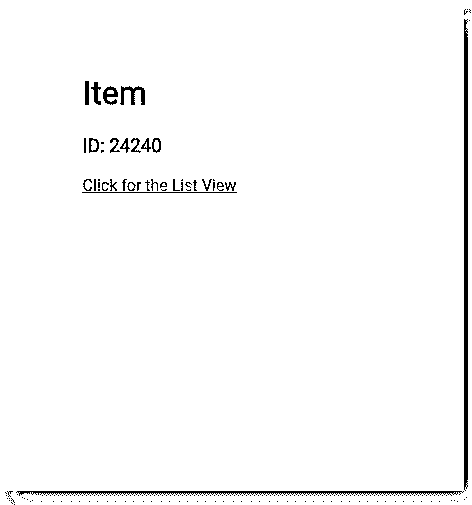
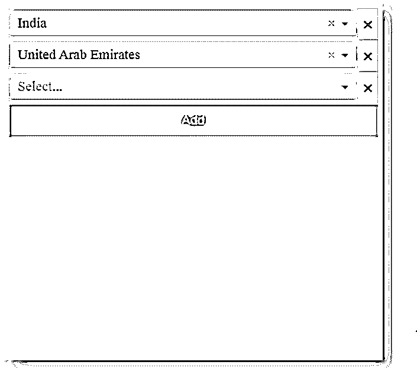

# 反应列表组件

> 原文：<https://www.educba.com/react-list-components/>

## React 列表组件简介

作为 React Native 的应用开发者，React Native 列表组件是一项非常重要的技能。React 本地列表组件帮助我们以 React 的 JSX 语法显示项目列表。我们可以使用列表组件做很多事情，比如呈现原语列表，呈现复杂对象列表，甚至自动更新列表状态。本文将让您更好地理解原生列表组件。这些示例将帮助您理解它是如何工作的，以及如何根据应用程序的不同要求来使用它。

### 使用各种 React 列表组件

下面是一些例子:

<small>网页开发、编程语言、软件测试&其他</small>

#### 1.带有过滤器的基本反应列表组件

src 文件夹中的组件:

*   FilteredList.js
*   Hello.js
*   List.js
*   索引. js

##### FilteredList.js

`import React from 'react'
import List from './List'
class FilteredList extends React.Component{
constructor() {
super()
this.state = {
initialItems: [
'Data Science',
'Data Analysis',
'Tableau',
'Power BI',
'React Native',
'React',
'Swift',
'Excel',
'SQL',
'Big Data'
],
items: [] }
this.setState({ items: this.state.initialItems })
this.filterList = this.filterList.bind(this)
}
filterList(e) {
let updatedList = this.state.initialItemsupdatedList = updatedList.filter(item => {
return (
item.toLowerCase().search(e.target.value.toLowerCase()) !== -1
)
})
this.setState({ items: updatedList })
}
render() { return (

<form>
<fieldset>
<input
type="text" placeholder="Search Here"
onChange={this.filterList} backgroundColor= '#c93e5f'
/>
</fieldset>
</form>
<List items={this.state.items} />

)
}
}
export default FilteredList`

##### Hello.js

`import React from 'react';
export default ({ name }) =><h1>Welcome {name}!</h1>;`

##### List.js

`import React from 'react'
class List extends React.Component{ render(){
return(
<ul>
{this.props.items.map(item => { return <li key={item}>{item}</li>
})}
</ul>
)
}
}
export default List`

##### 索引. js

`import React from 'react'
import { render } from 'react-dom'
import FilteredList from './FilteredList'
const styles = { fontFamily: 'sans-serif', textAlign:'center'
}
const App = () => (

<h2>Basic React List Component with Filter</h2>
<FilteredList />

)
render(<App />, document.getElementById('root'))`

**输出:**

#### 2.带有详细信息按钮的基本反应列表组件

src 文件夹中的组件:

*   index.js
*   person.js
*   persons.js
*   样式. css

##### 索引. js

`import React from "react";
import reactDom from "react-dom";
import Persons from "./persons.js";
import Person from "./person.js";
import "./styles.css";
const persons = [
{ id: 1, name: "Ram", gender: "Male", age: 23 },
{ id: 2, name: "Sita", gender: "Female", age: 26 },
{ id: 3, name: "Rahul", gender: "Male", age: 45 }
];
class App extends React.Component{ state = {
id: 0
};
setPerson = newId =>{ console.log(newId); this.setState({
id: newId
});
};
render() { return (

<Persons list={persons} person={this.setPerson} />
{this.state.id ? (
<Person person={persons.find(each => each.id == this.state.id)}
/>
) : null}

);
}
}
reactDom.render(<App />, document.getElementById("root"));`

##### person.js

`import React from "react";
export default class Person extends React.Component{
render(){
return(

Name: {this.props.person.name}
Gender: {this.props.person.gender}
Age: {this.props.person.age}

);
}
}`

##### persons.js

`import React from "react";
export default class Persons extends React.Component{
handleClick = e => {
this.props.person(e.target.value);
};
render(){
let list =this.props.list; return(

Important People of Our Organisation

{}

{list.map(each => (

<li key={each.id}>
{each.name}
<button onClick={this.handleClick} value={each.id}> Click to see details
</button>
</li>

))}

);
}
}`

##### 样式. css

`.App {
font-family: sans-serif; text-align: center;
}
span {
padding: 11px;
}
button {
display: inline; margin: 11px;
}`

**输出:**

#### 3.高级反应主义者

src 文件夹中的组件:

*   细节. js
*   List.js
*   索引. js
*   样式. css

##### 细节. js

`import React, { useState } from "react"; import { Link } from "react-router-dom";
function Detail({ match: {
params: { id }
}
}) {
const [data] = useState({ title: "Item" }); return (

<h1>{data.title}</h1>
<h3>ID: {id}</h3>
<Link to="/">Click for the List View</Link>

);
}
export default Detail;`

##### List.js

`import React, { useState } from "react";
import { Link } from "react-router-dom";
function List() {
const [data] = useState([
{ id: "24240"
, title: "Commodity 1" },
{ id: "25250"
, title: "Commodity 2" },
{ id: "26260"
, title: "Commodity 3" },
{ id: "27270"
, title: "Commodity 4" }
]);
return (

<ulclassName="list">
{data.map(item =>(
<li key={item.id}className="list-item">
<Linkto={item.id}>{item.title}</Link>
</li>
))}
</ul>

);
}
export default List;`

##### 索引. js

`import React from "react";
import ReactDOM from "react-dom"; import { BrowserRouter as Router
, Route } from "react-router-dom"; import List from "./List";
import Detail from "./Detail"; import "./styles.css";
function App() { return (
<Router className="App">
<Route exact path="/" component={List} />
<Route path="/:id" component={Detail} />
</Router>
);
}
constrootElement = document.getElementById("root");
ReactDOM.render(<App />, rootElement);`

##### 样式. css

`body {
background-color: #e7ffb0;
font-family: "Roboto", sans-serif;
}
.App {
font-family: sans-serif; text-align: center;
}
.container { margin: 0 auto; width: 641px; max-width: 81%;
}
.list {
list-style: none;
}
.list-item {
background-color: #deb1f0; margin: 9px;
padding: 1.5rem; border-radius: 5px;
}
.list-item a {
font-size: 1.75rem; text-decoration: none; color: #2b2530;
}
.card {
background-color: #9de7fc; margin: 9px;
padding: 2.5rem; border-radius: 5px;
}`

**输出:**

#### 4.带选择的交互式列表

使用的组件:

*   样式文件夹
*   Hello.js
*   index.html
*   索引. js

样式文件夹中的组件:

##### example.css

`.interactive-list-select { font-size: 19px;
width: 100%;
height: 2.26em;
border: 2px solid #b0ffd4; box-sizing: border-box; outline: 1;
}
.delete {
white-space: nowrap; width: 2%;
padding: 0 6px;
}`

##### Hello.js

`import React from 'react';
export default ({ name }) =><h1>Welcome {name}!</h1>;`

##### index.html

`

`

##### 索引. js

`import React from "react";
import ReactDOM from "react-dom";
import Select from 'react-select';
import 'react-select/dist/react-select.css';
import InteractiveList from "react-interactive-list";
import "react-interactive-list/lib/styles/react-interactive-list.css"; import './styles/example.css';
class Application extends React.Component{ constructor() {
super();
this.state = { options: [],
values: {}
};
this.renderInput = this.renderInput.bind(this); this.onRemoveItem = this.onRemoveItem.bind(this);
}
componentDidMount() { this.setState({
options: ['India', 'Turkey', 'United Arab Emirates', 'Indonesia'].map((country) => {
return { label: country, value: country };
})
});
}
renderInput(props, removable, uniqueId, index, onChangeCallback) { return (
<Select options={props.options} className='interactive-list-select' value={this.state.values[uniqueId]} onChange={
(selectedItem) => {
let newValues = this.state.values; newValues[uniqueId] = selectedItem; this.setState({values: newValues});
onChangeCallback(selectedItem);
}
} />
);
}
onRemoveItem(uniqueId, value) { deletethis.state.values[uniqueId];
this.setState({
values: this.state.values
});
console.log(this.state.values);
}
render() { return (
<InteractiveListonRemoveItem={this.onRemoveItem} renderItem={this.renderInput} placeholder="Some Text" maxItems={3} options={this.state.options}
/>
);
}
}
ReactDOM.render(<Application />, document.getElementById("root"));`

#### 输出:

### 结论

第一个例子帮助我们理解如何用过滤器创建一个本地列表。第二个例子是如何创建一个列表，这个列表有一个按钮，点击后显示一些细节。另外两个例子在预先列表和带有选择的组件上。在带有 select 的本地列表中，我们能够从选项列表中添加一个国家名称，并且还支持多项添加，这是一件很酷的事情。这些例子本质上是基本的，但是可以让你更好地理解如何创建更复杂的列表组件。

### 推荐文章

这是一个反应列表组件的指南。在这里，我们还讨论了介绍和使用其各种组件以及不同的例子和它的代码实现。您也可以看看以下文章，了解更多信息–

1.  [反应本地本地存储](https://www.educba.com/react-native-local-storage/)
2.  [React Native ListView](https://www.educba.com/react-native-listview/)
3.  [React-原生日历](https://www.educba.com/react-native-calendar/)
4.  [反应本地路由器](https://www.educba.com/react-native-router/)