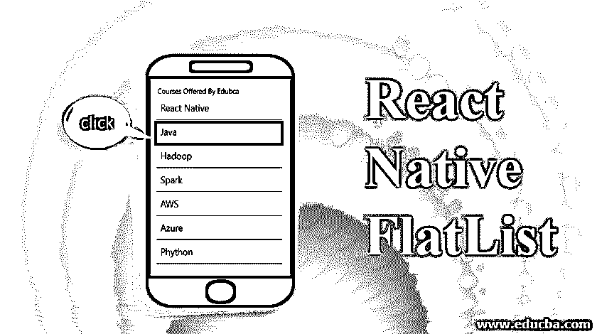
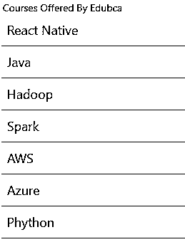
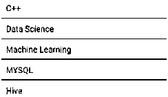
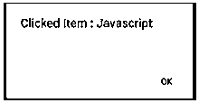

# 反应本机平面列表

> 原文：<https://www.educba.com/react-native-flatlist/>




## React 本机平面列表简介

React native flatlist 类似于 listview，用于保存列表中的项目，并提供重要的功能，如水平和垂直滚动。reactions native 中的 Flatlist 旨在处理可能不适合设备屏幕的大型数据集。该平面列表只呈现屏幕上当前显示的项目，而不是所有项目。

**语法:**

<small>网页开发、编程语言、软件测试&其他</small>

下面是一个基本语法:

```
import {Flatlist } from 'react-native';
<FlatList
data={
// data to be rendered in flatlist
}
SeparatorComponent={
// A separator to separate data items
}
renderData= {({ singledata}) =>
//  Single data view
}
/>
```

从上面的语法中，我们可以看到，可以使用两个主要属性来呈现 flatlist，这两个属性是 data 和 renderItem。分隔符、页眉、页脚和 Pulltoscroll 等其他属性是可选组件。

### Flatlist 是如何工作的？

它可以与列表视图相比较，是 react native 中最常用的组件之一。reactions native 中的 Flatlist 是一个内置组件，它提供了不适合运行应用程序的移动设备屏幕的数据滚动。平面列表适用于以下主要道具:

*   **Data:** 这是一个数据数组，包含将用于在 react native 中创建平面列表的各个项目。
*   **RenderItem:** 这是一个函数，它的目的是从一个数组中选取单个项目，并将其呈现到 react-native flatlist 的一个部分中。

### React 本机平面列表的特性

下面给出了重要的特征:

*   拉动以更新支持
*   标题支持
*   页脚支持
*   分离器支架
*   滚动加载支持
*   ScrollToIndex 支持
*   跨平台支持
*   可配置的回调
*   可选支持水平模式

上面列出的所有特性使得 flatlist 成为 react native 的一个非常常用和高效的组件。

### 例子

下面是一个显示 flatlist 用法的示例:

**代码:**

```
import React, { Component } from 'react';
import { AppRegistry, FlatList,
StyleSheet, Text, View,Alert } from 'react-native';
export default class FlatListDemo extends Component {
renderHeader= () => {
var header= (
<View style ={styles.header_footer_style}>
<Text style ={styles.textStyle}> Courses Offered By Edubca </Text>
</View>
);
return header;
};
renderSeparator = () => {
return (
<View
style={{
height: 1,
width: "100%",
backgroundColor: "#000",
}}
/>
);
};
//handling item Press event
getListViewItem = (item) => {
Alert.alert('Clicked Item : ' + item.key);
}
render() {
return (
<View style={styles.container}>
<FlatList
data={[
{key: 'React Native'},{key: 'Java'}, {key: 'Hadoop'},{key: 'Spark'},
{key: 'AWS'},{key: 'Azure'},{key: 'Phython'},
{key: 'Python'},{key: 'Javascript'}, {key: 'C++'},
{key: 'Data Science'},{key: 'Machine Learning'},{key: 'MYSQL'},
{key: 'Hive'}
]}
renderItem={({item}) =>
<Text style={styles.item}
onPress={this.getListViewItem.bind(this, item)}>{item.key}</Text>}
ItemSeparatorComponent={this.renderSeparator}
ListHeaderComponent={this.renderHeader}
/>
</View>
);
}
}
const styles = StyleSheet.create({
container: {
flex: 1,
},
item: {
padding: 10,
fontSize: 18,
height: 44,
},
})
AppRegistry.registerComponent('ReactFlatListDemo',()=>FlatListDemo);
```

**输出:**




**滚动后，我们可以看到如下项目:**




**点击一个项目，我们将看到以下内容:**




从上面的例子中我们可以看到，在 flatlist 中使用了以下属性:

*   **分隔符:**这被用作一个平面列表的不同视图之间的分割器。这是使用 flatlist 的 ItemSeparatorComponent 属性配置的。
*   **数据:**使用 flatlist 的 data prop 设置要在 flatlist 上渲染的数据。
*   **RenderItem:** 这个 prop 的作用是渲染一个包含数据内容的 flatlist，使得数组的每一部分都渲染到 flatlist 的不同单元格中。这基本上是一个接受单个参数的函数，该参数是要填充的项。
*   **Header:** 可以使用 usingListHeaderComponent 设置 flatlist 的 Header，并且可以使用函数设置其值。
*   **页脚:**可以使用 flatlist 的 ListFooterComponent prop 设置 flatlist 的页脚。

除了上述属性，还有其他属性，如 PullToScroll 和 InfiniteScroll，可以根据我们的要求进行设置。此外，我们可以看到如何在 flatlist 中处理项目的点击事件。

### 结论

从上面的文章中，我们对 react native 中的 flatlist 有了清晰的认识。它提供了几个有用的特性，其中一些已经在上面的例子中介绍过了。除了上述特性之外，还可以根据应用程序的要求和需要在 flatlist 上执行其他定制。

### 推荐文章

这是一个反应原生 FlatList 的指南。在这里，我们分别讨论 flatlist 的特性和工作方式，并举例说明。您也可以阅读以下文章，了解更多信息——

1.  [反应原生布局](https://www.educba.com/react-native-layout/)
2.  [反应原生架构](https://www.educba.com/react-native-architecture/)
3.  [React Native SectionList](https://www.educba.com/react-native-sectionlist/)
4.  [React Native ScrollView](https://www.educba.com/react-native-scrollview/)