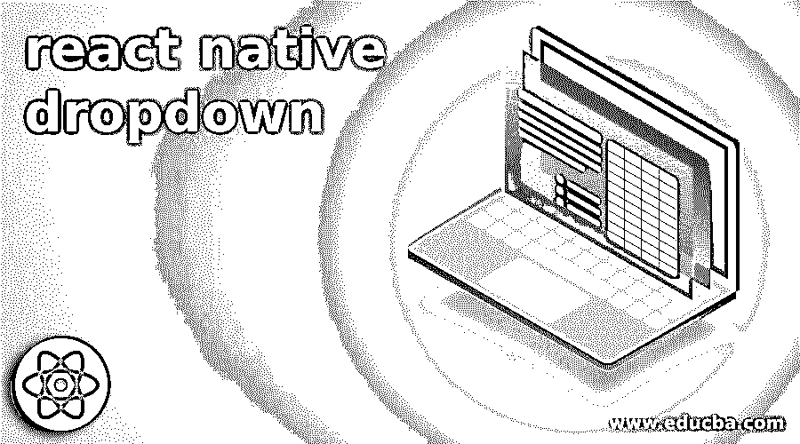
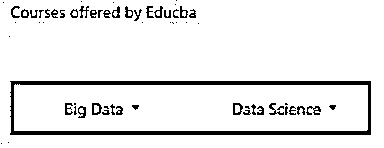
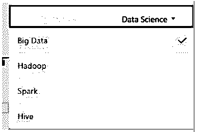
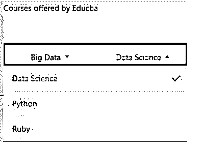

# 对本机下拉列表做出反应

> 原文：<https://www.educba.com/react-native-dropdown/>

## react 本机下拉菜单简介

React native dropdown 可以定义为一个简单的 React native 组件，可定制且易于使用。它是移动应用程序中常用的组件之一，可用于保存多个项目，并可用于在移动应用程序的不同屏幕之间导航。

**语法:**

<small>网页开发、编程语言、软件测试&其他</small>

`// import dropdown from react native
import {Dropdown } from 'react-native-material-dropdown';
// defining render method
render(){
return (  label='Label Name'  data={
// list of menu items
this.props.menuItems}
// setting dropdown menu style
containerStyle= {
styles. dropdownStyle }
onChangeText= {
(value) => {
// set current selected value in dropdown in react native
this.setState ({
selectedValue: value }
);
}
}
/> );
}
}`

### 如何在 react native 中使用 dropdown？

正如我们所知，react native 是一个跨平台的移动应用程序开发框架，可用于为 android 和 IOS 等各种操作系统构建应用程序。该程序包括从 react native 导入下拉菜单。在 render 方法中，下拉菜单的项目被填充，然后执行任何其他所需的操作。

在 react native 中使用下拉菜单需要我们遵循以下步骤:

**1。使用 npm 安装 react native 下拉包:**在创建 react native 项目后的这一步，我们需要添加它的一个依赖项。可以通过运行以下命令来添加依赖关系:

`npm install --save react-native-material-dropdown`

成功执行上述命令后，react native dropdown 的依赖项应该在 package.json 文件中可用。

**2。import react native drop down dependency:**在这一步中，我们必须在使用 drop down 之前将下拉依赖项导入到我们的源代码中。为了导入依赖关系，我们需要在代码中添加下面一行:

`import {Dropdown } from 'react-native-dropdown';`

**3。开发代码来呈现下拉菜单:**这是我们需要开发实际代码来实现下拉菜单并向其中添加项目的步骤。下面是用于呈现带有下拉项目的组件的代码。

在上面的代码片段中，我们有 render 方法，在 render 方法内部有用不同项实现它的逻辑。

`return (  label='Label Text'  data={
this.props.menuItems}
containerStyle={
styles.dropdownStyle}
onChangeText={
(dropdownitemvalue) => {
this.setState({
selectedValue: dropdownitemvalue }
);
}
}
/> );
}`

**4。标签文本:**提到的文本将被呈现为表示用户期望的输入的文本。

**5。要填充的数据:**这表示将被填充到下拉列表中的项目。数据格式应该是作为 react native dropdown 组件呈现的项目数组。

**6。下拉菜单样式:**这是将呈现在下拉菜单上的菜单样式。这可以是内置样式，也可以是任何自定义样式。

**7。onchangeText 事件:**每当用户从下拉菜单中选择一项时，就会触发该事件。我们可以在单击菜单项组件时执行所需的操作。我们可以根据菜单项的点击事件执行任何自定义事件。

### react 本机下拉列表示例

下面给出了一个例子:

**代码:**

`import React, { Component } from 'react';
import DropdownMenu from 'react-native-dropdown-menu';
import { View, Text } from "react-native";
export default class App extends Component {
constructor(props) {
super(props);
this.state = {
text: ''
};
}
render() {
var data = [["Big Data", "Hadoop", "Spark", "Hive"], ["Data Science" ,"Python","Ruby"]];
return (
<View style={{flex: 1}}>
<View>
<Text>
Courses offered by Educba
</Text>
</View>
<View style={{height: 52}} />
<DropdownMenu
style={{flex: 0.5}}
bgColor={'grey'}
tintColor={'#000000'}
activityTintColor={'red'}
handler={(selection, row) => this.setState({text: data[selection][row]})}
data={data}
>
</DropdownMenu>
</View>
);
}
}`

上面的代码展示了如何在 react native 中使用它。我们已经使用这个依赖来实现下面的菜单。

当我们编译并执行上面的代码时，我们会在手机屏幕上看到下面的输出。

**输出:**

**单击上面的第一个选项卡后，我们将看到下面的输出:**

**单击第二个选项卡后，我们将看到下面的输出:**

### 结论

上面的文章提供了对 react native dropdown 的清晰理解。有几个第三方库提供不同风格的下拉菜单。

### 推荐文章

这是一个反应原生下拉菜单的指南。在这里，我们讨论 react 本机 dropdown 的介绍，以及如何使用 dropdown 和相应的例子，以便更好地理解。您也可以看看以下文章，了解更多信息–

1.  [React 组件库](https://www.educba.com/react-components-libraries/)
2.  [反应原生进度条](https://www.educba.com/react-native-progress-bar/)
3.  [反应本地异步存储](https://www.educba.com/react-native-asyncstorage/)
4.  [反应原生闪屏](https://www.educba.com/react-native-textinput/)

