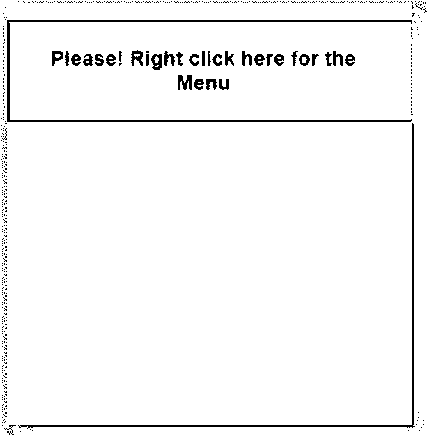
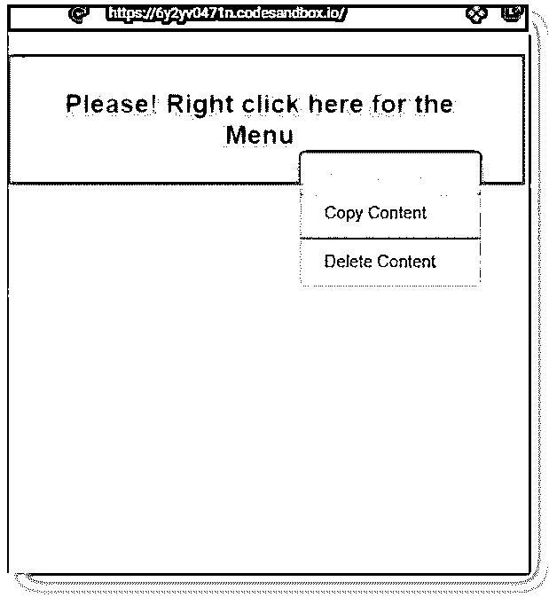
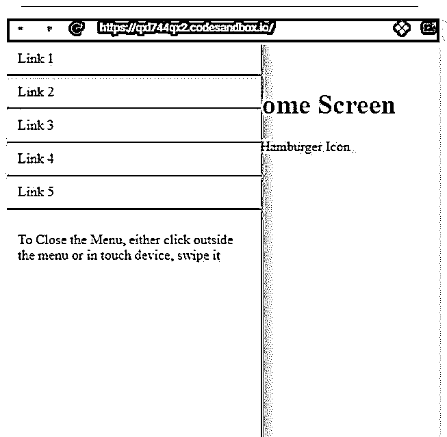
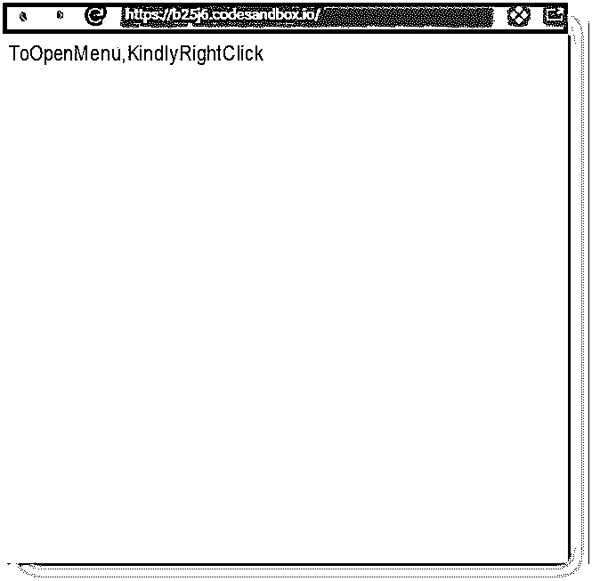
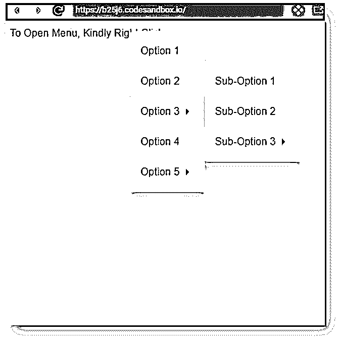

# 反应本地菜单

> 原文：<https://www.educba.com/react-native-menu/>

## React 原生菜单简介

以下文章提供了 React 本机菜单的概述。菜单暂时向我们展示了高架表面上的不同选项。菜单的位置取决于需求和打开它们的元素。在任何应用程序或网站中，菜单在导航用户到网站/应用程序共享的信息的不同部分方面起着重要的作用。在 React 或 React Native 的情况下，创建菜单并不是一项困难的任务。它提供了多种创建菜单的方法。

**语法:**

<small>网页开发、编程语言、软件测试&其他</small>

`<Menu
ref={this.setMenuRef} button={
<Text onPress={this.showMenu} style={this.props.textStyle}>
{this.props.menutext}
</Text>
}>
<MenuItemonPress={this.option1Click}>op1:Go to second Page</MenuItem>
<MenuItemonPress={this.option2Click}>op2:Demo Option</MenuItem>
<MenuItemonPress={this.option3Click} disabled> op3:Disabled option
</MenuItem>
<MenuDivider />
<MenuItemonPress={this.option4Click}> op4:Option After Divider
</MenuItem>
</Menu>`

### React 本地菜单示例

下面是提到的例子:

#### 示例#1

上下文菜单。

src 文件夹中的组件:

*   样式文件夹
*   索引. js

样式文件夹中的组件:

*   自定义. css
*   react-contextmenu.css

**a. custom.css**

`.custom-root {
background-color: #f2f7f6;
}
.custom-divider {
background-color:#050505;
}
.custom-selected { background-color:#b3f551;
}`

**b. react-contextmenu.css**

`.react-contextmenu {
background-color: #ebeded;
background-clip: padding-box;
border: 1px solid #42393930;
border-radius: 0.26rem;
color:#333636;
font-size: 15px;
margin: 3px 0 0;
min-width: 161px;
outline: none;
opacity: 0;
padding: 6px 0;
pointer-events: none;
text-align: left;
transition: opacity 251ms ease !important;
}
.react-contextmenu.react-contextmenu--visible {
opacity: 1;
pointer-events:
auto; z-index: 9999;
}
.react-contextmenu-item {
background: 00;
border: 0;
color: #373a3c;
cursor:pointer;
font-weight: 401;
line-height: 1.6;
padding: 4px 21px; t
ext-align: inherit;
white-space: nowrap;
}
.react-contextmenu-item.react-contextmenu-item--active,
.react-contextmenu-item.react-contextmenu-item--selected {
color: #f5f0f1;
background-color: #98e85f;
border-color: #e34467;
text-decoration: none;
}
.react-contextmenu-item.react-contextmenu-item--disabled,
.react-contextmenu-item.react-contextmenu-item--disabled:hover {
background-color: transparent;
border-color: rgba(0, 0, 0, 0.16);
color: #6e5e61;
}
.react-contextmenu-item--divider {
border-bottom: 2px solid rgba(12, 12, 12, 0.16);
cursor: inherit;
margin-bottom: 4px;
padding: 3px 0;
}
.react-contextmenu-item--divider:hover {
background-color: transparent;
border-color: rgba(0, 0, 0, 0.16);
}
.react-contextmenu-item.react-contextmenu-submenu {
padding: 0;
}
.react-contextmenu-item.react-contextmenu-submenu > .react-contextmenu-item
{
}
.react-contextmenu-item.react-contextmenu-submenu.react-contextmenu-item:after {
content: '▶';
display: inline-block;
position: absolute;
right: 6px;
}
.example-multiple-targets::after {
content: attr(data-count);
display: block;
}`

**c. index.js**

`import React from 'react'
import { render } from 'react-dom'
import { ContextMenu
, MenuItem
, ContextMenuTrigger } from 'react-contextmenu'
import './styles/react-contextmenu.css'
import './styles/custom.css'
const styles = {
textAlign: 'center',
textColor: '#9ded3b',
backgroundColor: '#ac46e8',
padding: 31
}
const ID = 'ID'
consthandleClick = (event, data) =>{
console.log(`clicked`, { event, data })
}
const attributes = {
className: 'custom-root',
disabledClassName: 'custom-disabled',
dividerClassName: 'custom-divider',
selectedClassName: 'custom-selected'
}
const App = () => (

<ContextMenuTrigger id={ID}>
<h2 style={styles}>Please! Right click here for the Menu</h2>
</ContextMenuTrigger>
<ContextMenuid={ID}>
<MenuItem
data={{ action: 'paste' }}
onClick={handleClick}
attributes={attributes}
>
Paste Content
</MenuItem>
<MenuItem
data={{ action: 'copy' }}
onClick={handleClick}
attributes={attributes}
>
Copy Content
</MenuItem>
<MenuItem divider />
<MenuItem
data={{ action: 'delete' }}
onClick={handleClick}
attributes={attributes}
>
Delete Content
</MenuItem>
</ContextMenu>

)
render(<App />, document.getElementById('root'))`

**输出:**

#### 实施例 2

汉堡菜单。

汉堡菜单的组成部分:

*   index.html
*   索引. js
*   menuContent.css
*   menu content . js-功能表内容

**index.html**

`

`

**b. index.js**

`import HamburgerMenu from 'react-hamburger-menu'
import MenuContent from './menuContent'
constcontentStyles = {
fontFamily: 'Times New Roman',
textAlign:'center',
}
class App extends Component {
constructor(props){
super(props)
this.state = {
menuOpen: false,
}
}
openMenu() {
this.setState({ menuOpen: true })
}
closeMenu() {
this.setState({ menuOpen: false })
}
render() {
return 

<CheeseburgerMenuisOpen={this.state.menuOpen}
color='#761aab'
closeCallback={this.closeMenu.bind(this)}>
<MenuContentcloseCallback={this.closeMenu.bind(this)}/>
</CheeseburgerMenu>
<HamburgerMenuisOpen={this.state.menuOpen} menuClicked={this.openMenu.bind(this)}
width={31}
height={25}
strokeWidth={4}
rotate={0}
color='#761aab'
borderRadius={0}
animationDuration={0.7}
/>

<h1>Welcome to the Home Screen</h1>

To Open Menu, Click on the Hamburger Icon

}
}
render(<App />, document.getElementById('root'))`

c . menu content . CSS

`.menu {
font-family: 'Times New Roman', Times, serif;
}
.menu-item {
border-bottom: 2px solid #a359d4;
}
.menu-item a {
display: block;
padding: .6rem 16px;
color:inherit;
text-decoration: none;
}
.menu-item a:hover {
color: inherit;
text-decoration: none;
background-color: #b3f266;
}
.menu-item a:focus {
text-decoration: none;
}
.menu-item a:visited {
color: inherit;
}
.active-menu-item {
background-color: #fafa82;
}
.hint {
padding: .6rem 16px;
}`

**d. menuContent.js**

`import React, { Component } from 'react'
import './menuContent.css'
class MenuContent extends Component {
constructor(props) {
super(props)
this.items = [] for (let i=1; i<=5; i++) {
this.items.push(i)
}
}
render() {
return (

{this.items.map(i =>

<a
href="https://www.educba.com/"onClick
={this.props.closeCallback}
target="_blank">
Link {i}
</a>

)}

To Close the Menu, either click outside the menu or in touch device, swipe it

)
}
}
MenuContent.PropTypes = {
closeCallback: React.PropTypes.func.isRequired
}
export default MenuContent`

**输出:**

#### 实施例 3

嵌套菜单。

src 文件夹中的组件:

*   App.tsx
*   index.tsx
*   样式. css

**a. App.tsx**

`import React, { useState } from "react";
import { Menu, MenuItem, Typography } from "@material-ui/core";
import NestedMenuItem from "material-ui-nested-menu-item";
export constNestedMenu = () => {
const [menuPosition, setMenuPosition] = useState<any>(null);
consthandleRightClick = (event: React.MouseEvent) =>{ if (menuPosition) {
return;
}
event.preventDefault();
setMenuPosition({
top: event.pageY,
left: event.pageX
});
};
consthandleItemClick = (event: React.MouseEvent) =>{
setMenuPosition(null);
};
return (

<Typography>To Open Menu, Kindly Right Click</Typography>
<Menu
open={!!menuPosition}
onClose={() =>setMenuPosition(null)}
anchorReference="anchorPosition"
anchorPosition={menuPosition}
>
<MenuItemonClick={handleItemClick}>Option1</MenuItem>
<MenuItemonClick={handleItemClick}>Option2</MenuItem>
<NestedMenuItem label="Option 3"
parentMenuOpen={!!menuPosition}
onClick={handleItemClick}
>
<MenuItemonClick={handleItemClick}>Sub-Option1</MenuItem>
<MenuItemonClick={handleItemClick}>Sub-Option2</MenuItem>
<NestedMenuItem
label="Sub-Option 3"
parentMenuOpen={!!menuPosition}
onClick={handleItemClick}
>
<MenuItemonClick={handleItemClick}>Sub-Sub-Option1</MenuItem
<MenuItemonClick={handleItemClick}>Sub-Sub-Option2</MenuItem>
</NestedMenuItem>
</NestedMenuItem>
<MenuItemonClick={handleItemClick}>Option 4</MenuItem>
<NestedMenuItem
label="Option 5"
parentMenuOpen={!!menuPosition}
onClick={handleItemClick}
>
<MenuItemonClick={handleItemClick}>Sub-Option1</MenuItem>
<MenuItemonClick={handleItemClick}>Sub-Option2</MenuItem>
</NestedMenuItem>
</Menu>

);
};
export default NestedMenu;`

**b. index.tsx**

`import * as React from "react";
import { render } from "react-dom";
import App from "./App";
constrootElement = document.getElementById("root");
render(<App />, rootElement);`

**c . styles . CSS****T3】**

`.App {
font-family: 'Times New Roman', Times, serif;
text-align: center;
}`

**输出:**

### 结论

根据上面的文章，其中包括例子，语法和对 React 本地菜单的简要介绍，我们可以看到如何创建菜单，以及如何根据我们的要求使用它。第一个例子是右键点击文本后出现的基本菜单，第二个例子向我们展示如何创建一个汉堡菜单，它也有我们网站的链接，最后一个帮助我们理解嵌套菜单的创建。

### 推荐文章

这是一个反应原生菜单的指南。这里我们分别讨论 React 本地菜单的介绍以及编程示例。您也可以看看以下文章，了解更多信息–

1.  [React 组件库](https://www.educba.com/react-component-library/)
2.  [反应本地本地存储](https://www.educba.com/react-native-local-storage/)
3.  [MobX 反应原生](https://www.educba.com/mobx-react-native/)
4.  [反应自然取向](https://www.educba.com/react-native-orientation/)