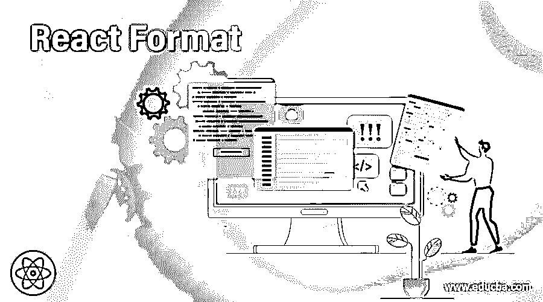
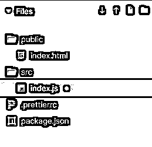
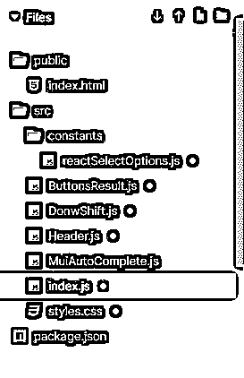
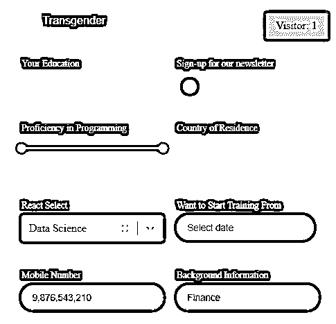
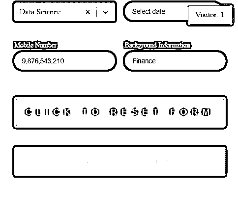

# 反应格式

> 原文：<https://www.educba.com/react-format/>

## React 格式简介

在网页或应用程序上显示一个数字是一件比较容易的事情，但是当涉及到格式化的时候，它就变得令人兴奋了。这篇文章简化了这项繁重的工作。格式是表示数字的最佳方式，这样它就可以有一些意义，并向用户提供更多的信息。可以进行格式化来以日期、货币、时间等形式表示数字。在本文中，提供了一些示例来解释如何以更有意义的方式格式化数字。这些例子以一种更简单的方式向读者展示了这个概念，这样他们就可以在他们的工作中应用这个概念。

**语法:**

<small>网页开发、编程语言、软件测试&其他</small>

*   **React 数字格式语法**

`import NumberFormat from 'react-number-format'`

*   **React 货币格式语法**

`import MaskedInput from 'react-text-mask'`

### 使用 React 格式

上述语法可用于将数字转换成数字或货币格式。可以导入库“NumberFormat ”,将数字格式化为有意义的数字，MaskedInput 可用于货币格式化。

### 例子

让我们讨论一下 React 格式的例子。

#### 示例 1–基本反应数字格式示例

在下面的例子中，我们使用了“react-number-format”在代码中导入数字格式。下面显示了一个数字格式的基本示例。

示例中使用的文件是:

**【I】index . js**

`import React
, {Component} from 'react'
import {render} from 'react-dom'
import NumberFormat from 'react-number-format'
import AutosizeInput from 'react-input-autosize'
export class App extends Component {
state = {n: '0'}
render() {
return (

<h2>Welcome to React Number Format Example</h2>
<NumberFormat
customInput={AutosizeInput}
isNumericString={true}
allowNegative={false}
decimalSeparator="."
decimalScale={3}
value={this.state.n}
onChange={s => this.setState({n: s.value})}
/>
<h3>***Thank You***</h3>

)
}
}
render(<App />, document.getElementById('root'))`

**输出:**

**

** 

#### 示例 2–React 格式提前示例

在下面的例子中，我们创建了一个表单，其中使用了 React Number 格式以及各种其他格式，如日期选择器、控制器、滑块等。

为了实现代码，使用的文件是:

**【我】reacelectionoptions . js**

`export default [
{ value: "data analysis"
, label: "Data Analysis" },
{ value: "data engineering"
, label: "Data Engineering" },
{ value: "data science"
, label: "Data Science" }
];`

**【ii】buttons result . js**

`import React from "react";
export default ({ data, reset, defaultValues }) => (
<>
{data && (
<pre style={{ textAlign: "left", color: "white" }}>
{JSON.stringify(data, null, 2)}
</pre>
)}
<button
className="button buttonBlack"
type="button"
onClick={() => {
reset(defaultValues);
}}
>
Click to Reset Form
</button>
<button className="button">Click to Submit</button>
</>
);`

**【iii】donw shift . js**

`import React from "react";
import Downshift from "downshift";
const items = ["Finance", "IT", "Consultant", "Research", "Other"];
export default ({ value, onChange }) => (
<Downshift
initialInputValue={value}
onChange={onChange}
itemToString={item => (item ? item : "")}
>
{({
getInputProps,
getItemProps,
getLabelProps,
getMenuProps,
isOpen,
inputValue,
highlightedIndex,
selectedItem
}) => (

<label {...getLabelProps()} className="label">
Background Information
</label>
<input
{...getInputProps()}
className="input"
placeholder="Enter your background"
/>
<ul {...getMenuProps()}>
{isOpen
? items
.filter(item => !inputValue || item.includes(inputValue))
.map((item, index) => (
<li
{...getItemProps({
key: item,
index,
item,
style: {
backgroundColor:
highlightedIndex === index ? "lightgray" : null,
fontWeight: selectedItem === item ? "bold" : "normal"
}
})}
>
{item}
</li>
))
: null}
</ul>

)}
</Downshift>
);`

**【iv】header . js**

`import React from "react";
export default ({ renderCount }) => (
<>
Visitor: {renderCount}
<h1 className="h1">
<svg
width="40px"
height="40px"
viewBox="0 0 150 150"
style={{ top: 9, position: "relative", marginRight: 10 }}
>
<defs />
</svg>
Welcome to EduCBA
</h1>

This is an example of React Format where we have used React Number Format.

</>
);`

**【v】mui autocomplete . js**

`import React from "react";
import TextField from "@material-ui/core/TextField";
import Autocomplete from "@material-ui/lab/Autocomplete";
import { Controller } from "react-hook-form";
export default function CountrySelect({ onChange, control }) {
return (
<Controller
as={
<Autocomplete
options={countries}
getOptionLabel={option => option.label}
renderOption={option => (

{countryToFlag(option.code)}
{option.label}

)}
renderInput={params => (
<TextField
{...params}
label="Choose a country"
variant="outlined"
/>
)}
/>
}
onChange={([, data]) => data}
name="country"
control={control}
defaultValue={{ code: "IN"
, label: "India"
, phone: "91" }}
/>
);
}
function countryToFlag(isoCode) {
return typeof String.fromCodePoint !== "undefined"
? isoCode
.toUpperCase()
.replace(/./g, char =>
String.fromCodePoint(char.charCodeAt(0) + 127397)
)
: isoCode;
}
const countries = [
{ code: "CA"
, label: "Canada"
, phone: "1"
, suggested: true },
{ code: "GB"
, label: "United Kingdom"
, phone: "44" },
{ code: "IN"
, label: "India"
, phone: "91" },
{ code: "JP"
, label: "Japan"
, phone: "81"
, suggested: true },
{ code: "US"
, label: "United States"
, phone: "1"
, suggested: true },
];`

**【VI】index . js**

`import React
, { useState } from "react";
import ReactDOM from "react-dom";
import { useForm
, Controller } from "react-hook-form";
import Header from "./Header";
import ReactDatePicker from "react-datepicker";
import NumberFormat from "react-number-format";
import ReactSelect from "react-select";
import options from "./constants/reactSelectOptions";
import {
TextField
, Checkbox
, Select
, MenuItem
, Switch
, RadioGroup
, FormControlLabel
, ThemeProvider
, Radio
, createMuiTheme
, Slider
} from "@material-ui/core";
import MuiAutoComplete from "./MuiAutoComplete";
import "react-datepicker/dist/react-datepicker.css";
import "./styles.css";
import ButtonsResult from "./ButtonsResult";
import DonwShift from "./DonwShift";
let renderCount = 0;
const theme = createMuiTheme({
palette: {
type: "light"
}
});
const defaultValues = {
Native: "",
TextField: "",
Select: "",
ReactSelect: { value: "data science"
, label: "Data Science" },
Checkbox: false,
switch: false,
RadioGroup: "",
numberFormat: 9876543210,
downShift: "Finance"
};
function App() {
const { handleSubmit, register, reset, control } = useForm({ defaultValues });
const [data, setData] = useState(null);
renderCount++;
return (
<ThemeProvider theme={theme}>
<form onSubmit={handleSubmit(data => setData(data))} className="form">

<label>Choice of Course:</label>
<input name="Native" className="input" ref={register} />

<label>Give Consent</label>
<Controller
as={Checkbox}
name="Checkbox"
type="checkbox"
control={control}
/>

<label>Gender</label>
<Controller
as={
<RadioGroup aria-label="gender">
<FormControlLabel
value="female"
control={<Radio />}
label="Female"
/>
<FormControlLabel
value="male"
control={<Radio />}
label="Male"
/>
<FormControlLabel
value="transgender"
control={<Radio />}
label="Transgender"
/>
</RadioGroup>
}
name="RadioGroup"
control={control}
/>

<label>E-sign</label>
<Controller as={TextField} name="TextField" control={control} />

<label>Your Education</label>
<Controller
as={
<Select>
<MenuItem value={10}>High School</MenuItem>
<MenuItem value={20}>Bachelors</MenuItem>
<MenuItem value={30}>Masters</MenuItem>
<MenuItem value={40}>PhD</MenuItem>
</Select>
}
name="Select"
control={control}
/>

<label>Sign-up for our newsletter</label>
<Controller
as={Switch}
type="checkbox"
name="switch"
control={control}
/>

<label>Proficiency in Programming</label>
<Controller
name="MUI_Slider"
control={control}
defaultValue={[0, 10]}
onChange={([, value]) => value}
as={<Slider valueLabelDisplay="auto" max={10} step={1} />}
/>

<label>Country of Residence</label>
<MuiAutoComplete control={control} />

<label>React Select</label>
<Controller
as={ReactSelect}
options={options}
name="ReactSelect"
isClearable
control={control}
/>

<label>Want to Start Training From</label>
<Controller
as={ReactDatePicker}
control={control}
valueName="selected"
onChange={([selected]) => selected}
name="ReactDatepicker"
className="input"
placeholderText="Select date"
/>

<label>Mobile Number</label>
<Controller
as={NumberFormat}
thousandSeparator
name="numberFormat"
className="input"
control={control}
/>

<Controller as={DonwShift} control={control} name="downShift" />

<ButtonsResult {...{ data, reset, defaultValues }} />
</form>
</ThemeProvider>
);
}
const rootElement = document.getElementById("root");
ReactDOM.render(<App />, rootElement);`

**【VII】styles . CSS**

`body {
background: #870837;
font-family: 'Times New Roman'
, Times
, serif;
color: white;
padding: 0 25px 110px;
}
.h1 {
margin-top: 75px;
color: #c8f54e;
font-size: 23.5px;
padding-bottom: 12px;
border-bottom: 2px solid #c078eb;
}
.form {
max-width: px;
margin: 0 auto;
}
.p {
color: #cbe043;
text-align: center;
}
.input {
display: block;
box-sizing: border-box;
width: 100%;
border-radius: 50px;
border: 1px solid #faf287;
padding: 9.5px 14.5px;
margin-bottom: 9.5px;
font-size: 13.5px;
}
.label,
section > label {
line-height: 0.5;
text-align: left;
display: block;
margin-bottom: 11.5px;
margin-top: 19.5px;
color: #faf287;
font-size: 13.5px;
font-weight: 199;
}
.button {
background: #f5b767;
color: #fcfbfa;
text-transform: uppercase;
border: none;
margin-top: 40.5px;
padding: 20.5px;
font-size: 16.5px;
font-weight: 100;
letter-spacing: 10.5px;
display: block;
appearance: none;
border-radius: 4.5px;
width: 100%;
}
.buttonBlack {
background: #807c78;
border: 1px solid #f7f5f2;
}
.App {
max-width: 605px;
margin: 0 auto;
}
.container {
display: grid;
grid-template-columns: 1fr 1fr;
grid-gap: 19.5px;
}
.counter {
font-weight: 400;
background: #f7f5f2;
color: #0a0a09;
padding: 9.5px 14.5px;
border-radius: 3.5px;
position: fixed;
top: 19.5px;
right: 19.5px;
z-index: 9999999;
border: 1px solid #1dd120;
box-shadow: 0 0 4px #1dd120;
}`

**输出:**

**T2】**

 **

### 结论

在上述文章的基础上，对 React 格式的概念进行了解释。本文解释了如何根据网页或应用程序的要求在不同的情况下使用 React 格式。我们希望这篇文章能让开发人员更容易理解这个概念。

### 推荐文章

这是 React 格式的指南。在这里，我们讨论了 React 格式的介绍、工作原理以及适当的例子和代码。您也可以浏览我们的其他相关文章，了解更多信息——

1.  [反应道具](https://www.educba.com/react-props/)
2.  [反应片段](https://www.educba.com/react-fragment/)
3.  [反应构造器](https://www.educba.com/react-constructor/)
4.  [反应键](https://www.educba.com/react-keys/)**