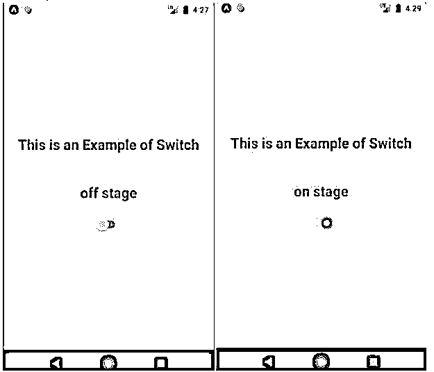
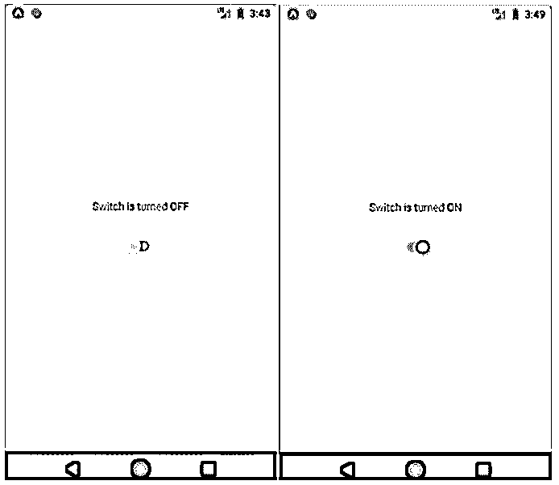
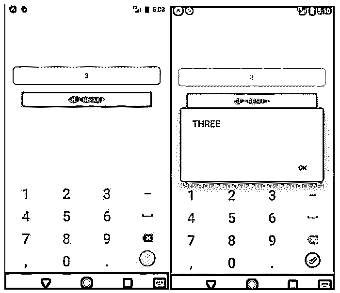
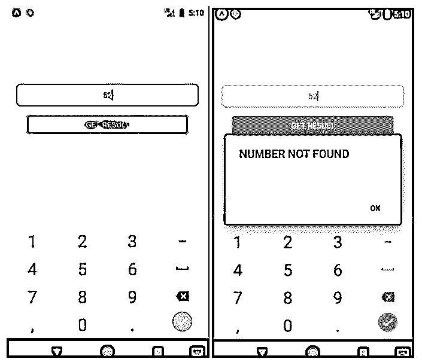
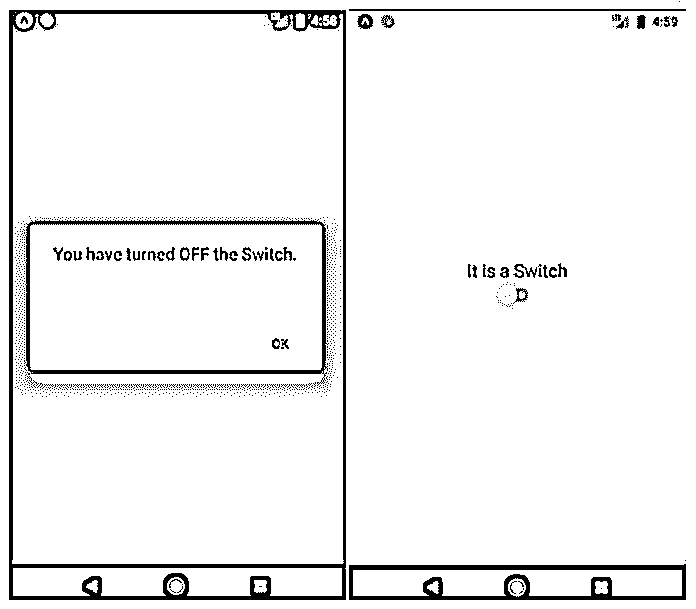

# 反应-本地开关

> 原文：<https://www.educba.com/react-native-switch/>

## React-Native 开关简介

React-Native 开关是一个由布尔值控制的组件，该值为真或假。为了更新关于组件的值属性以反映用户动作，使用 React-Native 开关的值改变回调方法。如果 valueprop 中没有更新，组件将无法给出用户操作的预期结果，而是会继续提供所提供的值。开关的属性是禁用的，trackColor，ios_backgroundColor，onValueChange，testID，thumbColor，tintColor，value。开关使用的主要属性是 on 值变化(通过开关值的变化调用)和 Value(开关值)。

**在 React Native 中导入交换机的语法:**

<small>网页开发、编程语言、软件测试&其他</small>

`import { Switch} from 'react-native'
<Switch
onValueChange={ (value) =? this.setState({ toggled: value })}
value={ this.state.toggled }
/>`

**在开关中使用 Render 的语法:**

`<Switch onValueChange= {handlerHere} value = {Pre decided value ifany}/>`

### 交换机组件如何在 React-Native 中工作？

react native 中交换机组件的工作定义如下:

**步骤 1:** 对于逻辑，使用 HomeContainer 组件，在下面的代码中，借助新文件 SwitchExample.js 创建表示性组件。

**步骤 2:** 在 SwitchExamplecomponent 中切换开关项，值已经从 state 和 functions 中传递。为了更新状态，使用切换功能。开关组件需要两个道具。当用户按下开关时，onValueChange prop 将触发切换功能。对于 HomeContainer 组件的状态，值 prop 是有界的。如果按下开关，状态将被更新，在值绑定到默认值之前，用户可以在控制台中检查值。

### 开关在应用中的逻辑和表现

下面给出了应用中开关的逻辑和表示的编码:

**代码:**

`import React, { Component } from 'react'
import {StyleSheet, Switch, View, Text} from 'react-native'
export default class SwitchExample extends Component {
state = {
switchValue: false
};
render() {
return (
<View style={styles.container}>
<Text style={styles.textStyle}>This is an Example of
Switch</Text>
<Text style={styles.textStyle}>{this.state.switchValue ? 'on stage' :'off stage'}</Text>
<Switch
value={this.state.switchValue} onValueChange
={(switchValue)=>this.setState({switchValue})}/>
</View>
);
}
}
const styles = StyleSheet.create({ container:{
flex:1,
alignItems: 'center', justifyContent: 'center', backgroundColor: '#96f2ca',
},
textStyle:{
margin: 25,
fontSize: 24, fontWeight: 'bold', textAlign: 'center', color: '#3a4a35'
}
})`

**输出:**

### React 本机开关的示例

下面是一些例子:

#### 示例#1

反应本机开关。

在下面的示例中，最初开关值设置为“FALSE ”,显示文本为“OFF”。当通过调用 onValueChange 将 Switch 的值更改为“TRUE”时，文本组件将重置为“ON”。

**代码:**

`import React from 'react';
import { Switch
,Text
,View
, StyleSheet } from 'react-native';
export default class App extends React.Component{ state = { switchValue: false };
toggleSwitch = value =>{ this.setState({ switchValue: value});
};
render() { return (
<View style={styles.container}>
<Text>{this.state.switchValue ? 'Switch is turned ON' : 'Switch is turned OFF'}</Text>
<Switch
style={{ marginTop: 31 }} onValueChange={this.toggleSwitch} value={this.state.switchValue}
/>
</View>
);
}
}
const styles = StyleSheet.create({ container: {
flex: 1,
justifyContent: 'center', alignItems: 'center', backgroundColor: '#edb5ff',
},
});`

**输出:**

#### 实施例 2

在 React Native 中使用 Switch Case 语句。

**代码:**

`import React, { Component } from 'react';
import { Platform, StyleSheet, View, TextInput, TouchableOpacity, Alert, Text } from 'react-native';
export default class App extends Component { constructor(){
super(); this.state={
TextInput_Data : ''
}
}
checkSwitch=(param)=>{ switch(param) {
case '1':
this.ONE(); break;
case '2':
this.TWO(); break;
case '3':
this.THREE(); break;
case '4':
this.FOUR(); break;
default:
Alert.alert("NUMBER NOT FOUND");
}
}
ONE=()=>{
Alert.alert("ONE");
} TWO=()=>{
Alert.alert("TWO");
}
THREE=()=>{
Alert.alert("THREE");
}
FOUR=()=>{
Alert.alert("FOUR");
}
render() { return (
<View style={styles.MainContainer}>
<TextInput
placeholder="Enter Value Here"
onChangeText={data =>this.setState({ TextInput_Data: data })} style={styles.textInputStyle} underlineColorAndroid='transparent'
keyboardType = {"numeric"}
/>
<TouchableOpacityonPress={this.checkSwitch.bind(this, this.state.TextInput_Data)} activeOpacity={0.6} style={styles.button} >
<Text style={styles.TextStyle}> GET RESULT </Text>
</TouchableOpacity>
</View>
);
}
}
const styles = StyleSheet.create({ MainContainer: {
flex: 1,
paddingTop: (Platform.OS) === 'ios' ?20 : 0, justifyContent: 'center',
alignItems: 'center', backgroundColor: '#f6ffa6', marginBottom: 20
},
textInputStyle: { height: 40,
width: '90%', textAlign: 'center', borderWidth: 1, borderColor:'#033ea3', borderRadius: 8,
marginBottom:15
},
button: { width: '80%',
padding: 8, backgroundColor:'#7a53e6', borderRadius:5, justifyContent: 'center', alignItems:'center'
},
TextStyle:{
color:'#ffffff', textAlign:'center',
}
});`

**输出:**

#### 实施例 3

React Native 的可定制开关组件。

**代码:**

`import React, { Component } from 'react'; import { StyleSheet
,Text
,View
, Switch
, Alert } from 'react-native';
export default class App extends Component { constructor() {
super(); this.state = {
SwitchOnValueHolder: false
}
}
ShowAlert = (value) =>{ this.setState({
SwitchOnValueHolder: value
})
if (value == true) {
Alert.alert("You have truned ON the Switch.");
}
else {
Alert.alert("You have turned OFF the Switch.");
}
}
render() { return (
<View style={styles.container}>
<Text style={styles.text}> It is a Switch </Text>
<Switch
onValueChange={(value) =>this.ShowAlert(value)} style={{ marginBottom: 10 }} value={this.state.SwitchOnValueHolder} />
</View>
);
}
}
const styles = StyleSheet.create({ container: {
flex: 1,
justifyContent: 'center', alignItems: 'center', backgroundColor: '#afff63',
},
text: { fontSize: 19,
color: '#000000',
},
});`

**输出:**

下图显示了开关分别打开和关闭时出现的窗口。

**当开关处于 on 状态时:**

**当开关处于关闭状态时:**

### 结论

在这里，我们知道当 valueprop 设置为 TRUE 时，开关值可以设置为 ON，当 valueprop 设置为 FALSE(这也是 value prop 的默认值)时，开关值可以设置为 OFF。我们还看到了在 React-Native 中从创建文件到逻辑再到最终表示的切换过程。我们还了解了如何开发一个简单的交换机，使用 switch case 语句开发交换机，以及开发一个可定制的交换机。在反应中，可以非常容易且非常有效地开发本地交换机。

### 推荐文章

这是一个反应本地开关的指南。在这里，我们讨论介绍，开关组件如何在 react-native 和例子。您也可以看看以下文章，了解更多信息–

1.  [React 原生抽屉导航](https://www.educba.com/react-native-drawer-navigation/)
2.  [React 原生库](https://www.educba.com/react-native-libraries/)
3.  [反应本地异步存储](https://www.educba.com/react-native-asyncstorage/)
4.  [React Native SectionList](https://www.educba.com/react-native-sectionlist/)

