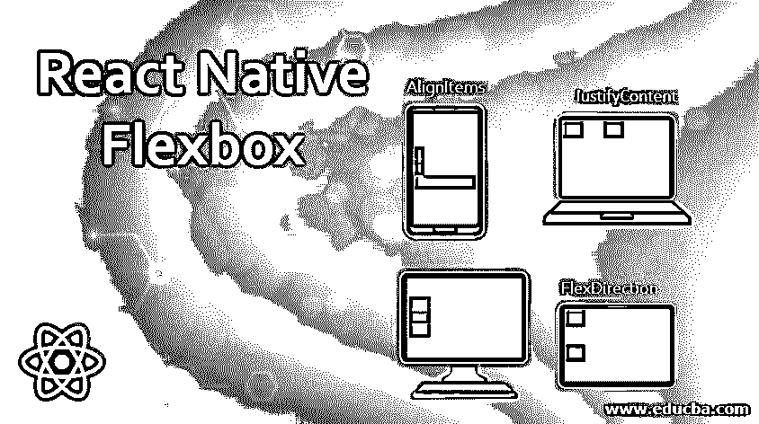
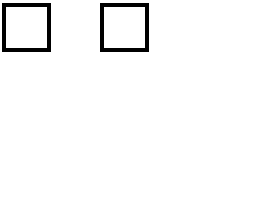
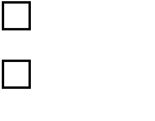
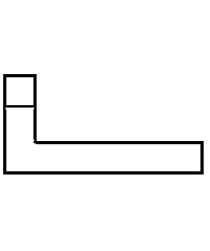

# React 本机 Flexbox

> 原文：<https://www.educba.com/react-native-flexbox/>




## React 原生 Flexbox 简介

react native 中的 Flexbox 让开发人员能够决定子组件的布局，基本上，它有算法使其适合所有类型的屏幕大小，flexbox 有三个重要属性，如 flexDirection(该属性允许我们定义元素垂直或水平对齐)，justifyContent(允许我们在容器内分发元素)， alignItems(其工作类似于 justifyContent 属性，唯一的区别是它还将用于将元素分布到次轴)，这些属性使其完美、合适并适合于任何配置和大小的任何设备。

### 反应本地 Flexbox 的属性

React 本机 Flexbox 包含三个重要属性。我们将通过要实现的示例来了解这些属性:

<small>网页开发、编程语言、软件测试&其他</small>

#### 1.弯曲方向

这个属性基本上是为布局的主轴而设置的。它允许开发人员将样式用于主轴中的组件。它支持属性行和列来排列其子组件。如果我们没有定义或指定 flexDirection 的值，它会将列作为 flexDirection。

下面是行 flexDirection 的示例。在这里，我们定义了主视图组件，并在其中传递了三个不同颜色、相同高度和宽度的组件视图。在 flex 的帮助下，我们将所有组件排列在屏幕上。我们还可以使用相同的示例，将一列作为 flexDirection。请查看以下示例和输出屏幕。

##### 带行的示例

**代码:**

```
import React, { Component } from "react";
import { StyleSheet, View } from "react-native";
export default class FlexDirectionExample extends Component {
render() {
return (
<View style={flexStyles.containerStyle}>
<View style={flexStyles.powderblueStyle} />
<View style={flexStyles.skyblueStyle} />
<View style={flexStyles.steelblueStyle} />
</View>
);
}
}
const flexStyles = StyleSheet.create({
containerStyle: {
flex: 1,
flexDirection: "row" // here we are settin row as the flexdirection
},
powderblueStyle: {
width: 70,
height: 70,
backgroundColor: "red"
},
skyblueStyle: {
width: 70,
height: 70,
backgroundColor: "pink"
},
steelblueStyle: {
width: 70,
height: 70,
backgroundColor: "green"
}
});
```

**输出:**




##### 带列的示例

**代码:**

```
import React, { Component } from "react";
import { StyleSheet, View } from "react-native";
export default class FlexDirectionExample extends Component {
render() {
return (
<View style={flexStyles.containerStyle}>
<View style={flexStyles.powderblueStyle} />
<View style={flexStyles.skyblueStyle} />
<View style={flexStyles.steelblueStyle} />
</View>
);
}
}
const flexStyles = StyleSheet.create({
containerStyle: {
flex: 1,
flexDirection: "column" // here we are setting column as the flex direction
},
powderblueStyle: {
width: 70,
height: 70,
backgroundColor: "red"
},
skyblueStyle: {
width: 70,
height: 70,
backgroundColor: "pink"
},
steelblueStyle: {
width: 70,
height: 70,
backgroundColor: "green"
}
});
```

**输出:**




#### 2.调整内容

该属性指定子组件向主轴的分布。它允许开发人员在起点、终点、中心以及空间分发子组件。在下面的例子中，我们在 justiFyContentExample 中定义了一个主视图组件，其中我们定义了另外三个视图组件，它们是主视图组件的子组件。正如我们已经讨论过的，我们可以为子组件定义布局，这里我们从主视图组件内部设置其他三个组件视图的位置。为了更好地理解，请跟随下面的示例以及输出屏幕。在输出屏幕中，我们可以看到三个不同颜色的子组件以垂直方式可见。

**代码:**

```
import React, { Component } from "react";
import { StyleSheet, View } from "react-native";
export default class JustifyContentExample extends Component {
render() {
return (
<View style={flexStyles.containerStyle}>
<View style={flexStyles.blueStyle} />
<View style={flexStyles.greenStyle} />
<View style={flexStyles.redStyle} />
</View>
);
}
}
const flexStyles = StyleSheet.create({
containerStyle: {
flex: 1,
flexDirection: "column", // setting components towards horizontally`.
justifyContent: "center" //putting components at the center
},
blueStyle: {
width: 70,
height: 70,
backgroundColor: "blue"
},
greenStyle: {
width: 70,
height: 70,
backgroundColor: "green"
},
redStyle: {
width: 70,
height: 70,
backgroundColor: "red"
}
});
```

**输出:**


#### 3.alignItems

该属性主要用于辅助轴。它指定另一个组件内的任何子组件向次轴的对齐。它是如何工作的？它的流程非常简单，如果主轴被设置为行，那么副轴就是列，如果主轴被设置为列，那么副轴就是行。使用该属性，我们可以将子组件向起点、终点、中心和拉伸方向对齐。

在下面的例子中，我们使用属性 alignItems 属性，并将其值设置为 stretch，这意味着它将扩展到屏幕大小。我们在引言部分已经了解到，我们可以从父组件中决定子组件的位置，因此在这个示例中，从一个父视图组件中，我们决定三个子组件的对齐。我们展示了如何使用对齐的拉伸参数，以同样的方式，我们可以将对齐设置为结束、中心和开始。请看下面的例子和输出屏幕。

**代码:**

```
import React, { Component } from "react";
import { StyleSheet, View } from "react-native";
export default class AlignItemsExample extends Component {
render() {
return (
<View style={flexStyles.containerStyle}>
<View style={flexStyles.blueStyle} />
<View style={flexStyles.greenStyle} />
<View style={flexStyles.redStyle} />
</View>
);
}
}
const flexStyles = StyleSheet.create({
containerStyle: {
flex: 1,
flexDirection: "column", // setting flex direction as the column`.
justifyContent: "center", //setting justify center
alignItems: "stretch" //setting alignItem as the stretched
},
blueStyle: {
width: 60,
height: 60,
backgroundColor: "blue"
},
greenStyle: {
width: 60,
height: 60,
backgroundColor: "green"
},
redStyle: {
/*width: 60,*///here we are not mentioning the width so it will stretched upto size of window
height: 60,
backgroundColor: "red"
}
});
```

**输出:**




### 使用 React 本机 Flexbox 的优势

将 flexbox 与 react native 一起使用有许多优点，下面给出了一些重要的优点。

*   我们可以从一个父组件控制许多子组件，因此这里的控制意味着决定子组件的布局和形状。
*   它使用起来非常简单，因为要实现与 flexBox 相同的外观和感觉，我们需要编写更复杂的代码。
*   几乎所有平台现在都支持 Flexbox，所以需要担心支持问题
*   它适用于任何尺寸的屏幕。

### 结论

从本教程中，我们了解了 flexBox，它赋予开发人员或设计人员为组件制作漂亮布局的能力，它允许父组件决定子组件的布局。

### 推荐文章

这是一个反应原生 Flexbox 的指南。在这里，我们讨论实现 React 本机 Flexbox 的重要属性、优点和示例。您也可以浏览我们的其他相关文章，了解更多信息——

1.  [React 原生图像拾取器](https://www.educba.com/react-native-image-picker/)
2.  [React Native FlatList](https://www.educba.com/react-native-flatlist/)
3.  [React Native SectionList](https://www.educba.com/react-native-sectionlist/)
4.  [反应自然状态](https://www.educba.com/react-native-state/)