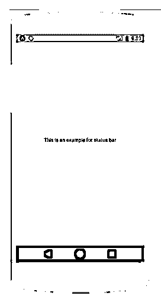

# 反应本机状态栏

> 原文：<https://www.educba.com/react-native-statusbar/>


## React 本机状态栏简介

react native 中的 StatusBar 用于管理状态栏，它为状态栏提供了一个强大的机制，使其更加有用，它具有动画(背景色)、隐藏(隐藏或显示状态栏)、背景色(用于设计背景色)等特性，除了这些属性之外，它还有一些非常有用的方法，这些方法有 setHidden(隐藏或显示状态栏)、setNetworkActivityIndicatorVisible(处理网络活动)、setBackgroundColor(该函数用于管理状态栏的背景色)、setBarStyle(用于设计和定制

**语法:**

<small>网页开发、编程语言、软件测试&其他</small>

在下面的语法中，我们使用了 backgroundcolor(给状态栏的背景添加一些颜色)、barStyle(我们可以在这些属性中传递想要使用的样式类型)等属性。

```
<StatusBar
backgroundColor="color of background"
barStyle="bar style which we wanted to have in bar status"
hidden = { boolean value of bar status if we want to hide or we want to show status bar }
translucent = {boolean value }
networkActivityIndicatorVisible={boolean value to make network indicator visible}
/>
```

### 属性

**1。动画:**当属性发生变化时，带有属性动画的状态栏会发挥作用。In 属性还将支持背景色(背景色将有助于用所需的颜色和变化来表示状态栏)。它还支持 hidden 和 barStyle。

**2。barStyle:**react native 中的[将使用的任何文本都可以在 bar style 的帮助下设计](https://www.educba.com/react-native-scrollview/)(比如字体大小、字体颜色等。)

**3。hidden:** 如果我们想隐藏或显示状态栏，那么我们可以使用属性 hidden。如果我们不设置这个属性的值，那么它将是假的。它的工作原理就像 hidden = {false}那么状态栏将可见，如果 hidden={true}那么状态栏将不可见。

**4。backgroundColor:** 背景色是 react native 中一个很重要的东西，它给状态栏的背景赋予颜色。

**5。半透明:**如果我们想在状态栏下构建一个应用程序，那么我们可以使用半透明属性。当它为真时，应用程序将在状态栏下构建。

**6。showhidetransformation:**这是一种效果，它在显示和隐藏发生的情况下创建一种过渡效果。如果我们没有为 showHideTransition 定义值，那么它将采用“fade”

7 .**。networkActivityIndicatorVisible**:该属性主要用于 IOS 设备，它检查网络活动指示器(检查网络活动的可见性)

**8。set hidden:**react 本机状态栏中的这个方法用于显示或隐藏状态栏。

**9。setBarStyle** :该函数用于设计状态栏。它提供了一种定制状态栏的强大方法。

10。setBackgroundColor: 该属性仅受 android 应用支持。在这个属性中，我们可以为状态栏设计一个背景颜色。

**11。setNetworkActivityIndicatorVisible:**该属性仅使用 IOS 设备，它控制网络活动指示器。

**12。setTranslucent:** 这个属性只对 Android 应用有效。它用来处理状态栏的半透明性。

### 实现 React 本机状态栏的示例

下面是 React 本机状态栏的示例:

#### 示例#1

在下面的例子中，我们显示了一个简单的状态栏，上面没有什么设计。在 design 部分，我们选择了值为 dark-content 的 barStyle，值为 false 的 hidden(这意味着状态栏将可见)。我们还设置了背景颜色的值。这里，我们将半透明设置为假，将 networkactivityindicator visible 设置为真(显示网络)

//这里我们写了一个非常简单的例子来显示 react native//中的状态栏

**代码:**

```
import React, { Component } from 'react';
//importing react and component inside our code for uses
import { StyleSheet, View, Text, StatusBar, Platform } from 'react-native';
// here we are importing all the components of react native inside our code
export default class App extends Component {
render() {
return (
<View style={statusBarStyles.styleForMainContainer}>
<StatusBar
barStyle="dark-content"
//it has few properties like dark-content, light-content and default
hidden={false}
//if we do not want to show status bar than we will set hidden={false}
backgroundColor="#00BCD4"
//here we are setting the background color for the status bar
translucent={false}
//here we are allowing light
networkActivityIndicatorVisible={true}
//here we are making network indicator true ,in case if we do not want to show network indicator we can set it as false
/>
<Text> This is an example for status bar </Text>
</View>
);
}
}
const statusBarStyles = StyleSheet.create({
styleForMainContainer: {
justifyContent: 'center',
alignItems: 'center',
flex: 1,
},
});
```

**输出:**




#### 实施例 2

在下面的例子中，我们显示了一个简单的状态栏，上面没有什么设计。在 design 部分，我们选择了值为 dark-content 的 BarStyle，值为 true 的 hidden(这意味着状态栏将不可见)。我们还设置了背景颜色的值。这里，我们将半透明设置为假，将 networkactivityindicator visible 设置为真(显示网络)

//这里我们写了一个非常简单的例子来显示 react native//中的状态栏

**代码:**

```
import React, { Component } from 'react';
//importing react and component inside our code for uses
import { StyleSheet, View, Text, StatusBar, Platform } from 'react-native';
// here we are importing all the components of react native inside our code
export default class App extends Component {
render() {
return (
<View style={statusBarStyles.styleForMainContainer}>
<StatusBar
barStyle="light-content"
//it has few properties like dark-content, light-content and default
hidden={true}
//if we do not want to show status bar than we will set hidden={false}
backgroundColor="#b3e6ff"
//here we are setting the background color for the status bar
translucent={false}
//here we are allowing light
networkActivityIndicatorVisible={false}
//here we are making network indicator true ,in case if we do not want to show network indicator we can set it as false
/>
<Text> This is an example for status bar with hiding status bar</Text>
</View>
);
}
}
const statusBarStyles = StyleSheet.create({
styleForMainContainer: {
justifyContent: 'center',
alignItems: 'center',
flex: 1,
},
});
```

**输出:**


### 结论

从这篇文章中，我们了解了 android 和 IOS 应用程序中的状态栏在 react-native StatusBar 组件的帮助下的实现，我们了解了它的属性，它包含了任何状态栏的所有有用属性。

### 推荐文章

这是一个反应本地状态栏的指南。在这里，我们讨论基本概念，属性，以及用代码和输出来反应本地状态条的例子。您也可以看看以下文章，了解更多信息–

1.  [React Native FlatList](https://www.educba.com/react-native-flatlist/)
2.  [React Native SectionList](https://www.educba.com/react-native-sectionlist/)
3.  [反应原生表](https://www.educba.com/react-native-table/)
4.  [反应原生动画](https://www.educba.com/react-native-animation/)