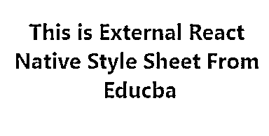

# react-本机样式表

> 原文：<https://www.educba.com/react-native-stylesheet/>

## React-Native 样式表简介

下面的文章提供了 React-Native 样式表的概要。React Native StyleSheet 是一种使用 JavaScript 代码设计应用程序样式的方法，react native StyleSheet 的主要功能与应用程序中组件的样式和结构有关，React Native 的所有组件都使用一种称为样式的属性，名称和属性值的工作方式与 web StyleSheet 类似。

### 使用 React-Native 样式表

下面给出了两种类型的样式表:

<small>网页开发、编程语言、软件测试&其他</small>

*   **内联样式表:**内联样式是通过 style 标签针对每个组件实现的。样式属性可用于向组件添加内联样式。但是这种方法不被认为是最佳实践，因为它使代码变得复杂。建议使用 style 来反应本机组件的方法是使用 StyleSheet.create API。
*   **外部样式表:**这些样式表使用单独的 JavaScript 文件实现，该文件可以导入到我们现有的代码中。外部样式表是独立的文件，与这些文件相关的优点是它们可以多次重用。

在 react native 中，我们可以使用外部和内联样式表。

使用 react 原生样式表时，需要记住以下几点:

*   避免创建新的样式表总是尝试重用现有的样式表。
*   始终将样式表代码放在 render 方法之外，以提供更好的性能。
*   样式表在 render 方法中只呈现一次。

**可以与 react 原生样式表一起使用的不同方法:**

**1。Compose():** 这个方法用于组合两个不同的样式表。第二个参数中指定的样式将覆盖第一个参数中指定的样式中的任何匹配样式。

**语法:**

`compose(stylefirst: object, stylesecond: object): object | array<object>`

**2。Create():** 这个方法用于根据给定的引用创建新的样式表。

**语法:**

`create(ref : object ): object`

除了以上所述，还有一些其他的方法可以根据我们的要求使用。

### React-Native 样式表的示例

下面是提到的例子:

#### 示例#1

在这个例子中，我们将看到如何使用内联样式以及 StyleSheet.create API。

**C0de:**

`importReact, { Component } from'react';
import { AppRegistry, StyleSheet, Text, View } from'react-native';
exportdefaultclassStyleSheetDemoextendsComponent {
render() {
return (
<View>
<Text style={{ backgroundColor: '#a7a6a5', color: 'green', fontSize: 20 }}>This is InlineStyleSheet</Text>
<Text style={styles.greenstyle}>HellofromEducba</Text>
<Text style={styles.arrayval}>This is ReactNative.</Text>
<Text style={[styles.arrayval, styles.greenstyle]}>ReactNativeStyleSheetDemo</Text>
<Text style={[styles.greenstyle, styles.arrayval]}>Thanks</Text>
</View>
);
}
}
const styles = StyleSheet.create({
arrayval: {
color: 'blue',
fontWeight: 'bold',
fontSize: 30,
},
greenstyle: {
color: 'red',
},
});`

**输出:**

#### 实施例 2

在这个例子中，我们将看到如何使用外部样式表在 react native 中使用样式。外部样式表文件将被导入到我们现有的 react 本机代码中。

下面是定义样式表的外部 javascript 代码。

**代码:**

`importReact, { Component } from'react'
import { Text, View, StyleSheet } from'react-native'
constExternalStyleSheet = (props) => {
return (
<View>
<Text style = {styles.currentState}>
{props.currentState}
</Text>
</View>
)
}
exportdefaultExternalStyleSheet
const styles = StyleSheet.create ({
currentState: {
marginTop: 30,
textAlign: 'center',
color: 'red',
fontWeight: 'bold',
fontSize: 25
}
})`

这是导入上面定义的样式表的主要组件。

**代码:**

`importReactfrom'react';
import { StyleSheet, Text, View } from'react-native';
importExternalStyleSheetfrom'./ExternalStyleSheet'
exportdefaultclassAppextendsReact.Component {
state = {
currentState: 'This is External React Native Style Sheet From Educba'
}
render() {
return (
<View>
<ExternalStyleSheet currentState = {this.state.currentState}/>
</View>
);
}
}`

**输出:**

#### 实施例 3

在这个例子中，我们将看到如何在 react native 中使用 compose 方法。

**代码:**

`importReactfrom'react';
import { StyleSheet, Text, View } from'react-native';
exportdefaultApp = () => (
<View style={container_style}>
<Text style={text_style}>This is React native Demo</Text>
</View>
);
const first = StyleSheet.create({
containerfirst: {
flex: 1,
padding: 24
},
textfirst: {
fontSize: 40,
color: '#61dafb'
},
});
const second = StyleSheet.create({
containersecond: {
flex: 1,
backgroundColor: '#000',
},
itemsecond: {
fontStyle: 'italic',
fontWeight: 'bold'
},
});
const container_style = StyleSheet.compose(first.containerfirst, second.containersecond);
const text_style = StyleSheet.compose(first.textfirst, second.itemsecond);`

**输出:**

### 结论

上面的文章清楚地解释了如何在 react native 中使用样式表。此外，各种第三方库可用于为我们的 react 本机应用程序提供更多定制。

### 推荐文章

这是 React-Native 样式表的指南。这里我们讨论 React-Native 样式表的介绍，并举例说明，以便更好地理解。您也可以看看以下文章，了解更多信息–

1.  [反应原生进度条](https://www.educba.com/react-native-progress-bar/)
2.  [React-原生边框样式](https://www.educba.com/react-native-border-style/)
3.  [反应原生图像](https://www.educba.com/react-native-image/)
4.  [反应原生动画](https://www.educba.com/react-native-animation/)

