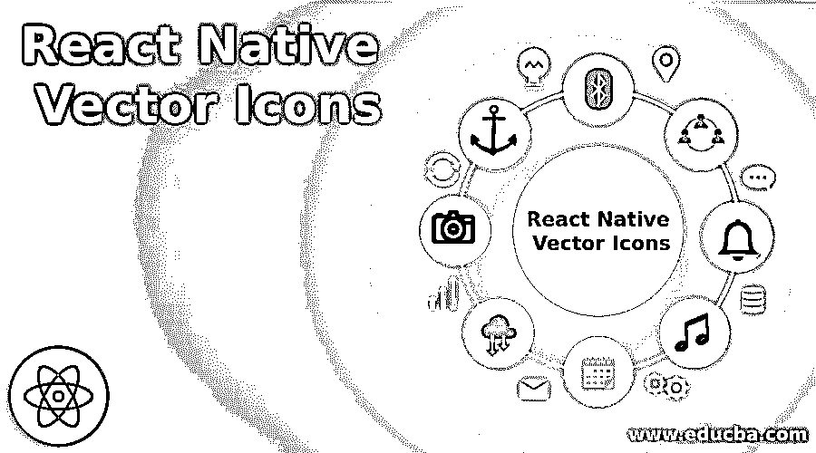
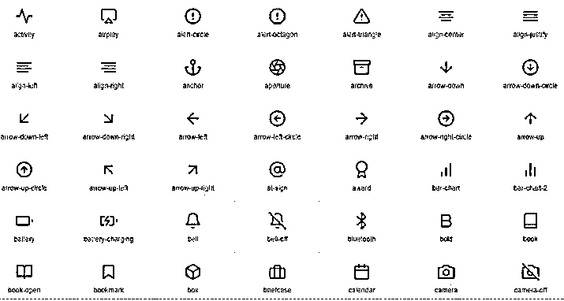
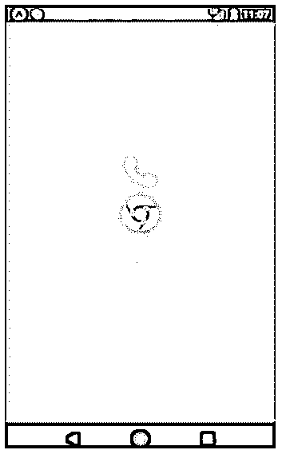
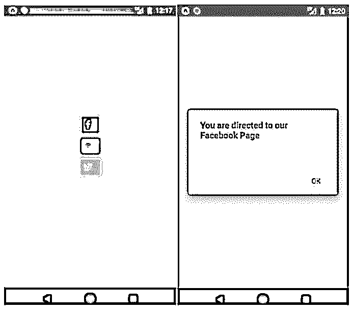
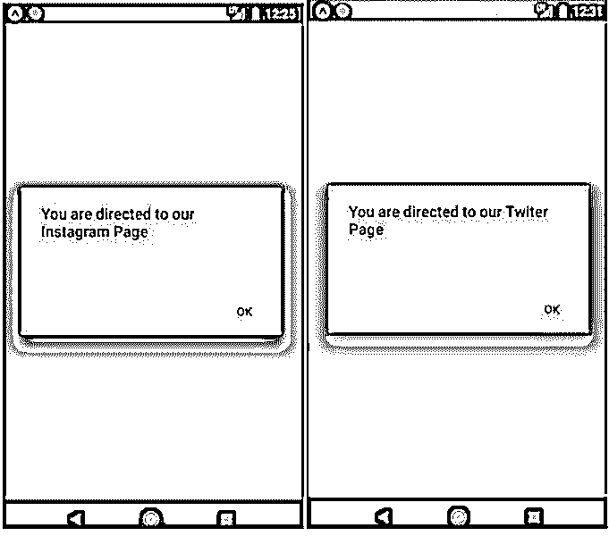
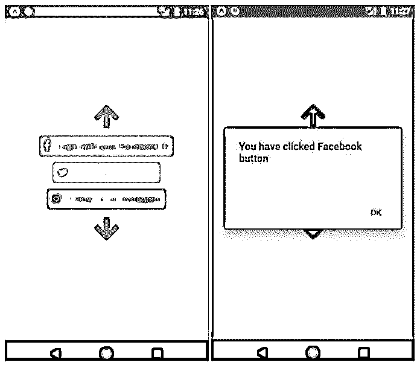
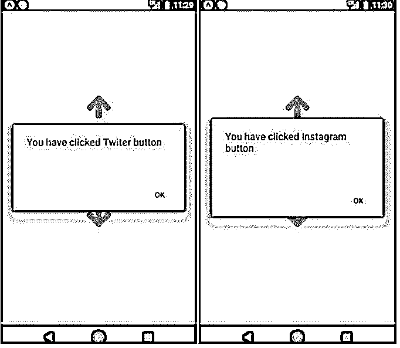
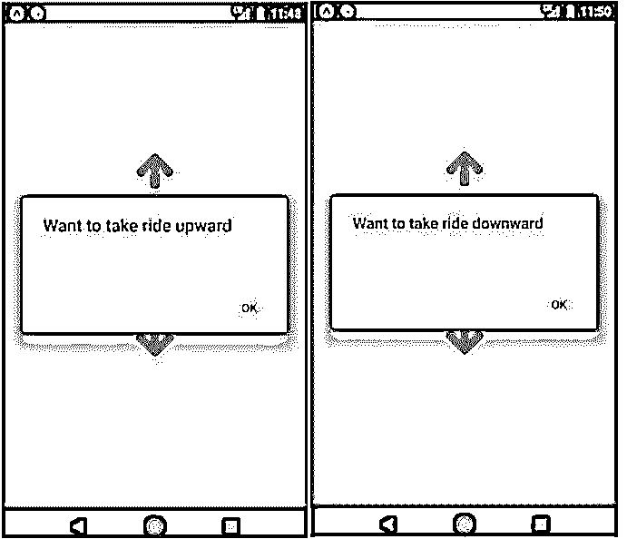

# 反应原生矢量图标

> 原文：<https://www.educba.com/react-native-vector-icons/>

## React 本机矢量图标简介

React 本地矢量图标是 NPM GitHub 库最受欢迎的图标。它有超过 3000 个矢量图标的集合，这些图标可以免费使用。他们是伟大的标志，按钮和导航或标签栏。这些矢量图标很容易整合风格并扩展到一个人的项目中。矢量图标在特定的演示中很有吸引力，这使得它更易于展示。与纯文本相比，矢量图标传达了更多的信息。一个可以改变图标颜色，图标大小和多种风格也得到支持。图标完全可以定制。这些矢量图标随处可见。

下图中显示了一些图标。

<small>网页开发、编程语言、软件测试&其他</small>

**导入 React 原生图标组件的语法:**

`<Icon name="rocket"
size={25}
color="#f51637" />`

**导入按钮组件的语法:**

`<Icon.Button
name="welcome to facebook"
backgroundColor="#7d13e8"
onPress={this.loginWithFacebook}>
Login with Facebook
</Icon.Button>`

### 反应原生向量图标列表

以下是清单:

| **图标类别** | **开发商** | **图标数量** |
| 安特设计 | AntFinanc | 297 个图标 |
| Entypo | 丹尼尔·布鲁斯 | 411 个图标 |
| 邪恶的狮子 | 亚历山大·梅季扬金和罗曼·沙明 | 70 个图标 |
| 羽毛 | 科尔·贝米斯和撰稿人 | 279 个图标 |
| FontAwesome5 | 丰图克斯公司。 | 5082(专业图标)和 1500(免费图标) |
| 字体真棒 | 戴夫·甘迪 | 675 个图标 |
| 丰蒂奥索 | 凯南 | 615 个图标 |
| 基础 | 祖尔布公司。 | 283 个图标 |
| 离子体 | 本·斯佩里 | 696 个图标 |
| 材料成本 | 谷歌公司。 | 932 个图标 |
| 材料社区图标 | MaterialDesignIcons.com | 3695 个图标 |
| 八图标 | Github 公司。 | 184 个图标 |
| 社交活动 | Sam Collins | 100 个图标 |
| 简单线条图标 | Sabbir 和贡献者 | 189 个图标 |

### React 本地向量图标的示例

下面给出的例子有:

#### 示例#1

简单的反应原生矢量图标。

**代码:**

`import React, {Component} from 'react';
import {Platform, StyleSheet, Text, View, TouchableOpacity, Alert} from 'react-native';
import Icon from 'react-native-vector-icons/FontAwesome';
const instructions = Platform.select({
ios: 'Press Cmd+R to reload,\n' + 'Cmd+D or shake for dev menu', android:
'Double tap R on your keyboard to reload,\n' + 'Shake or press menu button for dev menu',
});
type Props = {};
export default class App extends Component<Props> { render() {
const phone_icon = (
<Icon name="phone" size={50} color="#86fc72" onPress={()=>{Alert.alert("Want to make Call?")}} />
);
const chrome_icon = (
<Icon name="chrome" size={50} color="#ffff5e" onPress={()=>{Alert.alert("Want to open browser?")}} />
);
const music_icon = (
<Icon name="music" size={50} color="#fa69cc" onPress={()=>{Alert.alert("Want to play music?")}} />
);
return (
<View style={styles.MainContainer}>
<TouchableOpacity>
{phone_icon}
</TouchableOpacity>
<TouchableOpacity style={{marginTop: 9}}>
{chrome_icon}
</TouchableOpacity>
<TouchableOpacity style={{marginTop: 9}}>
{music_icon}
</TouchableOpacity>
</View>
);
}
}
const styles = StyleSheet.create({ MainContainer: {
flex: 1,
justifyContent: 'center', alignItems: 'center', backgroundColor: '#baa4b3', padding: 25
}
});`

**输出:**

它在移动应用程序中显示简单的矢量图标。

#### 实施例 2

按钮内的矢量图标。

**代码:**

`import React, {Component} from 'react';
import {Platform, StyleSheet, Text, View, TouchableOpacity, Alert} from 'react-native';
import Icon from 'react-native-vector-icons/FontAwesome';
const instructions = Platform.select({
ios: 'Press Cmd+R to reload,\n' + 'Cmd+D or shake for dev menu', android:
'Double tap R on your keyboard to reload,\n' + 'Shake or press menu button for dev menu',
});
type Props = {};
export default class App extends Component<Props> { render() {
const facebook_button = (
<Icon.Button name="facebook" backgroundColor="#3358de" size={19} onPress={()=>{Alert.alert("You are directed to our Facebook Page")}}>
</Icon.Button>
);
const instagram_button = (
<Icon.Button name="instagram" backgroundColor="#d839f7" size={19} onPress={()=>{Alert.alert("You are directed to our Instagram Page")}}>
</Icon.Button>
);
const twitter_button = (
<Icon.Button name="twitter" backgroundColor="#35cefc" size={19} onPress={()=>{Alert.alert("You are directed to our Twiter Page")}}>
</Icon.Button>
);
return (
<View style={styles.MainContainer}>
<TouchableOpacity>
{facebook_button}
</TouchableOpacity>
<TouchableOpacity style={{marginTop: 9}}>
{instagram_button}
</TouchableOpacity>
<TouchableOpacity style={{marginTop: 9}}>
{twitter_button}
</TouchableOpacity>
</View>
);
}
}
const styles = StyleSheet.create({ MainContainer: {
flex: 1,
justifyContent: 'center', alignItems: 'center', backgroundColor: '#d8ff8f', padding: 25
}
});`

**输出:**

它在不同的按钮里显示不同的图标。它显示了从上到下按下这些图标时显示的不同窗口。

#### 实施例 3

带有文本的按钮内的图标。

**代码:**

`import React, {Component} from 'react';
import {Platform, StyleSheet, Text, View, TouchableOpacity, Alert} from 'react-native';
import Icon from 'react-native-vector-icons/FontAwesome';
const instructions = Platform.select({
ios: 'Press Cmd+R to reload,\n' + 'Cmd+D or shake for dev menu', android:
'Double tap R on your keyboard to reload,\n' + 'Shake or press menu button for dev menu',
});
type Props = {};
export default class App extends Component<Props> { render() {
const uparrow_icon = (
<Icon name="arrow-up" size={50} color="#373647"
onPress={()=>{Alert.alert("Want to take ride upward")}} />
);
const facebook_button = (
<Icon.Button name="facebook" backgroundColor="#964ed9" size={21} onPress={()=>{Alert.alert("You have clicked Facebook button")}}>
<Text style={{fontFamily: 'Bold', fontSize: 16, color: '#f6f5f7'}}>Login with your Facebook ID</Text>
</Icon.Button>
);
const twitter_button = (
<Icon.Button name="twitter" backgroundColor="#2dc6d6" size={21} onPress={()=>{Alert.alert("You have clicked Twiter button")}}>
<Text style={{fontFamily: 'Bold', fontSize: 16, color: '#f6f5f7'}}>Follow Us on Twitter</Text>
</Icon.Button>
);
const instagram_button = (
<Icon.Button name="instagram" backgroundColor="#f23de0" size={21} onPress={()=>{Alert.alert("You have clicked Instagram button")}}>
<Text style={{fontFamily: 'Bold', fontSize: 16, color: '#f6f5f7'}}>Follow Us on Instagram</Text>
</Icon.Button>
);
const downarrow_icon = (
<Icon name="arrow-down" size={50} color="#373647" onPress={()=>{Alert.alert("Want to take ride downward")}} />
);
return (
<View style={styles.MainContainer}>
<TouchableOpacity>
{uparrow_icon}
</TouchableOpacity>
<TouchableOpacity style={{marginTop: 9}}>
{facebook_button}
</TouchableOpacity>
<TouchableOpacity style={{marginTop: 9}}>
{twitter_button}
</TouchableOpacity>
<TouchableOpacity style={{marginTop: 9}}>
{instagram_button}
</TouchableOpacity>
<TouchableOpacity style={{marginTop: 9}}>
{downarrow_icon}
</TouchableOpacity>
</View>
);
}
}
const styles = StyleSheet.create({ MainContainer: {
flex: 1,
justifyContent: 'center', alignItems: 'center', backgroundColor: '#ffea73', padding: 25
}
});`

**输出:**

它显示了不同的向量图标的一面，以及外部按钮的文本。当按下这些图标时，会显示不同的窗口。

### 结论

在我们的日常生活中，我们会遇到各种各样的矢量图标，它们可以很容易地在网页和移动应用程序中看到。在以上讨论的基础上，我们了解了图标的各种类型。它提供了各种各样的矢量图标，因为这些图标被广泛使用。其中的矢量图标有不同的类别，这些类别中的图标由不同的开发者开发。其中的矢量图标可以非常容易、非常高效地实现。

### 推荐文章

这是一个反应原生矢量图标的指南。这里我们讨论 React Native Vector 的介绍以及带有示例的图标列表。您也可以看看以下文章，了解更多信息–

1.  [反应原生成分](https://www.educba.com/react-native-components/)
2.  [反应原生表](https://www.educba.com/react-native-table/)
3.  [反应原生闪屏](https://www.educba.com/react-native-splash-screen/)
4.  [React 原生搜索栏](https://www.educba.com/react-native-search-bar/)

