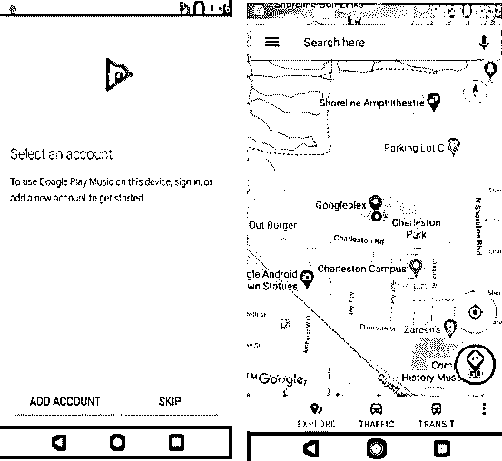
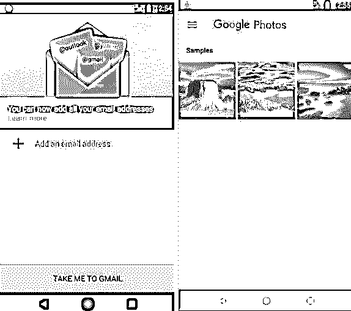
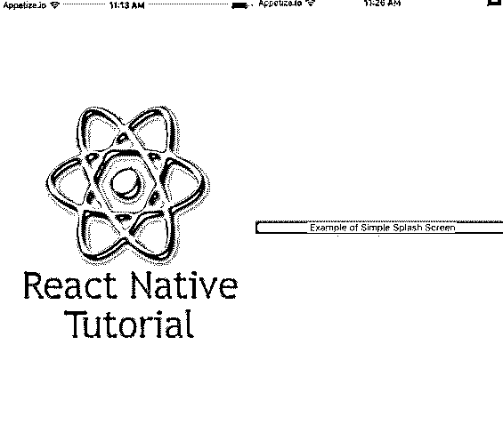
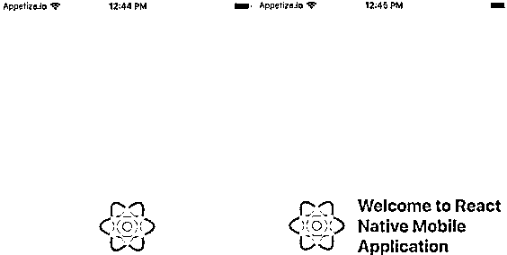
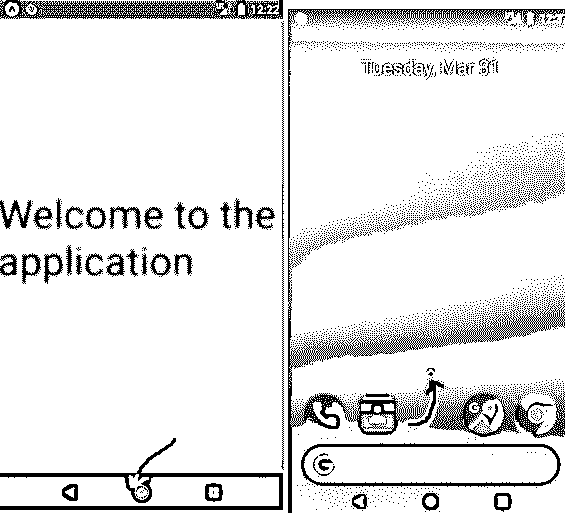
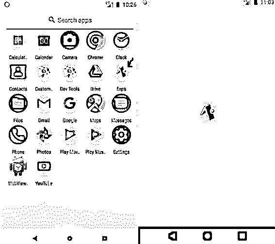
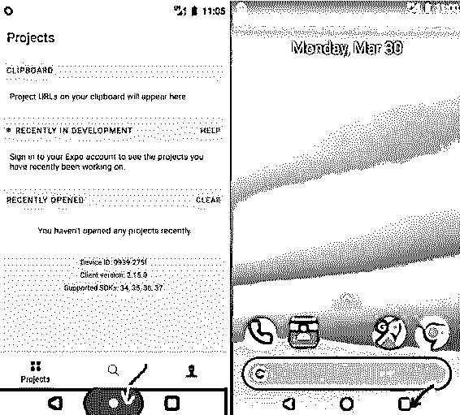
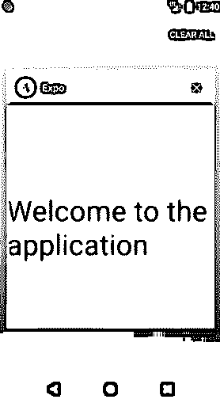
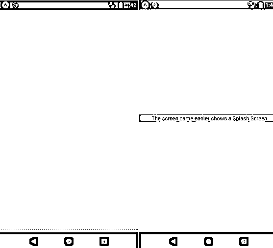

# 反应原生闪屏

> 原文：<https://www.educba.com/react-native-splash-screen/>

## React 原生闪屏简介

闪屏可以定义为一个图形控制元素，它由一个窗口组成，该窗口由软件的当前版本、徽标和图像组成。闪屏主要是在一个特定的程序或游戏启动时出现，甚至在一个应用程序或网站启动前需要重要信息时使用。splash 页面可以说是一个应用程序或网站的介绍。启动画面会在几秒钟后从显示屏上自动隐藏，并在应用程序再次启动时再次出现。下图显示了在日常生活中哪里可以找到闪屏。这些是谷歌音乐、谷歌地图、Gmail、谷歌照片的例子。

<small>网页开发、编程语言、软件测试&其他</small>

**安装语法**

下面是安装的语法:

**使用纱线**

`yarn add react-native-splash-screen`

**使用 NPM**

`npm install react-native-splash-screen`

**导入组件的语法**

`import { StyleSheet, Platform, TouchableOpacity, Image, View, Text, Alert } from 'react-native';`

### 如何在 React Native 中创建闪屏？

下面是仍在学习创建闪屏的例子:

#### 1.iOS 平台中带有 React 原生徽标图像的简单闪屏

**代码:**

`import React, { Component } from 'react';
import { StyleSheet, Platform, TouchableOpacity, Image, View, Text, Alert
} from 'react-native';
export default class Myapp extends Component<{}>
{
constructor(){ super(); this.state={ isVisible : true,
}
}
Hide_Splash_Screen=()=>{ this.setState({
isVisible : false
});
}
componentDidMount(){ var that = this;
setTimeout(function(){ that.Hide_Splash_Screen();
}, 5000);
}
render()
{
let Splash_Screen = (
<View style={styles.SplashScreen_RootView}>
<View style={styles.SplashScreen_ChildView}>
<Image source={{uri:'https://static.javatpoint.com/tutorial/react- natiimg/react-native-tutorial.png'}}
style={{width:'100%', height: '100%', resizeMode:
'contain'}} />
</View>
</View> )
return(
<View style = { styles.MainContainer }>
<Text style={{textAlign: 'center',width: '100%'
,backgroundColor: '#fc8bef'}}> Example of Simple Splash Screen</Text>
{
(this.state.isVisible === true) ? Splash_Screen : null
}
</View>
);
}
}
const styles = StyleSheet.create(
{
MainContainer:
{
flex: 1,
justifyContent: 'center',
alignItems: 'center',
paddingTop: ( Platform.OS === 'ios' ) ? 20 : 0
},
SplashScreen_RootView:
{
justifyContent: 'center',
flex:1,
margin: 10,
position: 'absolute', width: '100%',
height: '100%',
},
SplashScreen_ChildView:
{
justifyContent: 'center', alignItems: 'center', backgroundColor: '#fcf52b', flex:1,
},
});`

**输出:**

**解释:**在图 1 和图 2 中，我们可以看到上面代码的输出以及闪屏在 React Native 中的工作方式。React 原生 Logo 溅起新的一页。这是理解闪屏最简单的例子，即文本出现。

#### 2.React Native 中的动画启动画面

**代码:**

`import React, { Component } from 'react';
import {View, Image, Text } from 'react-native';
export default class App extends Component { constructor() {
super(); this.state = {
animating: false, align: 'center', alignsecond: false,
};
setTimeout( () =>
this.setState({ align: 'flex-start' }, function() { this.setState({
alignsecond: true,
});
}), 3000
);
}
render() { return (
<View
style={{ flex: 1,
alignItems: 'center', flexDirection: 'row', justifyContent: this.state.align, marginHorizontal: 40,
}}>
<Image
source={{ uri:
'https://raw.githubusercontent.com/AboutReact/sampleresource/master/react_l ogo.png',
}}
style={{ width: 100, height: 100 }}
/>
{!this.state.alignsecond ? null : (
<View style={{ margin: 10 }}>
<Text
style={{ color: '#092c96', fontSize: 25, fontWeight: 'bold'
}}>
Welcome to React Native Mobile Application
</Text>
</View>
)}
</View>
);
}
}`

**输出:**

**解释:**在图 1 和图 2 中，我们可以看到一个轻微的动画，其中徽标先出现，然后是文本。

#### 3.应用上传的闪屏

**代码:**

`import React from 'react';
import { View, Text } from 'react-native';
class SplashScreen extends React.Component { performTimeConsumingTask = async() => {
return new Promise((resolve) => setTimeout(
() => { resolve('result') }, 2000
)
)
}
async componentDidMount() {
const data = await this.performTimeConsumingTask();
if (data !== null) { this.props.navigation.navigate('App');
}
}
render() { return (
<View style={styles.viewStyles}>
<Text style={styles.textStyles}> Welcome to the application
</Text>
</View>
);
}
}
const styles = { viewStyles: {
flex: 1,
alignItems: 'center', justifyContent: 'center', backgroundColor: '#79ff26'
},
textStyles: {
color: '#ff4824', fontSize: 50, fontWeight: 'italic'
}
}
export default SplashScreen;`

**输出:**

**解释:**以下所有 7 张图片显示了闪屏在特定移动应用程序中是如何出现和消失的。

#### 4.Android 平台中带有简单图像的简单闪屏。

**代码:**

`import React, { Component } from 'react';
import { StyleSheet, Platform, TouchableOpacity, Image, View, Text, Alert
} from 'react-native';
export default class Myapp extends Component<{}>
{
constructor(){ super(); this.state={ isVisible : true,
}
}
Hide_Splash_Screen=()=>{
this.setState({ isVisible : false
});
}
componentDidMount(){ var that = this;
setTimeout(function(){ that.Hide_Splash_Screen();
}, 5000);
}
render()
{
let Splash_Screen = (
<View style={styles.SplashScreen_RootView}>
<View style={styles.SplashScreen_ChildView}>
<Image source={{uri:'https://raw.githubusercontent.com/AboutReact/sampleresource/m aster/react_logo.png'}}
style={{width:'100%', height: '100%', resizeMode:
'contain'}} />
</View>
</View> )
return(
<View style = { styles.MainContainer }>
<Text style={{textAlign: 'center',width: '100%'
,backgroundColor: '#36fffc'}}> The screen came earlier shows a Splash Screen</Text>
{
(this.state.isVisible === true) ? Splash_Screen : null
}
</View>
);
}
}
const styles = StyleSheet.create(
{
MainContainer:
{
flex: 1,
justifyContent: 'center', alignItems: 'center',
paddingTop: ( Platform.OS === 'android' ) ? 10 : 0
},
SplashScreen_RootView:
{
justifyContent: 'center', flex:1,
margin: 20,
position: 'absolute', width: '100%',
height: '100%',
},
SplashScreen_ChildView:
{
ustifyContent: 'center', alignItems: 'center', backgroundColor: '#c2ff29',
flex:1,
},
});`

**输出:**

**解释:**下图 1 和图 2 显示了在特定的 android 移动应用程序中，闪屏如何先于实际内容出现。

### 结论

在日常生活中，我们每天都要打开多个应用程序。当我们打开一个应用程序时，我们会看到一些信息、一些图片或一些命令，在本文中，我们已经向您解释了它是如何工作的，以及如何根据我们的要求创建它们。这些被称为闪屏，它对每个应用程序都非常重要，这样应用程序才能与用户进行良好的交互。在本文中，我们遇到了不同的闪屏示例，如徽标图像中的简单闪屏、React Native 中的动画闪屏、应用程序上传时的闪屏、android 移动应用程序上的闪屏，这可以让您对 React Native 中的闪屏有一些好的了解。

### 推荐文章

这是一个反应原生闪屏的指南。这里我们讨论一个介绍，以及用代码和输出实现的例子。您也可以浏览我们的其他相关文章，了解更多信息——

1.  [反应原生进度条](https://www.educba.com/react-native-progress-bar/)
2.  [反应原生动画](https://www.educba.com/react-native-animation/)
3.  [反应原生下拉菜单](https://www.educba.com/react-native-dropdown/)
4.  [React 原生搜索栏](https://www.educba.com/react-native-search-bar/)

