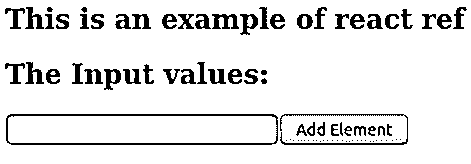

# 反应参考

> 原文：<https://www.educba.com/react-refs/>

## 反应参考的定义

React js 是一种获取 html 元素引用的方式；例如，如果我们有许多元素，并且我们想要对该元素执行一些更改，那么我们可以创建一个 refs 标记，并且在该标记中，我们可以执行一些更改。大多数情况下，避免在 react js 中使用 ref 标记，因为它会搜索具有该名称的 ref 标记。在 react js 中修改任何子组件的元素的唯一方法是从父组件向子组件发送道具，但是在 ref 的帮助下，我们可以在不从父组件向子组件发送道具的情况下做到这一点。

**语法:**

<small>网页开发、编程语言、软件测试&其他</small>

下面是 react js 中 ref 的简单语法。从下面的语法中，我们可以看到它有两个重要的组成部分，一个是 HTML 元素，如 div，另一个是 ref 标签，可以给它任何名称。我们可以借助一些要点来解释它的属性。

*   **HTML-TAG-NAME:** 这是像 div、input 等 HTML 属性的名称。，一旦我们在标签的名称中写入了 ref，当我们试图对它们进行一些或任何操作时，它们将使用我们提到的 html 标签的名称进行搜索。
*   **DETAILS-OF-REF:** 在这里，我们可以分配一些我们可以访问和修改的值。
*   这是在 html 中作为任何 HTML 标签的一个元素使用的键，因为我们可以像在 HTML 中创建它和类的名称一样创建它。

请查看下面的语法，以便更好地理解。

`<HTML-TAG-NAME  ref = "DETAILS-OF-REF"></input>`

### Refs 在 React 中是如何工作的？

在工作和理解 react js 中的 ref 的概念之前，我们需要理解为什么我们需要 react js 中的 ref。您已经看到，当您需要在父组件的子组件中进行任何更改时，我们需要将道具从父组件传递到子组件，根据道具的值，子组件会反映我们想要的更改。现在，如果我们想为一个非常独特和小的组件做更改，这种方法可能会更长，因为每次，我们都需要创建一些道具并将其发送给子组件来执行更改。现在，在 ref 标签的帮助下，我们可以将名称赋给 ref，并且在任何时候，在任何组件中，我们都可以对我们赋予它的 ref 名称进行一些更改。让我们举一个例子，如果我们给一个引用命名为 x，我们想对这个引用做一些修改，然后执行修改，它将搜索整个 HTML 节点，这是一个昂贵的操作，所以我们可以在需要的时候使用它。我们可以给出一些要点来解释裁判在反应中的更多工作。

*   Refs 不是 react js 中的任何特殊包；它是任何 html 新添加的属性。
*   当我们使用 ref 时，它允许我们找到具有我们给它的名称的属性，我们做一些修改，或者不使用 props 就可以得到 ref 的值。

### 反应参考文献示例

下面我们给出了 react ref 的两个例子，一个例子中，我们在点击按钮时捕获输入并在其他 html 属性上显示数据，另一个例子中，我们在书写时捕获输入文本并在其他 html 属性上显示它。我们可以运行这个例子，我们需要创建两个文件。js 扩展和另一个。html 扩展并将 js 和 html 代码粘贴到它们上面，我们就可以得到。

#### 示例#1

在下面的例子中，我们有一个输入框，我们给了这个输入框一个 ref 值，还有一个提交按钮。单击 submit 按钮后，无论我们在输入框中写什么，输入框都会被捕获并显示在 html 的另一个 h2 元素上。

**代码:**

`Javascriptparts ,
class Example extends React.Component {
constructor(props) {
super(props)
this.textAttribute = React.createRef();
this.state = {
textValue: ''
}
}
onSubmitHandler = element => {
element.preventDefault();
let val =this.textAttribute.current.value
this.setState({ textValue: val})
};
render() {
return (

<h2>This is an example of react ref</h2>
<h2>The Input values: {this.state.textValue}</h2>
<form onSubmit={this.onSubmitHandler}>
<input type="text" ref={this.textAttribute} />
<button>Add Element</button>
</form>

);
}
}
ReactDOM.render(<Example />, document.getElementById("main"));
HTML parts ,

`

**输出:**

在点击按钮之前，

单击带有文本的按钮后，

#### 实施例 2

在下面的例子中，我们使用了 ref 来显示我们在 html 字段中输入的内容，这些内容将在 ref 的帮助下被捕获，相同的文本将显示在另一个 html 元素上。因此，我们能够捕获元素，并且能够在不使用状态和道具的情况下对属性执行操作。

**代码:**

`Javascript parts,
class Example extends React.Component{
constructor(props){
super(props);
this.state={TextInput:null}
}
componentDidMount(){
this.data.oninput=this.changeText.bind(this);
}
changeText(e){
this.setState({TextInput:e.target.value})
}
render(){
return(

<input ref={(val)=>this.data=val} type="text"/>
{this.state.TextInput}

)
}
}
ReactDOM.render(<Example/>,document.getElementById("main"));
Html section ,

`

**输出:**

在填充输入框之前，

填充输入框后，

### 推荐文章

这是反应参考文献的指南。在这里，我们还将讨论 react refs 的定义和工作方式，以及不同的示例和代码实现。您也可以看看以下文章，了解更多信息–

1.  [React 本地认证](https://www.educba.com/react-native-authentication/)
2.  [反应本地本地存储](https://www.educba.com/react-native-local-storage/)
3.  [React-原生日历](https://www.educba.com/react-native-calendar/)
4.  [React 路由器转换](https://www.educba.com/react-router-transition/)