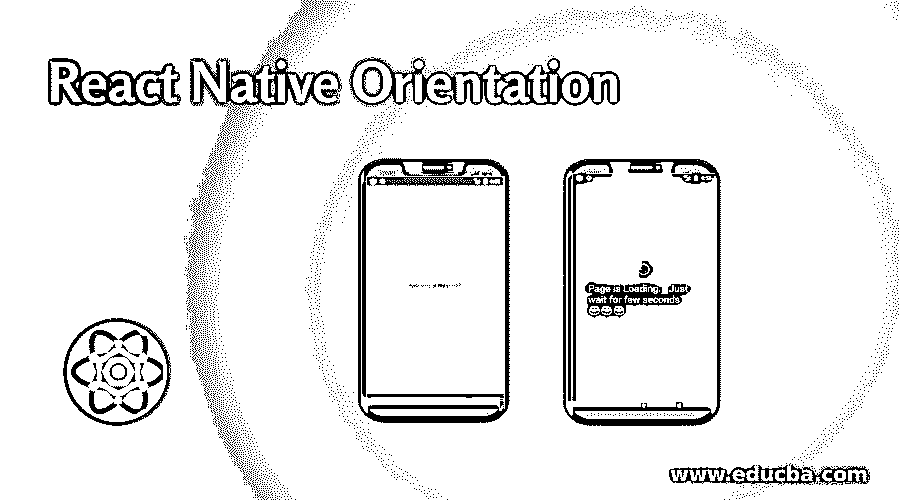
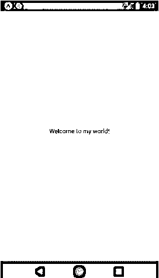
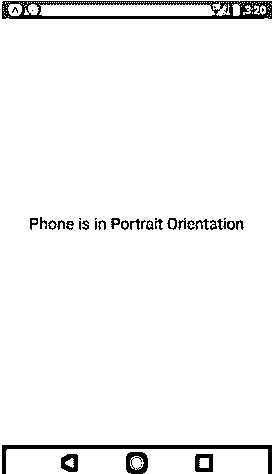
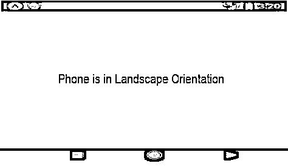
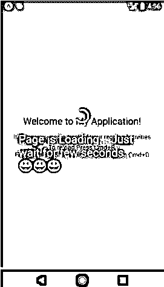

# 反应自然方向

> 原文：<https://www.educba.com/react-native-orientation/>

## 反应自然取向简介

方向是移动应用程序的一个重要方面。随着手机的发展，大屏幕出现在画面中，现在我们看电影、玩游戏需要更宽的视线，某些其他应用程序需要屏幕的纵向显示。对于适应用户需求和舒适度的电话来说，方位已经成为一个非常重要的特征。今天我们将看到如何处理屏幕旋转，以及如何自动旋转屏幕。屏幕方向也为用户提供了良好的用户友好体验。例如，在 Youtube 上，我们倾向于在纵向模式下搜索特定的视频，但我们喜欢在横向模式下观看，这样我们就可以全屏观看。

### 反应自然取向的类别

React Native Orientation 库为我们提供了两个类别来获取方向。

<small>网页开发、编程语言、软件测试&其他</small>

#### 1.正常定向

法线方向为我们提供了以下响应:

*   风景
*   肖像
*   肖像颠倒
*   未知的
*   为了获得当前方向

`Orientation.getOrientation((err, orientation) => {});`

*   我们将添加一个方向监听器，以便在设备改变方向时改变方向。

`Orientation.addOrientationListener((orientation) => {});`

*   移除方向

`Orientation.removeOrientationListener();`

#### 2.特定方向

特定的方向为我们提供了以下响应:

*   横向-左侧
*   风景-右
*   肖像
*   肖像颠倒
*   未知的
*   为了获得当前的特定方向

`Orientation.getSpecificOrientation((err, specificOrientation) => {});`

*   将添加特定的方向监听器，以便与设备同步更改方向。

`Orientation.addSpecificOrientationListener((specificOrientation) => {});`

*   移除特定方向侦听器。

`Orientation.removeSpecificOrientationListener();`

这些是我们可以使用 React Native Orientation 库设置的方向

1.  用于将屏幕锁定到纵向模式。

`Orientation.lockToPortrait()`

2.  用于将屏幕锁定到横向模式。

`Orientation.lockToLandscape()`

3.  将屏幕锁定到右侧横向模式。

`Orientation.lockToLandscapeLeft()`

4.  用于将屏幕锁定到左侧风景模式。

`Orientation.lockToLandscapeRight()`

5.  用于解锁任何先前锁定的方向。

`Orientation.unlockAllOrientations()`

### 反应自然取向的示例

反应自然取向的例子有:

#### 示例#1

**代码:**

`import React, { Component } from 'react';
import {
StyleSheet,
Text,
View
} from 'react-native';
import Orientation from 'react-native-orientation';
export default class App extends Component
{
componentDidMount() {
Orientation.addOrientationListener(this._orientationDidChange)
}
componentWillUnmount() {
Orientation.removeOrientationListener(this._orientationDidChange)
}
_orientationDidChange(orientation) {
console.log(orientation)
}
render() {
return (
<View style={styles.container}>
<Text style={styles.welcome}> Welcome to my world!
</Text>
</View>
)
}
}
const styles = StyleSheet.create({ container: {
flex: 1,
justifyContent: 'center',
alignItems: 'center',
backgroundColor: '#e98aff'
}
})`

**输出:**

我们有两种手机定位方式。分别是人像模式和风景模式。纵向模式是高度大于屏幕宽度的所有手机的默认方向。第二个，横向模式在屏幕旋转 90 度后进入画面，屏幕的宽度大于高度。在第二个例子中，我们将看到如何检测手机的方向。

#### 实施例 2

用方向对屏幕文本的变化作出自然方向的反应:

**代码:**

`import React, { Component } from 'react';
import { StyleSheet
, View
, Text } from 'react-native';
export default class App extends Component<{}> {
constructor(){
super();
this.state = {
OrientationStatus : '',
Height_Layout : '',
Width_Layout : '',
}
}
componentDidMount(){
this.DetectOrientation();
}
DetectOrientation(){
if(this.state.Width_Layout > this.state.Height_Layout)
{
this.setState({
OrientationStatus : 'Phone is in Landscape Orientation'
});
}
else{
this.setState({
OrientationStatus : 'Phone is in Portrait Orientation'
});
}
}
render() {
return (
<View style={styles.MainContainer} onLayout={(event) => this.setState({
Width_Layout : event.nativeEvent.layout.width,
Height_Layout : event.nativeEvent.layout.height
}, ()=> this.DetectOrientation())}>
<Text style={styles.TextStyle}> { this.state.OrientationStatus }
</Text>
</View>
);
}
}
const styles = StyleSheet.create({
MainContainer: { flex: 1,
justifyContent: 'center',
alignItems: 'center',
backgroundColor: '#e4ff6e',
margin: 10
},
TextStyle :{
fontSize : 21,
color : '#4655db'
}
});`

**输出:**

它显示当手机处于纵向模式时将出现的文本。

它显示当手机处于横向模式时将出现的文本。

在上面的例子中，我们使用了一个简单的技巧来检测屏幕的方向。我们刚刚使用了屏幕高度和宽度，并创建了一个条件，即如果屏幕高度大于宽度，则它是纵向模式，而在另一种情况下，屏幕宽度将大于屏幕高度，则它将是横向模式。这有助于应用程序了解何时根据用户和设备的方向改变其方向。

#### 实施例 3

方向支持加载覆盖。

`import React, { Component } from 'react'; import {
AppRegistry, StyleSheet, Text,
View
} from 'react-native';
import OrientationLoadingOverlay from 'react-native-orientation-loading- overlay';
export default class original extends Component { render() {
return (
<View style={styles.container}>
<Text style={styles.welcome}>
Welcome to My Application!
</Text>
<Text style={styles.instructions}>
It helps you keep a track of your regular Activities
</Text>
<Text style={styles.instructions}> To reload Press Cmd+R,{'\n'}
For dev menu Shake the device or Press Cmd+D
</Text>
<OrientationLoadingOverlay visible={true} color="#ffffff" indicatorSize="large" messageFontSize={25}
message="Page is Loading... Just wait for few seconds... "
/>
</View>
);
}
}
const styles = StyleSheet.create({ container: {
flex: 1,
justifyContent: 'center', alignItems: 'center', backgroundColor: '#f5e14e',
},
welcome: {
fontSize: 21, textAlign: 'center', margin: 11,
},
instructions: { textAlign: 'center', color: '#242020',
marginBottom: 4,
},
});
AppRegistry.registerComponent('original', () => original);`

**输出:**

### 结论

在本文中，我们了解了如何获取方向，以及如何在 React-native 中设置特定的方向。我们还看到了如何锁定特定的方向，甚至解锁之前的方向。即使在加载覆盖图时，我们也可以通过设备方向变化来实现应用的方向变化。使用这些方法，我们可以使我们的应用程序更加用户友好和易于使用。方向可以使一个普通的应用程序看起来很好，并且与用户兼容。因此，用户可以根据他们的舒适度来使用它。

### 推荐文章

这是一个反应自然取向的指南。在这里，我们还讨论了 react native orientation 的介绍和分类，以及不同的示例和代码实现。您也可以看看以下文章，了解更多信息–

1.  [反应原生获取](https://www.educba.com/react-native-fetch/)
2.  [反应原生网格](https://www.educba.com/react-native-grid/)
3.  [React 原生搜索栏](https://www.educba.com/react-native-search-bar/)
4.  [反应原生下拉菜单](https://www.educba.com/react-native-dropdown/)