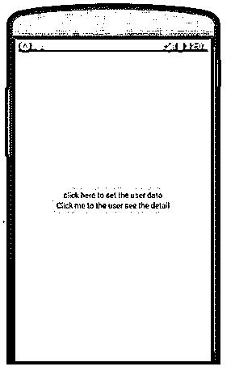
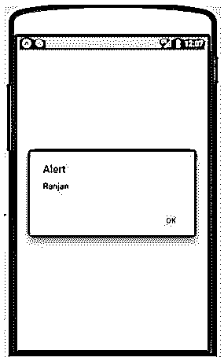
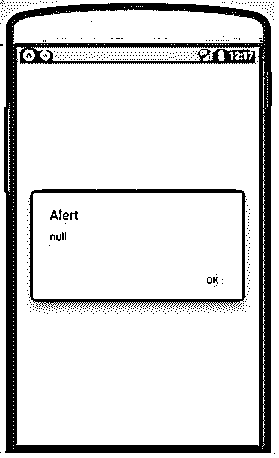
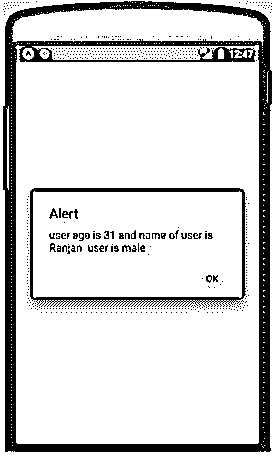
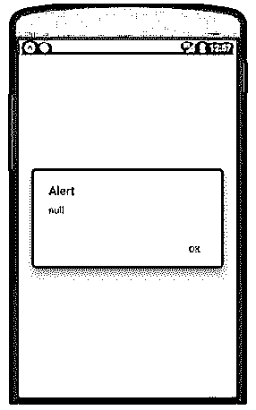

# 反应本机异步存储

> 原文：<https://www.educba.com/react-native-asyncstorage/>


## React 本机异步存储简介

react native 中的 AsyncStorage 是一种存储系统，我们可以在其中存储全局变量，以便访问我们的应用程序，使用 AsyncStorage 比使用 LocalStorage 总是更好，基本上 AsyncStorage 是应用程序上的异步、持久和未加密的键值存储系统，如果我们使用 asyncStorage，而不是直接使用它，这将是很好的。 在 IOS 的情况下，它将与本机代码一起使用，其中小值将被序列化，大值将被保存到单独的文件中，在 android 的情况下，我们可以使用 sqlite 或 RocksDB。

### 反应本机异步存储的工作原理

React native AsyncStorage 的工作方式可在以下步骤中定义:

<small>网页开发、编程语言、软件测试&其他</small>

*   它在用户系统(android 或 IOS 设备)上存储数据。
*   即使关闭应用程序或重启系统，这些数据仍然可用。
*   如果用户格式从系统内存中强制清除缓存，数据将会丢失。
*   当用户登录并关闭系统时会使用这些数据，此时系统会将数据保存在用户设备上，而当用户打开应用程序时，应用程序会从 AsyncStorage 获取数据并获得登录详细信息。

### 方法

下面给出了反应本机异步存储的不同方法:

#### 1.setItem 和 getItem

*   **setItem** :为键上的项目设置一个值，设置完成后会调用一个回调函数。
*   获取所有细节后，它将调用一个回调函数。

在下面的例子中，我们首先在函数 saveUserDetail 中设置存储“username”的值(单击文本时将调用该函数)，然后在第二个例子中设置另一个函数 displayuserDetail(单击文本时将调用该函数)。

**举例:**

**代码:**

```
import React, {Component} from 'react';
import {Platform, StyleSheet, Text,
View,TouchableOpacity, AsyncStorage,
} from 'react-native';
export default class syncStorageExample extends Component<Props> {
saveUserDetails(){
let username = "Ranjan";
AsyncStorage.setItem('username',username);
}
displayuserDetail = async ()=>{
try{
let username = await AsyncStorage.getItem('username');
alert(username);
}
catch(error){
alert(error)
}
}
render() {
return (
<View style={syncStyles.containerStyle}>
<TouchableOpacity onPress ={this.saveUserDetails}>
<Text>click here to set the user data</Text>
</TouchableOpacity>
<TouchableOpacity onPress ={this.displayuserDetail}>
<Text>Click me to the user see the detail</Text>
</TouchableOpacity>
</View>
);
}
}
const syncStyles = StyleSheet.create({
containerStyle: {
flex: 1,
justifyContent: 'center',
alignItems: 'center',
backgroundColor: '#F5FCFF',
},
});
```

**输出:**







#### 2.移除项目

无论我们在 setItem 函数的帮助下设置什么项目，都可以在 removeItem 函数的帮助下删除。removeItem 函数也有一个回调函数，一旦指定的项将从 asyncStorage 中移除，就会调用该函数。在下面的例子中，首先，我们在函数 saveUserDetails 中设置变量的值，该函数在文本单击时被调用；其次，当 next(向下文本)被单击时，它将首先删除该项，然后它将尝试获取被删除变量的值，输出将为空，因为我们已经删除了该项。

**举例:**

**代码:**

```
import React, {Component} from 'react';
import {Platform, StyleSheet, Text,
View,TouchableOpacity, AsyncStorage,
} from 'react-native';
export default class syncStorageExample extends Component<Props> {
saveUserDetails(){
let username = "Ranjan";
AsyncStorage.setItem('username',username);
}
displayuserDetail = async ()=>{
try{
await AsyncStorage.removeItem('username');
let username = await AsyncStorage.getItem('username');
alert(username);
}
catch(error){
alert(error)
}
}
render() {
return (
<View style={syncStyles.containerStyle}>
<TouchableOpacity onPress ={this.saveUserDetails}>
<Text>click here to set the user data</Text>
</TouchableOpacity>
<TouchableOpacity onPress ={this.displayuserDetail}>
<Text>Click me to the user see the detail</Text>
</TouchableOpacity>
</View>
);
}
}
const syncStyles = StyleSheet.create({
containerStyle: {
flex: 1,
justifyContent: 'center',
alignItems: 'center',
backgroundColor: '#F5FCFF',
},
});
```

**输出:**





#### 3.多重网格

**举例:**

**代码:**

```
import React, {Component} from 'react';
import {Platform, StyleSheet, Text,
View,TouchableOpacity, AsyncStorage,
} from 'react-native';
export default class syncStorageExample extends Component<Props> {
saveUserDetails(){
let username = "Ranjan";
let age='31'
let sex="male"
AsyncStorage.setItem('username',username);
AsyncStorage.setItem('age',age);
AsyncStorage.setItem('sex',sex);
}
displayuserDetail = async ()=>{
let username=''
let age=''
let sex=''
try{
AsyncStorage.multiGet(["username", "age", "sex"]).then(response => {
username=response[0][1];
age=response[1][1];
sex=response[2][1];
alert("user age is "+age +" "+ "and name of user is "+ username+" "+" user is "+sex);
})
}
catch(error){
alert(error)
}
}
render() {
return (
<View style={syncStyles.containerStyle}>
<TouchableOpacity onPress ={this.saveUserDetails}>
<Text>click here to set the user data</Text>
</TouchableOpacity>
<TouchableOpacity onPress ={this.displayuserDetail}>
<Text>Click me to the user see the detail</Text>
</TouchableOpacity>
</View>
);
}
}
const syncStyles = StyleSheet.create({
containerStyle: {
flex: 1,
justifyContent: 'center',
alignItems: 'center',
backgroundColor: '#F5FCFF',
},
});
```

**输出:**





#### 4.多重移除

有些时候，如果存储变量太多，逐个删除会是一个漫长的任务，所以为了避免这种情况，我们可以使用 multiRemove 方法。在下面的示例中，我们在名为 setItem 的 syncStorage 函数的帮助下，在函数 setUserDetails 中设置了一些属性。一旦我们完成了项目的设置，我们将调用下一个获取项目的文本，该文本将调用 displayUserDetail 函数，在该函数中，我们通过以数组格式提及属性的名称来删除所有属性。最后，我们正在尝试访问任何将显示为 null 的属性，因为我们已经一次性删除了所有属性。

**举例:**

**代码:**

```
import React, {Component} from 'react';
import {Platform, StyleSheet, Text,
View,TouchableOpacity, AsyncStorage,
} from 'react-native';
export default class syncStorageExample extends Component<Props> {
saveUserDetails(){
let username = "Ranjan";
let age=31
let sex="male"
AsyncStorage.setItem('username',username);
}
displayuserDetail = async ()=>{
try{
let keys = ['username', 'age','sex'];
AsyncStorage.multiRemove(keys, (err) => {
//it will remove the key username,age and sex all at once
//here we can perform operation ehich we want to perform after removal
});
let age = await AsyncStorage.getItem('age');
alert(age);
}
catch(error){
alert(error)
}
}
render() {
return (
<View style={syncStyles.containerStyle}>
<TouchableOpacity onPress ={this.saveUserDetails}>
<Text>click here to set the user data</Text>
</TouchableOpacity>
<TouchableOpacity onPress ={this.displayuserDetail}>
<Text>Click me to the user see the detail</Text>
</TouchableOpacity>
</View>
);
}
}
const syncStyles = StyleSheet.create({
containerStyle: {
flex: 1,
justifyContent: 'center',
alignItems: 'center',
backgroundColor: '#F5FCFF',
},
});
```

**输出:**





### 结论

从本教程中，我们学习了 react-native AsyncStorage 设置本地属性和删除这些本地属性以及在代码中使用这些属性。

### 推荐文章

这是一个反应本机异步存储的指南。这里我们讨论一下 react native 异步存储的介绍、工作原理和方法。您也可以看看以下文章，了解更多信息–

1.  [React Native FlatList](https://www.educba.com/react-native-flatlist/)
2.  [反应原生架构](https://www.educba.com/react-native-architecture/)
3.  [反应原生布局](https://www.educba.com/react-native-layout/)
4.  [反应原生进度条](https://www.educba.com/react-native-progress-bar/)