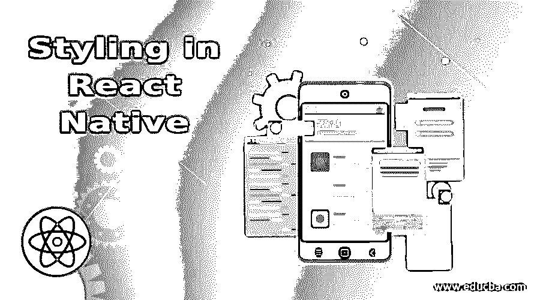
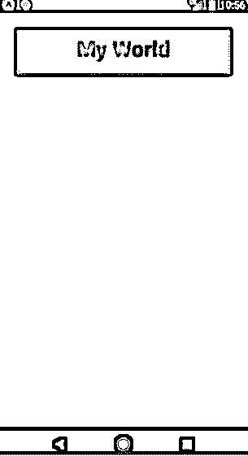
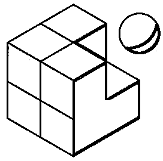
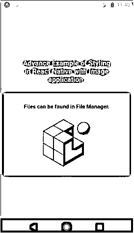
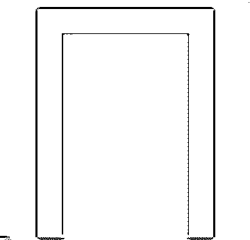
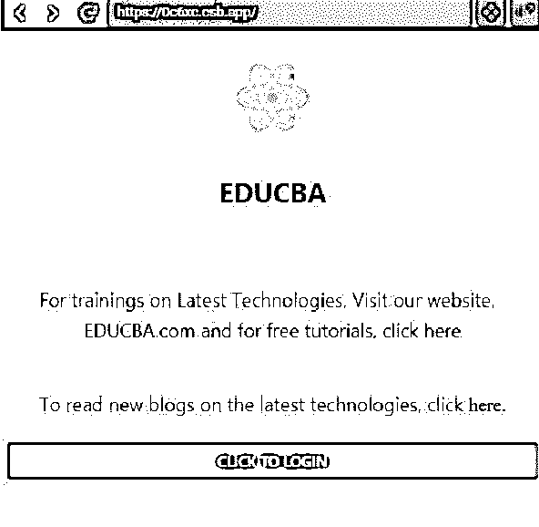

# React Native 中的样式

> 原文：<https://www.educba.com/styling-in-react-native/>

## React Native 中的样式介绍

造型是让任何东西吸引观众的一个非常重要的部分。应用程序或网站也是如此。我们倾向于喜欢看起来漂亮、风格正确的网站或应用程序。样式包括许多部分，如文本、字体、图像、颜色等。React Native 也支持应用程序的样式，就像 React 支持网站一样。基于 React Native 构建的应用程序可以根据我们的需求以不同的方式轻松进行样式化。在这篇文章中，我们将浏览一些例子，在这些例子中我们将看到应用程序风格化的一些方法。

**语法:**

<small>网页开发、编程语言、软件测试&其他</small>

`import { StyleSheet} from "react-native";`

### React Native 中实现样式的示例

下面是一些例子:

#### 示例 1–基本造型

**代码:**

`import React from "react"; import { StyleSheet
, Text
, View } from "react-native";
export default App = () => (
<View style={styles.container}>
<Text style={styles.title}>My World</Text>
</View>
);
const styles = StyleSheet.create({ container: {
flex: 2,
padding: 25,
backgroundColor: "#d9f587"
},
title: { marginTop: 17,
paddingVertical: 9,
borderWidth: 5, borderColor: "#4c2363", borderRadius: 6, backgroundColor: "#f2497b", color: "#631b87", textAlign: "center", fontSize: 31,
fontWeight: "bold"
}
});`

**输出:**

#### 示例# 2–使用图像进行造型

用于造型的组件:

*   资产文件夹
*   组件文件夹
*   射流研究…

资产文件夹中的组件:

*   snack-icon.png

组件文件夹中的组件:

*   资产示例. js

**1 .点心图标. png**

**2。资产示例. js**

**代码:**

`import * as React from 'react'; import { Text
, View
, StyleSheet
, Image } from 'react-native';
export default function AssetExample() { return (
<View style={styles.container}>
<Text style={styles.paragraph}> Files can be found in File Manager.
</Text>
<Image style={styles.logo} source={require('../assets/snack- icon.png')} />
</View>
);
}
const styles = StyleSheet.create({ container: {
alignItems: 'center', justifyContent: 'center', padding: 25, backgroundColor: '#f7ef4f',
},
paragraph: { margin: 25,
marginTop: 1,
fontSize: 15, fontWeight: 'bold', textAlign: 'center', color: '#d41c5f',
},
logo: { height: 128,
width: 128,
}
});`

**App.js**

**代码:**

`import * as React from 'react'; import { Text
, View
, StyleSheet } from 'react-native'; import Constants from 'expo-constants';
import AssetExample from './components/AssetExample';
import { Card } from 'react-native-paper';
export default function App() { return (
<View style={styles.container}>
<Text style={styles.paragraph}>
Advance Example of Styling in React Native with Image application.
</Text>
<Card>
<AssetExample />
</Card>
</View>
);
}
const styles = StyleSheet.create({ container: {
flex: 2,
justifyContent: 'center',
paddingTop: Constants.statusBarHeight, backgroundColor: '#6d91f2',
padding: 9,
},
paragraph: { margin: 25,
fontSize: 19, fontWeight: 'bold', textAlign: 'center', color: '#f5f262',
},
});` **T3】**

**输出:**

#### 示例# 3–多彩造型

src 文件夹中的组件:

*   App.js
*   索引. js

**1。App.js**

**代码:**

`import React, { Component } from "react";
import { StyleSheet, View } from "react-native";
class App extends Component {
render() {
return (
<View style={styles.background}>
<View style={styles.app} />
</View>
);
}
}
const styles = StyleSheet.create({ background: {
flex: 2,
borderColor: "#ed47a8", borderWidth: 20, backgroundColor: "#af58d1"
},
app: {
margin: "auto", maxWidth: 361,
maxHeight: 641,
width: 361,
height: 641, backgroundColor: "#55d4be", borderWidth: 50, borderColor: "#daff5e"
}
});
export default App;`

**2。index.js**

**代码:**

`import { AppRegistry } from "react-native"; import App from "./App";
AppRegistry.registerComponent("App", () => App);
AppRegistry.runApplication("App", { rootTag: document.getElementById("root")
});`

**输出:**

#### 示例# 4–使用按钮的样式

src 文件夹中的组件:

*   App.js
*   索引. js

**1。App.js**

**代码:**

`import React, { Component } from "react";
import { Button, Image, StyleSheet, Text, View } from "react-native";
const logoUri = `data:image/svg+xml;utf8,<svg viewBox="0 0 841.9 595.3"><g fill="#61DAFB"><path d="M666.3 296.5c0-32.5-40.7-63.3-103.1-82.4 14.4-63.6 8-114.2-20.2-130.4-6.5-3.8-14.1-5.6-22.4-5.6v22.3c4.6 0 8.3.9 11.4 2.6 13.6
7.8 19.5 37.5 14.9 75.7-1.1 9.4-2.9 19.3-5.1 29.4-19.6-4.8-41-8.5-63.5-
10.9-13.5-18.5-27.5-35.3-41.6-50 32.6-30.3 63.2-46.9 84-46.9V78c-27.5 0-
63.5 19.6-99.9 53.6-36.4-33.8-72.4-53.2-99.9-53.2v22.3c20.7 0 51.4 16.5 84
46.6-14 14.7-28 31.4-41.3 49.9-22.6 2.4-44 6.1-63.6 11-2.3-10-4-19.7-5.2-
29-4.7-38.2 1.1-67.9 14.6-75.8 3-1.8 6.9-2.6 11.5-2.6V78.5c-8.4 0-16 1.8-
22.6 5.6-28.1 16.2-34.4 66.7-19.9 130.1-62.2 19.2-102.7 49.9-102.7 82.3 0
32.5 40.7 63.3 103.1 82.4-14.4 63.6-8 114.2 20.2 130.4 6.5 3.8 14.1 5.6
22.5 5.6 27.5 0 63.5-19.6 99.9-53.6 36.4 33.8 72.4 53.2 99.9 53.2 8.4 0 16-
1.8 22.6-5.6 28.1-16.2 34.4-66.7 19.9-130.1 62-19.1 102.5-49.9 102.5-
82.3zm-130.2-66.7c-3.7 12.9-8.3 26.2-13.5 39.5-4.1-8-8.4-16-13.1-24-4.6-8-
9.5-15.8-14.4-23.4 14.2 2.1 27.9 4.7 41 7.9zm-45.8 106.5c-7.8 13.5-15.8
26.3-24.1 38.2-14.9 1.3-30 2-45.2 2-15.1 0-30.2-.7-45-1.9-8.3-11.9-16.4-
24.6-24.2-38-7.6-13.1-14.5-26.4-20.8-39.8 6.2-13.4 13.2-26.8 20.7-39.9 7.8-
13.5 15.8-26.3 24.1-38.2 14.9-1.3 30-2 45.2-2 15.1 0 30.2.7 45 1.9 8.3 11.9
16.4 24.6 24.2 38 7.6 13.1 14.5 26.4 20.8 39.8-6.3 13.4-13.2 26.8-20.7
39.9zm32.3-13c5.4 13.4 10 26.8 13.8 39.8-13.1 3.2-26.9 5.9-41.2 8 4.9-7.7
9.8-15.6 14.4-23.7 4.6-8 8.9-16.1 13-24.1zM421.2 430c-9.3-9.6-18.6-20.3-
27.8-32 9 .4 18.2.7 27.5.7 9.4 0 18.7-.2 27.8-.7-9 11.7-18.3 22.4-27.5
32zm-74.4-58.9c-14.2-2.1-27.9-4.7-41-7.9 3.7-12.9 8.3-26.2 13.5-39.5 4.1 8
8.4 16 13.1 24 4.7 8 9.5 15.8 14.4 23.4zM420.7 163c9.3 9.6 18.6 20.3 27.8
32-9-.4-18.2-.7-27.5-.7-9.4 0-18.7.2-27.8.7 9-11.7 18.3-22.4 27.5-32zm-74
58.9c-4.9 7.7-9.8 15.6-14.4 23.7-4.6 8-8.9 16-13 24-5.4-13.4-10-26.8-13.8-
39.8 13.1-3.1 26.9-5.8 41.2-7.9zm-90.5 125.2c-35.4-15.1-58.3-34.9-58.3-50.6
0-15.7 22.9-35.6 58.3-50.6 8.6-3.7 18-7 27.7-10.1 5.7 19.6 13.2 40 22.5
60.9-9.2 20.8-16.6 41.1-22.2 60.6-9.9-3.1-19.3-6.5-28-10.2zM310 490c-13.6-
7.8-19.5-37.5-14.9-75.7 1.1-9.4 2.9-19.3 5.1-29.4 19.6 4.8 41 8.5 63.5 10.9
13.5 18.5 27.5 35.3 41.6 50-32.6 30.3-63.2 46.9-84 46.9-4.5-.1-8.3-1-11.3-
2.7zm237.2-76.2c4.7 38.2-1.1 67.9-14.6 75.8-3 1.8-6.9 2.6-11.5 2.6-20.7 0-
51.4-16.5-84-46.6 14-14.7 28-31.4 41.3-49.9 22.6-2.4 44-6.1 63.6-11 2.3
10.1 4.1 19.8 5.2 29.1zm38.5-66.7c-8.6 3.7-18 7-27.7 10.1-5.7-19.6-13.2-40-
22.5-60.9 9.2-20.8 16.6-41.1 22.2-60.6 9.9 3.1 19.3 6.5 28.1 10.2 35.4 15.1
58.3 34.9 58.3 50.6-.1 15.7-23 35.6-58.4 50.6zM320.8 78.4z" /><circle
cx="420.9" cy="296.5" r="45.7" /><path d="M520.5 78.1z" /></g></svg>`;
const Link = props => (
<Text
{...props}
accessibilityRole="link"
style={StyleSheet.compose( styles.link,
props.style
)}
/>
);
class App extends Component { render() {
return (
<View style={styles.app}>
<View style={styles.header}>
<Image
accessibilityLabel="React logo" source={{ uri: logoUri }} resizeMode="contain" style={styles.logo}
/>
<Text style={styles.title}>EDUCBA</Text>
</View>
<Text style={styles.text}>
For trainings on Latest Technologies, Visit our website, {" "}
<Link href="https://www.educba.com/"> EDUCBA.com
</Link>{" "}
and for free tutorials, click{" "}
<Link href="https://www.educba.com/tutorials/?source=menu"> here
</Link>
</Text>
<Text style={styles.text}>
To read new blogs on the latest technologies, click{" "}
<Link href="https://www.educba.com/blog/?source=footer" style={styles.code}>
here
</Link>
.
</Text>
<Button onPress={() => {}} title="Click to Login" />
</View>
);
}
}
const styles = StyleSheet.create({ app: {
marginHorizontal: "auto", maxWidth: 501
},
logo: { height: 81
},
header: { padding: 21
},
title: {
fontWeight: "bold", fontSize: "1.6rem", marginVertical: "1.1em", textAlign: "center",
color: '#7039e6'
},
text: {
lineHeight: "1.6em", fontSize: "1.126rem", marginVertical: "1.1em", textAlign: "center", color: '#ed285a'
},
link: {
color: "#5dc418"
},
code: {
fontFamily: "Times New Roman"
}
});
export default App;`

**2。index.js**

**代码:**

`import { AppRegistry } from "react-native"; import App from "./App";
AppRegistry.registerComponent("App", () => App);
AppRegistry.runApplication("App", { rootTag: document.getElementById("root")
});`

**输出:**

### 结论

根据上面的文章，我们了解了如何在 React Native 上设计我们的应用程序。这四个不同的例子向我们展示了不同的方式来设计应用程序，既可以美化应用程序，又可以保持与用户的交互。我希望这篇文章对您有所帮助，并且这些例子更容易理解。

### 推荐文章

这是 React Native 中的样式指南。在这里，我们讨论 React Native 中的样式介绍及其示例和代码实现。您也可以浏览我们推荐的其他文章，了解更多信息——

1.  [反应本地异步存储](https://www.educba.com/react-native-asyncstorage/)
2.  [反应原生进度条](https://www.educba.com/react-native-progress-bar/)
3.  [React 原生库](https://www.educba.com/react-native-libraries/)
4.  [React 原生抽屉导航](https://www.educba.com/react-native-drawer-navigation/)