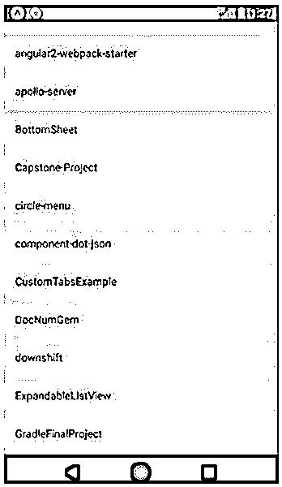
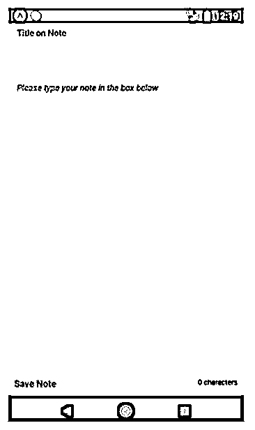

# 反应原生还原

> 原文：<https://www.educba.com/react-native-redux/>

## React Native Redux 简介

下面的文章提供了 React Native Redux 的概要。Redux 被定义为 JavaScript 应用程序的可预测状态容器。它有助于编写易于测试、在不同环境(如本机、服务器和客户端)中运行且行为一致的应用程序。除了这些功能之外，它还提供了令人惊叹的开发体验，如结合时间旅行调试器的实时代码编辑。Redux 可以与 React on 结合使用，也可以与任何其他视图库结合使用。它非常小，包括依赖项在内只有 2kB，但是它有一个很大的附加组件生态系统。对于在 NPM 的节点应用或模块捆扎机中的使用，它作为一个包提供。

### React Native Redux 的示例

下面是一些例子:

<small>网页开发、编程语言、软件测试&其他</small>

#### 示例#1

**ReducerComponent.js**

`export const GET_REPOS = 'my-awesome-app/repos/LOAD';
export const GET_REPOS_SUCCESS = 'my-awesome-app/repos/LOAD_SUCCESS';
export const GET_REPOS_FAIL = 'my-awesome-app/repos/LOAD_FAIL';
export default function reducer(state = { repos: [] }, action) {
switch (action.type) {
case GET_REPOS:
return { ...state, loading: true };
case GET_REPOS_SUCCESS:
return { ...state, loading: false
, repos: action.payload.data };
case GET_REPOS_FAIL:
return {
...state,
loading: false,
error: 'Error while fetching repositories'
};
default:
return state;
}
}
export function listRepos(user) {
return {
type: GET_REPOS,
payload: {
request: {
url: `/users/${user}/repos`
}
}
};
}`

**List.js**

`import React, { Component } from 'react';
import { View
, Text
, FlatList
, StyleSheet } from 'react-native';
import { connect } from 'react-redux';
import { listRepos } from './ReducerComponent';
class RepoList extends Component {
componentDidMount() {
this.props.listRepos('relferreira');
}
renderItem
= ({ item }) => (
<Viewstyle={styles.item}>
<Text>{item.name}</Text>
</View>
);
render(){
const{ repos } = this.props;
return(
<FlatList
styles={styles.container}
data={repos}
renderItem={this.renderItem}
/>
);
}
}
const styles = StyleSheet.create({
container: {
flex: 1
},
item: {
padding: 15,
borderBottomWidth: 1,
borderBottomColor: '#d0db9e'
}
});
constmapStateToProps = state =>{
letstoredRepositories
=
state.repos.map(repo =>
({ key: repo.id, ...repo }));
return {
repos: storedRepositories
};
};
constmapDispatchToProps = {
listRepos
};
export default connect(mapStateToProps, mapDispatchToProps)(RepoList);`

**App.js**

`import React, { Component } from 'react';
import { StyleSheet
, Text
, View } from 'react-native';
import { createStore, applyMiddleware } from 'redux';
import { Provider, connect } from 'react-redux'; import axios from 'axios';
import axiosMiddleware from 'redux-axios-middleware';
import reducer from './ReducerComponent';
import RepoList from './List';
const client = axios.create({
baseURL: 'https://api.github.com',
responseType: 'json'
});
const store = createStore(reducer,
applyMiddleware(axiosMiddleware(client)));
export default class App extends Component {
render(){
return(
<Provider store={store}>
<View style={styles.container}>
<RepoList />
</View>
</Provider>
);
}
}
const styles = StyleSheet.create({
container: {
flex: 1,
backgroundColor: '#b8cfe3',
marginTop: 40
}
});`

**输出:**

**

** 

#### 实施例 2

“笔记-应用”

##### 形容词（adjective 的缩写）应用程序文件夹的组件

**组件文件夹的组件:**

*   **Home.component.js**

`import React, { Component } from 'react';
import { View
, Text
, TextInput } from 'react-native';
import styles from './Home.component.style.js';
import TextArea from '../TextArea/TextArea.component.js';
class Home extends Component {
state = { title: '',
text: ''
}
setTitle = (title) =>this.setState({title})
setText = (text) =>this.setState({text});
render () {
return (
<View style={styles.container}>
<Text style={styles.titleHeading}> Title on Note </Text>
<TextInput style={styles.titleTextInput}
onChangeText={this.setTitle} value={this.state.title} />
<Text style={styles.textAreaTitle}> Please type your note in the box below </Text>
<TextArea text={this.state.text} onTextChange={this.setText} style={styles.textArea}/>
<View style={styles.bottomBar}>
<View style={styles.bottomBarWrapper}>
<Text style={styles.saveBtn}>Save Note</Text>
<Text style={styles.characterCount}>{this.state.text.length} characters</Text>
</View>
</View>
</View>
);
}
}
export default Home;`

*   **Home.component.style.js**

`import { StyleSheet } from 'react-native';
import theme from'../../styles/theme.style.js';
import { headingText, textInput } from '../../styles/common.style.js';
export default StyleSheet.create({
container: {
flex: 1,
paddingTop: theme.CONTAINER_PADDING,
flexDirection: 'column',
justifyContent: 'space-between'
},
titleHeading: {
...headingText
},
titleTextInput: {
...textInput
},
textAreaTitle: {
...headingText,
fontWeight: theme.FONT_WEIGHT_LIGHT,
fontStyle: 'italic'
},
textArea: {
...textInput, flex: 1
},
bottomBar: {
flexDirection: 'row',
alignItems: 'center'
},
bottomBarWrapper: {
flexDirection: 'row',
justifyContent: 'space-between',
flex: 1
},
saveBtn: { padding: 9,
fontWeight: theme.FONT_WEIGHT_BOLD
},
characterCount: { padding: 9,
fontSize: theme.FONT_SIZE_SMALL
}
});`

**文本区:**

*   **textarea . component . Android . js**

`import React, { Component } from 'react';
import { TextInput } from 'react-native';
import styles from './TextArea.component.style.js';
class TextArea extends Component {
state = {
text: ''
}
setText = (text) =>this.setState({text})
render () {
const {...extraProps} = this.props;
constalignTextTop = {textAlignVertical: 'top'};
return (
<TextInput
{...extraProps}
style={[styles.textArea, alignTextTop, extraProps.style]}
multiline = {true}
onChangeText={this.setText}
value={this.state.text}
underlineColorAndroid={'transparent'}
/>
);
}
}
export default TextArea;`

*   **TextArea.component.js**

`import React, { Component } from 'react';
import { TextInput } from 'react-native';
import PropTypes from 'prop-types';
import styles from './TextArea.component.style.js';
class TextArea extends Component {
staticpropTypes = {
text: PropTypes.string,
onTextChange: PropTypes.func
}
render () {
const {text, onTextChange, ...extraProps} = this.props;
return (
<TextInput
{...extraProps}
style={[styles.textArea, extraProps.style]}
multiline = {true}
onChangeText={onTextChange}
value={text}
/>
);
}
}
xport default TextArea;`

*   **textarea . component . style . js**

`import { StyleSheet } from 'react-native';
import theme from'../../styles/theme.style.js';
export default StyleSheet.create({
textArea: {
fontSize: theme.FONT_SIZE_MEDIUM,
fontWeight: theme.FONT_WEIGHT_LIGHT
}
});`

**重复文件夹的组件:**

**1。动作** **s-**

**index.actions.js**

`export const TEST_ACTION = 'TEST_ACTION';`

**2。减速器-**

**root . reduce . js**

`import { combineReducers } from 'redux';
import test from './test.reducer.js';
export default combineReducers({ test
});`**T2】**

**test.reducer.js**

`import { TEST_ACTION } from '../actions/index.actions.js';
const test = (state = {}, action) =>
{ switch (action.type) {
case TEST_ACTION: {
return action.payload;
}
default:
return state;
}
};
export default test;`

**3。store.js**

`import { createStore, compose} from 'redux';
import rootReducer from './reducers/root.reducer.js';
constenhancerList = [];
constdevToolsExtension = window && window.REDUX_DEVTOOLS_EXTENSION;
if (typeofdevToolsExtension === 'function') {
enhancerList.push(devToolsExtension());
}
constcomposedEnhancer = compose(...enhancerList);
constinitStore = () =>createStore(rootReducer, {}, composedEnhancer);
module.exports = {
initStore`

**样式组件文件夹:**

*   **common.style.js**

`import theme from './theme.style.js';
export constheadingText = {
fontSize: theme.FONT_SIZE_MEDIUM,
alignSelf: 'flex-start',
padding: 10,
fontWeight: theme.FONT_WEIGHT_BOLD,
};
export consttextInput = {
padding: theme.TEXT_INPUT_PADDING,
backgroundColor: theme.BACKGROUND_COLOR_LIGHT,
alignSelf: 'stretch'
};`

*   **主题.风格. js**

`export default {
PRIMARY_COLOR: '#2aabb8',
FONT_SIZE_SMALL: 11,
FONT_SIZE_MEDIUM: 13,
FONT_SIZE_LARGE: 15,
FONT_WEIGHT_LIGHT: '200',
FONT_WEIGHT_MEDIUM: '500',
FONT_WEIGHT_BOLD: '700',
BACKGROUND_COLOR_LIGHT: '#dff092',
CONTAINER_PADDING: 19,
TEXT_INPUT_PADDING: 9
};`

**App.container.js**

`import React, { Component } from 'react';
import Home from './components/Home/Home.component.js';
import { connect } from 'react-redux';
class App extends Component { render () {
console.log(this.props.state); return (
<Home />
);
}
}
constmapStateToProps = (state) =>({ state
});
constmapDispatchToProps = (dispatch) =>({ dispatch
});
export default connect(mapStateToProps, mapDispatchToProps)(App);`

**index.js**

`import React, { Component } from 'react';
import { initStore } from './redux/store';
import { Provider } from 'react-redux';
import App from './App.container.js';
const store = initStore();
class NoteTaker extends Component {
render () {
return (
<Provider store={store}>
<App />
</Provider>
);
}
}
export default NoteTaker;`

##### b.App.js

`import { AppRegistry } from 'react-native';
import app from './app/index';
AppRegistry.registerComponent('NoteTaker', () => app);
export default app;`

**输出:**

**

** 

### 结论

在以上讨论的基础上，我们成功地在移动应用中设置了 Redux。我们还了解了 Redux 如何成功地管理这些应用程序中的状态。

### 推荐文章

这是一个 React Native Redux 的指南。在这里，我们讨论 React Native Redux 的介绍以及一些示例，以便更好地理解。您也可以看看以下文章，了解更多信息–

1.  [反应原生架构](https://www.educba.com/react-native-architecture/)
2.  [React 原生图表](https://www.educba.com/react-native-charts/)
3.  [React 原生库](https://www.educba.com/react-native-libraries/)
4.  [反应原生成分](https://www.educba.com/react-native-components/)