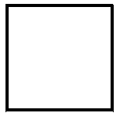

# 反应 JSX

> 原文：<https://www.educba.com/react-jsx/>

## 反应 JSX 简介

在 react js 中，我们经常遇到需要将 JavaScript 和 html 结合的情况，react 引入了 JSX 文件类型。他们没有发明一种不同的技术来同时处理两个机器人，而是引入了 JSX。你会看到 react js 中会有状态，会有函数，会有 HTML 和 CSS 也在任何特定组件的同一个文件上。为了处理所有这些属性，他们引入了 JSD 文件的概念。例如 const x =

# How are you

，所以这里我们可以看到它不是完整的 html，甚至不是 JavaScript。

### JSX 在 React 中的应用

下面给出了 JSX 在 React 中的用法:

<small>网页开发、编程语言、软件测试&其他</small>

#### 1.易于编写代码

在 JSX 的例子中，它允许我们在同一个文件中编写 HTML、CSS 和 javascript，这使得代码更加清晰易懂。我们看一下 const x =

# Hello friend

这样的例子，在这个例子中，我们在同一个文件中编写了 HTML 和 javascript，它看起来不像一个完整的 HTML 或任何完整的 javascript。我们也可以附加 css 和 html，比如 const x =

# hello friend

，在这里我们可以为 style object 添加一些 css 属性的样式对象，这些属性可以改变 h1 标签的设计。

#### 2.与 JavaScript 一起使用时不带" "

如果您处理过扩展名为。然后你会看到，如果你想把 html 和 javascript 结合起来，你必须使用双引号，同样的，如果我们想用。html 扩展，然后我们还需要使用 javascript 开始和结束标签。在 JSX 的帮助下，我们将能够简单地编写没有这些东西，我们可以轻松地管理流，不使用引号和任何 javascript 标签分别管理 html 和 javascript。

#### 3.不使用 createElement()将 HTML 放在 JavaScript 中

在 jsx 的帮助下，我们将能够从 javascript 到 html 创建 html dom，这意味着我们将使用 javascript 和 css 在 javascript 组合中编写 html，并且可以直接转换为 html dom，而无需使用名为 createElement()的属性或函数。它节省了额外的计算，因为我们不再从 javascript 到另一种格式创建 dom。例如 cons x =

# Hello friend

，这里是 javascript 和 html 的结合，html 标签可以很容易地放置到 html 真实节点，而不需要使用 createElement()的概念。

### 如何在 React 中使用 JSX？

下面我们给出了一些重要的例子，展示了 react js 中 jsx 的各种用法和工作方式。在下面的例子中，我们将 javascript、HTML 和 css 结合在一起，由于 jsx 文件类型，所有这些都是可能的。

在这个例子中，我们可以理解 jsx 文件的重要性，它让我们可以灵活地在同一个文件中使用所有类型的扩展名。它减少了我们为 html 和 javascript 管理独立流的工作。如果我们想运行下面的例子，那么我们可以创建任何扩展名为 jsx 的文件，我们可以把例子放在文件上，我们可以在浏览器上看到执行的输出。

#### 示例#1

**代码:**

`function fullName(userDetail) {
return userDetail.userFirstName + ' ' + userDetail.userMiddleName + ' '+userDetail.userLastName;
}
//Defining the css to design the output view with color and with some other attributes.
constuserStyle={
color:"red",
fontSize:"15px"
}
//Defining the css to design the output view with color and with some other attributes.
constuserdetails = {
userFirstName: 'Ranjan',
userMiddleName: 'Kumar',
userLastName : "Pandey"
};
//Here we can see that we are combining the html and javascripttogether .
const user = <h1 style ={userStyle}>Welcome to React programing, {fullName(userdetails)}!</h1>;
ReactDOM.render(user, document.getElementById('main'));
HTML,
Below is the html which will hold the hole react jsx file output

`

**输出:**

#### 实施例 2

**代码:**

`//Defining the css to design the output view with color and with some other attributes.
constjsxStyle={
color:"red",
fontSize:"15px",
justifyContent: "center",
alignItems: "center",
textAlign :"center",
marginTop: "1em"
}
class JsxExample extends React.Component {
render() {
return 

//Here we can see that we are combining the html and javascript together.
<h1 style={jsxStyle}>This is the tutorial for JSX</h1>

;
}
}
React.render(<JsxExample />, document.getElementById('main'));
HTML,
Below is the html which will hold the hole react jsx file output

</app>`

**输出:**

#### 实施例 3

**代码:**

`//Defining the css to design the output view with color and with some other attributes.
var Shape = React.createClass({
shapeStyle: {
width: "101px",
height: "101px",
mozBorderRadius: "51%",
alignItems: "center",
webkitBorderRadius: "101%",
background: "green"
},
render: function() {
return (
//Here we can see that we are combining the html and javascript together.

);
}
});
React.render(
<Shape />,
document.getElementById('main'));
HTML,
Below is the html which will hold the hole react jsx file output

</app>`

**输出:**

### 结论

从本教程中，我们看到了 jsx 的基本概念，我们看到了 jsx 的用途和流程，我们看到了它的重要性和在一些重要示例的帮助下的用途，重点是实时案例。

### 推荐文章

这是反应 JSX 的指南。这里我们讨论一下 react 中 JSX 的介绍、用法以及如何在 react 中使用 JSX？分别举例说明。您也可以看看以下文章，了解更多信息–

1.  [React 路由器转换](https://www.educba.com/react-router-transition/)
2.  [React Redux Connect](https://www.educba.com/react-redux-connect/)
3.  [React 原生模板](https://www.educba.com/react-native-template/)
4.  [React-Native 样式表](https://www.educba.com/react-native-stylesheet/)