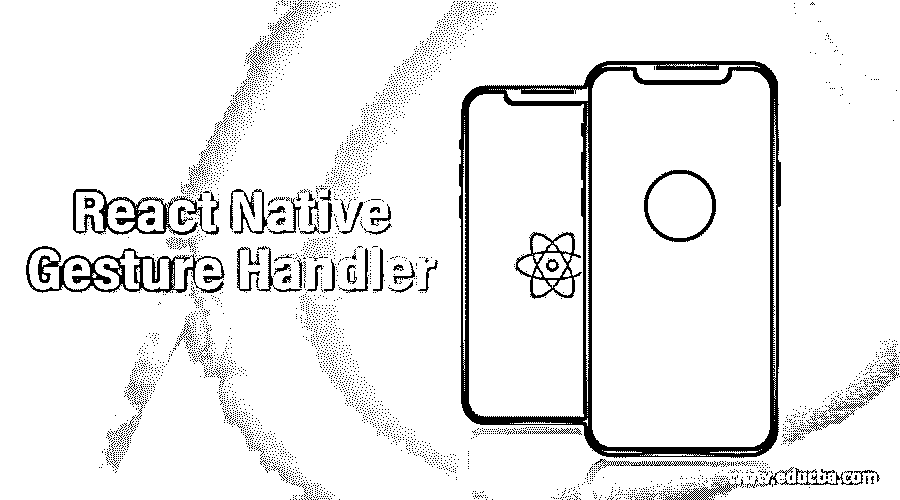
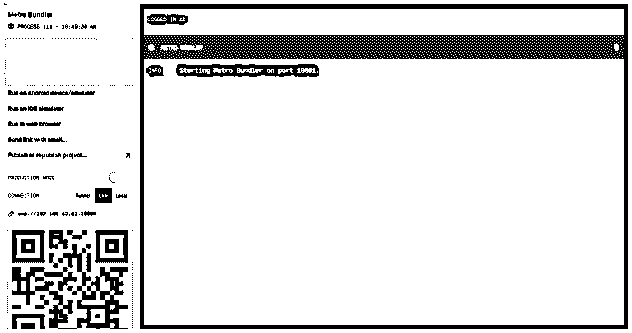
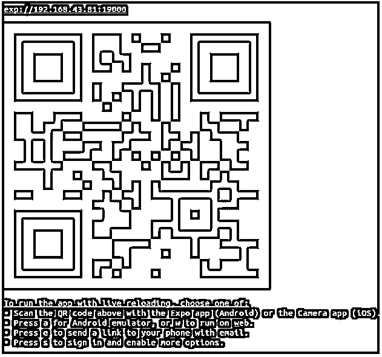
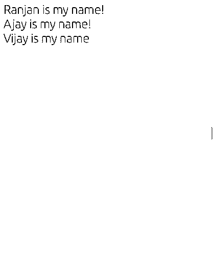
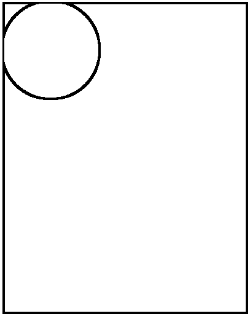
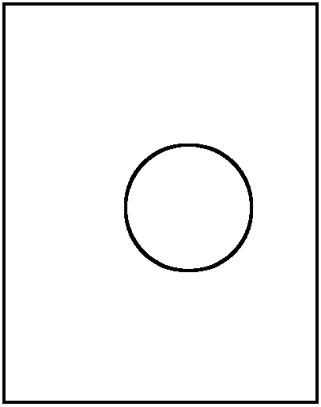

# 反应本机手势处理程序

> 原文：<https://www.educba.com/react-native-gesture-handler/>

## React 本机手势处理程序简介

在 react native 中，手势处理器的概念是在名为手势响应系统的 react-native 内置包之后出现的。我们也可以检查这个包，问题是 react 的内置库的性能。在 react-native 手势处理程序的帮助下，我们将能够读取收缩，并且还可以使用它进行旋转。我们可以控制任何维度的旋转，它将非常平滑和快速，它还允许我们使用在 react-native 线程中运行的触摸活动，这意味着它还允许我们处理默认行为。

### 句法

下面是我们导入 PanGestureHandler 的简单语法。我们已经从 react-native 手势处理程序中导入了 PanGestureHandler，在这个组件中，我们可以传递动画来平滑处理形状。

<small>网页开发、编程语言、软件测试&其他</small>

`import  {PanGestureHandler} from 'react-native-gesture-handler'
<PanGestureHandler onGestureEvent={handler function}>
{/* Animation for the view */}
</PanGestureHandler>`

### 如何使用手势处理程序 react-native？

在理解 react-native 手势处理程序的工作之前，我们需要理解为什么我们需要这个包。它主要用于形状的平滑流动，因为我们曾经有一个内置的包来处理形状，但性能和属性的限制并不好。因此，这是对内置包的一种替代。在使用这个包之前，我们需要导入手势处理器组件。然后，我们需要使用导入的组件，在手势处理器组件中，我们需要传递我们希望发生的动画。手势处理器组件内的动画我们可以感受到更好的性能，甚至我们将获得更多和额外的功能来处理这一点。

### React 本机手势处理程序的示例

要运行一个基本示例，首先我们需要创建一个应用程序，我们可以使用命令 sudo npm install expo-cli -global。因为我们使用 expo 在 android 环境中运行应用程序，之后，我们将使用 expo init my-new-project 命令。它将允许我们为任何 react 本机应用程序创建一个基本结构。它将下载运行基本应用程序所需的所有模块。

执行上述活动后，我们将看到如下所示的屏幕，

运行命令 npm start 启动应用程序。

最后，我们会在命令提示符下看到一个屏幕，

在这个屏幕上，我们需要在您的 android 手机上扫描博览会安装应用程序上的二维码。

#### 示例#1

下面是一个简单的例子，我们在不使用 react-native 手势包的情况下显示了一些列表。

**代码:**

`import React from 'react'
import {
SafeAreaView,
View,
Text,
StyleSheet,
FlatList
} from 'react-native'
//Array of list of the user details and it contains the key and message section
const userData = [
{ key: '11', msg: 'Ranjan is my name!' },
{ key: '21', msg: 'Ajay is my name!' },
{ key: '31', msg: 'Vijay is my name' }
] //Creating view for gesture components
const GastureSeperators = () => <View style={Gasturestyles.GastureSeperator} />
const UserList = ({ msg }) => (
<View style={{ backgroundColor: "yellow" }}>
<Text style={{ fontSize: 24 ,fontWeight:"100",color:"black"}}>{msg}</Text>
</View>
)
const Example = () => {
return (
<>
//Start of the SafeAreaView
<SafeAreaView style={Gasturestyles.GastureC}>
<FlatList
data={userData}
keyExtractor={value => value.key}
renderItem={({ item }) => <UserList {...item} />}
ItemSeparatorComponent={() => <GastureSeperators />}
/>
//End of the SafeAreView
</SafeAreaView>
</>
)
}
//Style for displaying the components and views
const Gasturestyles = StyleSheet.create({
GastureC: {
flex: 2,
backgroundColor:"yellow"
},
GastureSeperator: {
flex: 2,
backgroundColor: 'green',
height: 2,
}
})
//Exporting the Default Example components
export default Example`

屏幕上，在运行 npm start 后，我们可以看到上面示例的以下输出。

#### 实施例 2

这是第二个例子，这里我们使用了 react-native-gesture-handler，我们可以看到

**代码:**

`//Importing the react components from main react
import React, { Component } from 'react'
//Importing the components of react-native for uses
import { Text, View,StyleSheet ,Animated} from 'react-native'
//Importing the gesture handler components for uses
import  {PanGestureHandler} from 'react-native-gesture-handler'
export default class GestureHandlerClass extends Component {
//Creating x axis movement for the shape
x = new Animated.Value(1)
////Creating y axis movement for the shape
y = new Animated.Value(1)
manageGesture = Animated.event([{nativeEvent: {translationX: this.x,translationY:this.y}}], { useNativeDriver: true });
render() {
let transformStyle
//Designing the transform style so that the movement of the shape is very smooth
transformStyle = {
transform:[
{
translateY : this.y
},
{
translateX : this.x
}
] }
return (
{/* Start of the view along with the style*/}
<View style={[GestureStyle.gestureContainer]}>
<PanGestureHandler onGestureEvent={this.manageGesture}>
{/* Animation for the view */}
<Animated.View style={[GestureStyle.shape,transformStyle]} />
</PanGestureHandler>
</View>
)
}
}
//Style sheet for the above components and the for a better presentation of the components
const GestureStyle = StyleSheet.create({
gestureContainer: {
flex: 2,
flexDirection: "column-reverse",
justifyContent: "flex-end",
backgroundColor: "black"
},
shape: {
width: 155,
height: 155,
backgroundColor: "green",
fontWeight:100,
borderRadius: 99
}})`

下面的屏幕是我们正在显示的形状，我们可以在给定的 android 设备上将这些形状从一个地方移动到另一个地方。在下面的形状中，圆圈在顶部，然后我们将它从鼠标移动到另一个位置。

### 优势

使用手势处理程序有很多好处，让我来给出一些使用它的重要好处。

*   这使得识别任何种类的挤压和任何种类的触摸变得容易。
*   作为 react-native android 应用程序中处理形状旋转的平滑方式。
*   它提供了知道 react-native 手势处理程序之间的旋转的能力。
*   在驱动程序动画的帮助下，它还提供了平滑动画和形状移动的能力。
*   它为我们提供了响应交集的能力，即使在 Javascript 线程过多或简单过载的情况下。
*   与现有的内置处理程序相比，性能更好。

### 结论

从本教程中，我们学习了手势处理程序的基本工作原理，我们将重点放在 react-native 手势处理程序的语法上。我们还重点介绍了一些示例以及运行示例的所有设置，并了解了它的优势。

### 推荐文章

这是一个反应原生手势处理器的指南。在这里，我们讨论如何使用手势处理器和相应的例子进行反应。您也可以看看以下文章，了解更多信息–

1.  [反应原生旋转木马](https://www.educba.com/react-native-carousel/)
2.  [反应原生模态](https://www.educba.com/react-native-modal/)
3.  [React Native Redux](https://www.educba.com/react-native-redux/)
4.  [反应原生导航](https://www.educba.com/react-native-navigation/)

