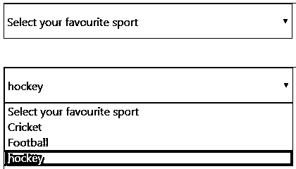
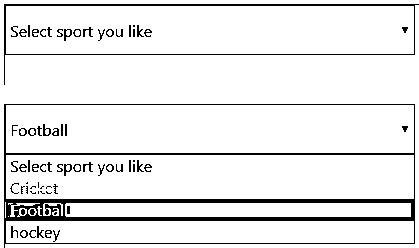

# 反应本机选取器

> 原文：<https://www.educba.com/react-native-picker/>


## React 本机选取器简介

React Native 中的 React Native picker 是一个库组件，可以让我们用很少的 HTML 代码来设计多选；基本上，它就像下拉菜单或对话框，最终用户可以从选项中选择一个列表项，它有几个选项可以在下拉菜单或对话框中显示我们的多选，使用 react native picker 的最大好处是它将适合任何小型大型或中型设备，因为我们可以通过使用样式参数根据设备的大小轻松设计我们的多选，它还允许我们不同地设计多选的每个选项。

**语法:**

<small>网页开发、编程语言、软件测试&其他</small>

在下面的语法中，我们可以看到我们传递了一些项，并且为这些项设置了标签和值。这些标签和值分别是要显示的属性和实际值。

```
<Picker selectedValue = {selected value of string or numeric to } onValueChange = {function to call on change }>
<Picker.Item label = "name visible to end user" value = "unique id1" />
<Picker.Item label = "name visible to end user" value = "unique id2" />
<Picker.Item label = "name visible to end user" value = "unique id3" />
</Picker>
```

### React 本机选取器的属性

属性如下所示:

*   **selectedValue** :这是最终用户从多个选项中选择的值。该属性可以是字符串或数字。
*   **onValueChange** :这是值改变时调用的函数。因此，如果我们想对下拉多选选项执行任何操作，我们可以在这个函数中执行。
*   **项**:该属性定义了最终用户将在下拉列表中看到的多个选项。例如，您见过从多个城市选项中选择您的城市。
*   **标签**:标签定义了最终用户可见的选项名称。
*   **值**:唯一标识每个元素的值；它将进入提交请求，或者这个值将被认为是可视标签选项的实际值。
*   **style** :如果我们想以一种定制的方式或者你想要的方式来显示我们的提货人，那么你可以使用这个属性。因此，基本上，这个属性将用于我们希望为 picker 应用程序放置任何服装设计的地方。例如，我们可以改变颜色、外观或下拉菜单的打开方式。如果你想调整你的 android 应用程序中的多选选项，你可以在这里设计。
*   **enabled:** 当我们想要禁用选择器中的多选项下拉菜单时，将使用该字段。它基本上是布尔值属性；这里，如果它的值为假，它将禁用下拉菜单，如果它的值为真，将启用下拉菜单。默认情况下，它的值将为 true，这意味着默认情况下，如果我们没有为它传递任何值，下拉菜单将是可见的。
*   **模式**:对于这个属性，我们可以将值传递给“对话框”或“下拉列表”基本上，在 android 中，有两个选项，要么你想在对话框中显示多选，要么以下拉列表的形式显示。如果您没有为该属性传递值，它将只是一个对话框。在 Android 中，根据你的应用外观和感觉，你可以决定这些参数。
*   **提示**:如果将对话框作为 mode 选项的值传递，会显示一个多选选项的对话框；在这里，我们可以定义显示对话框名称的提示值。所以基本上，无论我们为 prompt 设置什么值，它都将作为多选对话框的名称可见。
*   **itemStyle** :在这里，借助该属性，我们可以为多选的每个选项设置一些设计。例如，如果我们为您最喜欢的运动(如板球、足球、曲棍球等)提供多项选择。)并且您想为每项运动添加不同的图标和颜色，那么我们可以使用 itemStyle。

### 实现 React 本机选取器的示例

以下是 React 本机选取器的示例:

#### 示例#1

在下面的例子中，我们创建了一个下拉多选框，在这里我们显示了一个运动列表，我们可以选择我们喜欢的运动。

**代码:**

```
//importing all react native core libraries to use into our application.
import React, { Component } from "react";
import { StyleSheet, Picker, View } from "react-native";
class App extends Component {
state = {
indexvalue: 0
};
render() {
return (
<View>
<div>
<Picker
style={customeStyles.pickerCustomeStyle}
selectedValue={this.state.sports}
onValueChange={(valueOfItem, positionOfItem) =>
this.setState({ sports: valueOfItem, indexvalue: positionOfItem })
}
>
<Picker.Item label="Select your favourite sport" value="cr" />
<Picker.Item label="Cricket" value="cr" />
<Picker.Item label="Football" value="fb" />
<Picker.Item label="hockey" value="hc" />
</Picker>{" "}
</div>
</View>
);
}
}
const customeStyles = StyleSheet.create({
pickerCustomeStyle: {
height: 50,
width: "80%",
color: "green",
justifyContent: "center"
}
});
export default App;
```

**输出:**




**例 2:**

在本例中，我们通过将 enabled 值传递为 false 来禁用 multiselect 选项。在下面的示例中，我们可以看到最初我们将 enabled 的值设置为 true，在 picker 组件中，我们将其设置为{！this.state.enable}，使其启用为 false。请参见下面的输出屏幕示例。

**代码:**

```
import React, { Component } from "react";
import { StyleSheet, Picker, View } from "react-native";
class App extends Component {
state = {
indexvalue: 0,
enable: true
};
render() {
return (
<View>
<div>
<Picker
style={customeStyles.pickerCustomeStyle}
selectedValue={this.state.sports}
onValueChange={(valueOfItem, positionOfItem) =>
this.setState({ sports: valueOfItem, indexvalue: positionOfItem })
}
enabled={!this.state.enable}
>
<Picker.Item label="Disabled multiselect" value="cr" />
<Picker.Item label="Cricket" value="cr" />
<Picker.Item label="Football" value="fb" />
<Picker.Item label="hockey" value="hc" />
</Picker>{" "}
</div>
</View>
);
}
}
const customeStyles = StyleSheet.create({
pickerCustomeStyle: {
height: 50,
width: "80%",
color: "green",
justifyContent: "center"
}
});
export default App;
```

**输出:**


#### 实施例 3

在这个例子中，我们为内部项目编写样式。这里我们为多选的不同运动项目添加不同的颜色。我们分别为板球、足球和曲棍球制作了粉色、红色和黑色。这个例子对于处理任何真实世界的应用程序都非常有用，在这些应用程序中，您可能需要为不同的项目放置不同的视图。请按照下面的例子和屏幕的输出，我们正在显示不同的多选项目变成不同的颜色。

**代码:**

```
import React, { Component } from "react";
import { StyleSheet, Picker, View } from "react-native";
class App extends Component {
state = {
indexvalue: 0
};
render() {
return (
<View>
<div>
<Picker
style={customeStyles.pickerCustomeStyle}
selectedValue={this.state.sports}
onValueChange={(valueOfItem, positionOfItem) =>
this.setState({ sports: valueOfItem, indexvalue: positionOfItem })
}
>
<Picker.Item
label="Select sport you like"
color="green"
value="cr"
/>
<Picker.Item label="Cricket" color="pink" value="cr" />
<Picker.Item label="Football" color="red" value="fb" />
<Picker.Item label="hockey" color="black" value="hc" />
</Picker>{" "}
</div>
</View>
);
}
}
const customeStyles = StyleSheet.create({
pickerCustomeStyle: {
height: 50,
width: "80%",
color: "green",
justifyContent: "center"
}
});
export default App;
```

**输出:**




### 结论

从本教程中，我们了解了 react native 的 Picker 及其实现，以及它在 react native 应用程序中用于设计漂亮的下拉式或基于对话框的 UI 的可用属性。

### 推荐文章

这是一个反应原生拾取器的指南。在这里，我们讨论 React Native Picker 的属性及其示例和代码实现。您也可以浏览我们推荐的其他文章，了解更多信息——

1.  [React 原生图像拾取器简介](https://www.educba.com/react-native-image-picker/)
2.  [前 10 名 React 组件库](https://www.educba.com/react-components-libraries/)
3.  [反应自然与颤振–主要差异](https://www.educba.com/react-native-vs-flutter/)
4.  [JavaScript 日期函数(示例)](https://www.educba.com/javascript-date-function/)


