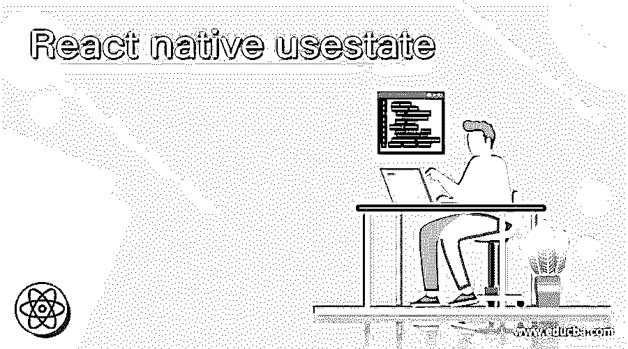
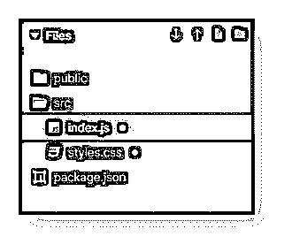
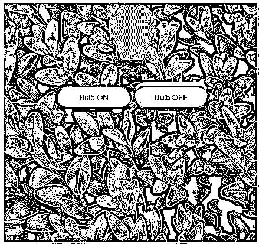
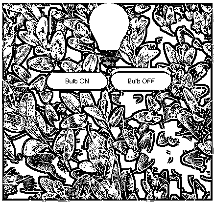
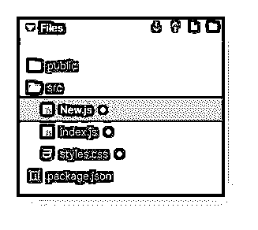
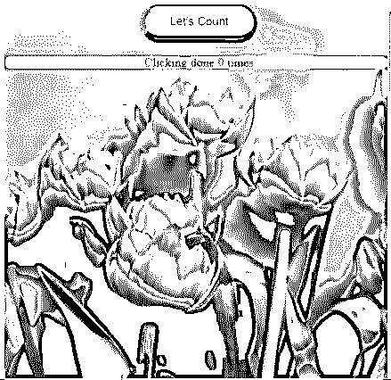
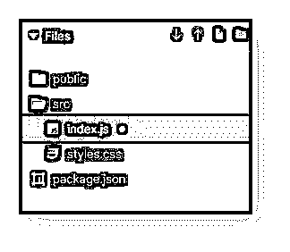

# 反应本机使用状态

> 原文：<https://www.educba.com/react-native-usestate/>

## React 本机使用状态简介

对于功能组件中的状态变量，使用 usestate。我们可以在函数中传递初始状态，函数可以返回一个变量以及当前状态的值和另一个用于更新该值的函数。Usestate 在 React Native 中用于将组件的状态更改为不同的状态。在制作允许用户改变函数状态的应用程序时，这个概念非常有用。本文用不同的例子解释了使用状态的概念，有助于读者理解这一概念。

**语法:**

<small>网页开发、编程语言、软件测试&其他</small>

`import React
, { useState } from 'react'
……
function New() {
const [count
, setCount] = useState(0)
……………
}`

### 在 React Native 中使用 useState 并举例说明

下面举几个例子

#### 示例#1

下面，useState 允许我们在函数组件中有状态变量。我们已经将初始状态传递给函数，当按下“灯泡开”按钮时，返回一个具有当前状态值的变量，并返回另一个函数来更新该值。

用于正确执行代码的文件有

**【I】index . js**

`import React
, { useState } from "react";
import ReactDOM from "react-dom";
import "./styles.css";
const rootElement = document.getElementById("root");
function LightbulbSvg(props) {
return (
<svg width="100px"
height="150px"
viewBox="0 0 56 90"
version="1.1">
<defs />
<g
id="Page-1"
stroke="none"
stroke-width="1"
fill="none"
fill-rule="evenodd"
>
<g id="noun_bulb_1912567"
fill="#5c0404"
fill-rule="nonzero">
<path
d="M41.521
,78.592 C41.521
,77.192 40.386
,76.057 38.986
,76.057 L17.015
,76.057 C15.615
,76.057 14.48
,77.192 14.48
,78.592 C14.48
,79.993 15.615
,81.128 17.015
,81.128 L38.986
,81.128 C40.386
,81.127 41.521
,79.993 41.521
,78.592 Z"
id="Shape"
/>
<path
d="M38.985
,68.873 L17.015
,68.873 C15.615
,68.873 14.48
,70.009 14.48
,71.409 C14.48
,72.809 15.615
,73.944 17.015
,73.944 L38.986
,73.944 C40.386
,73.944 41.521
,72.809 41.521
,71.409 C41.521
,70.009 40.386
,68.873 38.985
,68.873 Z"
id="Shape"
/>
<path
d="M16.857
,66.322 L39.142
,66.322 C40.541
,66.322 41.784
,65.19 42.04
,63.814 C44.63
,49.959 55.886
,41.575 55.886
,27.887 C55.887
,12.485 43.401
,0 28
,0 C12.599
,0 0.113
,12.485 0.113
,27.887 C0.113
,41.575 11.369
,49.958 13.959
,63.814 C14.216
,65.19 15.458
,66.322 16.857
,66.322 Z"
id="Shape"
fill={props.fillColor}
/>
<path
d="M18.282
,83.24 C17.114
,83.24 16.793
,83.952 17.559
,84.83 L21.806
,89.682 C21.961
,89.858 22.273
,90 22.508
,90 L33.492
,90 C33.726
,90 34.039
,89.858 34.193
,89.682 L38.44
,84.83 C39.207
,83.952 38.885
,83.24 37.717
,83.24 L18.282
,83.24 Z"
id="Shape"
/>
</g>
</g>
</svg>
);
}
function Bulb() {
const setOn = () => setLight(1);
let [light
, setLight] = useState(0);
let fillColor = light === 1 ? "#f0db51" : "#055d63";
const setOff = () => setLight(0);
return (

<LightbulbSvg
fillColor={fillColor} />

<button
onClick={setOn}
style={{
color: '#e30b1d'
, height: '50px'
, width: '150px'
, backgroundColor: '#f5ee67'
, borderRadius: '50px'
, borderRightWidth: '5px'
, borderRightColor: '#31cc43'
, borderLeftWidth: '5px'
, borderLeftColor: '#0c0c70'
, borderBottomWidth: '10px'
, borderTopColor: '#ad1599'
, borderBottomColor: '#3e700c'
, fontSize: '15px'
}}
>
Bulb ON</button>
<button
onClick={setOff}
style={{
color: '#991450'
, height: '50px'
, width: '150px'
, backgroundColor: '#8ef73e'
, borderRadius: '50px'
, borderRightWidth: '5px'
, borderRightColor: '#b30b1b'
, borderLeftWidth: '5px'
, borderLeftColor: '#0b0ebd'
, borderTopWidth: '10px'
, borderTopColor: '#e3431b'
, borderBottomColor: '#22c0f5'
, fontSize: '15px'
}}
>
Bulb OFF
</button>

);
}
ReactDOM.render(<Bulb />, rootElement);`

**【ii】styles . CSS**

`.App {
font-family: 'Times New Roman'
, Times
, serif;
text-align: center;
}`

**输出:**

*   **关于代码执行—**

*   **点击“灯泡开启”按钮—**

#### 实施例 2

下面的示例说明了在单击“让我们计数”按钮时使用 useState 来更新计数器的值。

用于正确执行代码的文件有

**【I】new . js**

`import React
, { useState } from 'react'
export default New
function New() {
const [count
, setCount] = useState(0)
return (

<button
onClick={() => setCount(count + 1)}
style={{
color: '#530ead'
, height: '50px'
, width: '150px'
, backgroundColor: '#fa9248'
, borderRadius: '50px'
, borderRightWidth: '5px'
, borderRightColor: '#31cc43'
, borderLeftWidth: '5px'
, borderLeftColor: '#24c4c9'
, borderBottomWidth: '10px'
, borderTopColor: '#0609c7'
, borderBottomColor: '#d916d9'
, fontSize: '15px'
}}
>Let's Count</button>

Clicking done {count} times

)
}`

**【ii】index . js**

`import React from 'react'
import ReactDOM from 'react-dom'
import New from './New'
function Application() {
return (

<New />

)
}
const rootElement = document.getElementById('root')
ReactDOM.render(
<Application />
, rootElement)`

**【iii】styles . CSS**

`.App {
font-family: 'Times New Roman'
, Times
, serif;
text-align: center;
}`

**输出:**

*   **关于代码执行—**

*   **点击“让我们数数”按钮—**

#### 实施例 3

以下示例说明了在基于 React Native 的表单应用程序中使用 useState 的方法。

用于正确执行代码的文件有:

**【I】index . js**

`import React
, { useState } from "react";
import ReactDOM from "react-dom";
import "./styles.css";
function SimpleForm(props) {
const [Course
, setCourse] = useState(props.Course);
const [Name
, setName] = useState(props.Name);
const [ContactNo
, setContactNo] = useState(props.ContactNo);
return (
<form style={{
backgroundImage: `url("https://images.pexels.com/photos/2896668/pexels-photo-2896668.jpeg?auto=compress&cs=tinysrgb&dpr=1&w=500")`
, height:'480px'
, width: '500px'
, color: '#c70c3e'
, alignItems: 'center'
, textAlign: 'center'
}}>

<label style={{
backgroundColor: '#55d0f2'
, color: '#530ead'
, height: '50px'
, width: '150px'
, borderRadius: '50px'
, borderRightWidth: '5px'
, borderRightColor: '#31cc43'
, borderLeftWidth: '5px'
, borderLeftColor: '#24c4c9'
, borderBottomWidth: '10px'
, borderTopColor: '#0609c7'
, borderBottomColor: '#d916d9'
, fontSize: '15px'
, alignItems: 'center'
, textAlign: 'center'
}}>
Your Name:
<input
type="text"
value={Name}
onChange={event => setName(event.target.value)}
style={{
backgroundColor: '#ffbb73'
, color: '#530ead'
, height: '15px'
, width: '150px'
, borderRadius: '50px'
, fontSize: '15px'
, alignItems: 'center'
, textAlign: 'center'
}}
/>
</label>
 
<label style={{
backgroundColor: '#f5f55d'
, color: '#530ead'
, height: '50px'
, width: '150px'
, borderRadius: '50px'
, borderRightWidth: '5px'
, borderRightColor: '#31cc43'
, borderLeftWidth: '5px'
, borderLeftColor: '#24c4c9'
, borderBottomWidth: '10px'
, borderTopColor: '#0609c7'
, borderBottomColor: '#d916d9'
, fontSize: '15px'
}}>
Course Choice:
<input
type="text"
style={{
backgroundColor: '#e32255'
, color: '#530ead'
, height: '15px'
, width: '130px'
, borderRadius: '50px'
, fontSize: '15px'
, alignItems: 'center'
, textAlign: 'center'
}}
value={Course}
onChange={event => setCourse(event.target.value)}
/>
</label>
 
<label style={{
backgroundColor: '#9df241'
, color: '#530ead'
, height: '50px'
, width: '130px'
, borderRadius: '50px'
, borderRightWidth: '5px'
, borderRightColor: '#31cc43'
, borderLeftWidth: '5px'
, borderLeftColor: '#24c4c9'
, borderBottomWidth: '10px'
, borderTopColor: '#0609c7'
, borderBottomColor: '#d916d9'
, fontSize: '15px'
}}>
Contact No.:
<input
type="number"
style={{
backgroundColor: '#46f26c'
, color: '#530ead'
, height: '15px'
, width: '150px'
, borderRadius: '50px'
, fontSize: '15px'
, alignItems: 'center'
, textAlign: 'center'
}}
value={ContactNo}
onChange={event => ContactNo(event.target.value)}
/>
</label>
 

<input
type="submit"
style={{
backgroundColor: '#c367f5'
, color: '#530ead'
, height: '50px'
, width: '150px'
, borderRadius: '50px'
, borderRightWidth: '5px'
, borderRightColor: '#31cc43'
, borderLeftWidth: '5px'
, borderLeftColor: '#24c4c9'
, borderBottomWidth: '10px'
, borderTopColor: '#0609c7'
, borderBottomColor: '#d916d9'
, fontSize: '15px'
}}
value="Proceed" />

<a href="https://www.educba.com/"
style={{
backgroundColor: '#e3cc4d'
, color: '#040ac7'}}>Click to Visit Us</a>
</form>
);
}
const rootElement = document.getElementById("root");
ReactDOM.render(
<>
<SimpleForm
Name="Rahul Dubey"
Course="React Native"
ContactNo={9876543210} />
 
</>,
rootElement
);`

**【ii】styles . CSS**

`.App {
font-family: sans-serif;
text-align: center;
}`

**输出:**

### 结论

在以上文章的基础上，我们可以理解 React Native 中的 usestate 的概念。本文解释了如何使用 usestate 来改变不同组件的状态。上面解释的例子将有助于读者理解根据不同应用的使用状态的实现。

### 推荐文章

这是一个反应本机使用状态的指南。在这里，我们通过例子讨论如何使用 usestate 来改变不同组件的状态。您也可以看看以下文章，了解更多信息–

1.  [反应原生标签栏](https://www.educba.com/react-native-tab-bar/)
2.  [反应原生模态](https://www.educba.com/react-native-modal/)
3.  [React component will update()](https://www.educba.com/react-componentwillupdate/)
4.  [反应误差边界](https://www.educba.com/react-error-boundaries/)

