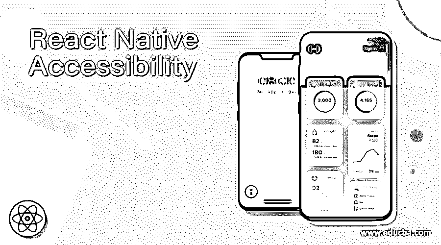
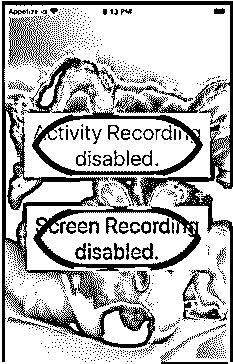
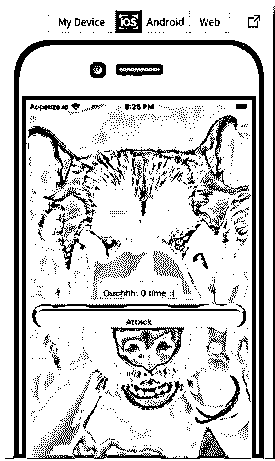
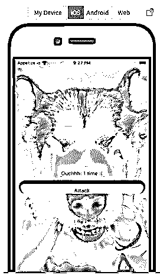
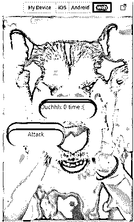
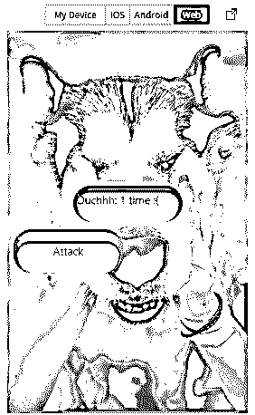

# 反应本机可访问性

> 原文：<https://www.educba.com/react-native-accessibility/>

## React 本机可访问性简介

可访问性意味着能够访问某些东西。许多用户无法轻松访问不同的网站、应用程序或手机。因此，可访问性选项通过提供屏幕阅读器、语音增强、导航器等等来帮助他们。网页可访问性是一种任何人都可以使用的网站的创建。包括 Android 和 iOS 在内的两大平台都有自己的一套辅助功能选项，比如 iOS 中的画外音和 Android 中的对讲。React native 还提供了一组补充的辅助功能选项，使每个人都可以使用该应用程序。为了更好地理解，本文将通过不同的例子来解释可访问性的使用。

**React 本机可访问性语法:**

<small>网页开发、编程语言、软件测试&其他</small>

*   **可访问**

`<View accessible={true}>
<Text
>Heyoo<
/Text>
</View>`

*   **可访问标签&可访问标签**

`<TouchableOpacity
accessible={
true}
accessibilityLabel="Press Me!"
accessibilityHint="The previous screen is navigated"
onPress={
onPress}>`

### 使用示例反应本机可访问性

#### 示例#1

下面，accessibility label 属性用于我们的 Touchable 上的自定义字符串。TouchableOpacity 元素上的可访问性标签默认为“单击我！”，它将窗口导航到以前使用的窗口。在 iOS 平台中，如果用户在设备的 VoiceOver 设置中启用了提示，那么 VoiceOver 将在标签后读取提示。当用户不能理解可访问性标签的结果时，可访问性提示帮助用户理解由于他们在可访问性元素上执行某个动作而将会发生什么。

**【我】App.js**

`import React
, { useState
, useEffect } from "react";
import { View
, Text
, StyleSheet
, TouchableOpacity
, ImageBackground
, Alert } from "react-native";
export default function App() {
return (
<ImageBackground
source={
{
uri:
'https://images.pexels.com/photos/4453074/pexels-photo-4453074.jpeg?auto=compress&cs=tinysrgb&dpr=1&w=500',
}
}
style={
{
flex: 1
}
}
>
<View>
<TouchableOpacity
accessible={true}
accessibilityLabel="Lets go in past"
accessibilityHint="The previous screen is navigated"
onPress={() => {}}>
<View
style={{
color: '#991450'
, height: '180px'
, width: '200px'
, backgroundColor: '#8ef73e'
, textAlign: 'center'
, alignItems: 'center'
}
}
accessibilityRole={'button'}>
<Text style={
{fontSize: 36
, marginBottom: 48
, color: '#faf569'
, backgroundColor: '#54f0cb'
, alignItems: 'center'
, borderWidth: 10
, textAlign: 'center'
,borderRadius: 100
, borderColor: '#d938f5'
, justifyContent: 'center'
}
}>
Lets Go Back in Past
</Text>
</View>
</TouchableOpacity>
</View>
</ImageBackground>
);
}`

**输出:**

#### 实施例 2

下面，应用程序将通过 useAccessibilityInfo 使用用户的可访问性信息，并且将执行某些动作来记录屏幕，并且还记录由于用户在应用程序的设置中授予或启用的可访问性而导致的用户活动。

**【我】App.js**

`import React
, { useState
, useEffect } from "react";
import { useAccessibilityInfo } from '@react-native-community/hooks'
import { View
, Text
, StyleSheet
, TouchableOpacity
, ImageBackground} from "react-native";
const styles = StyleSheet.create({
container: {
flex: 1,
alignItems: "center"
, justifyContent: "center"
},
});
export default function App() {
const {
reduceMotionEnabled
, screenReaderEnabled
} = useAccessibilityInfo();
return (
<ImageBackground
source={
{
uri:
'https://images.pexels.com/photos/4681107/pexels-photo-4681107.jpeg?auto=compress&cs=tinysrgb&dpr=1&w=500',
}
}
style={
{
flex: 1
}
}
>
<View style={styles.container}>
<Text style={{fontSize: 36
, marginBottom: 48
, color: '#2976e3'
, backgroundColor: '#faf569'
, alignItems: 'center'
, borderWidth: 10
, textAlign: 'center'
,borderRadius: 100
, borderColor: '#d40820'
, justifyContent: 'center'
}
}>
Activity Recording {reduceMotionEnabled ? "enabled" : "disabled"}.
</Text>
<Text style={{fontSize: 36
, marginBottom: 48
, color: '#9913ba'
, backgroundColor: '#bdf03c'
, alignItems: 'center'
, borderWidth: 10
, textAlign: 'center'
,borderRadius: 100
, borderColor: '#0d8c7f'
, justifyContent: 'center'
}}>
Screen Recording {screenReaderEnabled ? "enabled" : "disabled"}.
</Text>
</View>
</ImageBackground>
);
}`

**输出:**

#### 实施例 3

下面，accessibilityActions 属性包含一个操作对象列表，每个操作对象包含名称、类型和必填字段。动作请求通过 onAccessibilityAction 函数处理。使用 onAccessibilityAction 函数执行剪切、复制和粘贴内容的几个自定义操作。

**【我】App.js**

`import React
, { useState } from "react";
import { StyleSheet
, Text
, TouchableOpacity
, View
, ImageBackground
, Alert } from "react-native";
const Application = () => {
const onPress = () =>
setCount(
prevCount => prevCount + 1);
const [count
, setCount] = useState(0);
return (
<ImageBackground
source={
{
uri:
'https://images.pexels.com/photos/3663082/pexels-photo-3663082.jpeg?auto=compress&cs=tinysrgb&dpr=1&w=500',
}
}
style={
{
flex: 1
}
}
>
<View style={{
flex: 1,
justifyContent: "center",
paddingHorizontal: 10
}}>
<View style={{
alignItems: "center",
padding: 10,
}}>
<Text style={{
color: '#991450'
, height: '50px'
, width: '150px'
, backgroundColor: '#8ef73e'
, borderRadius: '50px'
, borderRightWidth: '5px'
, borderRightColor: '#b30b1b'
, borderLeftWidth: '5px'
, borderLeftColor: '#0b0ebd'
, borderTopWidth: '10px'
, borderTopColor: '#e3431b'
, borderBottomColor: '#22c0f5'
, fontSize: '15px'
}}
accessibilityLiveRegion="polite"
>
Ouchhh: {count} time :(
</Text>
</View>
<TouchableOpacity
style={{
color: '#991450'
, height: '50px'
, width: '150px'
, backgroundColor: '#8ef73e'
, borderRadius: '50px'
, borderRightWidth: '5px'
, borderRightColor: '#b30b1b'
, borderLeftWidth: '5px'
, borderLeftColor: '#0b0ebd'
, borderTopWidth: '10px'
, borderTopColor: '#e3431b'
, borderBottomColor: '#22c0f5'
, fontSize: '15px'
}}
onPress={onPress}
accessible={true}
accessibilityLabel="Lets go in past"
accessibilityHint="The previous screen is navigated"
>
<View
style={{
textAlign: 'center'
, alignItems: 'center'
}
}
accessible={true}
accessibilityActions={[
{
name: 'cuttingg'
, label: 'cuttingg'
},
{
name: 'copyingg'
, label: 'copyingg'
},
{
name: 'pastingg'
, label: 'pastingg'
}
]}
onAccessibilityAction={
(event) => {
switch (
event.nativeEvent.actionName) {
case 'cutting':
Alert.alert(
'Buzz'
, 'successfulll actionn of cuttingg');
break;
case 'copying':
Alert.alert(
'Buzzz'
, 'successfulll actionn of coypingg');
break;
case 'pasting':
Alert.alert(
'Buzz'
, 'successfulll actionn of pastingg');
break;
}
}}
accessibilityRole={'button'}>
<Text style={{
color: '#991450'
, height: '50px'
, width: '150px'
, backgroundColor: '#8ef73e'
, borderRadius: '50px'
, borderRightWidth: '5px'
, borderRightColor: '#b30b1b'
, borderLeftWidth: '5px'
, borderLeftColor: '#0b0ebd'
, borderTopWidth: '10px'
, borderTopColor: '#e3431b'
, borderBottomColor: '#22c0f5'
, fontSize: '15px'
}}
>Attack</Text>
</View>
</TouchableOpacity>
</View>
</ImageBackground>
);
};
export default Application;`

**输出:**

*   **在 iOS 平台上执行代码**

*   **在 iOS 平台点击“攻击”时**

*   **关于 Web 平台上的代码执行**

*   **点击网络平台**上的“攻击”

### 结论

在上述文章的基础上，我们可以理解 React 本机可访问性的概念。本文解释了不同的例子，以便根据特定的需求更好地理解和实现可访问性。这篇文章将帮助初学者，他们正在探索反应本地环境。

### 推荐文章

这是一个反应本机可访问性的指南。在这里，我们分别讨论简介、React 本机可访问性工作示例和代码实现。您也可以看看以下文章，了解更多信息–

1.  [反应引导](https://www.educba.com/react-bootstrap/)
2.  [反应原生 SVG](https://www.educba.com/react-native-svg/)
3.  [反应原生模态](https://www.educba.com/react-native-modal/)
4.  [反应原生标签栏](https://www.educba.com/react-native-tab-bar/)

