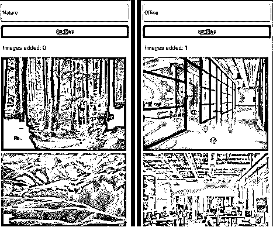
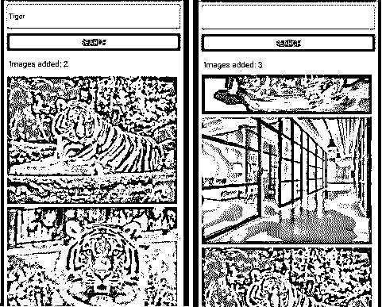

# MobX 反应原生

> 原文：<https://www.educba.com/mobx-react-native/>

## MobX React Native 简介

对于任何 React 应用程序，状态管理都是一个重要的方面。React 是一个 UI 库，所以我们需要状态管理来处理应用程序的状态。有时，状态管理很成问题，因为开发一个具有不一致状态的 React 应用程序很容易，而且很难处理。在本文中，我们将把 MobX 理解为 React 本机应用程序的状态管理解决方案。MobX 作为状态管理库与任何 JavaScript 框架一起使用。React 和 MobX 在一起正确使用的时候是相当强大的。React Native 使用 MobX 的存储和更新应用程序状态的机制来呈现其组件。MobX 的思想是检查最小状态，派生它，并且从不将状态改变成更多的状态。

### MobX 的概念

MobX 有下面列出的三个概念:

<small>网页开发、编程语言、软件测试&其他</small>

1.  看得见的
2.  行动
3.  反应

#### 1.看得见的

可观察性保持了应用程序的核心状态。它用于创建一个对象，该对象可以执行用户可以做出反应的新更改。这个想法是让一个物体能够发出新的变化，观察者可以对这些变化做出反应。这可以使用@observable 装饰器来完成。

下面的例子中，我们有一个名为 counter 的变量，它会随时间而变化。

`import { observable } from
"mobx", class Store {
@observable counter = 0;
}
export default new Store();`

#### 2.计算可观测量

由先前定义的可观察值产生的值称为计算值。MobX 不允许创建更多的状态。让我们举一个例子，我们的计数器变量保存航班延误的分钟数。现在，我们将添加一个从可观测计数器中导出的计算延迟消息。

`import { observable, computed } from
"mobx", class Store {
@observable counter = 0;
@computed get delayMessage = () => {
return 'The flight is delayed by' + this.count;
};
}
export default new Store();`

上面提到的@computed 是一个函数，每当计数器的值改变时，它就自动改变延迟的消息。

#### 3.行动

动作是修改状态的功能。MobX 支持单向数据流，这意味着每次动作状态改变时，它都会更新与状态相关的所有视图。我们将添加一个动作，每当延迟增加时，该动作根据计数器变量进行更新。

`Store {
import { observable
, action
, computed } from "mobx";
class Store {
@observable counter = 0;
@computed get delayMessage = () => {
return 'The flight is delayed by' + this.count;
};
@action
updateDelay = delay => { this.counter = delay;
};
}
export default new Store();`

### 例子

我们将开发一个应用程序，从 Unsplash 获取图像，并显示给用户。我们的应用程序将使用 Unsplash API 来获取图像。[API 可以在这里生成。](https://unsplash.com/developers)

**第一步:**

我们将搜索随机图像，并将保存结果。然后将允许用户将图像添加到收藏夹。

`import { action, observable ,decorate } from "mobx";
class Store {
text = '';
updateText = (text) => { this.text = text;
}
data = null; searchImages = () => {
fetch(`https://api.unsplash.com/search/photos?client_id=${API_KEY}&page=1&query=${this.text}&o rientation=landscape`)
.then(response => response.json())
.then(data => this.setData(data));
};
setData = (data) => { this.data = data;
};
}
decorate(Store, { text: observable, updateText: action, data: observable, searchImage: action, setData: action,
});
export default new Store();`

**第二步:**

我们将创建一个组件 PictureList.js，它将呈现图像列表。它还会显示添加到收藏夹中的图片。

`import React from "react";
import { TextInput, Button, FlatList, View } from 'react-native'; import { inject, observer } from "mobx-react";
function PictureList(props) {
const { text, updateText, data, searchImages } = props.store; return (
<>
<TextInput style={styles.input} value={text} onChangeText={updateText}
/>
<Button title="Search"
style={styles.button}
onPress={searchImages}
/>
/>
<FlatList data={data.results}
keyExtractor={(item) => item.id} renderItem={({ item }) => (
<ImageView
source={{ uri: item.urls.small }} onPress={() => {}}
/>
)}
/>
</>
);
}
export default inject("store")(observer(PictureList));`

**第三步:**

`import { action ,decorate, observable } from "mobx"; class Store {
text = '';
updateText = (text) => {...}; data = null;
searchImages = () => {...};
setData = (data) => {...}; favorites = [];
addToFavorite = (image) => { this.favorites.push(image); this.data = null;
this.text = '';
};
}
decorate(Store, { text: observable, updateText: action, data: observable, searchImage: action, setData: action,
favorites: observable, addToFavorite: action,
});
export default new Store();`

我们将为新添加的观察项和操作更新视图。先前搜索的图片将被删除。

`const { favorite, addToFavorite} = this.props.store return (
<>
{data?
<FlatList style={styles.container}
data={data.results}
keyExtractor={(item) =>
item.id} renderItem={({ item })
=> (
<ImageView
source={{ uri: item.urls.small }}
onPress={() => addToFavorite(item.urls.small)}
/>
)}
/> :
<FlatList
style={styles.container}
data={favorites}
keyExtractor={(item, index) =>
index.toString()} renderItem={({ item }) => (
<ImageView
source={{ uri: item }} // render favorite images
/>
)}
/>
}
</>
);
import { computed ,decorate, action, observable } from
"mobx"; class Store {
get getFavoriteCount() {
return
this.favorites.length;
}
}
decorate(Store, { getFavoriteCount: computed,
});
export default new Store();`

`const { getFavoriteCount } =
this.props.store; return (
<Text style={styles.count}>
Images added:
{getFavoriteCount}
</Text>
data={data.results}
keyExtractor={(item) => item.id} renderItem={({ item }) => (
<ImageView
source={{ uri: item.urls.small }}
onPress={() => addToFavorite(item.urls.small)}
/>
)}
/> :
<FlatList style={styles.container} data={favorites}
keyExtractor={(item, index) => index.toString()} renderItem={({ item }) => (
<ImageView
source={{ uri: item }} // render favorite images
/>
)}
/>
}
</>
);
import { computed ,decorate, action, observable } from "mobx"; class Store {
get getFavoriteCount() { return this.favorites.length;
}
}
decorate(Store, { getFavoriteCount: computed,
});
export default new Store();`

`const { getFavoriteCount } = this.props.store; return (
<Text style={styles.count}> Images added: {getFavoriteCount}
</Text>>
);`

最后，我们将向根组件提供存储。

`import React from 'react';
import PictureList from './src/container/PictureList'; import { Provider } from 'mobx-react';
import store from './src/store'; const App = () => {
return (
<Provider store={store}>
<PictureList />
</Provider>
);
};
export default App;`

**输出:**

### 结论–MobX 反应自然

在本文中，我们了解了状态管理对于任何应用程序是多么必要。我们明白了 MobX 和 React 在一起使用时是多么强大。MobX 使状态管理变得简单而省事。在这篇文章中，我们了解了可观测量、计算可观测量、行动和反应。最后，我们看了一个例子，在这个例子中，我们从 Unsplash 获取不同的图片，管理应用程序的状态，并理解用户如何将图片添加到收藏夹，我们可以对它进行计数。我希望这篇文章能够澄清一些关于 MobX 的概念。

### 推荐文章

这是一本 MobX React Native 的指南。在这里，我们讨论 MobX React Native 的介绍以及一些例子。您也可以看看以下文章，了解更多信息–

1.  [Mobx vs Redux](https://www.educba.com/mobx-vs-redux/)
2.  [反应原生图像](https://www.educba.com/react-native-image/)
3.  [反应自然状态](https://www.educba.com/react-native-state/)
4.  [反应原生架构](https://www.educba.com/react-native-architecture/)