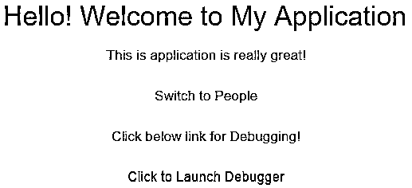
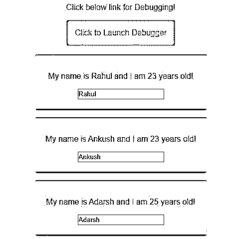

# 反应本机调试器

> 原文：<https://www.educba.com/react-native-debugger/>

## React 本机调试器简介

每个人都知道调试是应用程序开发中最重要的部分之一。大多数开发人员发现调试应用程序既困难又耗时，因此 React Native Debugger 工具应运而生。它有添加了 Redux 调试器的 Chrome 开发工具。这是一个桌面应用程序，可用于 Mac OS、Linux 和 Windows。与其他开发人员工具不同，它甚至不需要设置就可以工作。在本文中，我们将通过一些例子来了解它是如何工作的，以及如何在现实生活中执行它。

### 句法

下面是语法:

<small>网页开发、编程语言、软件测试&其他</small>

`Debugger.logAction({ label: 'My event',
type: 'NETWORK_REQUEST',
logType: 'SUCCESS',
data: myCustomData <-- Supported types: String, Array, Object
});`

### React 本机调试器如何工作？

带调试器的应用程序:

**src 文件夹内的组件:**

*   组件文件夹
*   容器文件夹
*   半铸钢ˌ钢性铸铁(Cast Semi-Steel)
*   射流研究…
*   射流研究…
*   半铸钢ˌ钢性铸铁(Cast Semi-Steel)

**组件文件夹内的组件:**

*   驾驶舱文件夹
*   错误边界文件夹

**驾驶舱文件夹内的人员文件夹组件:**

*   半铸钢ˌ钢性铸铁(Cast Semi-Steel)
*   射流研究…

【ErrorBoundary 文件夹内的组件:

*   错误边界. js

**人物文件夹内的组件:**

*   个人文件夹
*   个人文件夹中的 js 组件:
*   半铸钢ˌ钢性铸铁(Cast Semi-Steel)
*   射流研究…

**容器文件夹内的组件**

*   半铸钢ˌ钢性铸铁(Cast Semi-Steel)
*   射流研究…
*   测试. js

**代码:**

`{
margin: 0;
padding: 0;
font-family: sans-serif;
}
import React from "react";
import ReactDOM from "react-dom"; import "./index.css";
import App from "./containers/App";
import registerServiceWorker from "./registerServiceWorker";
ReactDOM.render(<App />, document.getElementById("root")); registerServiceWorker();
const isLocalhost = Boolean( window.location.hostname === 'localhost' ||
window.location.hostname === '[::1]' ||
window.location.hostname.match(
/^127(?:\.(?:25[0-5]|2[0-4][0-9]|[01]?[0-9][0-9]?)){3}$/
)
);
export default function register() {
if (process.env.NODE_ENV === 'production' && 'serviceWorker' in navigator) {
const publicUrl = new URL(process.env.PUBLIC_URL, window.location); if (publicUrl.origin !== window.location.origin) {
return;
}
window.addEventListener('load', () => {
const swUrl = `${process.env.PUBLIC_URL}/service-worker.js`;
if (!isLocalhost) { registerValidSW(swUrl);
} else { checkValidServiceWorker(swUrl);
}
});
}
}
function registerValidSW(swUrl) { navigator.serviceWorker
.register(swUrl)
.then(registration => { registration.onupdatefound = () => {
const installingWorker = registration.installing; installingWorker.onstatechange = () => {
if (installingWorker.state === 'installed') {
if (navigator.serviceWorker.controller) {
console.log('New content is available; please refresh.');
} else {
console.log('Content is cached for offline use.');
}
}
};
};
})
.catch(error => {
console.error('Error during service worker registration:', error);
});
}
function checkValidServiceWorker(swUrl) { fetch(swUrl)
.then(response => { if (
response.status === 404 ||
response.headers.get('content-type').indexOf('javascript') === -1
) {
navigator.serviceWorker.ready.then(registration => { registration.unregister().then(() => {
window.location.reload();
});
});
} else { registerValidSW(swUrl);
}
})
.catch(() => { console.log(
'No internet connection found. App is running in offline mode.'
);
});
}
export function unregister() {
if ('serviceWorker' in navigator) { navigator.serviceWorker.ready.then(registration => {
registration.unregister();
});
}
}
.App {
font-family: sans-serif; text-align: center;
}
.bold {
font-weight: bold;
}
.red {
color:#f279b2;
}
.Cockpit button {
border: 1px solid #74ddf7; padding: 16px;
background-color: #d4f774; font: inherit;
color: #464a3c; cursor: pointer;
}
.Cockpit button:hover { background-color: #f7869e; color: #211f20;
}
.Cockpit button.Red { background-color: #e386f0;
}
import React from "react";
import classes from "./Cockpit.css";
const cockpit = props => {
const { people = [], clicked, showPeople } = props; const assignedClasses = [];
let btnClass = "";
if (showPeople) { btnClass = "Red";
}
if (people.length <= 2) {
assignedClasses.push("red");
}
if (people.length <= 1) { assignedClasses.push("bold");
}
return (

<h1>Hello! Welcome to My Application</h1>

This is application is really great!

<button onClick={clicked} className={btnClass}> Switch to People
</button>

Click below link for Debugging!

<button onClick={clicked} className={btnClass}> Click to Launch Debugger
</button>

);
};
export default cockpit;
import React, { Component } from "react";
class ErrorBoundary extends Component { state = {
hasError: false,
errorMessage: ""
};
componentDidCatch = (error, info) => { this.setState({
hasError: true, errorMessage: error
});
};
render() {
if (this.state.hasError) {
return <h1>{this.state.errorMessage}</h1>;
} else {
return this.props.children;
}
}
}
export default ErrorBoundary;
import React from "react";
import Person from "./Person/Person";
import ErrorBoundary from "../ErrorBoundary/ErrorBoundary"; const people = props =>
props.people.map((person, index) => { return (
<ErrorBoundary key={person.id}>
<Person
click={() => props.clicked(index)}
name={person.name} age={person.age}
changed={event => props.changed(event, person.id)}
/>
</ErrorBoundary>
);
});
export default people;
.Person {
width: 61%; margin: 17px auto;
border: 2px solid #d1dce8;
box-shadow: 0 3px 4px #7c8894; padding: 17px;
text-align: center;
}
import React from "react";
import "./Person.css";
const person = props => { return (

My name is {props.name} and I am {props.age} years old!

{props.children}
<input type="text" onChange={props.changed} value={props.name} />

);
};
export default person;
.App {
text-align: center;
}
import React, { Component } from "react"; import "./App.css";
import People from "../components/People/People"; import Cockpit from "../components/Cockpit/Cockpit";
class App extends Component { state = {
people: [
{ id: "asfa1"
, name: "Rahul"
, age: 23 },
{ id: "vasdf1"
, name: "Ankush"
, age: 23 },
{ id: "asdf11"
, name: "Adarsh"
, age: 25 }
],
otherState: "some other value", showPeople: false
};
nameChangedHandler = (event, id) => {
const personIndex = this.state.people.findIndex(p => { return p.id === id;
});
const person = {
...this.state.people[personIndex] };
person.name = event.target.value;
const people = [...this.state.people]; people[personIndex] = person;
this.setState({ people });
};
deletePersonHandler = personIndex => { const people = [...this.state.people]; people.splice(personIndex, 1); this.setState({ people });
};
togglePeopleHandler = () => {
const doesShow = this.state.showPeople;
this.setState({ showPeople: !doesShow });
};
render() {
const style = { backgroundColor: "#f1ff96", font: "inherit",
border: "2px #ed85d8", padding: "9px", cursor: "pointer"
};
let people = null;
if (this.state.showPeople) { people = (
<People people={this.state.people}
clicked={this.deletePersonHandler} changed={this.nameChangedHandler}
/>
);
}
return (

<Cockpit showPeople={this.state.showPeople} people={this.state.people} clicked={this.togglePeopleHandler}
/>
{people}

);
}
}
export default App;
import React from 'react';
import ReactDOM from 'react-dom'; import App from './App';
it('renders without crashing', () => {
const div = document.createElement('div'); ReactDOM.render(<App />, div);
});`

**输出:**

### 结论

在上述讨论的基础上，我们了解了什么是本机调试器，以及如何使用它来调试各种应用程序。上面提到的例子显示了它如何为一个特定的应用程序工作。

### 推荐文章

这是一个反应原生调试器的指南。在这里，我们讨论了引入适当的语法反应本机调试器，它是如何工作的各自的例子。您也可以浏览我们的其他相关文章，了解更多信息——

1.  [React Native 中的造型](https://www.educba.com/styling-in-react-native/)
2.  [反应原生旋转木马](https://www.educba.com/react-native-carousel/)
3.  [React 原生菜单](https://www.educba.com/react-native-menu/)
4.  [React 本地认证](https://www.educba.com/react-native-authentication/)