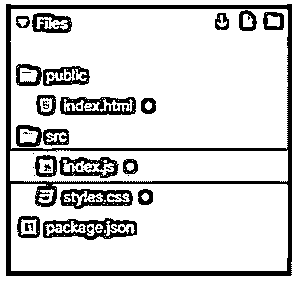
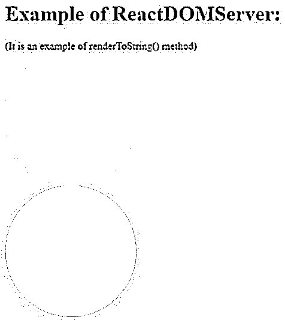
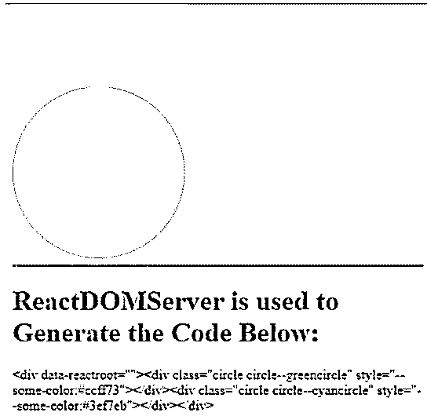
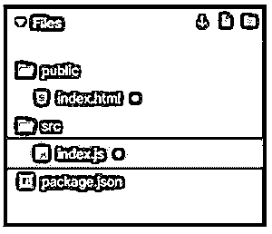
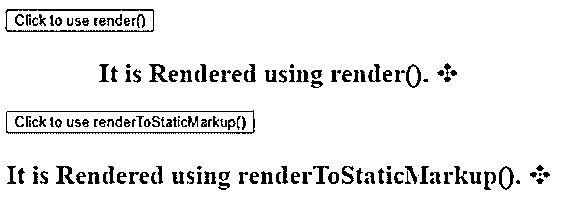

# ReactDOMServer

> 原文：<https://www.educba.com/reactdomserver/>

## ReactDOMServer 简介

服务器端渲染(SSR)是一项著名的技术，它将客户端单页应用程序渲染到服务器上，然后将之前渲染的完整页面发送到客户端。当客户端的 JavaScript 包接管时，SPA 正常运行。即使不使用 JavaScript 代码的爬虫也可以在使用服务器端渲染的应用程序的内容之间爬行。这有助于搜索引擎优化和将元数据传送到社交媒体平台上。ReactDOMServer 对象允许将组件呈现给静态标记。通常在节点服务器上使用 ReactDOMServer。

`import ReactDOMServer from 'react-dom/server';
var ReactDOMServer = require('react-dom/server');`

<small>网页开发、编程语言、软件测试&其他</small>

在浏览器和服务器上使用 ReactDOMServer:

浏览器中的**:**

`var React = require('react');
var ReactDOM = require('react-dom');
class Blog extends React.Component
{
render()
{
return 
EduCBA Trainings
;
}
}
ReactDOM.render(<Blog />, node);`

**在服务器上:**

`var React = require('react');
var ReactDOMServer = require('react-dom/server');
class Blog extends React.Component {
render() {
return 
EduCBA Trainings
;
}
}
ReactDOMServer.renderToString(<Blog />);`

浏览器和服务器使用以下方法:

*   renderToStaticMarkup()
*   renderToString()

有一些附加方法只能在服务器上使用，不能在浏览器环境中使用。这些方法依赖于只存在于服务器上的流。

*   renderToStaticNodeStream()
*   renderToNodeStream()

### Dom 服务器在 React 中的工作

下面给出了可以在浏览器和服务器上使用的 ReactDOMServer 的不同方法:

#### 1.renderToString()

`ReactDOMServer.renderToString(element)`

React 元素呈现为 HTML。React 返回一个字符串。renderToString()方法用于在服务器上生成 HTML，并发送标记以加快页面加载。它也有助于搜索引擎之间的网页抓取搜索引擎优化相关的工作。当我们在具有服务器渲染标记的节点上调用 ReactDOM.hydrate()方法时。React 将事件处理程序附加到它上面，这有助于在第一次页面加载时提高应用程序的性能。

#### 2.renderToStaticMarkup()

`ReactDOMServer.renderToStaticMarkup(element)`

这个方法就像 renderToString 一样，唯一的区别是没有创建 React 内部使用的额外 DOM 属性。当我们像使用静态页面生成器一样使用 React 时，这很有帮助。移除不需要的属性可以节省内存。当我们希望通过在客户端使用 React 来增强标记的交互性时，我们不应该使用 renderToStaticMarkup()方法。在这种情况下，renderToString()用于服务器，ReactDOM.hydrate()用于客户端。

### ReactDOMServer 的示例

以下是 ReactDOMServer 的示例:

#### 示例#1

renderToString()方法。

我们在 index.js 文件中做了 2 个类“circle circle-green circle”和“circle circle-cyan circle”。

`

`

这些类的内容样式是通过 styles.css 文件来处理的。ReactDOMServer 生成的代码也显示在输出中。

ReactDOM 是通过以下方式导入的:

`import ReactDOM from "react-dom";`

ReactDOMServer 是使用以下代码导入的:

`import ReactDOMServer from "react-dom/server";`

用于生成以下代码的文件:

**index.js**

`import React from "react";
import ReactDOM from "react-dom";
import ReactDOMServer from "react-dom/server";
import "./styles.css";
const Examples = () => {
return (

);
};
const Main = () => {
return (

<h1>Example of ReactDOMServer: </h1>

 (It is an example of renderToString() method)

<Examples />

<h1>ReactDOMServer is used to Generate the Code Below: </h1>
{ReactDOMServer.renderToString(<Examples />)}

);
};
ReactDOM.render(<Main />, document.getElementById("root"));`

**styles.css**

`:root {
--pad: 2px;
}
body {
padding: var(--pad);
}
.circle {
border-bottom-left-radius: 50%;
border-bottom-right-radius: 50%;
border-top-left-radius: 50%;
border-top-right-radius: 50%;
width: 201px;
height: 201px;
margin-bottom: var(--pad);
}
.circle--greencircle {
background-color: var(--someColor);
}
.circle--cyancircle {
background-color: var(--some-color);
}`

**输出:**

#### 实施例 2

renderToStaticMarkup()方法。

使用以下方式导入渲染:

`import { render } from "react-dom";`

ReactDOMServer 是使用以下代码导入的:

`import ReactDOMServer from "react-dom/server";`

输出内容的样式通过以下方式维护:

`const styles = {
fontFamily: "Times",
textAlign: "center"
};`

单击 button-1(即单击以使用 render())时出现的文本通过以下方式保持:

`document.getElementById("button-1").onclick = () => {
render(
<App message="It is Rendered using render()." />,
document.getElementById("root-1")
);
};`

点击按钮 2(即点击使用 renderToStaticMarkup())时出现的文本通过以下方式维护:

`document.getElementById("button-2").onclick = () => {
const element = ReactDOMServer.renderToStaticMarkup(
<App message="It is Rendered using renderToStaticMarkup()." />
);
document.getElementById("root-2").innerHTML = element;
};`

按钮上显示的内容通过以下方式保存在 index.html 文件中:

`<button id="button-1">Click to use render()</button>

<button id="button-2">Click to use renderToStaticMarkup()</button>

`

用于实现代码的文件:

**index.html**

`<!DOCTYPE html>
<html lang="en">
<head>
<meta charset="utf-8">
<meta name="viewport" content="width=device-width, initial-scale=1, shrink-to-fit=no">
<title>React Based App</title>
</head>
<body>
<noscript>
Enable JavaScript to run application.
</noscript>
<button id="button-1">Click to use render()</button>

<button id="button-2">Click to use renderToStaticMarkup()</button>

</body>
</html>`

**index.js**

`import React from "react";
import { render } from "react-dom";
import ReactDOMServer from "react-dom/server";
const styles = {
fontFamily: "Times",
textAlign: "center"
};
const App = props => (

<h2>
{props.message} {"\u2725"}
</h2>

);
document.getElementById("button-1").onclick = () => {
render(
<App message="It is Rendered using render()." />,
document.getElementById("root-1")
);
};
document.getElementById("button-2").onclick = () => {
const element = ReactDOMServer.renderToStaticMarkup(
<App message="It is Rendered using renderToStaticMarkup()." />
);
document.getElementById("root-2").innerHTML = element;
};`

**输出:**

**

** 

### 结论

在上述文章的基础上，我们看到了 ReactDOMServer 的概念以及如何针对不同的需求使用它。我们介绍了在 ReactDOMServer 上工作的方法，所描述的例子将有助于 ReactDOMServer 的应用。

### 推荐文章

这是 ReactDOMServer 的指南。在这里，我们讨论 ReactDOMServer 的介绍，以及 DOMServer 在 react 中的工作方式和例子。您也可以看看以下文章，了解更多信息–

1.  [React 本地认证](https://www.educba.com/react-native-authentication/)
2.  [React 路由器转换](https://www.educba.com/react-router-transition/)
3.  [反应原生导航](https://www.educba.com/react-native-navigation/)
4.  [React 组件库](https://www.educba.com/react-component-library/)

