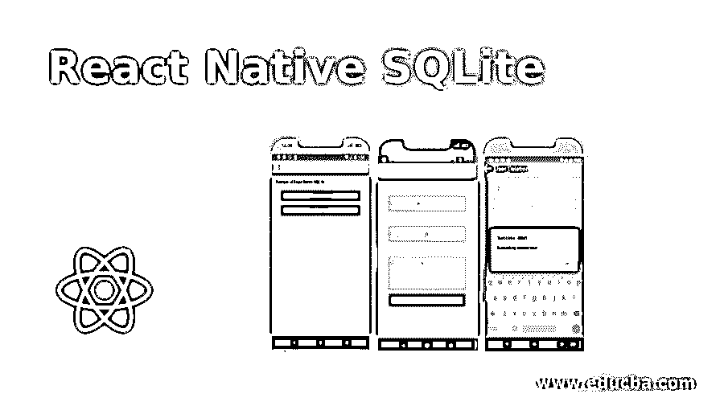
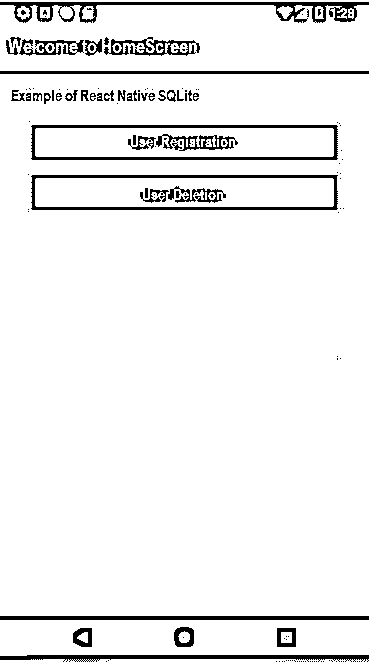
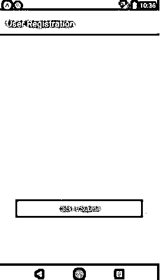

# React 本机 SQLite

> 原文：<https://www.educba.com/react-native-sqlite/>

## React 原生 SQLite 简介

SQLite 可以定义为一个 SQL 数据库，它是开源的，将数据存储到设备上的文本文件中。用户可以在 SQLite 数据库中执行所有创建、读取、更新和删除 SQL 事务。对于移动开发，SQLite 数据库非常重要。SQLite 数据库包含一个带有字段的表模式。保存到 SQLite 数据库表中的所有数据都保存为应用程序数据，并且会占用内存空间。随着保存到 SQLite 数据库的记录或数据的增加，应用程序数据也会增加。SQLite 数据库非常容易在 React-Native 中连接，因为其中有预先可用的库。

### 如何在 React-Native 中创建 SQLite 数据库？

对于 SQLite 数据库，我们使用了适用于 iOS 和 Android 的 SQLite3 原生插件。

<small>网页开发、编程语言、软件测试&其他</small>

#### 1.页面组件-文件夹

*   **自定义按钮. js**

`import React from 'react';
import { TouchableOpacity
, Text
, StyleSheet } from 'react-native';
const Mybutton = props => {
return (
<TouchableOpacity style={styles.button} onPress={props.customClick}>
<Text style={styles.text}>{props.title}</Text>
</TouchableOpacity>
);
};
const styles = StyleSheet.create({ button: {
alignItems: 'center',
backgroundColor: '#df36eb',
color: '#ffffff',
padding: 11,
marginTop: 15,
marginLeft: 36,
marginRight: 36,
},
text: {
color: '#ffffff',
},
});
export default Mybutton;`

*   **自定义文本. js**

`import React from 'react';
import { TouchableHighlight
, Text
, StyleSheet } from 'react-native';
const Mytext = props => {
return <Text style={styles.text}>{props.text}</Text>;
};
const styles = StyleSheet.create({ text: {
color: '#111825',
fontSize: 19,
marginTop: 15,
marginLeft: 36,
marginRight: 36,
},
});
export default Mytext;`

*   **Customtextinput.js** 的缩写形式

`import React from 'react';
import { View
, TextInput } from 'react-native';
const Mytextinput = props => {
return (
<View
style={{ marginLeft: 36,
marginRight: 36,
marginTop: 49,
borderColor: '#61fab8',
borderWidth: 1,
}}>
<TextInput
underlineColorAndroid="transparent"
placeholder={props.placeholder}
placeholderTextColor="#61fab8"
keyboardType={props.keyboardType}
onChangeText={props.onChangeText}
returnKeyType={props.returnKeyType}
numberOfLines={props.numberOfLines}
multiline={props.multiline}
onSubmitEditing={props.onSubmitEditing}
style={props.style}
blurOnSubmit={false}
value={props.value}
/>
</View>
);
};
export default Mytextinput;`

#### 2.显示器组件-文件夹

*   **DeleteUser.js**

`import React from 'react';
import { Button
, Text
, View
, Alert } from 'react-native';
import Mytextinput from './pages/Customtextinput'; import Mybutton from './pages/Custombutton';
import { openDatabase } from 'react-native-sqlite-storage'; var db = openDatabase({ name: 'UserDatabase.db' });
export default class UpdateUser extends React.Component { constructor(props) {
super(props); this.state = {
input_user_id: '',
};
}
deleteUser = () => { var that = this;
const { input_user_id } = this.state; db.transaction(tx => {
tx.executeSql(
'DELETE FROM  table_user where user_id=?', [input_user_id],
(tx, results) => {
console.log('Results', results.rowsAffected); if (results.rowsAffected > 0) {
Alert.alert( 'Success Alert',
'Successfully deleted User', [
{
text: 'Alright!',
onPress: () => that.props.navigation.navigate('HomeScreen'),
},
],
{ cancelable: false }
);
} else {
alert('Please mention a valid User Id');
}
}
);
});
};
render() {
return (
<View style={{ backgroundColor: '#ffffff', flex: 1 }}>
<Mytextinput
placeholder="Enter User Id"
onChangeText={input_user_id => this.setState({ input_user_id })}
style={{ padding:11 }}
/>
<Mybutton
title="Click to Delete User"
customClick={this.deleteUser.bind(this)}
/>
</View>
);
}
}`

*   **HomeScreen.js**

`import React from 'react';
import { View } from 'react-native';
import Mybutton from './pages/Custombutton'; import Mytext from './pages/Customtext';
import { openDatabase } from 'react-native-sqlite-storage'; var db = openDatabase({ name: 'UserDatabase.db' });
export default class HomeScreen extends React.Component { constructor(props) {
super(props); db.transaction(function(txn) {
txn.executeSql(
"SELECT name FROM sqlite_master WHERE type='table' AND name='table_user'",
[],
function(tx, res) {
console.log('item:', res.rows.length); if (res.rows.length == 0) {
txn.executeSql('DROP TABLE IF EXISTS table_user', []); txn.executeSql(
'CREATE TABLE IF NOT EXISTS table_user(user_id INTEGER PRIMARY KEY AUTOINCREMENT, user_name VARCHAR(20), user_contact INT(10), user_address VARCHAR(255))',
[] );
}
}
);
});
}
render() { return (
<View`

*   **RegisterUser.js**

`import React from 'react'; import { View
, ScrollView
, KeyboardAvoidingView
, Alert } from 'react-native';
import Mytextinput from './pages/Customtextinput'; import Mybutton from './pages/Custombutton';
import { openDatabase } from 'react-native-sqlite-storage';
var db = openDatabase({ name: 'UserDatabase.db' });
export default class RegisterUser extends React.Component {
constructor(props) { super(props); this.state = {
user_name: '', user_contact: '', user_address: '',
};
}
register_user = () => { var that = this;
const { user_name } = this.state; const { user_contact } = this.state; const { user_address } = this.state; if (user_name) {
if (user_contact) { if (user_address) {
db.transaction(function(tx) { tx.executeSql(
'INSERT INTO table_user (user_name, user_contact, user_address) VALUES (?,?,?)',
[user_name, user_contact, user_address], (tx, results) => {
console.log('Results', results.rowsAffected); if (results.rowsAffected > 0) {
Alert.alert( 'Success Alert',
'Your Registration is Successful', [
{
text: 'Alright!',
onPress: () =>
that.props.navigation.navigate('HomeScreen'),
},
],
{ cancelable: false }
);
} else {
alert('Registration has Failed');
}
}
);
});
} else {
alert('Please mention Address');
}
} else {
alert('Please mention Contact Number');
}
} else {
alert('Please mention Name');
}
};
render() { return (
<View style={{ backgroundColor: '#ffffff', flex: 1 }}>
<ScrollView keyboardShouldPersistTaps="handled">
<KeyboardAvoidingView behavior="padding"
style={{ flex: 1, justifyContent: 'space-between' }}>
<Mytextinput
placeholder="Enter Name here"
onChangeText={user_name => this.setState({ user_name })} style={{ padding:10 }}
/>
<Mytextinput
placeholder="Enter Contact No here"
onChangeText={user_contact => this.setState({ user_contact
})}
maxLength={10} keyboardType="numeric" style={{ padding:10 }}
/>
<Mytextinput
placeholder="Enter Address here"
onChangeText={user_address => this.setState({ user_address
})}
maxLength={225} numberOfLines={5} multiline={true}
style={{ textAlignVertical: 'top',padding:10 }}
/>
<Mybutton
title="Click to Submit" customClick={this.register_user.bind(this)}
/>
</KeyboardAvoidingView>
</ScrollView>
</View>
);
}
}`

#### 3.App.js

`import React from 'react';
import { createAppContainer } from 'react-navigation';
import { createStackNavigator} from 'react-navigation-stack';
import HomeScreen from './pages/HomeScreen'; import RegisterUser from './pages/RegisterUser'; import DeleteUser from './pages/DeleteUser';
const App = createStackNavigator({ HomeScreen: {
screen: HomeScreen, navigationOptions: {
title: 'Welcome to  HomeScreen', headerStyle: { backgroundColor: '#df36eb' }, headerTintColor: '#ffffff',
},
},
Register: {
screen: RegisterUser, navigationOptions: {
title: 'User Registration',
headerStyle: { backgroundColor: '#df36eb' }, headerTintColor: '#ffffff',
},
},
Delete: {
screen: DeleteUser, navigationOptions: {
title: 'User Deletion',
headerStyle: { backgroundColor: '#df36eb' }, headerTintColor: '#ffffff',
},
},
});
export default createAppContainer(App);`

**输出:**

图 1 显示主屏幕，图 2 显示用户注册屏幕，图 3 和图 4 是用户删除屏幕。

**图片 1 &图片 2**

**T2】**

 ****图片 3 &图片 4**

### 推荐文章

这是一个反应原生 SQLite 的指南。在这里，我们还讨论了简介和如何创建 SQLite 数据库，以及不同的示例和代码实现。您也可以看看以下文章，了解更多信息–

1.  [React 原生图表](https://www.educba.com/react-native-charts/)
2.  [React 原生抽屉导航](https://www.educba.com/react-native-drawer-navigation/)
3.  [React 原生库](https://www.educba.com/react-native-libraries/)
4.  [反应原生图像](https://www.educba.com/react-native-image/)
5.  [反应原生燃烧基](https://www.educba.com/react-native-firebase/)**