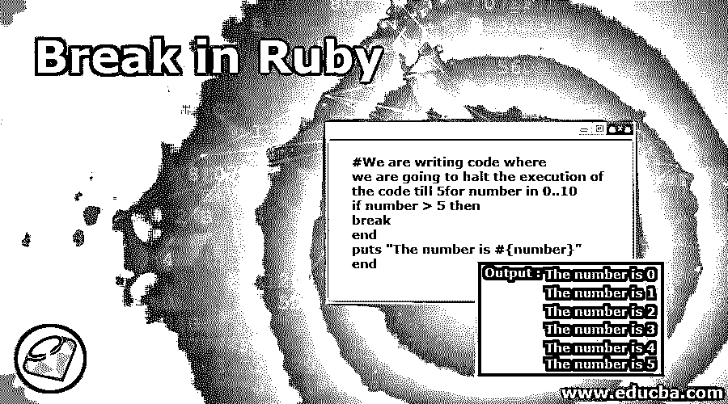
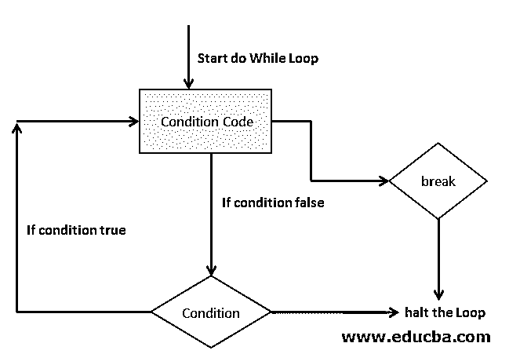
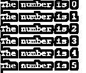

# 红宝石的突破

> 原文：<https://www.educba.com/break-in-ruby/>

## Ruby break 语句简介

我们在 Ruby 中使用过循环，我们知道循环在 Ruby 中非常有用，因为它们提供了一种方便的方式来多次执行同一段代码，但是如果我们想要停止执行并退出循环，会发生什么呢，所以在这种情况下，我们在 Ruby 中有一个非常有用的属性，它是 break， break 提供了一种在任何给定时间停止循环执行的方法，例如，如果您正在搜索任何数据，而一旦您获得了数据，进一步搜索就没有用了，因此借助 break，我们可以在获得所需的输出后退出循环。

**语法:**

<small>网页开发、编程语言、软件测试&其他</small>

下面是 Ruby 中 break 语句的语法，我们可以在下面的步骤中解释 Ruby break 的语法。

*   在我们要做的第一件事的例子中，我们使用了一个 while 循环和表达式，这里表达式是条件，并且在成功表达式(truee)输出时将执行代码块。
*   接下来我们有一个注释部分，在那里我们提到了我们的搜索或执行任何操作的逻辑。
*   一旦我们从代码中得到我们需要的输出，一次又一次地执行代码块是没有用的，所以我们有代码断点，它将退出循环。
*   从语法中我们可以理解，在任何时候，如果我们发现我们已经得到了输出，我们可以跳过下一条指令的执行。

`#We can consider any loop , i have taken an example of the while loop.
while expression
#write your code for searching your attribute from the each value
# Use the break once you get the value for which you're doing this search.
break
end
end`

### Ruby 中的 Break 语句是如何工作的？

在 break 语句的帮助下，我们将能够节省不必要的代码执行，并且我们将能够节省我们昂贵的资源和过程。让我们借助下面的流程图来理解 Ruby 中 break 的工作原理。

*   首先，它将执行代码块，因为它是一个 do while 循环。
*   下一次是条件块的执行，每次都会检查条件，如果条件再次成功，就会执行代码块。
*   这里有一种暂停执行的方法是条件块失败，另一种暂停执行的方法是使用 break 语句。
*   在下图中，我们可以看到，如果条件块失败或中断，那么只有循环停止。
*   我们以 do while 循环为例，但也可以用其他循环做同样的事情。
*   关于 break 的几个要点，因为 break 只对 while 和 for 循环有效，我们在使用它时会面临一些挑战。

**Note**: In case if we want to halt the execution of the loop (we do not want to execute the next block of statement ) in that case we also simply use the return in any loop, because return will work for any type of the loop.

请参见 Ruby 中 break 语句的流程图。

### Ruby 中 Break 语句的例子

以下是 Ruby 中的中断示例:

#### 示例#1

下面是我们打印数字的例子。这里我们一直印到 5 点。我们可以在下面的步骤中解释下面的代码。

*   这里我们运行一个 while 循环来检查数字，while 条件语句只检查数字是否在 0 到 10 之间。
*   如果该数字大于 10，循环将被停止。
*   但是这里我们的目标是只打印到 5 点，所以 break 在这里起着重要的作用。
*   这里我们使用了一个 if 条件，它检查将要打印的数字是否大于 5，如果数字大于 5，它将中断语句，循环将被中止。

请遵循以下示例:

**代码:**

`#We are writing code where we are going to halt the execution of the code till 5
for number in 0..10
if number > 5 then
break
end
puts "The number is #{number}"
end`

**输出:**

#### 实施例 2

在下面的例子中，我们选取了一些学生，并对他们运行循环，这是我们程序的目标。一旦我们找到用户“sujit ”,我们将运行命令 break，它将停止程序的完整执行。我们也可以在下面的步骤中解释下面的代码。

*   首先我们取了一组学生变量。
*   我们正在运行一个可以无限循环的循环，因为我们没有使用任何特定的条件，我们只是使用了 true，它永远不会改变，执行将继续。
*   最后，在代码块中，我们编写了一个带有 if 条件的检查，它将检查学生姓名是否为“sujit ”,如果匹配，将执行 break 语句，代码将停止执行，这意味着循环将暂停，并且不会发生剩余的学生打印。

请遵循以下示例:

**代码:**

`student = ['ajay','ranjan','vijay','sujit','akash'] i=0
while true do
puts student[i] i += 1
break if student[i] == 'sujit'
end`

**输出:**

#### 实施例 3

这里这段代码的目标是不断地将 3 加到一个从 0 开始的数中，我们希望只打印到 9，其总和应该小于 12。请遵循以下示例:

**代码:**

`number = 0
while true
number += 3
puts "The sum of the two number is #{number}"
if  number + 3 >= 12
break
end
end`

**输出:**

### 结论

从这些教程中，借助一些有用的例子，我们学习了 Ruby 中 break 语句的一些重要用途和基本概念，我们还学习了 break 与流程图的工作原理，我们还重点介绍了 break 在实际案例中的用法。

### 推荐文章

这是一个 Ruby 入门指南。在这里，我们讨论 Ruby break 语句及其语法的介绍，以及示例和代码实现。您也可以浏览我们推荐的其他文章，了解更多信息——

1.  [红宝石直到循环](https://www.educba.com/ruby-until-loop/)
2.  [Ruby if else？](https://www.educba.com/ruby-if-else/)
3.  [红宝石常数](https://www.educba.com/ruby-constants/)
4.  [Ruby Profiler](https://www.educba.com/ruby-profiler/)

