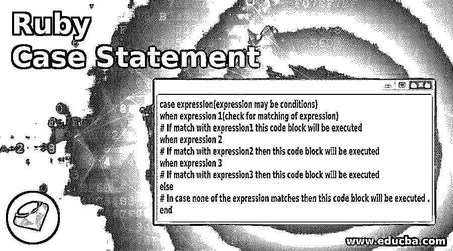

# Ruby Case 语句

> 原文：<https://www.educba.com/ruby-case-statement/>

## Ruby Case 语句简介

Ruby 中的 Case 语句是一种根据提供给 case 的值执行不同代码和表达式的方式，Ruby 中的 case 语句类似于其他编程语言中的基本 switch cases。在 Ruby 中的 switch 情况下，它有三个主要组成部分 case(它类似于一般概念中的 switch，它接受变量输入，同样它将由 when 使用)、when(这用于检查条件，它类似于任何基本编程语言的情况)、else(它用于没有条件匹配的情况，基本上它充当默认)。

**语法:**

<small>网页开发、编程语言、软件测试&其他</small>

*   这里的表达式可以是任何值，可以是任何字符串或数字，也可以是任何输出类似于(" a "，1==1 等)的表达式。
*   然后，在不同的 when 块中，它将继续检查表达式，只要符合条件，它就会进入代码块。
*   例如，如果表达式是“test”并且在三个 when 块中，在这种情况下是“final”、“test”和“test3”，那么它将与 when 块的“test”表达式相匹配，并且该块的代码将被执行。
*   最后，如果没有一个表达式与 when 表达式块匹配，那么它将转到 else 块。

`case expression(expression may be conditions)
when expression 1(check for matching of expression)
# If match with expression1 this code block will be executed
when expression 2
# If match with expression2 then this code block will be executed
when expression 3
# If match with expression3 then this code block will be executed
else
# In case none of the expression matches then this code block will be executed .
end`

### Ruby 中的 Case 语句是如何工作的？

下面给出了一个简单的例子来看看 case 语句在 ruby 中是如何工作的:

*   这里的表达式可以是任何值，可以是任何字符串或数字，也可以是任何给出输出的表达式，比如(我们在表达式中使用了“Ranjan”这个名称)。
*   然后，在不同的 when 块中，它将继续检查表达式，只要符合条件，它就会进入代码块。
*   例如，如果表达式是“Ranjan”并且在 when 块中有“Ajay”、“Vijay”、“Ranjan”、“Sujit”，在这种情况下，它将与 when 块的“Ranjan”表达式匹配，并且该块的代码将被执行。
*   最后，如果没有一个表达式与 when 表达式块匹配，那么它将转到 else 块。
*   它不断检查各种 when 块中表达式的匹配，如果有任何匹配 when 块，它将执行它们，或者它将到达 else 块。

**代码:**

`expression = "Ranjan"
# Here start of the expression
case expression
# First when block to check the expression value
when "Ajay"
puts 'This is the Ajay code block , write logic here to execute'
# Second when block to check the expression value
when "Vijay"
puts 'This is the Vijay code block , write logic here to execute'
# Third when block to check the expression value
when "Ranjan"
puts 'This is the Ranjan code block , write logic here to execute'
# Fourth when block to check the expression value
when "Sujit"
puts 'This is the Sujit code block , write logic here to execute'
else
puts "Nono of the user name matches , so please a general code block here for execution"
end`

**输出:**

### Ruby Case 语句示例

下面是一些例子:

#### 示例#1

让我们举一个学生评分系统的例子，有人将输入学生的分数，如果学生属于 A、B、C 等级，它将给出输出。我们知道，在学院和大学，分数是基于一定范围的分数。在下面的示例中，输入的分数是 56，我们可以在屏幕下方看到输出，显示该分数属于 C 级，介于 45 到 60 之间。

**代码:**

`# Marks obtained by an student
studentMarks = 56
case studentMarks
# Start of the when block for checking the grade of student..
when 30..45
puts "Student passed with the D grade "
when 45..60
puts "Student passed with C grade"
when 60..75
puts "Student passed with B grade"
when 75..100
puts "Student passed with A grade"
else
puts  "Student failed , as the marks obtained by student is very less or not fall under any grade value"
end`

**输出:**

#### 实施例 2

假设室内有许多开关，每个开关都有特定的代码，比如开关 1 用于风扇，开关 2 用于交流电，开关 3 用于灯泡，开关 4 用于冰箱。我们想写一个代码，通过输入那个特定的数字，我们可以打开它们。在下面的代码中，我们给开关分配了 3，这意味着我们要执行灯泡的开或关操作。当块启动时，它将继续检查开关编号，一旦匹配，它将执行该 when 块的代码块。

**代码:**

`# We assigned the value for the switch as 3(for bulbs)
switch = 3
# Here when block will start to check the switch type
case switch
when 1
puts "This switch for on or off the fan"
when 2
puts "This switch for on or off the AC"
when 3
puts "This switch for on or off the Bulbs"
when 4
puts "This switch for on or off the fridge"
else
"Enter switch number does not match any available switches"
end`

**输出:**

### 结论

从本教程中，我们学习了 switch 语句的基本概念和实际用途，在一些真实场景的帮助下，我们学习了它的工作和用途。我们还将重点放在它的重要关键组件上，如 case、when 和 else 以及示例。

### 推荐文章

这是一个 Ruby Case 语句的指南。在这里，我们讨论介绍，如何在 Ruby 和例子 case 语句工作。您也可以看看以下文章，了解更多信息–

1.  [Ruby 命令](https://www.educba.com/ruby-commands/)
2.  [红宝石变量](https://www.educba.com/ruby-variables/)
3.  [红宝石评论](https://www.educba.com/ruby-comments/)
4.  [Ruby 工具](https://www.educba.com/ruby-tools/)

