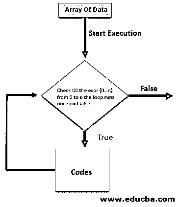
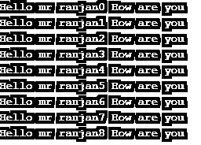
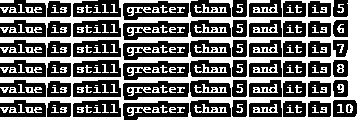

# Ruby 中的 For 循环

> 原文：<https://www.educba.com/for-loop-in-ruby/>


## Ruby 中的 For 循环介绍

ruby 中的 For 循环允许开发人员在不同的时间重用同一段代码，或者以更清晰的方式来说，Ruby 中的 Loop 是一种根据需要多次运行相同代码的方式，在 Ruby 中，它支持一种预定义的方式来实现循环的目标，for 循环是 Ruby 编程语言中最常见的，在任何 for 循环中，它都包含 in 运算符，这将有助于从数组(["a "，" b "，" c"])或数字(0…10)的开始到结束迭代表达式部分中的给定数据。

### 句法

下面是 Ruby 中循环的语法，

<small>网页开发、编程语言、软件测试&其他</small>

```
for name_of_variable[, variable1...] in expr [do]
# here will do the code for executions
end
```

下面给出了对以下语法的解释，

*   **for** :这是 ruby 预定义的关键字，将用于执行同一段代码，一次又一次，它表示任何循环的开始。

*   **name_of_variable** :对于循环的迭代，这些属性很重要。他们为当前循环迭代的引用支付角色。
*   **in** :这个关键字是在 ruby 中为“for”循环特别制作的，它在打破数据数组中起着至关重要的作用。
*   **expr** : expr 是保存数据数组的表达式，代码会遍历 Expr 的每个属性。
*   **do** :这是一个可选属性，用于指定代码的开始，该代码将重复执行。
*   **end** :该关键字表示从“do”关键字开始的“for”循环块的结束。

### Ruby 中 For 循环的流程图

下面是 Ruby 中循环的流程图，我们可以在下面的步骤中解释下面的循环，

*   第一次执行将从以表达式(0)的形式传递循环值开始..n)。
*   在循环中，有一个条件块将检查真或假条件。基本上，这个条件是关于检查数组中是否有没有被遍历的数据。
*   如果条件成功(仍然有数据),代码块将执行，如果条件为假，循环将中断。如果在数组上循环或到达最后一个数字后数组变空，将会发生失败。
*   它将继续，直到条件为真，这意味着数据数组将为空。
*   表达式可以是数据或数字的数组。在数字的情况下，它将迭代到最后一个数字，在数据数组的情况下，它将迭代所有数组数据。




### Ruby 中的 for 循环是如何工作的？

ruby 中 for 循环的工作原理可以在下面的步骤中解释，

*   ruby 中的 For 循环是基于数据数组或一些哈希值的。
*   每次循环都检查数组或哈希值中的条件和可用数据。
*   如果条件失败(条件= =假)，那么循环将被中断。这里的条件是非空数组。
*   如果条件为真，它将进入循环并执行代码块，它将继续这样做，直到条件为真。
*   循环的执行还取决于数组或哈希值中可用的数据(尤其是对于每个循环)。

*   循环将针对数据数组长度的数值运行。

### Ruby 中 for 循环的例子

下面举几个例子

#### 示例#1

下面是 Ruby for 循环的第一个例子，我们可以在下面的步骤中解释下面的代码。

*   首先，我们创建了一个变量“name ”,并将值“ranjan”赋给这个变量。

*   在下一步中，我们开始循环运行代码直到 8。因为我们已经写了 0..8 代替表达。
*   在代码的开始，它将开始为 ranja0 向 ranjan8 用户打印问候。
*   一旦达到 8 这个数字，它将执行最后一个代码，并打破循环。

请跟随下面的代码和输出屏幕。

**代码:**

```
name ="ranjan"
for b in 0..8 do
puts "Hello mr #{name}#{b} How are you"
end
```

**输出:**




#### 实施例 2

这是 for 循环的第二个例子，这个例子我们可以用下面的方式来解释，

*   第一个“for”循环将开始，它将检查从 0 到 10 的数字。
*   对于每个数字，它将把它与写在 if 块中的条件进行比较
*   在 if 块中，只有当“b”的值大于 5 时，我们才会执行。

*   如果“b”的值小于 5，循环将转到下一个，这意味着“b”的数值将改变，新的数字将出现。例如，如果值是 4，它将变为 5，下一次又变为 6。
*   一旦“b”的值为 5，它将开始进入 if 块，并开始为我们打印输出。
*   一旦“b”的值达到表达式部分的最后一个值 10，它将打印并在此暂停 for 循环。

请跟随下面的代码和输出屏幕。

**代码:**

```
for b in 0..10
if b < 5 then
next
end
puts "value is still greater than 5 and it is #{b}"
end
```

**输出:**

#### 


这是“for”循环的第三个例子，我们可以在下面的步骤中解释这个例子，

*   首先，我们定义了变量 students，并给它分配了一些学生数据数组。

*   下一步，for 循环将开始打印每个学生的名字。
*   这里的“b”是包含学生变量中每个学生名字的字符串。
*   在这个循环中，每次 for 循环上的操作符都会运行并检查数据。
*   一旦学生的数组变空，循环就会停止。

请跟随下面的代码和输出屏幕。

**代码:**

```
students = ["Ranjan", "Ajay", "Vijay", "Sujoy"]
for b in students do
puts "Student name is #{b}"
end
```

**输出:**


### 结论

从这个教程中，我们学习了 Ruby 中 for 循环的用法和工作原理，我们学习了 Ruby 中 for 循环的流程和一些实际应用，我们学习了如何从头到尾处理数据数组和数字。我们还看到了 Ruby 中“for loop”的 for 循环的流程图。

### 推荐文章

这是一个 Ruby 中 for 循环的指南。这里我们讨论了 ruby 中 for 循环的例子，以及它是如何在 Ruby 中工作的，并给出了流程图。您也可以看看以下文章，了解更多信息–

1.  [红宝石的用途](https://www.educba.com/uses-of-ruby/)
2.  [Ruby 命令](https://www.educba.com/ruby-commands/)
3.  [对于 C 中的循环](https://www.educba.com/for-loop-in-c/)


