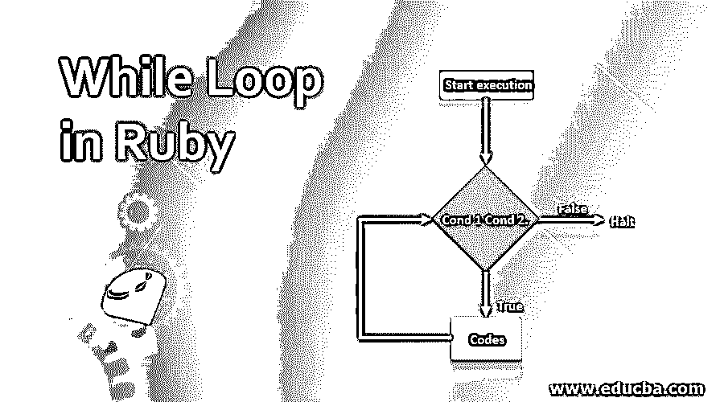
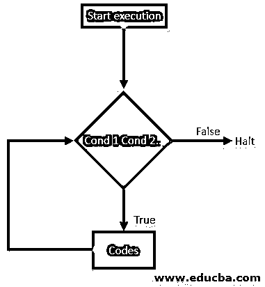
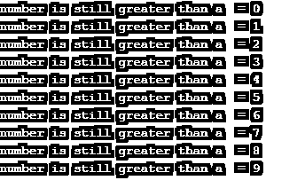
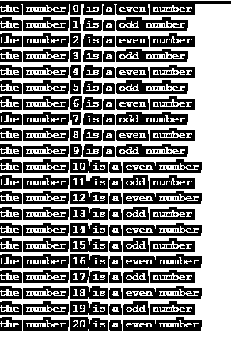

# Ruby 中的 While 循环

> 原文：<https://www.educba.com/while-loop-in-ruby/>

## Ruby 中 While 循环的定义

虽然 ruby 中的 loop 允许开发人员在不同的时间运行同一段代码，或者以更清晰的方式运行同一段代码，但 Ruby 中的 loop 是一种根据情况需要多次运行相同代码的方式，在 Ruby 中，它支持预定义的方式来实现循环的目标，而 Loop 是 Ruby 中最常用的循环方式之一， 在任何 while 循环中，它由一个条件语句组成(条件可以是多个条件的组合)，如果条件为真，循环将执行代码块，否则循环将中断**。**

**语法:**

<small>网页开发、编程语言、软件测试&其他</small>

下面是 Ruby 中 while 循环的语法，

`while cond1 cond 2 ..  [do] //(code block)here we are going to write code
end`

**说明:**

下面给出了对上述语法的解释，

*   **while** :这是 ruby 预定义的关键字，将用于一次又一次地执行同一段代码，它表示任何循环的开始。
*   **条件 1，条件 2..**:这些是在代码块执行前要检查的条件。示例(a > 9 || a < 100)这里可以是任何整数值，两个条件是 cond1 和 cond2，如果任何一个条件为真，那么代码块将执行。
*   **do** :在 do 块的帮助下，它将能够至少执行一次代码，即使条件失败或者只是条件为假。
*   **end** :该关键字表示从“do”关键字开始的“while”循环块的结束。

请遵循下面给出的 while 循环代码语法。

### 流程图

下面是 Ruby 中循环的流程图，我们可以用下面的步骤来解释下面的流程图，

*   第一次执行将从传递 cond1 和 cond2 形式的循环值开始，这意味着 cond1 和 cond2 所需的数据。
*   在循环中，有一个条件块将检查真或假条件。基本上，这个条件是关于检查 while 循环中写的条件是真还是假。
*   在条件(条件 1 和条件 2)的情况下，成功代码块将执行，如果条件为假，循环将中断。
*   它将继续，直到条件为真，cond2 和 cond2 或更多的组合条件应该为真。
*   如果条件为假，循环将被停止，结束发生在 while 循环上。

### Ruby 中的 While 循环是如何工作的？

ruby 中 while 循环的功能可以在下面的步骤中解释。

*   ruby 中的 While 循环基于布尔值，这意味着它对条件的真值和假值起作用。
*   每次循环检查条件，如果为 while 循环编写的条件为真，它将执行代码块，如果条件为假，while 循环将中断并结束。
*   用更专业的话来说，如果条件失败(condition==fale ),那么循环将被中断。这里的条件可以是更多条件的组合。
*   如果条件为真，它将进入循环并执行代码块，它将继续这样做，直到条件为真。
*   借助 Ruby while 循环中的 do 关键字，即使条件失败，它也会执行 altealt，这意味着一旦代码块执行，即使条件为假。

### Ruby 中 While 循环的例子

ruby 中的 while 循环示例如下:

#### 示例#1

下面是 Ruby 中 while 循环的第一个例子，我们可以在下面的步骤中解释下面的例子，

*   在这里，程序的目标是打印 10 以内的所有数字。
*   首先，我们定义了一个像$a 和$number 这样的全局变量。
*   我们已经将$a 和$number 的值分别初始化为 0 和 10。
*   “While 循环”从条件开始，它将检查将要打印的$number 是否大于$a。
*   如果$number 大于$a，它将打印该数字，一旦$a 的值达到 10，它将失败(false)。

**代码:**

`$a = 0
$number = 10
while $a < $number  do
puts("number is still greater than a  = #$a" )
$a +=1
end`

**输出:**

#### 实施例 2

下面是 Ruby 中 while 循环的第二个例子，我们可以在下面的步骤中解释下面的例子。

*   在下面的例子中，我们用问候来欢迎一群学生。
*   首先，我们定义了一组学生的全局变量。
*   我们定义了一个全局变量$a，用于检查学生数组的长度。
*   最后，在条件中，我们检查数组的长度是否大于$a 变量。这样，我们将能够遍历所有的数组并打印每个学生的问候。

**代码:**

`$students = ["ranjan","ajay","vijay","suresh"] $a=0
while $students.length()>$a  do
@s=$students[$a] puts("welcome to the programming world MR.#@s" )
$a +=1
end`

**输出:**

#### 实施例 3

下面是 Ruby 中 while 循环的第三个例子，我们可以在下面的步骤中解释下面的例子。

*   在下面的例子中，我们检查给定的数字是奇数还是偶数。
*   我们定义了一个全局变量$number，并赋值为 20，这意味着直到 220，我们都在检查偶数和奇数。
*   我们使用了 ruby 奇数方法，它会告诉我们这个数字是奇数还是偶数。

**代码:**

`$number = 0
while $number <= 20
if $number.odd?
puts "the number #$number is a odd number"
else
puts "the number #$number is a even number"
end
$number += 1
end`

**输出:**

### 结论

从这些教程中，我们学习了 while 循环的工作原理及其在现实世界中的重要用途，我们还学习了 while 循环在 Ruby 中的工作原理及其通用语法和条件流程图(多个条件的组合，如果为真则成功，如果为假则失败)。

### 推荐文章

这是 Ruby 中 While 循环的指南。这里我们讨论 ruby 中 while 循环的介绍和语法，以及不同的例子和代码实现。您也可以看看以下文章，了解更多信息–

1.  [Python 中的 Do While 循环](https://www.educba.com/do-while-loop-in-python/)
2.  [PHP 中的 While 循环](https://www.educba.com/while-loop-in-php/)
3.  [Ruby 中的循环](https://www.educba.com/loops-in-ruby/)
4.  [Ruby 数组方法](https://www.educba.com/ruby-array-methods/)

