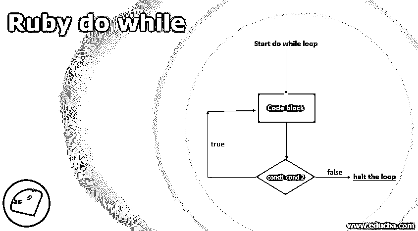
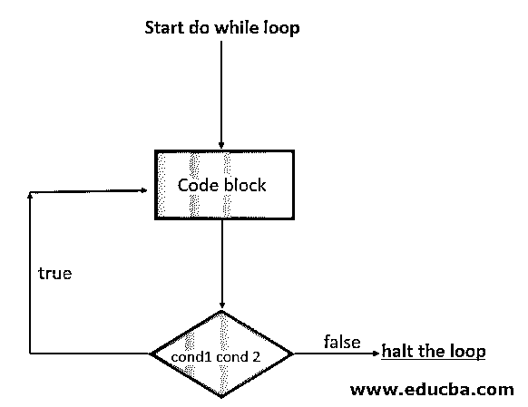
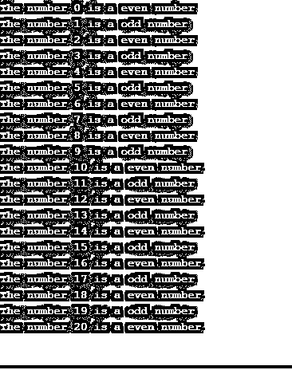

# Ruby do while

> 原文：<https://www.educba.com/ruby-do-while/>

## Ruby do-while 简介

ruby 中的 while 循环允许开发人员在不同的时间运行同一段代码，并且第一次执行代码至少一次，或者以更清晰的方式运行，而 Ruby 中的 while 循环是一种在开始执行时运行一次代码的方式， 在任何 do while 循环中，它都由一个条件语句组成(条件可以是多个条件的组合，并且将是条件的表达式)，如果条件为真，循环将执行代码块，否则循环将中断，并且由于 do，代码块将首次执行。

### 句法

下面是 Ruby 中执行 while 循环的语法和解释:

<small>网页开发、编程语言、软件测试&其他</small>

`while cond1 cond 2 ..  [do] //(code block)here we are going to write code
end`

**说明:**

*   while:这是 ruby 预定义的关键字，将用于执行同一段代码，一次又一次，它表示任何循环的开始。
*   cond1、cond2:这些是在执行代码块之前要检查的条件。示例(a>9 || a<100)这里可以是任何整数值，两个条件是 cond1 和 cond2，如果任何一个条件为真，则代码块将执行。
*   do:在 do 块的帮助下，它将能够至少执行一次代码，即使第一次条件失败或者只是条件为假。
*   end:该关键字表示从“do”关键字开始的“while”循环块的结束

### Ruby do-while 流程图

下面是 Ruby 中 do-while 循环的流程图，我们可以用下面的步骤来解释下面的流程图:

**说明:**条件块启动时，肯定会执行一次代码块。这意味着代码块将首次执行，然后开始检查条件。其次，执行将从传递 cond1 和 cond2 形式的循环值开始，这意味着 cond1 和 cond2 所需的数据。在循环中有一个条件块，它将检查真或假条件。

这个条件是关于检查写在 do-while 循环中的条件是真还是假。在条件(条件 1 和条件 2)的情况下，成功代码块将执行，如果条件为假，循环将中断。它将继续，直到条件为真，cond2 和 cond2 或更多的组合条件应该为真。如果条件为假，循环将被停止，do-while 循环结束。

### Ruby 中 while loop 工作时怎么做？

ruby 中 do-while 循环的工作原理可以在下面的步骤中解释:

ruby do-while 循环的主要重要事实是，第一次它至少会执行一次循环，然后它会检查条件。ruby 中的 While 循环基于布尔值，这意味着它对条件的真值和假值起作用。每次循环检查条件，如果为 while 循环编写的条件为真，它将执行代码块，如果条件为假，while 循环将中断并结束。

用更专业的话来说，如果条件失败(condition==false)，那么循环将被中断。这里的条件可以是更多条件的组合。如果条件为真，它将进入循环并执行代码块，它将继续这样做，直到条件为真。借助 Ruby while 循环中的 do 关键字，它将执行 altealt 一次，即使条件第一次失败，这意味着一旦代码块将在执行开始时执行，即使条件为假。

### 实现 Ruby do-while 的示例

下面是提到的例子:

#### 示例#1

**代码:**

`$studentsLists = ["ranjan","ajay","vijay","suresh"] $a=0
while $studentsLists.length()>$a  do
@s=$studentsLists[$a] puts("Welcome to the programming world mr.  #@s" )
$a +=1
end`

**输出:**

**解释:**在上面的例子中，我们用问候来欢迎一群学生。首先，我们定义了一个学生列表全局变量数组。我们定义了一个全局变量$a，用于检查学生数组的长度。最后，在条件中，我们检查数组的长度是否大于$a 变量。这样我们就可以遍历所有的数组并打印出每个学生的问候。这里将在启动时至少执行一次它的角色。

#### 实施例 2

下面是 Ruby 中 while 循环的例子，我们可以用下面的步骤来解释下面的例子:

**代码:**

`$oddeven = 0
while !($oddeven > 20) do
if $oddeven.odd?
puts "The number #$oddeven is a odd number"
else
puts "The number #$oddeven is a even number"
end
$oddeven += 1
end`

**输出:**

**解释:**在下面的例子中，我们检查给定的数字是奇数还是偶数，并相应地打印输出。我们已经定义了一个全局变量$oddeven 并赋值为 20，这意味着直到 20 我们都在检查偶数和奇数。我们使用了 ruby odd 方法来检查数字，这将告诉我们数字是奇数还是偶数。

### 结论

从这些教程中，我们学习了“do while”循环的工作原理及其在现实世界中的重要用途，我们还学习了 do-while 循环在 Ruby 中的工作原理及其通用语法和条件流程图(多个条件的组合，如果为真，则成功，如果为假，则失败。

### 推荐文章

这是一个 Ruby do while 的指南。这里我们讨论 Ruby do while 的介绍，语法，它是如何工作的，例子来更好的理解。您也可以浏览我们的其他相关文章，了解更多信息——

1.  [红宝石变量](https://www.educba.com/ruby-variables/)
2.  [Ruby 命令](https://www.educba.com/ruby-commands/)
3.  [Ruby 方法](https://www.educba.com/ruby-methods/)
4.  [Ruby DateTime](https://www.educba.com/ruby-datetime/)

