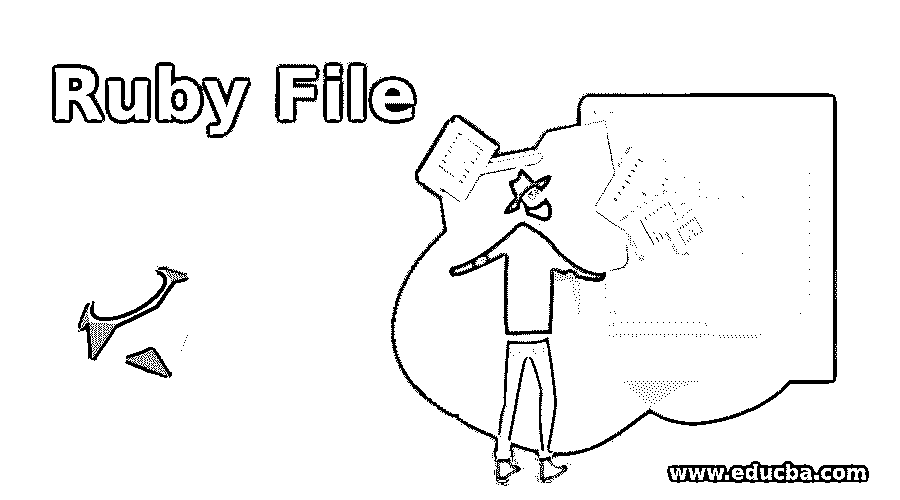
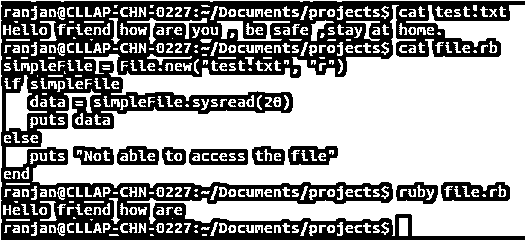
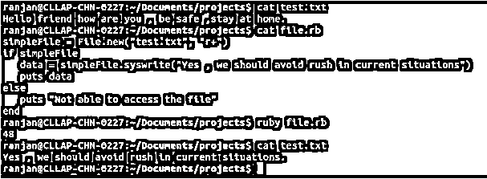

# Ruby 文件

> 原文：<https://www.educba.com/ruby-file/>

## Ruby 文件简介

Ruby file 提供了一种处理文件系统的漂亮方法；它有许多用于内核模块的 I/O 方法；在 ruby 中，有许多处理文件系统的重要方法，所有这些方法都是从 I/O 类派生出来的，有一些重要的文件操作，如 read(读取文件)、write(写入文件)、puts(读取变量并打印分配给该变量的值)、gets、princ、print(打印与 puts 类似，唯一的区别是它不会从新行开始，它的光标会在同一行)和 readline，这些对于文件系统来说非常常见。

### 各种文件操作

Ruby 在文件系统上有各种各样的操作，假设你不知道你能在 Ruby 文件系统上执行什么操作，你仍然可以概括你在日常生活中在文件系统上执行的重要操作；例如，你打开一个文件，你在文件上更新或写一些东西，你每天执行的更多操作都将包含在 Ruby 文件系统中。

<small>网页开发、编程语言、软件测试&其他</small>

### Ruby 文件示例

让我们通过一些例子来开始理解这些操作。

#### 示例# 1–以只读方式打开文件

以只读方式打开文件，这里我们打开文件进行读取，并从文件中读取内容。我们可以在下面的步骤中解释下面的例子。

*   首先，我们创建了一个名为 test.txt 的文件，并向该文件添加了一些内容。
*   我们使用带有两个参数的 new，在第一个参数中，我们传递将要读取的文件的名称和路径，第二个参数传递打开文件的模式(在本例中，我们以 read(r)模式打开文件)。
*   下一个代码是 if 语句，我们检查文件是否为空，以避免空内容的无用代码流。
*   最后，借助 sysread 方法，取 20 为字长。
*   在输出中，它打印文件中的 20 个字符。

**Note**: Make not that here my text file test.txt is available on the same path where the Ruby code file is present; in my case, both on the same directories because of that, I did not require to mention the path of the file, but in case if you have your file in the other directory then the Ruby code, then please mention the path instead of writing simply file name.

请遵循以下代码，并退出屏幕。

**代码:**

`simpleFile = File.new("test.txt", "r")
if simpleFile
data = simpleFile.sysread(20)
puts data
else
puts "Not able to access the file"
end`

**输出:**

#### 示例 2–以写模式打开文件

以写模式打开文件，这里我们是为了写的目的打开文件并在文件上写内容。因此，我们可以在下面的步骤中解释下面的例子。

*   首先，我们创建了一个名为 test.txt 的文件，并向该文件添加了一些内容。
*   我们使用带有两个参数的 new，在第一个参数中，我们传递将要读取的文件的名称和路径，第二个参数传递打开文件的模式(在本例中，我们以 write(+r)模式打开文件)。
*   下一个代码是 if 语句，我们检查文件是否为空，以避免空内容的无用代码流。
*   最后，借助 syswrite 方法，该方法将写入内容或简单地删除现有内容并添加传递到函数中的内容。这个函数将返回文件中字母的总长度。您可以在示例中看到，它返回 48。
*   我们可以在执行代码之前和执行代码块之后看到文件 test.txt 的内容。

**代码:**

`simpleFile = File.new("test.txt", "r+")
if simpleFile
data = simpleFile.syswrite("Yes, we should avoid the rush in current situations")
puts data
else
puts "Not able to access the file"
end`

**输出:**

#### 示例 3–重命名文件

这是一个非常简单的例子，我们将一个文件从 test.txt 重命名为 final.txt。一旦我们执行下面给出的代码，输出会将 test.txt 更改为 final.txt。我可以在下面的步骤中解释输出屏幕。

*   我创建了一个文件 test.txt 和 file.rb(包含 ruby 代码)
*   我们用 ls 命令检查了文件名。
*   最后，我们运行命令 ruby file.rb，它执行代码并更改文件名。

请按照下面的代码输出屏幕。

**代码:**

`File.rename( "test.txt", "final.txt" )`

**输出:**

#### 示例 4–删除文件

这是一个非常简单的例子，我们正在删除一个文件名 final.txt。一旦我们执行下面给出的代码，输出将删除 final.txt 文件。我可以在下面的步骤中解释输出屏幕。

*   我创建了一个文件 test.txt 和 file.rb(包含 ruby 代码)
*   我们用 ls 命令检查了 final.txt 文件。
*   最后，我们运行命令 ruby file.rb，它执行代码并删除文件。
*   我们再次用 ls 命令检查文件夹，发现文件夹中不包含 final.txt

请按照下面的代码输出屏幕。

**代码:**

`File.delete("final.txt")`

**输出:**

#### 示例 5–基于 IO 的操作

在本例中，我们只是逐行对 test.txt 内容执行循环。因此，我们可以在下面的步骤中解释下面的例子。

*   test.txt 文件包含两行内容。
*   运行命令 ruby file.rb 将逐行打印内容。

请遵循下面的代码和输出屏幕的例子。

**代码:**

`IO.foreach("test.txt"){|content| puts content}`

**输出:**

### 结论

从这些教程中，我们学习了文件系统及其基本概念；我们学习了一些最重要和最常用的操作，比如读、写、删除和重命名文件；我们还学习了 Ruby 文件系统中的 I/O 操作。

### 推荐文章

这是一个 Ruby 文件指南。在这里，我们讨论 Ruby 文件的基本概念和最常用的操作以及例子。您也可以看看以下文章，了解更多信息–

1.  [Ruby 命令](https://www.educba.com/ruby-commands/)
2.  [Ruby on Rails 职业生涯](https://www.educba.com/career-in-ruby-on-rails/)
3.  [红宝石的用途](https://www.educba.com/uses-of-ruby/)
4.  [Ruby 面试问题](https://www.educba.com/ruby-interview-questions/)

