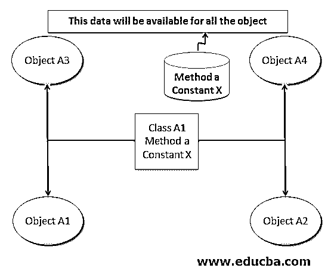

# Ruby 中的类

> 原文：<https://www.educba.com/class-in-ruby/>

## **Ruby 中的类介绍**

Ruby 中的类是一个重要的属性，类只是对象的克隆，任何类都可以包含方法、常量等，一旦我们从类中创建了对象，那么该对象就包含了类的所有属性，这就是为什么我们称它为任何对象的蓝图，使用类的主要好处是它允许我们编写可以被许多对象重用的方法和变量， 在 Ruby 中，我们使用 class 作为关键字来创建任何名称的类，而 new 是另一个关键字来从该类创建对象，该对象将拥有所有的属性访问权限。

### 如何在 Ruby 中创建类？

要在 Ruby 中创建一个类，我们可以在类名前使用 class 关键字。请看下面用 Ruby 创建类的例子。让我解释下面的例子。

<small>网页开发、编程语言、软件测试&其他</small>

*   我们定义了一个类名为 ClassName 的类，我们可以看到我们在类名(class name)前使用了 class 关键字。
*   在类里面我们已经给了一些注释部分，在这里我们也可以放一些方法和常量来代替注释。
*   在这个类中，我们使用了 initialize 方法，这是一个预定义的初始化方法。
*   当我们从这个类中创建对象时，这个类也会自动调用 initialize 方法并完成变量的初始化工作。

**语法:**

`class ClassName
#Do the initialisation here
def initialize(param1, param2)
# Here we are initialising the variables .
@param1 = param1
@param2 = param2
end
#Write here your methods and constants
end
#Create object from class
Object =ClassName.new(param1, param2)`

### Ruby 中的类是如何工作的？

如果你见过任何土木工程师为桥梁建筑设计或绘制一些建筑。一旦土木工程师画出任何设计，这个设计就可以用来建造许多建筑。因为那张图纸包含了我们建造任何建筑或桥梁所需的一切。同样，Ruby 中的类扮演绘图的角色，从该类创建的所有对象将扮演建筑物的角色。我们可以借助下面的流程图来解释 Ruby 中类的工作方式。

*   这里我们有一个名为 A 的类，这个类包含一个方法和一个常量。
*   这里 class 关键字将通知 Ruby 编译器变量的类型。
*   一旦 Ruby 编译器读取 class 关键字，它将为一个具有我们传递的类名的类保留内存和定义。
*   现在我们正在从类 A 中创建许多对象，如对象 A1、对象 A2、对象 A3 和对象 A4。
*   从这个类创建的每个对象内部都包含相同的方法和常数。这意味着如果需要的话，这些对象可以随时访问方法 a 和变量 x。
*   在 Ruby 类中，有一个堆区保存页面格式的数据，其中每个页面都有一定的固定大小。像在 Java 这样的通用语言中，它们曾经有一个堆区和一个栈区，但是在 Ruby 中只有堆区。在课堂上，我们可以在 Ruby 文档中读到更多关于堆区域的内容。

为了更好的理解，请看下面的 Ruby 类流程图。

### 用 Ruby 实现类的例子

下面是 Ruby 中的类的例子:

#### 示例#1

下面是一个在 Ruby 中创建和使用类的例子。这个程序的目的是显示用户信息。我们可以在下面的步骤中解释下面的例子。

*   首先，我们创建了一个名为 Human 的类。
*   接下来，我们创建了一个 Ruby 内置方法 initialize，它将被用作 Ruby 类内部的构造函数来进行初始化。
*   我们在类中编写了 display_data 方法，该方法将显示传递给它的属性的数据。
*   接下来，我们从类 Human 创建一个对象，并使用所需的参数调用 display_data 方法来显示用户数据。

请查看下面的代码示例以及输出屏幕。

**代码:**

`class Human
# Method for initialisation inside the class
def initialize()
# Initialising the variables
puts "Initialisation for the class will be done here"
end
def display_data(name,age,sex)
puts "The name of the user is #{name} and  age is #{age} also he is a #{sex}"
end
end
# Creating an objects and passing parameters  for initialization
object1 = Human.new()
object2 = Human.new()
object1.display_data("ranjan", 31, "male")
object2.display_data("anjali", 28, "female")`

**输出:**

#### 实施例 2

下面是一个在 Ruby 中创建和使用类的例子。这个程序的目的是显示用户信息。我们可以在下面的步骤中解释下面的例子。

*   首先，我们创建了一个名为 Human 的类。
*   接下来，我们创建了一个 Ruby 内置方法 initialize，它将作为 Ruby 类中的构造函数来初始化用户详细信息，以便在其他方法中使用。
*   我们在类中编写了一个 display_data 方法，它将显示在对象创建时传递给 initialize 的属性的数据。
*   接下来，我们将从类 Human 创建一个对象，并调用 display_data 方法，不需要任何参数，因为将使用我们在初始化时传递的参数..

请查看下面的代码示例以及输出屏幕。

**代码:**

`class Human
# Method for initialisation inside the class
def initialize(name ,age ,sex )
# Initialising the variables
@name = name
@age = age
@sex =sex
end
def display_data()
puts "The name of the user is #{@name} and  age is #{@age} also he is a #{@sex}"
end
end
# Creating an objects and passing parameters  for initialization
object1 = Human.new("ranjan", 31, "male")
object2 = Human.new("anjali", 28, "female")
object1.display_data()
object2.display_data()`

**输出:**

### 结论

从这些教程中，我们在一个有用的真实例子的帮助下学习了 Ruby 中类的一些重要用途和基本概念，我们也在图表和少量语法的帮助下学习了类的工作方式，这里我们也很少关注类在真实世界用例中的使用。

### 推荐文章

这是一个 Ruby 类的指南。在这里，我们借助一个有用的真实例子和它的语法以及代码实现来讨论 Ruby 中 class 的一些重要用途和基本概念。您也可以浏览我们推荐的其他文章，了解更多信息——

1.  [Ruby 命令](https://www.educba.com/ruby-commands/)
2.  [红宝石系列](https://www.educba.com/ruby-ranges/)
3.  [下一个红宝石](https://www.educba.com/next-in-ruby/)
4.  [Ruby 异常](https://www.educba.com/ruby-exceptions/)

