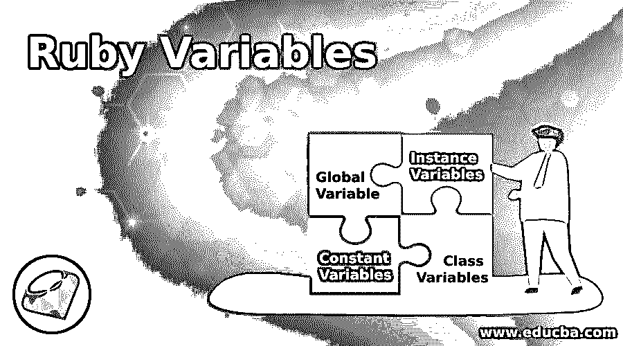
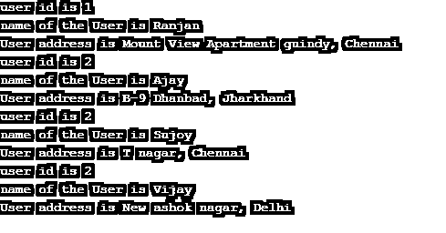

# Ruby 变量

> 原文：<https://www.educba.com/ruby-variables/>

## Ruby 变量简介

ruby 中的变量是我们存储数据的内存位置，Ruby 开发人员需要时会用到这些数据。在 ruby 中，它支持 5 种类型的数据，它们是全局变量(从$开始，全局变量对所有人都可用，其值为零；默认情况下，仅在需要时使用全局变量，否则应避免使用全局变量)、实例变量(以@开头，范围一直到特定实例)、类变量(以@@开头)、局部变量(范围一直到类、模块和 def 的局部变量)和常量变量(以大写字母开头，不能重新分配或修改)。

### 如何在 Ruby 中声明和初始化变量？

Ruby 变量的声明和初始化可以用下面的格式完成。

<small>网页开发、编程语言、软件测试&其他</small>

*   **对于全局变量:**全局变量是所有作用域都可用的变量，但是全局变量使用起来并不安全，所以我们在使用时需要确定需求。

全局变量以美元符号开始。

`$ruby_global_variable = 15`

*   **对于实例变量**:实例变量可以用@符号初始化，默认值为零。

`@ruby_instance_variable = 15`

*   **对于类变量**:类变量用@@初始化，将在类内部定义。

`@@ruby_class_variables = 15`

*   **对于局部变量** : Ruby 局部变量是用 _ 定义的，范围从 def、method 到 classes。

`_ruby_local_variables = 15`

*   **对于常量变量**:ruby 中的常量变量是大写字母，一旦赋值就不能重新赋值。

常数 1 =15

常数 2 =20

### Ruby 中的变量类型

以下是变量的类型:

#### 1.全局变量

默认情况下，全局变量以美元($)符号开始，包含零值。不建议在所有情况下都使用全局变量。

**举例:**

在下面的例子中，我们定义了一个变量$ruby_global，它可以在两个名为 RubyClass1 和 RubyClass2 的类中访问。这两个类都包含一个函数 print_ruby_global，我们在类的实例上使用它。请按照下面的例子以及输出屏幕。

**代码:**

`$ruby_global_variable = 11
class RubyClass1
def print_ruby_global
puts "RubyClass1 global variable output is  #$ruby_global_variable"
end
end
class RubyClass2
def print_ruby_global
puts "RubyClass2 global variable output is  #$ruby_global_variable"
end
end
rubyclass1obj = RubyClass1.new
rubyclass1obj.print_ruby_global
rubyclass2obj = RubyClass2.new
rubyclass2obj.print_ruby_global`

**输出:**

#### 2.实例变量

实例变量以@符号开头。下面给出了实例变量的例子。

**举例:**

下面的例子可以用下面的步骤来解释:

*   我们定义了一个名为 UserClass 的类，在这个类中，我们初始化了三个变量。
*   在这个类中，我们定义了一个名为 show_detail 的函数。
*   最后，我们从 UserClass 创建了对象，并使用初始化的对象(实例)调用函数 show_detail。用户的每个属性的输出对我们来说都是可见的。

**代码:**

`class UserClass
def initialize(user_id, user_name, address)
@user_id = user_id
@user_name = user_name
@user_addr = address
end
def show_details()
puts "user id is #@user_id"
puts "name of the User is #@user_name"
puts "User address is #@user_addr"
end
end
#
user1 = UserClass.new("1", "Ranjan", "Mount View Apartment guindy, Chennai")
user2 = UserClass.new("2", "Ajay", "B-9 Dhanbad, Jharkhand")
user3 = UserClass.new("2", "Sujoy", "T nagar, Chennai")
user4 = UserClass.new("2", "Vijay", "New ashok nagar, Delhi")
# Call the Methods of class for displaying the details
user1.show_details()
user2.show_details()
user3.show_details
user4.show_details`

**输出:**

#### 3.类别变量

可以用@@符号定义类变量。如果有人将覆盖类变量，那么它会显示一个警告。下面的例子可以用下面的步骤来解释:

*   首先，我们定义了一个名为 User 的类，这个类包含三个变量的初始化。
*   接下来，我们定义了一个名为 show_details 的函数，这个函数包含显示用户详细信息的逻辑。
*   接下来，我们创建了给用户计数的函数，每次从用户对象调用该函数时，它的值都会更新并显示更新后的值。

请按照下面的例子以及屏幕的输出。

**代码:**

`class User
@@no_of_users = 0
def initialize(u_id, u_name, u_address)
@user_id = u_id
@user_name = u_name
@user_addr = u_address
end
def show_details()
puts "User ID is #@user_id"
puts "User name is #@user_name"
puts "User Address is #@user_addr"
end
def total_users()
@@no_of_users += 1
puts "Count for the total number of users is: #@@no_of_users"
end
end
user1 = User.new("1", "Ranjan", "Mount View Apartment guindy, Chennai")
user2 = User.new("2", "Ajay", "B-9 Dhanbad, Jharkhand")
user3 =User.new("2", "Sujoy", "T nagar, Chennai")
user4 =User.new("2", "Vijay", "New ashok nagar, Delhi")
# Call the Methods of class for displaying the details
user1.total_users()
user2.total_users()
user3.total_users()
user4.total_users()`

**输出:**

#### 4.常量变量

常量变量以大写字母开始。常量变量不能重新赋值。定义在类内部的常量可以在类内部访问，定义在模块内部的常量可以在模块内部访问，我们也可以将常量定义为全局常量，它在类和模块之外，对所有人都可用。常量变量的一个例子如下。

**说明:**

*   首先，我们创建了一个名为 Example For Constant 的类，该类包含两个变量(CONSTANT1 和 CONSTANT2)。
*   我们在 Constant 的类示例中创建了一个名为 display_constant 的函数，该函数包含显示两个常量值的逻辑。

**举例:**

**代码:**

`class ExampleForConstant
CONSTANT1 = 101
CONSTANT2 = 201
def display_constant
puts "constant first value is  #{CONSTANT1}"
puts "constant second value is  #{CONSTANT2}"
end
end
# create an object and call the method display_constant.
object = ExampleForConstant.new()
object.display_constant`

**输出:**

### 结论

从本教程中，我们了解了 Ruby 变量以及其中可用的常量，我们了解到主要有五种类型的变量，它们是全局变量、局部变量、实例变量、常量变量和类变量，我们还了解了使用每种类型变量的方法。

### 推荐文章

这是一个 Ruby 变量的指南。在这里，我们讨论 ruby 变量以及可用的常量及其不同类型的变量，它们是全局变量、局部变量、实例变量、常量变量和类变量。您也可以浏览我们推荐的其他文章，了解更多信息——

1.  [红宝石评论](https://www.educba.com/ruby-comments/)
2.  [Ruby 数组方法](https://www.educba.com/ruby-array-methods/)
3.  [红宝石块](https://www.educba.com/ruby-block/)
4.  [Ruby 调试器](https://www.educba.com/ruby-debugger/)

