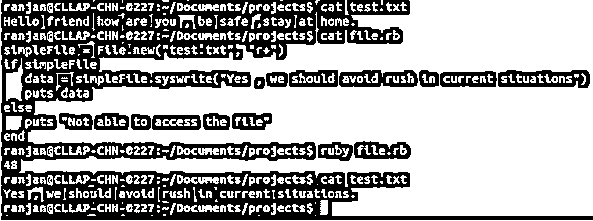
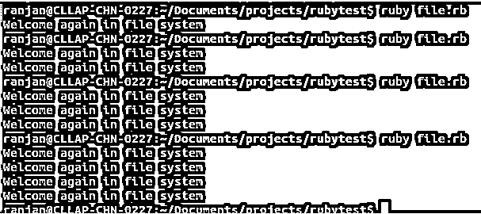

# Ruby 写入文件

> 原文：<https://www.educba.com/ruby-write-to-file/>

## Ruby 写入文件简介

为了对文件执行写操作，ruby 提供了各种方法和途径，在任何文件系统上执行的所有操作都将通过 Ruby 的 file 类来完成。文件类系统允许开发人员在其上使用各种方法，如 open、new 和 write，以在文件系统上执行写入工作，它允许我们以 append(用换行符在现有内容上添加新内容)模式写入，或者以正常的 write(在 Ruby 中，用该方法写入内容的最短方式)和 write(这里 write 方法将在 append 和 write 等各种模式下工作)写入。

### 使用各种方法在 Ruby 中写入文件

在 Ruby 中，我们有各种方式和方法可以用来在文件中写入内容，比如我们可以使用 new，我们可以在追加模式和写入模式下使用 open，我们可以使用直接写入方法(write 也可以在各种模式下使用，比如追加模式和写入模式)。让我们讨论一下在任何文件上书写的所有这些可能的方法。

<small>网页开发、编程语言、软件测试&其他</small>

**Note**: I assume that the file where we are going to write content belongs to the same directory where the ruby file which contains the code for writing and hence ‘i’ have directly mentioned the file name like test.txt. In case if the ruby file containing the logic for writing content on the test.txt file is separated then please mention the complete path of the file like “/c/content/test.txt”.

#### 1.使用新的

我们可以使用新的 Ruby 关键字来执行写操作。以写模式打开文件，这里我们是为了写目的打开文件，并在文件上写入内容。我们可以在下面的步骤中解释下面的例子。

*   首先，我们创建了一个名为 txt 的文件，并向该文件添加了一些内容。
*   我们使用带有两个参数的 new，在第一个参数中，我们传递将要读取的文件的名称和路径，第二个参数传递打开文件的模式(在本例中，我们以 write(+r)模式打开文件)。
*   下一个代码是 if 语句，我们检查文件是否为空，以避免空内容的无用代码流。
*   最后，借助 syswrite 方法，该方法将写入内容或简单地删除现有内容并添加传递到函数中的内容。这个函数将返回文件中字母的总长度。您可以在示例中看到，它返回 48。
*   我们可以在执行代码之前和执行代码块之后看到文件 test.txt 的内容。

请看下面的例子。

**代码:**

`#Here argument r+ indicate we are opening the file in write mode .
simpleFile = File.new("test.txt", "r+")
if simpleFile
data = simpleFile.syswrite("Yes , we should avoid rush in current situations")
puts data
else
puts "Not able to access the file"
end`

**输出:**

#### 2.使用在追加模式下打开

下面是一个简单的例子，我们在追加模式下打开一个文件 test.txt。追加模式意味着每次我们执行代码时，它都会在新行中添加新内容。当我们需要文件系统上的旧内容和新内容时，会执行这种类型的操作。我们可以用两个重要的步骤来解释下面的例子。

*   在第一步中，我们打开文件 test.txt，转到每一行，并在文件的新行上添加新内容。
*   在第二步中，我们以读取模式打开文件，并打印文件的所有内容。

请看下面的例子。

**代码:**

`#Here the argument “a” indicates we are opening the file in append mode .
File.open("test.txt","a") do |line|
line.puts "\r" + "Welcome again in file system"
end
File.open("test.txt").each do |line|
puts line
end`

**输出:**

#### 3.在写模式下使用 Open

下面是一个简单的例子，我们在写模式下打开一个文件 test.txt。写模式意味着每次我们执行代码时，它都会添加新的内容并删除旧的内容。当我们不需要旧的内容时，执行这种类型的操作。下面给出了我们正在执行的两个主要步骤。

*   第一步，我们以写模式打开文件，并通过替换旧内容来添加新内容。
*   在第二步中，我们以读取模式打开文件，并打印文件的所有内容。

请看下面的例子。

**代码:**

`#Here argument w indicates we are opening the file in write mode .
File.open("test.txt","w") do |line|
line.puts "\r" + "Welcome again in file system"
end
File.open("test.txt").each do |line|
puts line
end`

**输出:**

#### 4.直接使用写方法

在下面的例子中，我们没有打开文件，而是在 write 方法的帮助下直接在文件上写内容。我们正在执行两个主要操作，可以用两个步骤来解释。

*   在第一步中，我们通过向 write 方法传递两个参数(文件名和内容)来编写内容。我们还可以传递类似 append 或 write 的编写模式(与 open 方法的方式相同)。
*   其次，我们正在读取上一步添加的文件内容。

请看下面的例子。

**代码:**

`File.write('test.txt', 'This we are adding without opening the file')
File.open("test.txt").each do |line|
puts line
end`

**输出:**

### 结论

从本教程中我们学习了在文件系统上写东西，我们看到了在 Ruby 中可用方法的帮助下，在任何文件系统上写东西的各种方法。借助一些重要的例子，我们学会了这些方法的用法。

### 推荐文章

这是一个 Ruby 写文件的指南。在这里，我们将借助一些有用的例子和代码实现，讨论如何使用各种方法在 Ruby 中写入文件。您也可以浏览我们推荐的其他文章，了解更多信息——

1.  [Ruby 命令](https://www.educba.com/ruby-commands/)
2.  [红宝石的用途](https://www.educba.com/uses-of-ruby/)
3.  [围棋 vs 红宝石](https://www.educba.com/go-vs-ruby/)
4.  [红宝石块](https://www.educba.com/ruby-block/)

