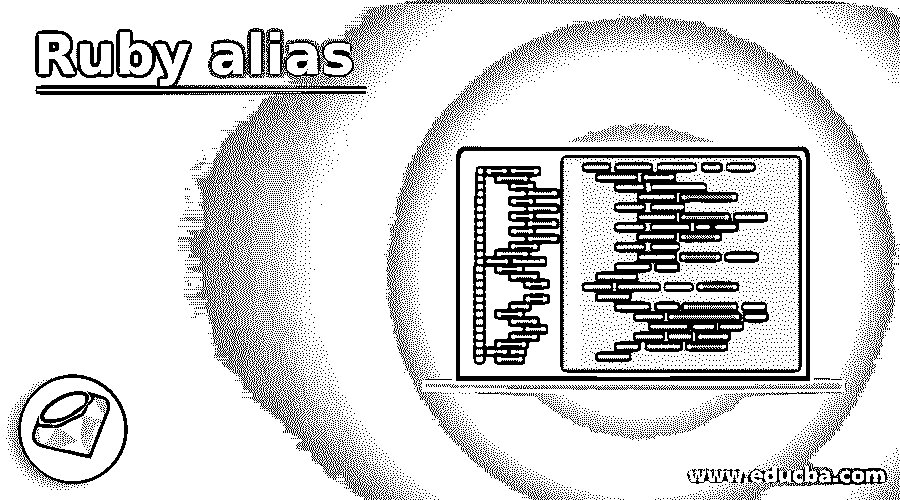
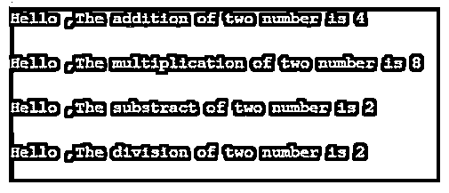

# Ruby 别名

> 原文：<https://www.educba.com/ruby-alias/>

## Ruby alias 简介

Ruby 允许开发人员为某些特定的目的定义或重命名，这里的重命名意味着用新的名称来表示旧的方法行为。基本上，alias 是 Ruby 中的一个关键字，它有两个参数，一个是旧名称，另一个是新名称，当我们觉得代码中的方法命名有些模糊时，我们通常会使用这些参数，当我们有太多名称相似的方法时，alias 关键字会更有用，因为我们可以根据我们的理解和方法的目的来重命名这些函数，这使得其他开发人员更容易理解。

**语法:**

<small>网页开发、编程语言、软件测试&其他</small>

可能有两种重要的语法。我们只需要提到别名的新名称和旧名称，方法的新名称将被创建，我们可以使用新的更改名称来访问它。

`alias oldnamenewname`

`alias :oldname :newname`

### 别名语句在 Ruby 中是如何工作的？

下面给出了 Ruby 中 alias 语句的工作原理:

*   一旦我们使用了关键字 alias ruby，就需要两个属性，一个是旧名称，另一个是我们想要指定的新名称。
*   在类对象之外，将有一个改变了的名字，在任何情况下，我们都可以用这个类的对象来访问这个方法。

**Note**: Its best use is, when some other class or library which we are including in our class contains some methods with the same name which our class contains, at that time we can rename our methods for better understanding.

### Ruby 别名示例

下面是提到的例子:

#### 示例#1

在下面的例子中，我们创建了一个学生类，在这个学生类中，我们创建了一个名为 studentName 的方法，该方法打印学生的名字。在同一个类中，我们用各种新的方法名来重命名这些方法，我们在 Student 类的对象之外使用改变的名称，并获得相同的输出。

定义一个类，在类内部我们为几个函数的名字取别名，这些函数在外部可以用我们给定的别名。

**代码**

`class Student
defstudentName
'Ranjan Kumar pandey'
end
#Creation of alias for methods simply renaming the method
alias student studentName
alias name student
alias identity name
end
s = Student.new
#Here we are calling the methods with the name which we have given for it as alias
puts s.studentName
puts s.name
puts s.identity`

**输出:**

#### 实施例 2

在下面的例子中，我们创建了一个 Man 类，在 Man 类中，我们创建了一个名为 studentName 的方法，它打印出了名称。在同一个类中，我们重命名该方法，并在 Student 类的对象之外使用更改后的名称。

定义一个类，在类内部我们为几个函数的名字取别名，这些函数在外部可以用我们给定的别名。

**代码:**

`class Man
def talk
"Hello, I can talk"
end
#Creation of alias for methods simply renaming the method
alias_method "#{name.downcase}_talk", :talk
end
#Here we are calling the methods with the name which we have given for it as alias
p Man.new.man_talk`

**输出:**

#### 实施例 3

在下面的例子中，我们创建了一个人类类，在人类类中，我们为不同类型的人创建了一些方法，这些方法打印出了他们的详细信息。在同一个类中，我们重命名该方法，并在 Student 类的对象之外使用更改后的名称。

定义一个类，在类内部我们为几个函数的名字取别名，这些函数在外部可以用我们给定的别名。

**代码:**

`class Human
def boy
puts 'Hello, I am man'
end
def girl
puts 'Hello ,I am girl'
end
def child
puts 'Hello ,I am child'
end
#Creation of alias for methods simply renaming the method
alias :boyMessege :boy
alias :girlsMessege :girl
alias :childMessege :child
end
h = Human.new
#Here we are calling the methods with the name which we have given for it as alias
puts h.boyMessege
puts h.girlsMessege
puts h.childMessege`

**输出:**

#### 实施例 4

在下面的例子中，我们创建了一个名为 Cal 的类，在这个类中我们做了一些算术计算，在同一个类中，我们重命名了这个类的名称。我们可以看到，在外部，我们正在用完全相同的操作访问方法的更改名称。很多时候，重命名一个非常大的计算方法是一个好主意，这样既减少了代码量，也减少了输入。

定义一个类，在类内部我们为几个函数的名字取别名，这些函数在外部可以用我们给定的别名。

**代码:**

`class Cal
def addition(a,b)
puts "Hello ,The addition of two number is #{+b}"
end
def multiplication(a,b)
puts "Hello ,The multiplication of two number is #{a*b}"
end
defsubstract(a,b)
puts "Hello ,Thesubstract of two number is #{b-a}"
end
def division(a,b)
puts "Hello ,The division of two number is #{b/a}"
end
alias :add :addition
alias :mul :multiplication
#Creation of alias for methods simply renaming the method
alias :subs :substract
alias :div :division
end
c = Cal.new
#Here we are calling the methods with the name which we have given for it as alias
puts c.add(2,4)
puts c.mul(2,4)
puts c.subs(2,4)
puts c.div(2,4)`

**输出:**

### **结论**

从这些教程中，我们了解了 Ruby 中别名的基础知识，我们也了解了别名的工作原理，我们知道我们可以在有很多库和其他方法的地方使用别名来制造误解，然后我们根据自己的理解重命名这个方法。

### 推荐文章

这是一个 Ruby alias 的指南。这里我们讨论 Ruby alias 的介绍，alias 语句是如何工作的，并给出了相应的例子。您也可以看看以下文章，了解更多信息–

1.  [Ruby 模块](https://www.educba.com/ruby-modules/)
2.  [Ruby 数组方法](https://www.educba.com/ruby-array-methods/)
3.  [While Ruby 中的循环](https://www.educba.com/while-loop-in-ruby/)
4.  [红宝石运算符](https://www.educba.com/ruby-operators/)

