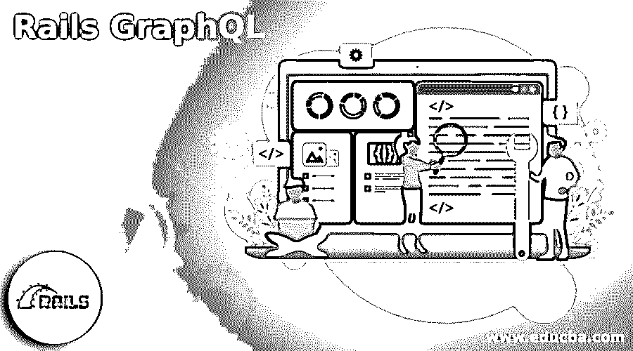
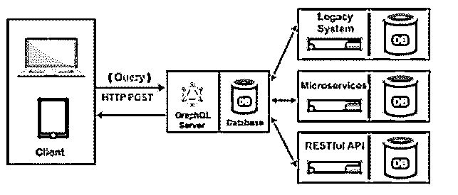
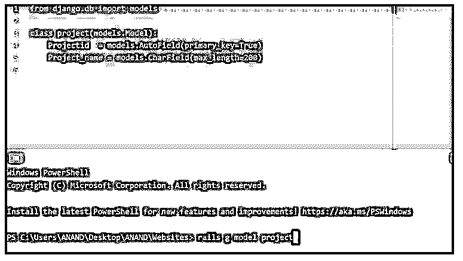
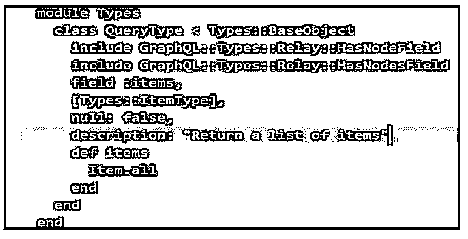

# Rails 图形 SQL

> [https://www . educba . com/rails-graph QL/](https://www.educba.com/rails-graphql/)

## Rails GraphQL 简介

GraphQL 是一种查询语言，有助于更复杂地从后台检索数据。GraphQL 是一个服务器端运行时进程。因此，GraphQL 不能作为前端系统或后端系统进行关联。GraphQL 的主要功能是让 API 变得更快。从几个数据源检索数据的过程可以使用一个名为 GraphQL 的特定 api 来实现。因此，在 GraphQL 类 API 的支持下，可以灵活地在前端获取和显示大量数据。在要考虑的其他方面，GraphQL 是 REST API 服务的替代品，而且 GraphQL 可以与 Ruby 和 rails 很好地融合这一事实也是一个相当大的优势。

### 如何设置 Rails GraphQL？

设置 ruby on rails 架构的过程将涉及下面给出的先决条件:

<small>网页开发、编程语言、软件测试&其他</small>

*   Ruby 和 Rails 安装。
*   需要安装 PostgreSQL。
*   最后，必须安装一个特别支持的操作系统。

要执行的第一步是设置一个 rails 应用程序，并将其连接到后端的数据库。这是此设置的基本基础。可以使用 Rails 命令来加快这个过程。这个过程将帮助执行一些操作，比如生成一个 rails 应用程序，创建与这个 rails 应用程序相关的所有必要文件。因此，为了在 rails 中创建新的应用程序并将其连接到后端的相关数据库，可以执行下面给出的查询。

因此，rails 命令的执行将在名为 rails_GraphQL 的目录位置创建一个 rails 应用程序。此过程还会安装所有相关的依赖项。这里的关键部分是连接到相关的数据库。数据库级的连接是借助-d 标志实现的。d 标志将确保生成数据库级连接。此外，有必要生成所有相关的测试文件。开发所有相关的测试文件是在下一节使用的标志中执行的。如果要开发不同的测试文件，so-t 标志将允许生成所有需要的文本文件。api 是一个非常重要的标志。它说 rails 应用程序将只使用构建 API 所必需的文件来创建。

### 设置图表 QL

在将 GraphQL 条目添加到所使用的 gem 文件的帮助下，可以执行设置 graph-ql 依赖关系的过程。首先，必须打开这个特定应用程序的 gem 文件。GraphQL 的 gem 条目可以添加到任何地方，而 graph-ql rails 必须单独在开发部分设置。

要在 rails 应用程序中安装 GraphQL，必须执行下面的 rails install 命令。下面给出了命令的详细信息，

上面的命令生成 GraphQL 安装过程所需的所有文件。将安装像 GraphQL_controller.rb、GraphQL 目录创建和 GraphQL post 路由这样的文件。

### GraphQL 架构

图 ql 系统的架构图如下所示。我们可以从下图中注意到，GraphQL 通信的过程有三个主要部分。一个是客户端部件表单，将在其中生成关联的请求。因此客户端部分将是发出请求的部分；更具体地说，所有的 http 请求都将被开发。因此，当从这个部分生成建议时，http 请求项将到达 GraphQL 设置，它充当获取数据的中间件。因此，当 GraphQL 收到查询时，它会立即将请求重定向到对数据库的查询中。

对数据库的调用可能是 restful api、大型机之类的遗留系统，甚至是 restful API 服务，这是 net 操作的调用点。一旦接收到该调用所需的数据，带有该数据的调用将被还原到 GraphQL 安装的服务器。响应将从安装了 GraphQL 的服务器提供给客户端；答案将再次提供给客户。GraphQL 的主要功能是让 API 变得更快。从几个数据源检索数据的过程可以使用一个名为 GraphQL 的特定 api 来实现。在 GraphQL 类 API 的支持下，大量的数据可以灵活地在前端读取和显示。正在生成的请求和正在接收的响应之间的区别在于，根据响应，响应将与已经获取的必要数据捆绑在一起。

### Rails GraphQL 新项目

在 rails 中创建项目的过程是使用带有模型的命令。model 命令将生成与项目相关联的模型。因此客户端部分将是发出请求的部分；更具体地说，将生成所有的 http 请求。使用下面的模型命令可以开发一个模型。在下面的例子中，将会生成一个名为“project”的模型——这个名为 project 的新模型。

从模型中获取一些数据的命令是通过下面的方法完成的，其中下面给出的查询将从数据库的 item 表中返回所有记录。

### 结论

上面给出的文章清楚地解释了 GraphQL 作为一个包的作用，以及如何将这个包安装在基于 ruby 和 rails 的应用程序之上。安装完成后，从 ruby 和 rails 应用程序关联的数据库中检索所有记录需要遵循什么步骤？还提交了相应的查询。

### 推荐文章

这是一个 Rails GraphQL 的指南。在这里，我们将讨论简介、架构，以及如何为一个新项目设置 Rails GraphQL。您也可以看看以下文章，了解更多信息–

1.  [Ruby on Rails 的职业生涯](https://www.educba.com/career-in-ruby-on-rails/)
2.  [Ruby On Rails 语言](https://www.educba.com/ruby-on-rails-language/)
3.  [Ruby 哈希](https://www.educba.com/ruby-hashes/)
4.  [轨道命令](https://www.educba.com/rails-commands/)

