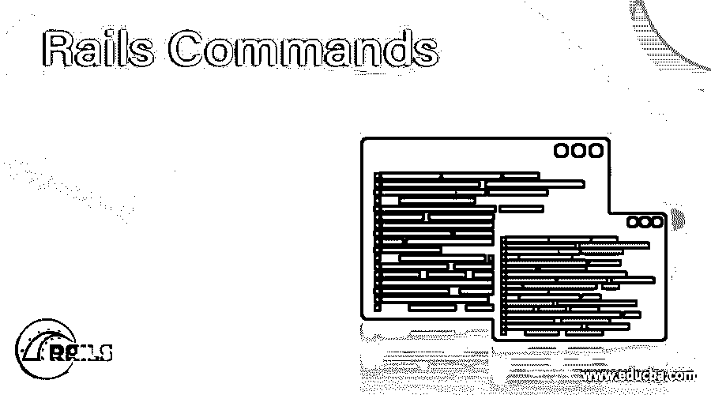
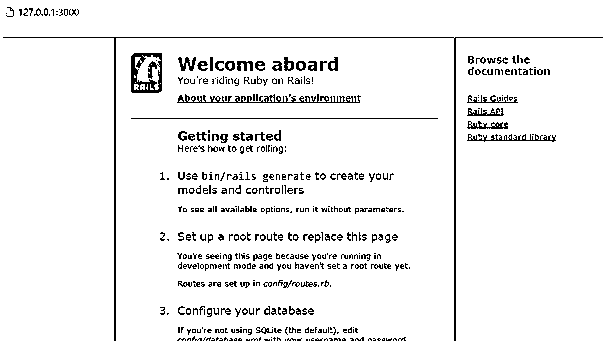
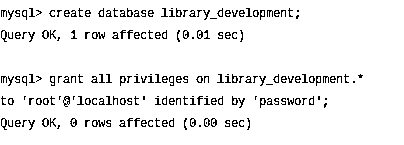
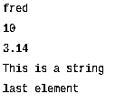

# Rails 命令

> 原文：<https://www.educba.com/rails-commands/>

## Rails 命令简介

Ruby on Rails 是一个用 Ruby Rails 编程语言编写的 web 开发框架，它的设计目的是使 web 应用程序编程变得更容易，方法是让开发人员需要开始的东西在安装之前就安装好。在 Ruby 中，我们需要编写非常少的代码，而在其他编程语言和框架中。使用 Ruby 进行 Web 开发也更有趣。Ruby 编程语言用于 web 应用程序开发的主要原则是不重复你自己和配置之上的约定。Ruby 是一种高级编程语言，类似于 Python、Perl 等解释语言，也类似于 Java、Ada 等面向对象语言。

### 基本 Rails 命令

以下是基本命令。

<small>网页开发、编程语言、软件测试&其他</small>

#### 1.如何在 Ruby Rails 中启动 web 服务器？

在 Ruby 中，web 服务器几乎可以在任何 web 服务器下运行，但是使用 Rails 开发 web 应用程序的最佳方式是使用内置的 WEBrick 服务器。

要启动 web 服务器，我们需要执行以下步骤:

*   CD ruby/库
*   Rails 服务器
*   我们需要打开浏览器，在端口 3000 上输入 http://127.0.0.1:3000，输出如下:

#### 2.如何在 Rails 中设置数据库？

在 Rails 中，我们可以设置不同类型的数据库，我们将设置 [MySQL 数据库](https://www.educba.com/mysql-commands/)，我们使用 root 作为应用程序的用户 id，我们可以执行不同的操作，如创建数据库、授予权限等。示例输出如下所示:

#### 3.如何在 Ruby 中创建活动记录文件？

在 Ruby 中，我们可以使用几个 [Rails](https://www.educba.com/advantages-of-rails/) 命令为任何项目创建活动记录文件。我们将为图书馆应用程序创建活动记录文件，记录为图书和主题，如下所示:

*   rails 脚本/生成模型手册
*   rails 脚本/生成模型主题

它生成如下输出代码:

#### 4.如何在 Ruby 中创建模型之间的关联/关系？

在 [Rails 命令](https://www.educba.com/rails-commands/)中，我们可以创建模型之间的关联，有一对一、一对多、多对多三种类型的关联，样例代码如下所示。它创建了一个单一主题，因为一本书属于一个主题，输出是:

#### 5.如何在 Ruby 中创建迁移文件？

在 Rails 中，我们可以使用下面的命令创建一个迁移文件，它包含描述表的数据结构的基本语法

*   rails 生成迁移表 _ 名称
*   rails 生成迁移书籍

它将生成以下代码作为输出:

#### 6.如何在 Ruby 中创建字符串文字？

在 Ruby 中，字符串是以 8 位表示的字符序列，双引号字符串允许替换单引号字符串，而单引号字符串则不允许，示例代码如下:

`puts ‘escape using “\ \”’;
puts ‘That\’s right’;`

高于代码的输出如下所示:

#### 7.如何在 Rails 中声明数组？

在 Rails 中，我们可以通过用逗号分隔的整数和字符串的组合来声明数组，如下所示:

`array = [  "fred", 10, 3.14, "This is a string", "last element", ] array.each do |i|
puts i
end`

上面代码的输出如下所示:

#### 8.什么是 Range，如何在 Ruby 中使用？

在 Ruby 中，范围用于表示范围的开始和结束之间的一组值，并使用 for start 和 e for end 文本来构造，示例代码如下:

`(10....14). each do |n|
print n, ‘ ‘
end`

上面代码的输出如下所示:

**T2】**

 **#### 9.如何在 Ruby 中使用已定义的运算符？

在 Ruby 中，定义？这是一个特殊的操作符，它采用一个方法调用来确定表达式是通过还是失败，示例代码如下:

定义？Var —如果 Var 已初始化，则验证为真，示例如下:

#### 10.如何在 Ruby 中使用单行注释？

在 Ruby 中，注释可以用不同的方式表示，比如单行注释和多行注释，示例代码如下:

这是单行注释

`puts “Hello, Ruby!”`

输出如下所示:

### 中间轨道命令

以下是中间命令。

#### 1.如何在 Ruby 中使用想要的模板生成一个新的应用？

在 Ruby 中，我们可以使用下面的 rails 命令 new treehouse 来生成一个新的应用程序，而我们可以使用模板来运行它们，如下所示:

`rails new treehouse –template=India`

#### 2.如何在 Ruby 中删除数组中特定索引处的元素？

在 Ruby 中，我们可以使用下面的命令删除数组中特定索引处的元素:

`array.delete_at(index)`

**例子**

*   array = ["hi "，" bar "，" foo"]
*   array.delete_at(2)
*   新数组是:["hi "，" bar"]

#### 3.Ruby 中什么是插值，怎么做？

在 Ruby 中，插值被定义为使用双引号将字符串与变量或表达式组合在一起，称为插值，示例代码如下:

`“Email : # {user.email}”
“ A string and an #{expression}”`

#### 4.如何在 Ruby 中调用方法？

在 Ruby 中，我们可以使用对象调用方法，调用方法就像是在 Ruby 中发送消息的,因为我们发送一个带有消息的对象，并等待它的响应和示例代码，如下所示:

**举例:**

*   object.method(参数)
*   字符串.长度
*   数组. delet

#### 5.如何在 Ruby 中创建和使用哈希？

在 Ruby 中，可以通过花括号中的键-值对来创建散列，键将始终通过箭头指向值，示例代码如下:

`{42 => “answer” , “score” =>100, :name=> “Das” }`

### 高级 Rails 命令

以下是高级命令。

#### 1.什么是集合迭代器，如何在 Ruby 中使用？

在 Ruby 中，collect 迭代器用于返回集合和 collect 方法的所有元素，不需要与块和示例代码相关联，如下所示:

`collection = collection.collect
a=[1,2,3] b=Array.new
b=a.collect
puts b`

#### 2.用 Ruby 写一个 web 服务处理方法？

在 Ruby 中，Web 服务方法可以编写为简单的 Ruby Rails 方法，这些方法将向外界公开，示例代码 2 执行两个数字的加法，如下面的命令所示:

`class MyServer < SOAP:: RPC:: StandaloneServer
#handler methods
def add(a,b)
return a+b
end
end`

### 要使用的提示和技巧

*   使用提取快速匹配的正则表达式
*   以数组#join 的形式连接字符串的最佳方式，例如:数组#*
*   使用十进制格式，因为它计算速度很快
*   执行插值，因为它可以快速插入文本

### 结论

最后，它概述了不同类型的 Ruby on Rails 命令。我希望在阅读完这篇文章之后，您会对 Ruby on Rails 命令有很好的了解。

### 推荐文章

这是一个 Rails 命令指南。在这里，我们讨论了概念、基本、中级和高级 Rails 命令以及有效使用的技巧和诀窍。您也可以阅读以下文章，了解更多信息——

1.  [火花命令](https://www.educba.com/spark-commands/)
2.  [配置单元命令](https://www.educba.com/hive-command/)
3.  [Kali Linux 命令](https://www.educba.com/kali-linux-commands/)
4.  [Sqoop 命令](https://www.educba.com/sqoop-commands/)

**