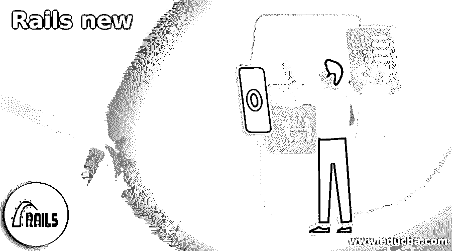
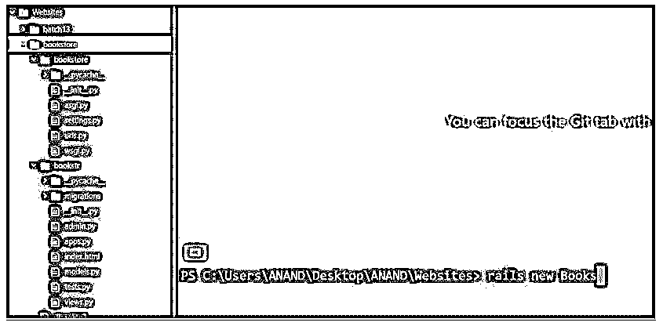
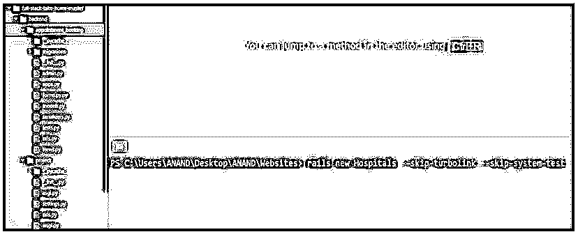
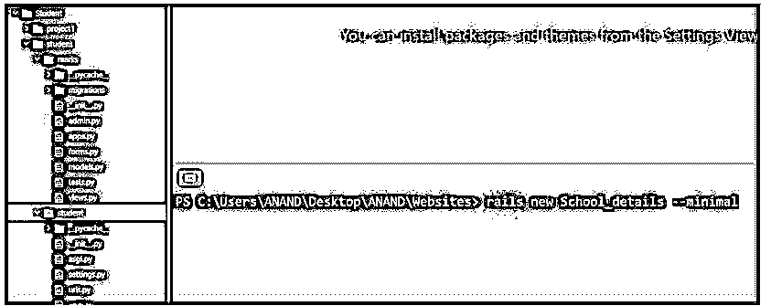

# Rails 新

> 原文：<https://www.educba.com/rails-new/>

## Rails 简介新

项目中的所有过程都只能通过应用来实现。应用程序用于表示要获得的特定功能。创建应用程序的过程可以通过“rails new”命令来完成。因此，新命令是一种能力，通过它可以在进程中生成新的应用程序。这个新命令是用 ruby 语言编写的，旨在开发基于 web 的框架，它使得应用程序的开发变得更加容易。-minimal flag 命令用于开发和构建 rails 应用程序，这些应用程序非常简单，可能是 rails 应用程序。

### 创建 Rails 新应用程序

让我们进一步看看如何创建一个应用程序。通过 rails new 命令可以非常灵活地完成创建新应用程序的过程。

<small>网页开发、编程语言、软件测试&其他</small>

使用命令创建新应用程序的语法如下所示:

**语法:**

`$> rails new Application_Name`

语法以 rails 关键字“rails”开始。关键字“rails”确保表示特定操作是基于 rails 的操作。因此，rails 命令执行器将在后台被触发。命令执行器认为该操作是一个“新的”创建操作。.其后必须是应用程序名称值。应用程序名称值表示应用程序的名称。这里，应用程序的值为“Books ”,这允许设置创建名为“Hospitals”的应用程序设置。在这种情况下，跳过命令是 turbolink 和系统测试。这是通过“新”这个关键词理解的。其后必须是应用程序名称值。应用程序名称值表示应用程序的名称。一旦执行了这个命令，就会生成具有给定名称的应用程序。

### 所有 Rails 新命令选项

下面给出了应用程序创建过程中使用的各种选项或标志。每个标志将在应用程序创建过程中执行一些特定的相关操作。

预配置数据库、跳过特定文件(如 javascript 文件)、捆绑包执行过程、为应用程序类型的过程选择模板等操作都可以借助下面给出的标志来完成。“新建–帮助”命令可用于列出与过程相关的所有标志。

下面给出了命令的执行和输出。

**代码:**

`$> rails new --help`

**用法:**

rails 新应用程序路径[选项]

**选项:**

*   [–skip-namespace]，[–no-skip-namespace]–允许跳过名称空间
*   [–skip-Collision-check]，[–no-skip-Collision-check]–将跳过冲突检查，这允许应用程序从重复项中撤销
*   -r，[–ruby = PATH]–选择 Ruby 二进制路径
*   # Default-/Users/David/。rbenv/versions/3.0.0/bin/ruby
*   -m，[–TEMPLATE = TEMPLATE]–模板级应用选择
*   -d，[–DATABASE = DATABASE]–选定的数据库预配置
*   [–skip-gemfile]，[–no-skip-gemfile]–Gem 文件创建过程将被跳过
*   -G，[–skip-git]，[–no-skip-git]–git ignore 文件将被跳过
*   -M，[–skip-action-Mailer]，[–no-skip-action-Mailer]–将跳过所有基于邮件文件的操作
*   -O，[–跳过活动记录]，[–不跳过活动记录]–将跳过所有活动记录
*   -P，[–skip-puma]，[–no-skip-puma]–将跳过所有与 puma 相关的活动
*   -C，[–skip-action-cable]，[–no-skip-action-cable]–将跳过所有基于电缆的操作文件
*   -S，[–跳过链轮]，[–不跳过链轮]–将跳过所有链轮文件操作
*   -J，[–skip-javascript]，[–no-skip-JavaScript]–将跳过所有 JavaScript 文件
*   -T，[–跳过测试]，[–不跳过测试]–将跳过所有测试文件
*   -B，[–skip-bundle]，[–no-skip-bundle]–将跳过绑定执行

**运行时选项:**

*   -f，[–force]–现有文件将被覆盖
*   -p，[–假装]，[–不假装]–将执行所有更改
*   -q，[–quiet]，[–no-quiet]–所有状态输出将被抑制
*   -s，[–skip]，[–no-skip]–将跳过所有现有文件

### Rails 新示例

下面是提到的例子:

#### 示例#1

新书

上面给出的示例命令用于创建书籍的应用程序。关键字“rails”确保表示特定操作是基于 rails 的操作。因此，命令执行器将在后台触发。rails 命令执行器认为该操作是一个“新”的创建操作。这是通过“新”这个关键词理解的。其后必须是应用程序名称值。应用程序名称值表示应用程序的名称。这里，应用程序的值为“Books ”,这允许设置创建名为“Books”的应用程序设置。

#### 实施例 2

rails 新医院-skip-turbo link-skip-系统测试

上面给出的示例命令用于创建书籍的应用程序。关键字“rails”确保表示特定操作是基于 rails 的操作。因此，rails 命令执行器将在后台被触发。命令执行器认为该操作是一个“新的”创建操作。这是通过“新”这个关键词理解的。其后必须是应用程序名称值。应用程序名称值表示应用程序的名称。这里，应用程序的值是“Books ”,这允许 rails 设置创建一个名为“Hospitals”的应用程序设置。在这种情况下，跳过命令是 turbolink 和系统测试。这两个命令都意味着跳过相关的 turbolinks，相关的系统测试也将被跳过。

#### 实施例 3

rails new School _ details–最小

上面给出的命令将有助于创建一个名为 school details 的应用程序。因此，将创建一个名为学校详细信息的应用程序。这里有趣的因素是–minimal 标志的使用。其后必须是应用程序名称值。应用程序名称值表示应用程序的名称。–minimal 命令创建一个极简的应用程序。在几秒钟内，一个新的压缩应用程序将会生成。此过程会跳过与应用程序创建过程相关的所有功能。

### 结论

上面给出的文章清楚地解释了如何在这个过程中创建应用程序。与应用程序创建过程相关联的语法以及应用程序创建过程是如何被触发的也在上面给出的文章中指出。选项部分还提到了与流程相关的各种标志。讨论了三个不同的例子。每个例子都解释了应用程序创建过程如何在不同的跳过过程中工作。

### 推荐文章

这是一个新的 Rails 指南。这里我们分别讨论简介、创建 rails 新应用、命令选项和示例。您也可以看看以下文章，了解更多信息–

1.  [Ruby on Rails 职业生涯](https://www.educba.com/career-in-ruby-on-rails/)
2.  [Ruby On Rails 语言](https://www.educba.com/ruby-on-rails-language/)
3.  [Ruby 哈希](https://www.educba.com/ruby-hashes/)
4.  [轨道命令](https://www.educba.com/rails-commands/)

