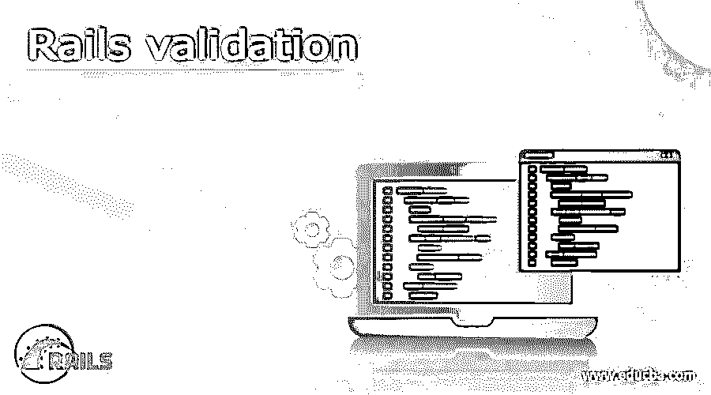

# Rails 验证

> 原文：<https://www.educba.com/rails-validation/>

## Rails 验证的定义

任何人都有必要检查输入的数据是否有效。在给定的时刻，检查输入数据的有效性是非常重要的，这个工具包可以在 ruby 中使用 Rails 验证方法来实现。可以使用记录模型类的 rails 验证来检查有效性状态。Ruby rails 中有各种内置的验证方法。使用内置的验证 DSL，我们可以进行多种类型的验证。可以创建用户定义的验证方法。活动记录模型状态中的失败被视为错误。

### 什么是 rails 验证？

如果我们在 Ruby 中输入一些数据，我们需要确保输入的数据是否属于活动记录状态。我们需要 Rails 验证术语来确保数据有效性，并表明输入的数据是有效还是无效。当对象未保存时，它表明在 Ruby 中创建了一个错误。有效性键检查其有效性，如果为真且没有发现错误，则检查其有效性；否则，它将显示 false。一个重要的应用是，如果我们向某人发送邮件，它有助于确保我们向正确的收件人发送邮件。此外，重要的是要知道我们需要确保只有需要的数据保存在数据库中，这意味着我们需要在模型级别验证数据。有三种不同的验证方法，每种方法都有其优点和缺点；下面就让我们来讨论一下。

<small>网页开发、编程语言、软件测试&其他</small>

**1。原生数据库约束:**当我们在表中使用丰富的内容时，需要在数据库级别进行验证。当我们在这个阶段进行验证时，可以安全地处理数据。此外，它使得测试和维护大量数据变得更加容易。

**2。客户端验证:**当我们维护一个站点时，客户端验证会很有用。尽管如此，这还是有优势的，因为当它单独使用 JavaScript 时，大多数验证都不可靠。但是当它们与其他技术一起使用时，这个缺点可以被克服。

**3。控制器级验证:**这可能是使用验证的诱人方式之一，但是它有它的缺点:在测试和维护上有困难。但从长远来看，这种验证方法真的很有帮助。

### Rails 验证模型

据我们所知，Rails 是非常复杂的框架之一，它有许多内置设施。使用 Rails 的另一个巨大优势是它提供了一个活动记录特性。因此，ruby 中的 rails 被用来更容易地执行复杂的任务。例如，验证功能检查数据的重复或原始性。活动记录对于验证任何数据都非常重要。它作为一个助手，在字符串匹配的基础上验证输入的数据是否与数据库匹配。下面是一个解释 rails 验证模型的例子:

`# user.rb
class User < ApplicationRecord
has_many :posts, dependent: :destroy
validates :username, :password, :bibiogram, presence: true
end`

在上面的例子中，属性用逗号分隔，使用的关键字是“validates”此外，验证器是“存在”，而“真”是分配给验证器的条件。验证器检查属性或零字符串的存在。

### 创建 rails 验证的自定义方法

现在让我们通过一个例子来看看如何在 ruby rails 中创建一个用户定义的验证方法。

`# users_controller.rb
class UsersController < ApplicationController
def create
user = User.create(user_params)
if user.valid?
render json: {user: user}, status: :created
else
render json: {errors: user.errors.full_messages},
status: :not_acceptable
end
end
private def user_params
params.permit(:username, :password, :bio)
end
end`

如果客户需要简化属性，应该使用两个关键字。它们有效吗？方法和呈现方法。此外，user_params 帮助客户按照他们的意愿进行流线化。在上面的例子中，我们使用 JSON 和 HTTP status，客户端已经使用它构建了应用程序。

所以，在上面的例子中，对象是 user_param，变量是术语 user。什么时候我们称之为有效？方法，如果用户成功地出现在数据库中，将为用户创建一个状态传输以及来自对象的响应。如果没有发生这种情况，JSON 响应中将包含不同的对象。有时，不可接受的状态也会包括在内。

### Rails 验证示例

为了验证数据的有效性，我们使用一个简单的例子来检查输入的数据是有效的(true)还是无效的(false)。

`class Person < ActiveRecord::Base
validates :name, :presence => true
end
Person.create(:name => "Jonny").valid? # => true
Person.create(:name => nil).valid? # => false`

关键字有效吗？它将启动有效性搜索，如果它准确地找到关键字，它将说它为真；如果不是，它将返回值为 false。不应该出现将语句返回为 true 的错误。在上面的例子中，如果 Jonny 名称存在，它将验证它为真。根据定义，如果完成验证后集合为空，则称该对象有效；如果没有，则无效。

### 结论

ruby 框架中使用的 Rails 验证是检查输入的数据是有效还是无效的助手之一。这种有效性是通过使用关键字 valid 来检查的吗？我们已经看到了不同类型的验证。重要的是，我们看到了一个用户定义的验证方法的例子。这个验证键对于检查输入的许多数据非常有用。主要的例子是检查电子邮件 ID 的有效性，或者在数据库的大量数据中检查特定的字符。

### 推荐文章

这是一个 Rails 验证指南。这里我们讨论定义，什么是 rails 验证，优点和缺点。您也可以看看以下文章，了解更多信息–

1.  [铁轨的优点](https://www.educba.com/advantages-of-rails/)
2.  [轨道命令](https://www.educba.com/rails-commands/)
3.  Ruby on Rails 的职业生涯
4.  [Rails 与 PHP](https://www.educba.com/rails-vs-php/)

