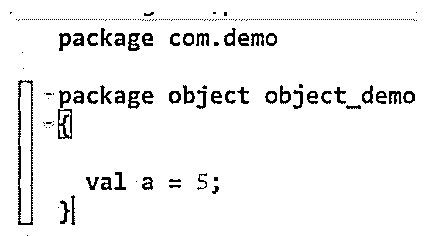
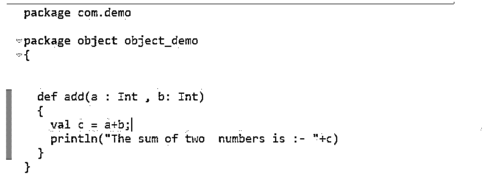
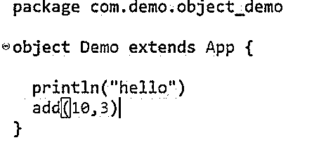
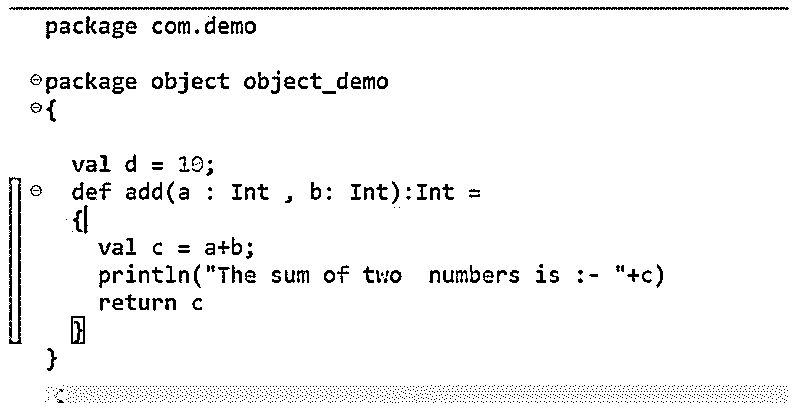

# Scala 包对象

> 原文：<https://www.educba.com/scala-package-object/>

## Scala 包对象介绍

在 2.8 版本中引入的 Scala Package Objects 包含了变量、类和对象的定义，可以被整个包访问。这些是公共对象，它们的作用域对于整个包中的所有类和对象都是可访问的。因此对象的范围很容易与应用程序集成。通过使用它，我们可以将公共数据始终放在一个地方，并在应用范围内访问。包对象可以继承 Scala 类和 trait。

### Scala 包对象的语法

语法如下所示:

<small>网页开发、编程语言、软件测试&其他</small>

`packagecom.demo  // package name
packageobjectobject_demo  //package object name
{
vala = 5;
//other members
}`

我们需要创建一个名为 package 的文件。Scala，我们将在这里定义这个 Scala 包对象。

**举例:**

我们将在想要使用 package 对象的同一个包中创建一个 package.scala 文件。

并为目标包中的成员编写代码。

**代码:**

`packagecom.demo
packageobjectobject_demo
{
vala = 5;
}`

**代码:**

`packagecom.demo.object_demo
objectDemoextendsApp {
println("hello")
println(a)
}`

在 main 方法中调用它，它将读取在 package 对象中定义的值。

**输出:**

**包对象:**

从上面的代码片段中，我们看到了如何在 scala 中创建 package 对象及其语法。

### 包装对象工作

包对象包含在文件包中。Scala，它位于我们想要使用它的同一个包中。基本上，标准的 scala 包都有自己的包对象，如 Scala。_ 是导入的。整个程序所需的成员、对象、变量都放在这个包对象上，我们可以不用导入包就可以使用它。使用包对象，我们可以有一个逻辑结构以及更快地访问成员变量。

我们可以在这个包对象中导入不可变的集合类。通过使用 package 对象，我们可以缩短 Scala 的代码行，避免使用 import 语句。每个包都有一个包对象和相应的包名，使得成员可以在 Scala 代码中使用它。每当我们编译代码时，它会根据包名创建类文件。因此，每当我们试图访问该成员时，它将从该包对象中被访问。

**举例:**

让我们看一个包含 SUM 方法的 package 对象的例子。这显示了两个数的和，我们将把这个方法打包。Scala 文件，并将调用主类中的方法来检查我们是否调用了它。

项目文件夹中包含 Package.scala 文件的代码片段:

**代码:**

`packagecom.demo
packageobjectobject_demo
{
defadd(a : Int , b: Int)
{
valc = a+b;
println("The sum of two  numbers is :- "+c)
}
}`

调用该方法的主类的代码是:

**代码:**

`packagecom.demo.object_demo
objectDemoextendsApp {
println("hello")
add(10,3)
}`

结果将打印在两个整数的和上。

**输出:**

因此，通过这种方式，我们可以在我们的 Scala 应用程序中使用该对象。它还包含与 Scala 代码一起使用的不可变集合。Iterable，Traversable，Seq，Iterator，List，Nil 这些是 Scala 包对象中的集合对象。现在 Scala.math.* package 对象中移动了 Big Decimal、BigInt、Numeric。

**举例:**

我们也可以调用在该文件中定义的方法，并在 scala 类方法中使用它。

文件 package.Scala。

它有一个将两个数相加的方法，就是我们在上面的例子中看到的那个。

**代码:**

`packagecom.demo
packageobjectobject_demo
{
vald = 10;
defadd(a : Int , b: Int):Int =
{
valc = a+b;
println("The sum of two  numbers is :- "+c)
returnc
}
}`

main 方法有一个名为 method1 的方法，它从 package 对象中取出方法，并使用其中的变量对其进行操作，以产生所需的结果。

**代码:**

`packagecom.demo.object_demo
objectDemoextendsApp {
println("hello")
defMethod1(d:Int)
{
vale = add(10,3)
println("Insdie Method operation "+(e*d))
}
Method1(4)
// add(10,3)
}`

**输出:**

从上面的例子中，我们看到了如何在我们的代码中使用这个包对象方法。

### 结论

从上面的文章中，我们了解了它的用法。我们发现在面向对象的代码中使用它有很多好处。我们还看到成员是通过包访问的，并且具有范围。借助各种例子，我们试图阐明其功能。

### 推荐文章

这是一个 Scala 包对象的指南。这里我们分别讨论包对象工作的介绍和例子。您也可以看看以下文章，了解更多信息–

1.  [Scala if else](https://www.educba.com/scala-if-else/)
2.  [Scala for 循环](https://www.educba.com/scala-for-loop/)
3.  [什么是 Scala？](https://www.educba.com/what-is-scala/)
4.  [Scala 运算符](https://www.educba.com/scala-operators/)

