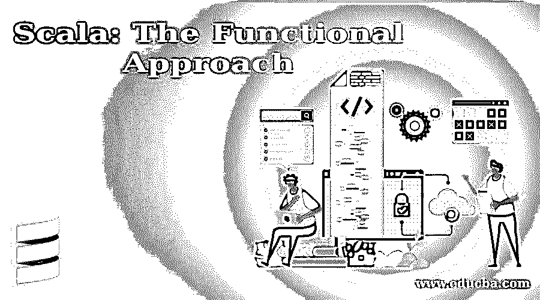

# Scala:函数式方法

> 原文：<https://www.educba.com/scala-the-functional-approach/>

*图片来源:pixabay.com*

欢迎朋友们来到我的下一个关于编程语言的博客。这次我们将讨论臭名昭著的 Scala。首先，什么是 scala？为什么它在 Java 开发者中如此出名？它能完全取代 Java 吗？所以，如果你是一个有经验的程序员，那么你可能会有很多这样的问题。别担心。这就是我们在这里的原因。

<small>网页开发、编程语言、软件测试&其他</small>

[Scala 只是可扩展语言](https://www.educba.com/what-is-scala/)的简称。这意味着您不仅可以用它来编写一行程序，还可以用它来编写与服务器相关的大问题。Scala 从 Java 中吸取了很多东西。因此，你可能会看到 scala 中的很多代码与 Java 相似。但是，话又说回来 scala 实际上为什么要被构建呢？现在，这些是我们将在这个博客中深入探讨的事情。所以，让我们一个一个地看看这些东西。我们走吧。

## scala 是脚本语言吗？

我听到很多人说 scala 看起来像一种脚本语言。但我不敢苟同。Scala 的语法更短，占用的内存也更少。为了快速响应，您可以使用 REPL 或 IDE。

Scala 是一种实际上用于构建许多大型服务器的语言，因为它有时非常依赖。语法和代码与 Java 的大部分相似。由于 Scala 主要是一种打字错误类型的语言，它的大部分错误实际上是在编译代码时发现的，而不是在调试代码或实际运行软件时发现的。

这意味着调试时更少的麻烦，如果你正在运行一个大公司；这可能会更有利可图，因为调试代码所需的人力会更少，因为在编译小代码时大多数错误都会被处理掉。

所以，我之前提出的问题是“scala 是否是一种脚本语言？”我同意这有 50%是真的，但同时也有 50%是假的。尽管 scala 看起来很像脚本语言；见鬼，它甚至在编码时感觉像一种脚本语言，但事实是，它不是。

所以，更确切地说，在深层，scala 是一个多重编译的，或者更具体地说；它是精心集成的面向对象编程和函数式编程的基本概念的结合。

### Scala 是如何面向对象的？

首先，你如何定义面向对象？

面向对象编程或 OOP 意味着它是一种不同类型的编码语言，它将代码中的数据结构与代码中的函数结合在一起，以构建可重用的对象。

同义词“面向对象”最好用来解释一个专门处理不同对象模式的系统，其中您执行的操作取决于您用于数据操作的对象类型。

比方说，一个 OOP 画图[算法](https://www.educba.com/algorithms-and-cryptography/ "Algorithms and Cryptography")可以让你画出无数类型的数据对象，比如圆、八边形、正方形等等。但是，对每个对象执行相同的选项会改变结果。明白我的意思了吗？

所以，这个问题的答案是，scala 虽然像面向对象语言一样走路和说话。这是不完全的。你可能会发现很多人说的恰恰相反。但是让我告诉你为什么。Scala 实际上是一种纯粹的函数式语言。

但是开发者还是给了它很多面向对象语言的感觉。类似地，当开发这种特殊的语言时，开发人员有他们合适的方法来集成面向对象语言的特性。因此，尽管 Scala 作为一种面向对象的语言使用起来感觉很舒服，但理论上并不是这样。

### scala 是怎样一种函数式语言？

正如我之前说过的，scala 的设计理念是让它尽可能接近函数式语言。虽然我不会说这是纯粹的功能，但话说回来…我是谁来评论？

Scala 有很多内置特性，这向我们证明了它是一种函数式语言。然而，你可能觉得它的语法实际上太传统了，但是 Scala 也是一种专业构建的函数式语言。

它拥有你需要的所有东西，无论你谈论的是顶级的类函数还是一个拥有非常精通的不可变数据结构的库，一切都是纯函数性的。与突变相比，它通常具有不变性的优先权。

与许多旧的函数式语言不同，Scala 显示了从面向对象到更函数式方法的简单迁移。虽然你可以开始使用它作为一个没有分号的 Java，但久而久之，你最终会进步到尽可能地限制你的应用程序中的可变状态，将你的代码转换成一个安全的函数模式。

Scala 开发人员倾向于相信这些类型的进展总是一个好习惯。但同时，Scala 是方法论的。您可以以任何您想要的方式使用它，从脚本到面向对象到函数式。

### Scala 会取代 Java 吗？

Scala 运行在 Java 虚拟机上，Java 虚拟机的首字母缩写是 JVM。Java 和 scala 的类可以完全混合，不用担心它们是位于不同的项目和文件夹中，还是位于同一个项目和文件夹中。

尽管身处不同的地方，他们仍然可以找到彼此。此外，scala 的编译器包含了来自编译器 Java 的一个小集合，它匹配类似的重复依赖代码。

Java 的库和框架以及工具都可以在网上免费获得。构建 Java 工具，比如说 Maven 或类似的 ide，比如 Eclipse 或 Netbeans，以及 Hibernate 或 spring 之类的框架，它们似乎都可以完美地与 Scala 一起工作。

如果这还不够，Scala 还可以在 Android 上运行。scala 的社区非常广泛，它是 Java 的重要组成部分。甚至臭名昭著的 Scala 框架也包含了 Java 的双重 API。

以下是两种语言的基本示例:

首先，让我们看一看 Java:

`*public class Test{*` 
T1】

`*    private List<test1> orders;*`

`*    public Test() {*`

`*        orders = new ArrayList< test1>();*`

`*    }*`

`*   public String getName() {*`

`*        return name;*`

`*    }*`

`*    public void setName(String name) {*`

`*        this.name = name;*`

`*    }*`

`*    public List< test1> gettest1() {*`

`*        return orders;*`

`*    }*`

`*    public void settest1(List<test1> orders) {*`

`*        this.orders = orders;*`

`*    }*`

`*}*`

`*public class test1{*`

`*    private int id;*`

`*    private List<Product> products;*`

`*    public test1() {*`

`*        products = new ArrayList<Product>();*`

`*    }*`

`*    public int getId() {*`

`*        return id;*`

`*    }*`

`*    public void setId(int id) {*`

`*        this.id = id;*`

`*    }*`

`*    public List<Contents> getContents() {*`

`*        return products;*`

`*    }*`

`*    public void setContents(List<Contents> products) {*`

`*        this.products = products;*`

`*    }*`

`*}*`

`*public class Contents {*`

`*    private int id;*`

`*    private String category;*`

`*    public int getId() {*`

`*        return id;*`

`*    }*`

`*    public void setId(int id) {*`

`*        this.id = id;*`

`*    }*`

`*   public String getCategory() {*`

`*        return category;*`

`*    }*`

`*    public void setCategory(String category) {*`

`*        this.category = category;*`

`*    }*`

`*}*`

现在，让我们看看 Scala 中的同一个例子:

`*class Test {*`

`*    var name: String = _*`

`*    var orders: List[test1] = Nil*`

`*}*`

`*class test1 {*`

`*    var id: Int = _*`

`*    var products: List[Contents] = Nil*`

`*}*`

`*class Contents {*`

`*    var id: Int = _*`

`*    var category: String = _*`

`*}*`

怎么回事？这正是我所说的。但问题是，尽管 Scala 与 Java 有很多共同点，而且比 Java 简单得多，但它无法取代 Java。Java 的互操作性和可扩展性远远优于 scalas。

它拥有比 Scala 更广泛的社区..尽管如此，如果我在上面这段代码上多花 15 分钟，我仍然可以尝试让上面这段 scala 代码更加紧凑，如果我打算在小范围内使用它，这仍然是不值得的。

### 结论

看，现在还没有这样的结论。因为 Scala 是，如果你要我说什么的话，那么它就是一种纯粹的基于函数的语言。不管 scala 进步了多少，它仍然是一种成熟的函数式语言，具有面向对象语言的方方面面和几乎所有的含义。

Scala 有类似于 Ruby 或 Python 等脚本语言的紧凑代码，类似于 Javas 的对象和类似于 Haskells 的函数式方法。所以，最后…是的！Scala 是一种函数式语言。

### 推荐文章:-

这里有一些文章可以帮助你获得更多关于 scala 的细节，所以只要浏览链接就可以了。

1.  [Java Web 服务面试问题](https://www.educba.com/java-web-services-interview-questions-and-answers/)
2.  [Scala vs Java 性能](https://www.educba.com/scala-vs-java-performance/)
3.  [Python vs Scala<T1】](https://www.educba.com/python-vs-scala/)
4.  [Java 生涯](https://www.educba.com/career-in-java/)

